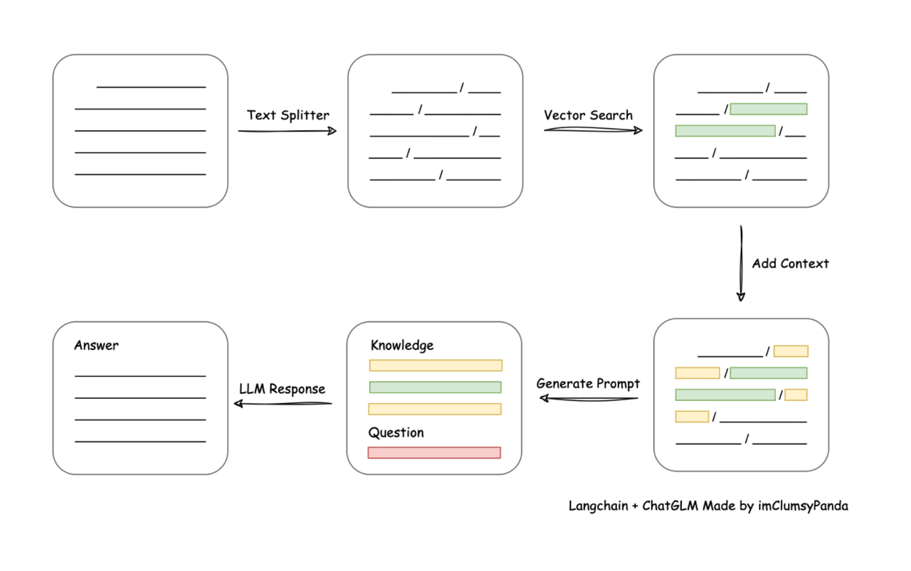
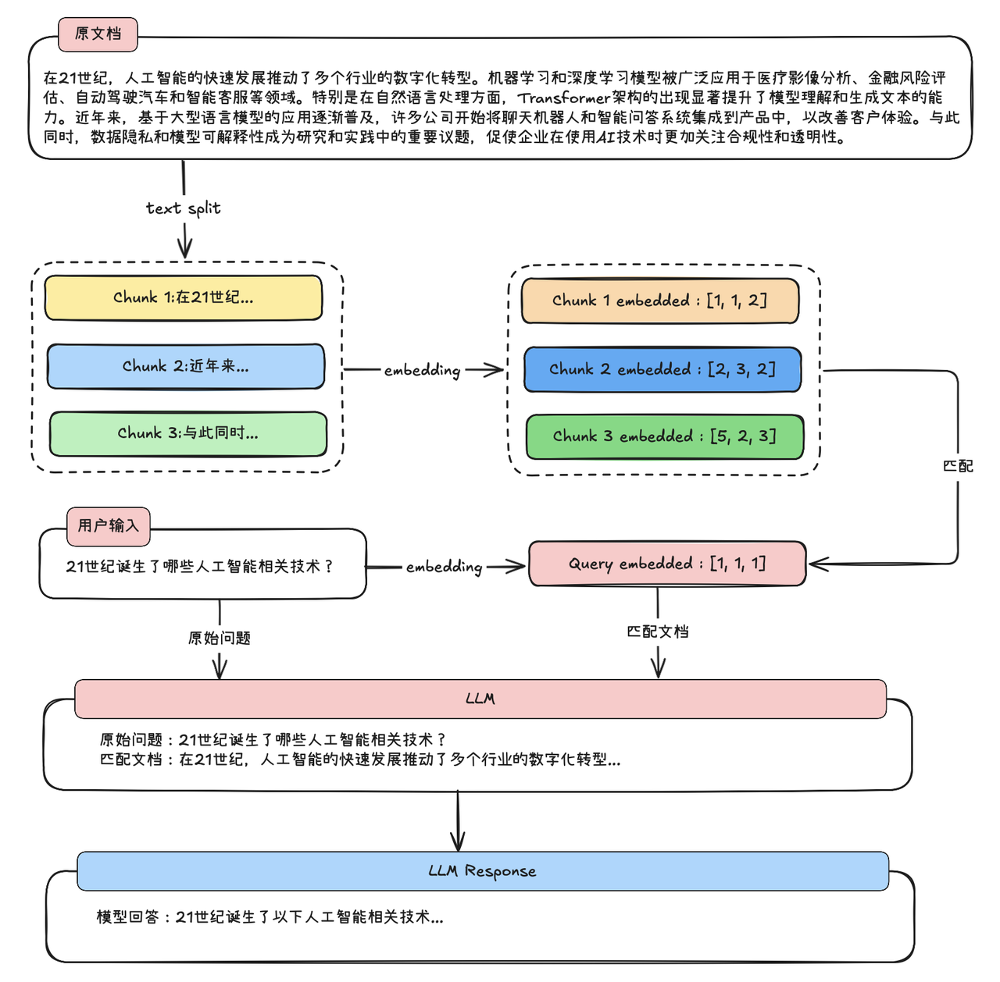
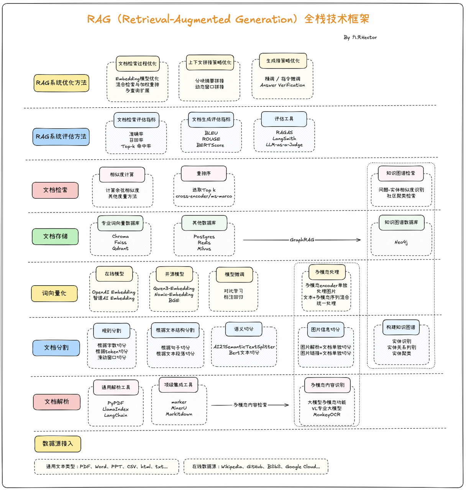

### 1、RAG 综述

RAG（Retrieval-Augmented Generation）检索增强生成技术，最早是在 Facebook AI（Meta AI）于 2020 年发表的论文《Retrieval-Augmented Generation for Knowledge-Intensive NLP Tasks》（ https://arxiv.org/abs/2005.11401 ）中正式提出，这种方法的核心思想是借助一些文本检索策略，让大模型每次问答前都带入相关文本，以此来改善大模型回答时的准确性。这项技术刚发布时并未引发太大关注，而伴随2022年大模型技术大爆发，RAG技术才逐渐进入人们视野，并且由于早期大模型技术应用均已“知识库问答”为主，而RAG技术是最易上手、并且上限极高的技术，因此很快就成为了大模型技术人必备的技术之一。

#### 1.1、RAG 的实现流程

RAG 技术已经是非常庞大的技术体系了，从简单的文档切分、存储、匹配，再到复杂的入 GraphRAG（基于知识图谱的检索增强），以及复杂文档解析+多模态识别技术等。


#### 1.2、RAG 的极简实现流程



我们需要围绕给定的文档（往往是非常长的文档）先进行切分，然后将切分的文档转化为计算机能识别的形式，也就是将其转化为一个数值型向量（也被称为词向量），然后当用户询问问题的时候，我们再将用户的问题转化为词向量，并和段落文档的词向量进行相似度匹配，借此找出和当前用户问题最相关的原始文档片段，然后将用户的问题和匹配的到的原文片段都带入大模型，进行最终的问答。由此便可实现一次完整的文档检索增强执行流程。

> RAG 极简实现的执行过程如下：



#### 1.3、RAG 的核心应用场景：拓展模型知识边界与减少问答幻觉

当代大模型的三项技术缺陷：

- 大模型幻觉：在使用大模型的时候，都会遇到大模型无中生有胡编乱造答案的情况。

  大型语言模型之所以会产生幻觉，主要是因为它们的训练方式和内在机制决定了它们并不具备真正理解和验证事实的能力。模型在训练过程中，通过分析大规模文本数据来学习不同词语和句子之间的概率关系，也就是在某种程度上掌握“在什么上下文中，什么样的回答听起来更合理”。然而，模型并没有接入实时的知识库或事实核查工具，当它遇到陌生的问题、模糊的描述或者上下文不完整的输入时，就会基于概率和语料库中似是而非的关联去“编造”一个看似正确的答案。由于这些输出往往语法流畅、逻辑连贯，人类读者很容易误以为它是真实可信的内容，这就是我们通常说的“模型幻觉”。

- 最大上下文限制

  每次生成回答时，模型需要把输入文本转换成固定长度的数字序列（称为token），并在内部一次性加载到模型的“上下文窗口”中进行处理。这个窗口的大小是有限的，不同模型一般在几千到几万token之间。如果输入内容超出这个长度，模型要么截断最前面的部分，要么丢弃部分信息，这就会造成对话历史、长文档或先前提到的重要细节的遗失。因为它无法跨越上下文窗口无限地保留信息，所以在面对长对话或者大量背景知识时，模型常常出现上下文断裂、回答不连贯或者忽略先前条件的情况。

- 模型专业知识与时效性知识不足

基于此，我们再回顾 RAG 的技术实现流程，就不难发现其背后的技术价值了：如果我们能在每次对话的时候，为当前模型输入最精准的问题相关的文档，那就能拓展模型的知识边界，无论是提升模型专业知识的准确性、给模型灌输一些时效性的知识、或者消除模型幻觉，都将大有助益，而在其他一些对话场景中，无论是需要围绕海量的文本搭建本地问答知识库、还是在构建无限上下文的聊天机器人，RAG 技术都是最佳解决方案。

#### 1.4、RAG 全栈技术体系



##### （1）GraphRAG

**GraphRAG（Graph-enhanced Retrieval-Augmented Generation）** 是一种在经典 RAG 基础上引入**知识图谱/图结构**的新型检索生成方法 。其核心思想是通过将文档或数据转换成图的形式，从而捕捉实体与实体之间的语义关系，并在检索阶段利用图遍历、关系推理等机制来辅助上下文构建，这种结构化信息能够提升语义理解和多跳推理能力。

具体来说，GraphRAG 的流程包括：

1. **图谱构建**：将文本拆分为多个单元（TextUnit），提取实体与关系，构造知识图，并进行图社区检测与摘要；
2. **混合检索**：用户提问既可以进行向量检索定位实体，也可以通过图查询（如 Cypher/SPARQL）沿关系边扩展信息 ；
3. **图增强生成**：将检索到的节点、路径、社区摘要等信息拼接进 Prompt，引导 LLM 生成更准确、结构清晰、并基于事实推理的回答。

| 对比维度       | 传统 RAG                     | GraphRAG                              |
| -------------- | ---------------------------- | ------------------------------------- |
| 检索方式       | 基于向量语义相似度           | 向量+知识图遍历/查询                  |
| 关系理解能力   | 弱：只能匹配语义相近片段     | 强：能理解实体之间的多跳关系与结构    |
| 多跳推理支持   | 弱：难以综合跨文档信息       | 强：图结构天然支持推理路径遍历        |
| 语义上下文覆盖 | 依赖检索片段                 | 可检索完整实体子图、社区摘要          |
| 可解释性       | 中：返回片段但缺关键信息结构 | 高：能显示实体关系路径及社区结构      |
| 性能/复杂度    | 低：直接使用向量库           | 高：需要图构建、遍历、摘要等 pipeline |

传统 RAG 主要是“先检索语义近似片段，再生成回答”，适合简单查询与短对话。但当问题需要“连接多个事实”“推理关系链”和“洞察上下文结构”时，传统 RAG 会显得力不从心，而 GraphRAG 正是为复杂推理场景设计的增强机制。

##### （2）Agentic RAG

**Agentic RAG（Agentic Retrieval-Augmented Generation）** 是一种在传统 RAG 基础上进一步扩展的增强范式，它将**检索增强生成**与**Agent（智能体）能力**有机结合，使大模型不仅能够基于外部知识库进行回答，还能够通过一系列自主决策和工具调用来完成复杂任务。与经典 RAG 的“检索+拼接+生成”线性流程不同，Agentic RAG 将 LLM 视为一个具备推理、规划和操作能力的智能体，它在对话过程中可以根据问题拆解子任务，先后执行多轮检索、知识整合、函数调用甚至外部API请求，再将结果动态组合成最终的答案。

   在这个模式下，大模型可以主动提出接下来的检索需求，或根据中间推理结果迭代获取更多信息，形成“循环式检索与生成”的闭环工作流。例如，当用户提出复杂查询时，Agentic RAG 可以先调用检索工具定位候选内容，再使用工具对结果进行归纳或分类，必要时还会触发计算或外部查询操作，最后再汇总所有信息输出一个有依据的、分步骤的解答。

   相比传统RAG，Agentic RAG 不仅提升了回答准确性和透明度，也为多轮推理和跨知识库整合提供了更强的灵活性，是近年来大模型产品中非常重要的能力演进方向。

### 2、手搓 RAG 系统

**Embedding** 是将文本字符串表示为向量（浮点数列表），通过计算向量之间的距离来衡量文本之间的相关性。向量距离越小，表示文本之间的相关性越高；距离越大，相关性越低。常见的 Embedding 应用包括：

- **搜索**：根据文本查询的相关性对结果进行排序
- **聚类**：根据文本相似性将其分组
- **推荐**：根据相关文本字符串推荐项目
- **异常检测**：识别与其他内容相关性较低的异常点
- **多样性测量**：分析相似性分布
- **分类**：将文本字符串根据其最相似的标签进行分类

```
# RAG 实现流程：
- 数据加载与切割
- 生成词向量（Embedding）
- 提出问题
- 从向量数据库中检索出最相关的文档片段
- 使用 LLM 模型回答（包含完整的提示词：问题 + 上下文）
```

【详见代码】

### 3、基于 LangChain 的 RAG 系统

#### 3.1、文档加载器

[Document loaders](https://python.langchain.com/docs/integrations/document_loaders/)

> 常见文件加载器使用示例

```py
from langchain_community.document_loaders import TextLoader, CSVLoader

txtLoader = TextLoader(file_path="data/test.txt", encoding="utf-8")
data = txtLoader.load()
print(data)

csvLoader = CSVLoader(file_path="data/test.csv", encoding="utf-8")
data = csvLoader.load()
print(data)
```

#### 3.2、文本分割器

[Text Splitters](https://python.langchain.com/api_reference/text_splitters/index.html)

> 文档切分策略

（1）根据句子切分：这种方法按照自然句子边界进行切分，以保持语义完整性。

（2）按固定字符数切分：这种策略根据特定的字符数量来划分文本，但可能会在不适当的位置切断句子。

（3）按固定字符数切分 + 重叠窗口（overlapping windows）：此方法与按字符数切分相似，但通过重叠窗口技术避免切分关键内容，确保信息连贯性。

（4）递归切分：通过递归方式动态确定切分点，这种方法可以根据文档的复杂性和内容密度来调整块的大小。

（5）根据语义切分（使用模型）：这种高级策略依据文本的语义内容来划分块，旨在保持相关信息的集中和完整，适用于需要高度语义保存的应用场景。

| 分割器                                               | 描述                                                         |
| ---------------------------------------------------- | ------------------------------------------------------------ |
| RecursiveCharacterTextSplitter                       | 按字符列表递归拆分：按照（段落 > 句子 > 单词）的规则，递归地将文本拆分为块。推荐用于通用文本的分割器。 |
| CharacterTextSplitter                                | 按单个字符拆分。                                             |
| RecursiveCharacterTextSplitter.from_language         | 编程语言代码拆分。                                           |
| MarkdownHeaderTextSplitter                           | 按标题拆分 Markdown，保留章节结构。                          |
| MarkdownTextSplitter                                 | Markdown 文本拆分                                            |
| RecursiveJsonSplitter                                | 递归拆分 JSON，拆解为逻辑最小单位（键值对或数组）。          |
| langchain_experimental.text_splitter.SemanticChunker | 根据语义相似度拆分文本（依赖 Embedding 模型），将文本自动切分为含义完整的片段。 |
| CharacterTextSplitter.from_tiktoken_encoder          | 按照模型 Tokenizer 的 Tokens 数进行拆分，便于控制输入上下文的长度。 |

```python
from langchain.text_splitter import (
    RecursiveCharacterTextSplitter,
    CharacterTextSplitter,
    MarkdownHeaderTextSplitter,
    MarkdownTextSplitter,
    RecursiveJsonSplitter,
)
```

##### （1）按字符列表递归拆分

此分割器推荐用于通用文本的分割。它试图按字符列表参数（默认列表为：["\n\n", "\n", " ", ""]）顺序分割文本，直到块足够小。这样做的目的是尽可能地将所有段落、然后是句子、最后是单词保持在一起，因为这些段落通常看起来是语义最相关的文本片段。

```python
from langchain.text_splitter import RecursiveCharacterTextSplitter

text = """
您好！我是新田旧区的一名居民，现就近期频繁遭遇的违停罚单问题向贵单位反映情况，并恳请关注我们片区长期存在的停车难问题。

近期，本人在8月份的连续三个周末（8月3日、8月10日、8月16日）均被贴违停罚单，甚至今晨6点就被处罚。由于本村缺乏配套停车场，夜间停车资源极其紧张，尤其是加班至深夜21点后，根本无处停车，只能临时将车辆停在路边空地处，且均未阻碍交通、未占用公交站、人行道、黄网格等禁停区域。此外，车辆均在早晨7点前驶离，并未影响道路通行。

我们理解交通执法的重要性，但也希望交警部门在执法过程中能充分考虑市民的实际困难，尤其在清晨、夜间等非高峰时段，能否以提醒、劝导等人性化方式替代直接处罚？目前这种“一刀切”的执法方式，不仅未解决停车问题，反而加重了居民的生活负担，令人感到缺乏温度与理解。

更重要的是，新田旧区长期缺乏规划配套停车场，根本无力满足居民日益增长的停车需求。仅靠处罚无法从根本上解决问题，反而可能激化矛盾。我们强烈建议政府及相关职能部门尽快协调推动停车场的建设与管理，从源头上缓解停车难问题，实现疏堵结合，真正体现执政为民的理念。

望贵单位重视此情况，优化执法方式，并积极推动停车场建设，切实回应民众诉求。

感谢您的关注与理解！
"""

text_splitter = RecursiveCharacterTextSplitter(
    chunk_size=100,  # 块的最大大小，其中大小由 length_function 决定
    chunk_overlap=20,  # 目标块之间的重叠。重叠块有助于减少上下文在块之间划分时的信息丢失。
    length_function=len,  # 确定块大小的函数。
    is_separator_regex=False,  # 分隔符列表（默认为：["\n\n", "\n", " ", ""]）是否应解释为正则表达式。
)

# 创建 LangChain Document对象（用于下游任务）：list[Document]
docs = text_splitter.create_documents([text])

"""
[
Document(metadata={}, page_content='您好！我是新田旧区的一名居民，现就近期频繁遭遇的违停罚单问题向贵单位反映情况，并恳请关注我们片区长期存在的停车难问题。'), 
Document(metadata={}, page_content='近期，本人在8月份的连续三个周末（8月3日、8月10日、8月16日）均被贴违停罚单，甚至今晨6点就被处罚。由于本村缺乏配套停车场，夜间停车资源极其紧张，尤其是加班至深夜21点后，根本无处停车，只能临'), 
Document(metadata={}, page_content='加班至深夜21点后，根本无处停车，只能临时将车辆停在路边空地处，且均未阻碍交通、未占用公交站、人行道、黄网格等禁停区域。此外，车辆均在早晨7点前驶离，并未影响道路通行。'), 
Document(metadata={}, page_content='我们理解交通执法的重要性，但也希望交警部门在执法过程中能充分考虑市民的实际困难，尤其在清晨、夜间等非高峰时段，能否以提醒、劝导等人性化方式替代直接处罚？目前这种“一刀切”的执法方式，不仅未解决停车问'), 
Document(metadata={}, page_content='种“一刀切”的执法方式，不仅未解决停车问题，反而加重了居民的生活负担，令人感到缺乏温度与理解。'), 
Document(metadata={}, page_content='更重要的是，新田旧区长期缺乏规划配套停车场，根本无力满足居民日益增长的停车需求。仅靠处罚无法从根本上解决问题，反而可能激化矛盾。我们强烈建议政府及相关职能部门尽快协调推动停车场的建设与管理，从源头上'), 
Document(metadata={}, page_content='尽快协调推动停车场的建设与管理，从源头上缓解停车难问题，实现疏堵结合，真正体现执政为民的理念。'), 
Document(metadata={}, page_content='望贵单位重视此情况，优化执法方式，并积极推动停车场建设，切实回应民众诉求。\n\n感谢您的关注与理解！')
]
"""
```

> 从没有单词界限的语言中拆分文本（如：中文）

```python
text_splitter = RecursiveCharacterTextSplitter(
    chunk_size=100,  # 块的最大大小，其中大小由 length_function 决定
    chunk_overlap=20,  # 目标块之间的重叠。重叠块有助于减少上下文在块之间划分时的信息丢失。
    length_function=len,  # 确定块大小的函数。
    is_separator_regex=False,  # 分隔符列表（默认为：["\n\n", "\n", " ", ""]）是否应解释为正则表达式。

    # 按默认的分隔符列表顺序拆分，可能会导致单词（如：成语）被拆分成多个块。
    # 为了保持单词完整，可以覆盖分隔符列表以添加其他标点符号。
    separators=[
        "\n\n",  # 按段落
        "\n",  # 按行
        " ",  # 按空格
        "。",  # 按句子
        "，",  # 按逗号
        "、",  # 按顿号
    ],
    keep_separator="end",  # 在拆分块时，是否保留分隔符，及分隔符的位置（默认：start）。
)

# 直接获取字符串内容
texts = text_splitter.split_text(text=text)
for t in texts:
    print(t)

"""
您好！我是新田旧区的一名居民，现就近期频繁遭遇的违停罚单问题向贵单位反映情况，并恳请关注我们片区长期存在的停车难问题。
近期，本人在8月份的连续三个周末（8月3日、8月10日、8月16日）均被贴违停罚单，甚至今晨6点就被处罚。
由于本村缺乏配套停车场，夜间停车资源极其紧张，尤其是加班至深夜21点后，根本无处停车，只能临时将车辆停在路边空地处，且均未阻碍交通、未占用公交站、人行道、黄网格等禁停区域。
此外，车辆均在早晨7点前驶离，并未影响道路通行。
我们理解交通执法的重要性，但也希望交警部门在执法过程中能充分考虑市民的实际困难，尤其在清晨、夜间等非高峰时段，能否以提醒、劝导等人性化方式替代直接处罚？目前这种“一刀切”的执法方式，
不仅未解决停车问题，反而加重了居民的生活负担，令人感到缺乏温度与理解。
更重要的是，新田旧区长期缺乏规划配套停车场，根本无力满足居民日益增长的停车需求。仅靠处罚无法从根本上解决问题，反而可能激化矛盾。
我们强烈建议政府及相关职能部门尽快协调推动停车场的建设与管理，从源头上缓解停车难问题，实现疏堵结合，真正体现执政为民的理念。
望贵单位重视此情况，优化执法方式，并积极推动停车场建设，切实回应民众诉求。

感谢您的关注与理解！
"""
```

##### （2）按单个字符拆分

```python
from langchain.text_splitter import CharacterTextSplitter

text_splitter = CharacterTextSplitter(
    separator="\n\n",  # 分隔符
    chunk_size=500,
    chunk_overlap=20,
    length_function=len,
    is_separator_regex=False,
)

docs = text_splitter.create_documents([text])
texts = text_splitter.split_text(text)
```

##### （3）代码分割器

```py
from langchain.text_splitter import Language, RecursiveCharacterTextSplitter

py_code = """
def main():
    print("Hello World")

# Call
main()
"""

py_splitter = RecursiveCharacterTextSplitter.from_language(
    language=Language.GO,
    chunk_size=50,
    chunk_overlap=0,
)
py_docs = py_splitter.create_documents(texts=[py_code])

"""
[Document(metadata={}, page_content='def main():\n    print("Hello World")'), 
 Document(metadata={}, page_content='# Call\nmain()')]
"""

# ============================================================================ #

go_code = """
import (
    "fmt"
)

def main() {
    fmt.Println("Hello World")
}
"""

go_splitter = RecursiveCharacterTextSplitter.from_language(
    language=Language.GO,
    chunk_size=50,
    chunk_overlap=0,
)

go_docs = go_splitter.create_documents(texts=[go_code])

"""
[Document(metadata={}, page_content='import (\n    "fmt"\n)'), 
 Document(metadata={}, page_content='def main() {\n    fmt.Println("Hello World")\n}')]
"""
```

> 支持的编程语言

```py
class Language(str, Enum):
    """Enum of the programming languages."""

    CPP = "cpp"
    GO = "go"
    JAVA = "java"
    KOTLIN = "kotlin"
    JS = "js"
    TS = "ts"
    PHP = "php"
    PROTO = "proto"
    PYTHON = "python"
    RST = "rst"
    RUBY = "ruby"
    RUST = "rust"
    SCALA = "scala"
    SWIFT = "swift"
    MARKDOWN = "markdown"
    LATEX = "latex"
    HTML = "html"
    SOL = "sol"
    CSHARP = "csharp"
    COBOL = "cobol"
    C = "c"
    LUA = "lua"
    PERL = "perl"
    HASKELL = "haskell"
    ELIXIR = "elixir"
    POWERSHELL = "powershell"
    VISUALBASIC6 = "visualbasic6"
```

> 获取语言的分隔符列表

```python
RecursiveCharacterTextSplitter.get_separators_for_language(language=Language.GO)

"""
['\nfunc ', '\nvar ', '\nconst ', '\ntype ', '\nif ', '\nfor ', '\nswitch ', '\ncase ', '\n\n', '\n', ' ', '']
"""
```

##### （4）根据语义相似度拆分文本

```python
from langchain_experimental.text_splitter import SemanticChunker
from langchain_openai import OpenAIEmbeddings

embeddings = OpenAIEmbeddings(
    model="bge-m3",
    openai_api_key="sk-8kL0zP3mN9qV2",
    openai_api_base="http://172.16.2.10:30569/v1"
)
semantic_splitter = SemanticChunker(
    embeddings=embeddings,
    # 断点阈值类型：
    # percentile          百分位数（默认类型）：计算句子之间的所有差异，然后拆分大于 X（默认值：95.0）百分位数的差异。
    # standard_deviation  标准差：任何大于 X（默认值：3.0）个标准差的差值都会被分割。
    # interquartile       四分位数：（默认值：1.5）
    # gradient            梯度：与百分位数法一起用于划分数据块。当数据块彼此高度相关或特定与某个领域时（如：法律、医疗），此方法非常有用。（默认值：95.0）
    breakpoint_threshold_type="percentile",
    breakpoint_threshold_amount=None,  # 调整断点阈值
)

# docs = semantic_splitter.create_documents([text])
# print(docs)

texts = semantic_splitter.split_text(text)
print(len(texts))
for t in texts:
    print(t)
```

##### （5）按 Tokens 拆分

```python
from langchain.text_splitter import CharacterTextSplitter
import tiktoken

text_splitter = CharacterTextSplitter.from_tiktoken_encoder(
    encoding_name="cl100k_base",
    chunk_size=100,
    chunk_overlap=0,
)

texts = text_splitter.split_text(text)
for i, t in enumerate(texts):
    print(i, t)

"""
Created a chunk of size 199, which is longer than the specified 100
Created a chunk of size 153, which is longer than the specified 100
Created a chunk of size 156, which is longer than the specified 100
0 您好！我是新田旧区的一名居民，现就近期频繁遭遇的违停罚单问题向贵单位反映情况，并恳请关注我们片区长期存在的停车难问题。
1 近期，本人在8月份的连续三个周末（8月3日、8月10日、8月16日）均被贴违停罚单，甚至今晨6点就被处罚。由于本村缺乏配套停车场，夜间停车资源极其紧张，尤其是加班至深夜21点后，根本无处停车，只能临时将车辆停在路边空地处，且均未阻碍交通、未占用公交站、人行道、黄网格等禁停区域。此外，车辆均在早晨7点前驶离，并未影响道路通行。
2 我们理解交通执法的重要性，但也希望交警部门在执法过程中能充分考虑市民的实际困难，尤其在清晨、夜间等非高峰时段，能否以提醒、劝导等人性化方式替代直接处罚？目前这种“一刀切”的执法方式，不仅未解决停车问题，反而加重了居民的生活负担，令人感到缺乏温度与理解。
3 更重要的是，新田旧区长期缺乏规划配套停车场，根本无力满足居民日益增长的停车需求。仅靠处罚无法从根本上解决问题，反而可能激化矛盾。我们强烈建议政府及相关职能部门尽快协调推动停车场的建设与管理，从源头上缓解停车难问题，实现疏堵结合，真正体现执政为民的理念。
4 望贵单位重视此情况，优化执法方式，并积极推动停车场建设，切实回应民众诉求。
"""
```

> RecursiveCharacterTextSplitter.from_tiktoken_encoder

```python
# 对块大小实时硬约束（但语义会中断）
# 如果每个分割块的大小较大，则会递归分割
from langchain.text_splitter import RecursiveCharacterTextSplitter
text_splitter = RecursiveCharacterTextSplitter.from_tiktoken_encoder(
    encoding_name="cl100k_base",
    chunk_size=100,
    chunk_overlap=0,
)

texts = text_splitter.split_text(text)
for i, t in enumerate(texts):
    print(i, t)
    
"""
0 您好！我是新田旧区的一名居民，现就近期频繁遭遇的违停罚单问题向贵单位反映情况，并恳请关注我们片区长期存在的停车难问题。
1 近期，本人在8月份的连续三个周末（8月3日、8月10日、8月16日）均被贴违停罚单，甚至今晨6点就被处罚。由于本村缺乏配套停车场，夜间停车资源极其紧张，尤其是加
2 班至深夜21点后，根本无处停车，只能临时将车辆停在路边空地处，且均未阻碍交通、未占用公交站、人行道、黄网格等禁停区域。此外，车辆均在早晨7点前驶离，并未影响
3 道路通行。
4 我们理解交通执法的重要性，但也希望交警部门在执法过程中能充分考虑市民的实际困难，尤其在清晨、夜间等非高峰时段，能否以提醒、劝导等人性化方式替代直接处罚？目前这
5 种“一刀切”的执法方式，不仅未解决停车问题，反而加重了居民的生活负担，令人感到缺乏温度与理解。
6 更重要的是，新田旧区长期缺乏规划配套停车场，根本无力满足居民日益增长的停车需求。仅靠处罚无法从根本上解决问题，反而可能激化矛盾。我们强烈建议政府及相
7 关职能部门尽快协调推动停车场的建设与管理，从源头上缓解停车难问题，实现疏堵结合，真正体现执政为民的理念。
8 望贵单位重视此情况，优化执法方式，并积极推动停车场建设，切实回应民众诉求。

感谢您的关注与理解！
"""
```

> TokenTextSplitter

```python
# 直接使用 TokenTextSplitter 分割器（更不靠谱，中文被分成两半，直接乱码）
# 它直接工作 tiktoken 并确保每个分割小于块大小
from langchain.text_splitter import TokenTextSplitter
text_splitter = TokenTextSplitter(
    chunk_size=100,
    chunk_overlap=0,
)
texts = text_splitter.split_text(text)
for i, t in enumerate(texts):
    print(i, t)

# 直接使用 TokenTextSplitter 分割器（更不靠谱，中文被分成两半，直接乱码）
# 它直接工作 tiktoken 并确保每个分割小于块大小
from langchain.text_splitter import TokenTextSplitter
text_splitter = TokenTextSplitter(
    chunk_size=100,
    chunk_overlap=0,
)
texts = text_splitter.split_text(text)
for i, t in enumerate(texts):
    print(i, t)


"""
0 
您好！我是新田旧区的一名居民，现就近期频繁遭遇的违停罚单问题向贵单位反映情况，并恳请关注我们
1 片区长期存在的停车难问题。

近期，本人在8月份的连续三个周末（8月3日、8月10日、8月16日）均被贴违停
2 罚单，甚至今晨6点就被处罚。由于本村缺乏配套停车场，夜间停车资源极其紧张，尤其是加�
3 �至深夜21点后，根本无处停车，只能临时将车辆停在路边空地处，且均未阻碍交通、未占用公交�
4 �、人行道、黄网格等禁停区域。此外，车辆均在早晨7点前驶离，并未影响道路通行。

我们理解�
5 �通执法的重要性，但也希望交警部门在执法过程中能充分考虑市民的实际困难，尤其在清晨、夜间等非高�
6 ��时段，能否以提醒、劝导等人性化方式替代直接处罚？目前这种“一刀切”的执法方式，不仅未解决停车问
7 题，反而加重了居民的生活负担，令人感到缺乏温度与理解。

更重要的是，新田旧区长期缺乏规划配�
8 �停车场，根本无力满足居民日益增长的停车需求。仅靠处罚无法从根本上解决问题，反而可能激
9 化矛盾。我们强烈建议政府及相关职能部门尽快协调推动停车场的建设与管理，从源头上缓解停�
10 ��难问题，实现疏堵结合，真正体现执政为民的理念。

望贵单位重视此情况，优化执法方式，并积�
11 ��推动停车场建设，切实回应民众诉求。

感谢您的关注与理解！
"""
```

#### 3.3、检索器（处理 Query 问答 - 召回率）

[Retrievers](https://python.langchain.com/docs/integrations/retrievers/)


#### 3.4、Embedding 模型

[Embedding models](https://python.langchain.com/docs/integrations/text_embedding/)


#### 3.5、向量数据库

[Vector stores](https://python.langchain.com/docs/integrations/vectorstores/)


