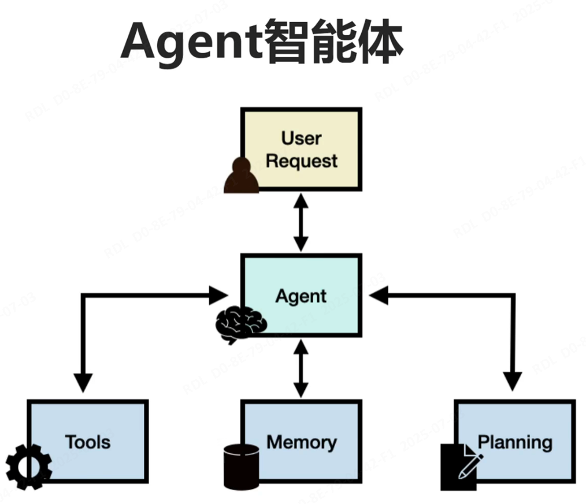
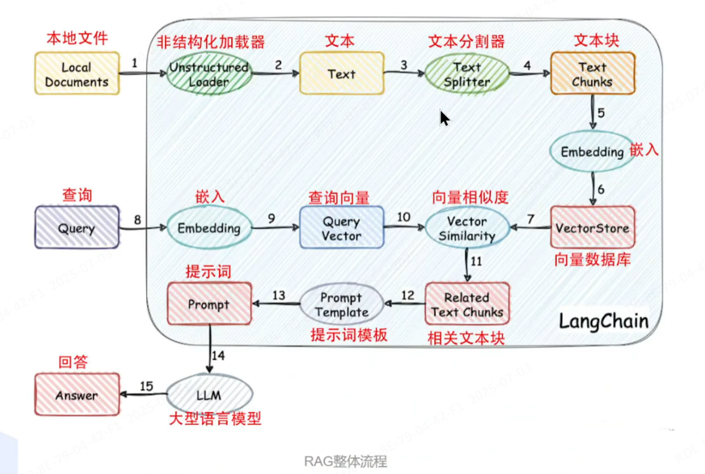
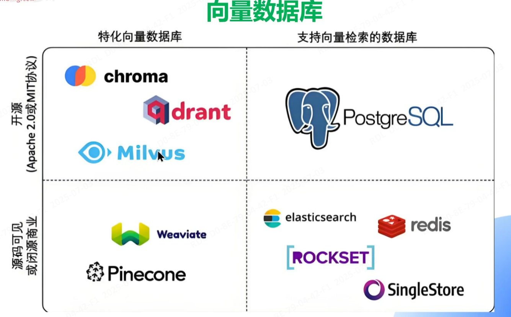
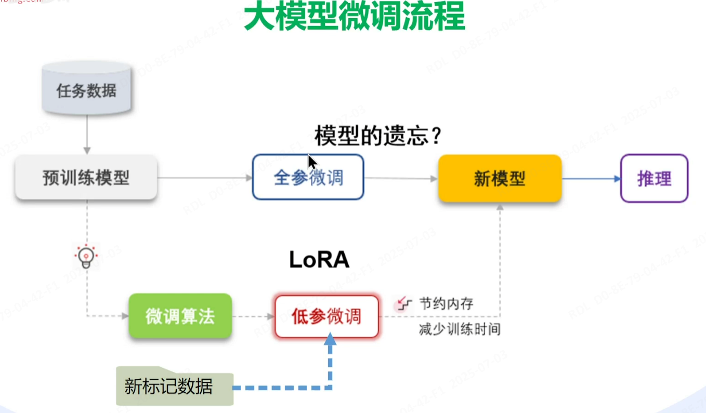
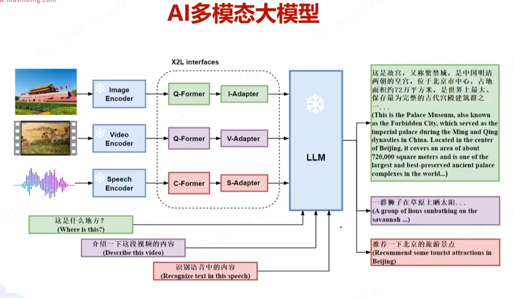
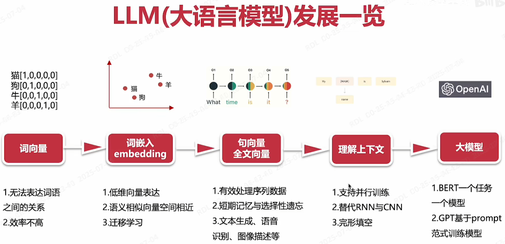

### 1、Tool（工具）

- 单一功能模块：Tool 是完成特定任务的独立工具，每个工具专注于一项具体操作（如搜索、计算、API 调用等）。
- 无决策能力：工具本身不决定何时被调用，仅在被触发时执行预设操作。
- 输入输出明确：每个工具需明确定义输入参数和输出格式，例如：
  - 搜索工具：输入是查询字符串，输出是搜索结果。
  - 计算工具：输入是数学表达式，输出是计算结果。

### 2、Agent（智能体）

- 任务协调者：Agent 是自主决策的智能体，负责解析用户意图、规划任务步骤、调用工具并整合结果。

- 决策逻辑：基于 LLM 的推理能力（如 ReAct 框架），动态决定使用哪些工具及执行顺序。

- 上下文管理：维护任务状态，处理工具返回的中间结果，最终生成用户友好的响应。

工作流程

1. 理解意图：解析用户输入的深层需求（如“比较 Python 和 Java 的优缺点”需多步调研）。
2. 规划步骤：决定调用工具的顺序（如先搜索 Python 特性，再搜索 Java 特性）。
3. 执行工具：调用 Tool 获取数据，处理可能的错误或重试。
4. 综合响应：将多个工具的结果整合为自然语言回答。

通过这种分工，LangChain 实现了模块化与智能化的结合：Tool提供基础能力，Agent 赋予系统自主决策的灵活性，两者协同完成从简单查询到复杂问题求解的多样化任务。

```text
用户输入
  ↓
Agent（解析意图，生成计划）
  ↓
选择工具 → 调用Tool1 → 获取结果
  ↓
选择工具 → 调用Tool2 → 获取结果
  ↓
整合结果 → 生成最终回答
```

### 3、MCP

MCP（Model Context Protocol，模型上下文协议），2024 年 11 月底，由 Anthropic 推出的一种开放标准，旨在统一大型语言模型（LLM）与外部数据源和工具之间的通信协议。

Function Calling 是AI模型调用函数的机制，MCP 是一个标准协议，使 AI 模型与 API 无缝交互，而 AI Agent 是一个自主运行的智能系统，利用 Function Calling 和 MCP 来分析和执行任务，实现特定目标。

> MCP 与 Function Calling 的区别

| 类别       | MCP（Model Context Protocol） | Function Calling               |
| ---------- | ----------------------------- | ------------------------------ |
| 性质       | 协议                          | 功能                           |
| 范围       | 通用（多数据源、多功能）      | 特定场景（单一数据源或功能）   |
| 目标       | 统一接口，实现互操作          | 扩展模型能力                   |
| 实现       | 基于标准协议                  | 依赖于特定模型实现             |
| 开发复杂度 | 低：通过统一协议实现多源兼容  | 高：需要为每个任务单独开发函数 |
| 复用性     | 高：一次开发，可多场景使用    | 低：函数通常为特定任务设计     |
| 灵活性     | 高：支持动态适配和扩展        | 低：功能扩展需额外开发         |

MCP 协议支持两种主要的通信机制：基于标准输入输出的本地通信和基于SSE（Server-Sent Events）的远程通信。这两种机制都使用 JSON-RPC 2.0 格式进行消息传输，确保了通信的标准化和可扩展性。

本地通信：通过 stdio 传输数据，适用于在同一台机器上运行的客户端和服务器之间的通信。

远程通信：利用 SSE 与 HTTP 结合，实现跨网络的实时数据传输，适用于需要访问远程资源或分布式部署的场景。

### 4、RAG

RAG：Retrieval-Augmented Generation 检索增强生成。RAG通过结合 LLMs 的内在知识和外部数据库的非参数化数据，提高了模型在知识密集型任务中的准确性和可信度。

- 向量数据库：Milvus、Chroma、PostgreSQL、Drant等

- 数据的加载：html、markdown、pdf、excel、word等

- 数据的切片（Chunk）：标题、段落、分隔符、语义等

- 嵌入（Embeddings）模型：openai、bge-large等

- 检索器：ANN、全文检索、过滤检索、混合检索、分组等

- Rerankers（重排序）：加权排序、RRFRanker等

- Agent+RAG

- Graph+RAG

- 多源RAG

- 评估RAG：RAGAs（检索增强生成评估）框架










### 5、Transformer

