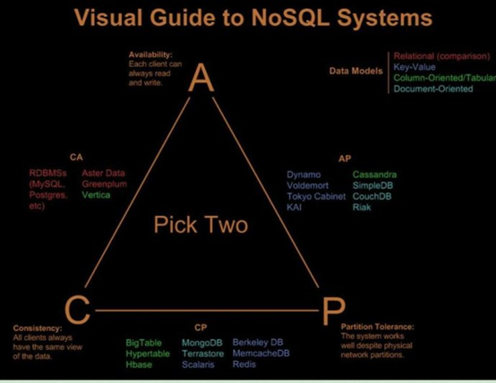
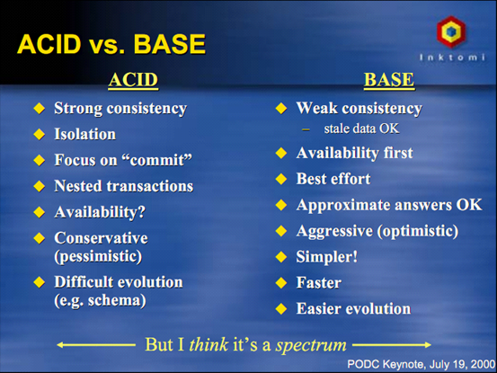
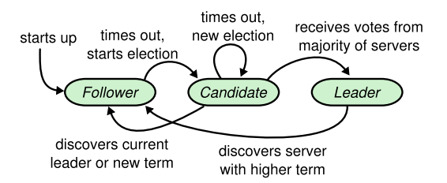
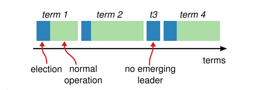
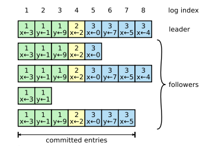
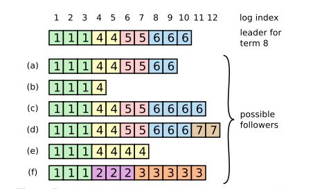
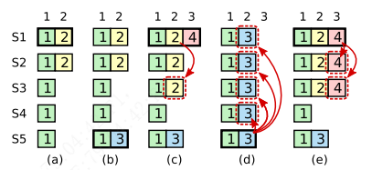
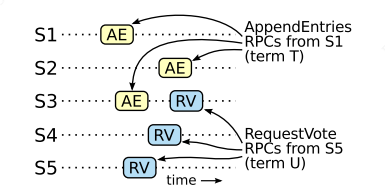
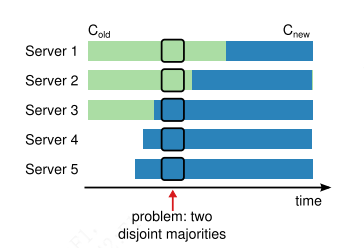
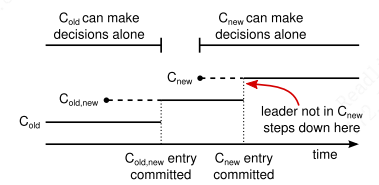

## 一、分布式理论

### 1、CAP 理论

CAP 理论来自学术界，CAP 本身基于状态，基于瞬态，是一个描述性的理论，并不解决工程问题。它是一个证明你不能做什么的理论，就像能量守恒一样（无法设计出永动机），限制了分布式系统设计者的行为。

CAP 定理表达了一个分布式系统里（出现分区的情况下）不可能同时满足以下三个特性：

#### （1）C：数据一致性（Consistency）

一致性是指写操作后的读操作可以读取到最新的数据状态，当数据分布在多个节点上，从任意节点读取到的数据都是最新的状态。当节点故障时，节点之间无法保证一致性变化，为了保证分布式系统对外的数据一致性，选择不返回任何数据（对外表现为不可用）。即对调用者而言，数据具有强一致性。

对于写请求：数据无法同步到所有（或大多数）节点时，返回错误。

对于读请求：无法获取到最新数据（不能被大多数节点共识），返回错误。


注意：

- CAP理论中的C  !=  事务ACID特性中的C。

- CAP 理论中的 C 为：副本一致性，即所有副本的结果一致（共识）。
- 而 ACID 中的 C 是事务的一致性状态，即两个值之间的关系，前后保持一致。

#### （2）A：服务可用性（Availability）

可用性是指任何读、写操作都可以在一定时间内得到响应结果，且不会出现响应超时或响应错误。

可用性在 CAP 里是对结果的要求，它要求系统内的节点接收到的无论是写请求还是读请求，都要能处理并返回响应结果。它有两点必须满足的条件：

① 返回结果必须在合理的时间内。

② 需要系统内能正常接收请求的所有节点都返回结果。

#### （3）P：分区容忍性（Partition-tolerance）

系统如果不能在时限内达成数据一致，就意味着发生了分区的情况，必须就当前操作在 C 和 A 之间做出选择。

通常分布式系统的各个结点部署在不同的子网，不可避免的会出现由于网络问题或机器故障而导致结点之间通信失败，这就是网络分区，此时仍可对外提供服务，这叫分区容忍性。

#### （4）分布式数据库中的 CAP



一个分布式系统（发生分区错误时）理论上最多只能同时满足：CAP 三项中的两项。P 是必须的，在分布式系统内，P 是必然发生的（网络不可靠），一旦发生分区，整个分布式系统就完全不可用，这是不符合实际需要的。所以，对于分布式系统，我们只需考虑 C 和 A 如何选择。

- CP 系统：放弃可用性，追求一致性和分区容忍性。当发生分区故障后，客户端的任何请求都被卡死或者超时，但每个节点总是会返回一致的数据。（如：zookeeper，跨行转账）
- AP 系统：放弃一致性，追求分区容忍性和可用性。当发生分区故障后，客户端依然可以访问系统，但是获取的数据可能会不一致。（如：Eureka，这是很多分布式系统设计时的选择，最终一致性）
- CA：放弃分区容忍性，即不进行分区，不需考虑网络和节点挂掉的问题，则可以实现一致性和可用性。那么系统将不是一个标准的分布式系统。（关系型数据库就满足 CA 架构）

对于 NoSQL 数据库，更加注重可用性，所以就会是一个 AP 系统。

对于分布式关系型数据库，必须要保证一致性，所以就会是一个 CP 系统。

但分布式关系型数据库仍有高可用性的需求，虽然达不到 CAP 理论中的 100% 可用，但一般都具备 99.999% 以上的高可用。我们可以把分布式关系型数据库看作 CP + HighAvailability 的系统。由此产生了两个广泛应用的指标：

- RPO（Recovery Point Objective）：恢复点目标，指数据库在灾难发生后会丢失多长时间的数据。分布式关系型数据库 RPO = 0。
- RTO（Recovery Time Objective）：恢复时间目标，指数据库在灾难发生后到整个系统恢复正常所需要的时间。分布式关系型数据库 RTO < 几分钟。

> CAP 选择总结，当分布式系统出现内部问题时，该怎么选：

- 迁就外部服务：如外包公司，不能因自身问题让外部服务受影响，优先高可用。
- 让外部服务迁就你：如银行，要优先一致性。

#### （5）CAP 的理解误区：

- 分布式系统因为 CAP 理论，放弃了 C 或 A 的其中一个？

  理解有误，只有当 P 发生时，才会出现 C 和 A 选择，而 P 发生的概率非常低，所以，当没有出现分区问题时，系统拥有完美的数据一致性和可用性。

  实际上，我们设计一个系统时，更多的是要选择 C 和 A 中的一个，对其进行降级，以此妥协，也就是 trade off 的一个过程。

#### （6）CAP 视角的分布式方案

> Quorum Replication

N（副本数）

W（写入成功副本数）

R（读取成功副本数）

- W+R > N，永远都有一个副本是最新且正确的。
- N=3，W=1，R=3（写可用 AP，读一致 CP）。
- N=3，W=3，R=1（写一致 CP，读可用 AP）。

> 共识算法

副本之间有交互，Leader 提供读写，Leader 宕机时，选举一个新 Leader，只有选举的短暂过程不可用。

CP + HighAvailability


### 2、Base 理论

CAP 理论说明，在分布式系统中需要妥协。而 Base 理论 是 CAP 理论的一种妥协，Base 理论降低了发生分区错误时，对可用性和一致性的要求。

- 基本可用（Basically Availble）：分布式系统在出现故障时，允许损失部分可用功能，保证核心功能可用。（可能响应延长、可能服务降级）；
- 软状态/柔性事务（Soft State）：允许系统中的数据存在中间状态，并认为该中间状态不会影响系统整体可用性。
- 最终一致性（Eventual Consistency）：节点数据同步可以存在延时，但在一定的期限后必须达成数据一致，状态为最终状态。

> ACID vs BASE

| ACID                   | BASE                   |
| ---------------------- | ---------------------- |
| 强一致性               | 弱一致性（容忍旧数据） |
| 隔离性                 | 可用性优先             |
| 专注于提交             | 尽最大努力             |
| 嵌套事务               | 大概的答复             |
| 可用性                 | 侵略性的（乐观的）     |
| 保守（悲观的）         | 更简单的               |
| 进化困难（例如：模式） | 更快                   |
|                        | 更容易进化             |




### 3、数据一致性模型

- 强一致性
- 弱一致性
- 最终一致性
- 因果一致性：因果关系的操作顺序得到保证。
- 会话一致性


## 二、分布式 ID 

### 1、雪花算法

### 2、UUID

```shell
# Linux 生成 UUID
> cat /proc/sys/kernel/random/uuid
```

### 3、Redis


## 三、分布式缓存

### 1、哈希取余算法

用户每次读写操作都是根据公式：hash(key)%N，其中 N 代表节点数，计算出哈希值，决定数据映射到哪个节点。

优点：简单，预估好数据规划好节点，每台服务器固定处理一部分请求，起到负载均衡的作用。

缺点：节点扩容、缩容都需要重新计算节点的映射关系，数据迁移量大，数据泛洪。


### 2、一致性哈希算法

一致性哈希环：根据 hash(key)%(2^32^-1)  这个算法构成的结果集形成的环形空间。

节点映射：将集群中各个IP节点映射到环上的某个位置，hash(host|ip)%(2^32^-1)。

落键规则：根据一致性哈希算法 hash(key)%(2^32^-1) 得到键在环上的位置，沿顺时针方向寻找到的第一个节点即为该键的存储节点。

优点：提高了容错性和扩展性，增减节点时，仅影响该节点在 hash 环上顺时针相邻的节点。

缺点：节点太少时，若两个节点相距很近，会导致数据倾斜，数据存储不均匀。

虚拟节点机制：为了解决数据倾斜问题，可以在服务器 ip 或主机的后面增加编号，生成虚拟节点。数据定位算法不变，只是多了一个虚拟节点到实际节点的映射。


### ...有界负载一致性 hash


### 3、哈希槽算法

哈希槽算法解决均匀分布的问题，在数据和节点之间抽象出 slot 层，用于管理数据和节点之间的关系。

槽数量：2^14 = 16384

槽：slot = CRC16(key)%16384

哈希：解决的是映射问题，便于数据分配。

槽：解决的是粒度问题，便于数据移动。


Redis-Cluster 采用的分区方式：哈希槽算法。

- 把16384槽按照节点数量进行平均分配，由节点进行管理
- 对每个key按照CRC16规则进行hash运算
- 把hash结果对16383进行取余
- 把余数发送给Redis节点
- 节点接收到数据，验证是否在自己管理的槽编号的范围
  - 如果在自己管理的槽编号范围内，则把数据保存到数据槽中，然后返回执行结果
  - 如果在自己管理的槽编号范围外，则会把数据发送给正确的节点，由正确的节点来把数据保存在对应的槽中

注意：Redis-Cluster 的节点之间会共享消息，每个节点都会知道是哪个节点负责哪个范围内的数据槽。

虚拟槽分布方式中，由于每个节点管理一部分数据槽，数据保存到数据槽中。当节点扩容或者缩容时，对数据槽进行重新分配迁移即可，数据不会丢失。 


### 4、缓存模式

#### （1）数据一致性

- 同步操作 DB；
- 同步操作 Cache；
- 利用 Job 消费消息，重新补偿一次缓存操作。

#### （2）多级缓存


#### （3）热点缓存

- 小表广播，从 RemoteCache 提升为 LocalCache，APP 定时更新，甚至可以让运营平台支持广播刷新 LocalCache。
- 主动预约。

#### （4）缓存穿透/击穿

- 缓存短暂零值；
- 布隆过滤器：未匹配到数据则一定不存在，匹配到数据不一定存在；

- singlefly：对同一个失效 key 的多个请求，只有一个请求执行对 key 的更新操作，其余均等待结果返回。（源码就是waitgroup+atomic+mutex） 

- 分布式锁：只有一个线程去查询后端的服务，某个线程在查询后端服务的同时，其他线程没有获得分布式锁的权限，需要进行等待。（不建议）

#### （5）缓存雪崩

缓存大面积失效，或缓存服务宕机。

- key 过期时间随机（事前）；
- 设置缓存高可用集群，出事切换（事后）；
- 用限流降级、服务熔断的方式防止缓存雪崩（事后）；
- singleflight 只允许单个线程查询数据和写缓存（事前）；
- 预热缓存（事前）。


### 5、缓存小技巧


## 四、分布式事务

### 1、本地事务

关系型数据库事务的 4 个基本特性 ACID：

- 原子性（Atomicity）：一个事务内的所有操作要么都执行，要么都不执行。
- 一致性（Consistency）：数据满足完整性约束，不存在中间状态。
- 隔离性（Isolation）：多个事务并发执行时，互不干扰。
- 持久性（Durability）：事务完成后结果永久保存。


### 2、分布式事务解决方案

> 分布式事务用于在分布式系统中保证不同节点之间的数据一致性。

分布式事务的实现有很多种，最具有代表性的是由 Oracle Tuxedo 系统提出的 XA 分布式事务协议。XA 协议包含两阶段提交协议（Two-phase commit protocol）和三阶段提交协议（3PC）两种实现。

XA 协议中包含两个角色：事务协调者和事务参与者。

#### （1）2PC

> 强一致性

2PC 是一种强一致性设计，用事务协调者来协调管理各参与者的提交和回滚。

2PC的传统方案是在数据库层面实现的，如 Oracle、MySQL 都支持 2PC 协议。

**准备阶段**：事务协调者给每个参与者发送 Prepare 消息，每个数据库参与者在本地执行事务，并写本地的 Undo/Redo 日志，此时事务没有提交。（Undo 日志是记录修改前的数据，用于数据库回滚，Redo 日志是记录修改后的数据，用于提交事务后写入数据文件）

**提交阶段**：如果事务协调者收到了参与者的执行失败或者超时消息时，直接给每个参与者发送回滚（Rollback）消息；否则，发送提交（Commit）消息；参与者根据事务管理器的指令执行提交或者回滚操作，并释放事务处理过程中使用的锁资源。


2PC 的问题：

- 性能问题：同步阻塞协议，协调者需要等待所有参与者响应才会进行下一步操作，需要等待两阶段结束才释放资源。
- 协调者单点故障问题
- 丢失消息导致的不一致问题


#### （2）3PC（了解）

> 强一致性事务，数据库层面。

XA 三阶段提交在两阶段提交的基础上增加了CanCommit 阶段，并且引入了超时机制。一旦事物参与者迟迟没有接到协调者的 commit 请求，会自动进行本地 commit。这样有效解决了协调者单点故障的问题。但是性能问题和不一致的问题仍然没有根本解决。

准备阶段（CanCommit）：询问此时的参与者是否有条件接这个事务，不会一来就干活直接锁资源，使得在某些资源不可用的情况下所有参与者都阻塞着。

预提交阶段（PreCommit）：

提交阶段（DoCommit）：


#### （3）TCC

> 补偿性事务

TCC 是 Try、Commit、Cancel 三种指令的缩写，其逻辑模式类似于XA两阶段提交，但是实现方式是在代码层面来人为实现。对业务的侵入性较大，每个操作都需要实现对应的三个方法。

- Try：指的是预留，即资源的预留和锁定。
- Confirm：确认操作，这一步其实就是真正的执行了。
- Cancel：撤销操作，可以理解为把预留阶段的动作撤销。

 

TCC 对业务的侵入较大和业务紧耦合，需要根据特定的场景和业务逻辑来设计相应的操作。所以 TCC 可以跨数据库、跨不同的业务系统来实现事务。

还有一点要注意，撤销和确认操作的执行可能需要重试，因此还需要保证操作的幂等。


注意：

- 空回滚
- 防悬挂


#### （4）本地消息表

> 最终一致性

要解决消息的可靠存储，实际上是需要解决 MySQL 存储和 message 存储的一致性问题。事务消息一旦被可靠的持久化，我们整个分布式事务变为了最终一致性。

- 在同一事务中，执行业务并将消息放入消息表中；
- 然后调下一个操作，调用成功后，更新消息表状态；
- 调用失败，用后台任务定时扫描本地消息表，并调用对应的服务，成功后更新消息状态；
- 重试，需要保证对应服务的方法是幂等的，一般会有最大重试次数，超过次数记录预警，人工处理。


#### （5）MQ 事务

> 最终一致性

利用消息中间件来异步完成事务的后一半更新，实现系统的最终一致性。这个方式避免了像 XA 协议那样的性能问题。


#### （6）最大努力通知（Best Effort）

> 最终一致性

只有消息被消费才能保障最终业务数据的完整性，所以我们要尽最大努力，把消息送达到下游的业务消费方。适用于对时间不敏感的业务，例如短信通知。

本地消息表、MQ 事务 都是尽最大努力，所以最大努力通知其实只是表明了一种柔性事务的思想：我已经尽力我最大的努力想达成事务的最终一致了。

我们发现，所有努力送达的模型，必须是先预扣（预占资源）的做法。


#### （7）Seata

Seata 的设计目标其一是对业务无侵入，因此从业务无侵入的 2PC 方案着手，在传统 2PC的基础上演进，并解决 2PC 方案面临的问题。

Seata 把一个分布式事务理解成一个包含了若干分支事务的全局事务。全局事务的职责是协调其下管辖的分支事务达成一致，要么一起成功提交，要么一起失败回滚。

Seata 定义了 3 个组件来协议分布式事务的处理过程： 

- Transaction Coordinator（TC）：事务协调器，它是独立的中间件，需要独立部署运行，它维护全局事务的运行状态，接收 TM 指令发起全局事务的提交与回滚，负责与 RM 通信协调各各分支事务的提交或回滚。
- Transaction Manager（TM）： 事务管理器，TM 需要嵌入应用程序中工作，它负责开启一个全局事务，并最终向 TC 发起全局提交或全局回滚的指令。
- Resource Manager（RM）：控制分支事务，负责分支注册、状态汇报，并接收事务协调器 TC 的指令，驱动分支（本地）事务的提交和回滚。


> Seata实现2PC与传统2PC的差别

架构层次方面：传统 2PC 方案的 RM 实际上是在数据库层，RM 本质上就是数据库自身，通过 XA 协议实现，而 Seata 的 RM 是以 jar 包的形式作为中间件层部署在应用程序这一侧的。

两阶段提交方面：传统 2PC无论第二阶段的决议是 commit 还是 rollback ，事务性资源的锁都要保持到 Phase2 完成才释放。而 Seata 的做法是在 Phase1 就将本地事务提交，这样就可以省去 Phase2 持锁的时间，整体提高效率。


## 五、分布式共识算法（Raft Consensus Algorithm）

- [Raft Website](https://raft.github.io/)
- [Raft Paper](https://raft.github.io/raft.pdf)
- [可理解的 Raft 可视化](http://thesecretlivesofdata.com/raft/)

### 1、概述

#### （1）什么是 Raft？

Raft 是一种用于管理复制日志的一致性算法。Raft 比 Paxos 更容易理解，也为构建实用系统提供了更好的基础。为了增强可理解性，Raft 分离了共识的关键要素，如领导人选举、日志复制和安全性，并加强了一致性，以减少状态数量。

Raft 的新颖功能：

- 强大的 Leader：Raft 使用了比其它共识算法更强的 Leader 形式。例如，日志条目仅从 Leader 服务器流向其它服务器。这简化了对复制日志的管理，并使 Raft 更易于理解。
- Leader 选举：Raft 使用随机定时器来选举 Leader。这只增加了少量的机制到任何共识算法已经需要的心跳，同时简单快速地解决冲突。
- 成员身份更改：Raft 更改集群中服务器集的机制使用了一个新的 *联合共识* 方法，其中两种不同配置的大多数在过渡期间重叠。这允许集群在配置更改期间继续正常运行。

#### （2）什么是分布式共识？

共识是容错分布式系统中的一个基本问题。共识涉及多个服务器就值达成一致，一旦他们就某个值做出决定，该决定就是最终决定。当大多数服务器可用时，典型的共识算法会取得进展（提交条目）。如果更多的服务器出现故障，他们将停止取得进展（但永远不会返回错误的结果【一致性】）。


### 2、复制状态机（Replicated state machines）

共识算法通常出现在复制状态机的上下文中。在这种方法中，服务器集合上的状态机计算相同状态的相同副本，并且即使某些服务器出现故障也可以继续运行。复制状态机用于解决分布式系统中的各种容错问题。例如，具有单集群 Leader 的大型系统（GFS、HDFS、RAMCloud），通常使用单独的复制状态机来管理 Leader 选举并存储必须在 Leader 崩溃后才能生存的配置信息。复制状态机的例子包括 Chubby 和 Zookeeper（例：管理 Kafka 集群）。

复制状态机通常使用复制日志来实现，每个服务器都有一个状态机并存储一份日志，其日志包含一系列命令，其状态机按顺序执行这些命令。每个日志以相同的顺序包含相同的命令，因此每个状态机处理相同命令序列。由于状态机是确定性的，每个状态机都计算相同的状态和相同的输出序列。

状态机的结果：相同的初始状态 + 相同的输入 = 相同的结束状态。

保持复制日志的一致性是共识算法的工作。


> 复制状态机执行流程：

① Leader 服务器上的共识模块接收来自 Client 的命令。

② 将命令添加到日志中，并与其它服务器（Follower）上的共识模块进行通信，以确保每个日志最终都以相同的顺序包含相同的请求，即使某些服务器出现故障。

③ 一旦命令被正确复制（收到大多数节点的回复），每个服务器的状态机就会按日志顺序处理它们。

④ 响应客户端。

> 实际系统的一致性算法通常具有一下特征：

- 它们确保在所有非拜占庭（non-Byzantine）条件下的安全性（永远不会返回错误的结果），包括网络延迟、分区，数据包丢失、重复，重新排序。
- 只要大多数（大于 N/2）服务器可以运行，并且可以相互通信和与客户端通信，它们就可以完全发挥作用（可用）。
- 它们不依赖于时间来确保日志的一致性：错误的时钟和极端的消息延迟在最坏的情况下会导致可用性问题。
- 在常见情况下，只要集群的大多数成员对单轮远程过程调用做出响应，命令就可以完成；少数慢速服务器不需要影响整体系统性能。

### 3、Raft 算法基础

#### （1）服务器状态



在任何给定的时间，每个服务器都处于三种状态之一：

- 追随者（Follower）：追随者是被动的，它不会自己提出要求，只是简单地回应领导者和候选人的要求。

- 候选者（Candidate）：在一个选举超时时间内，没发现 Leader，则切换为 Candidate，开始选举。

- 领导者（Leader）：领导者处理所有客户端请求（如果客户端联系追随者，追随者会将其重定向到领导者）。

在正常操作中，只有一个领导者，而所有其它服务器都是追随者。

#### （2）任期



Raft 将时间划分为任意长度的任期，每届任期以选举开始，一名或多名候选人试图成为 Leader。如果一位候选人赢得了选举，那么它将在余下的任期内担任 Leader。在某些情况下，选举会导致投票分裂，在这种情况下，任期将在没有 Leader 的情况下结束；新的任期（包括新的选举）将很快开始。Raft 确保在一个任期内最多有一位 Leader。

不同的服务器在不同时期可能会观察到任期之间的转换，并且在某些情况下，服务器可能不会观察到一个选举甚至整个任期。

任期在 Raft 中充当逻辑时钟，它们允许服务器检测过时的信息，如过期的 Leader。每个服务器存储一个当前任期编号，该编号随时间单调递增。当服务器通信时，都会交换当前任期，如果一台服务器的当前任期小于另一台服务器，则会将其当前任期更新为更大的值。如果 Candidate 或 Leader 发现自己的任期已经过时，就会立即恢复到 Follower 状态。如果服务器接收到一个具有过时任期编号的请求，它将拒绝该请求。

#### （3）通信

Raft 服务器使用 RPC 进行通信，并且基本的一致性算法只需要两种类型的 RPC：请求投票 RPC 和追加条目 RPC。

- State：服务器状态

```go
type ServerState struct {
    // 所有服务器上的持久状态（在响应 RPC 前已更新到稳定存储上）
    currentTerm int      // 服务器已看到的最新任期（第一次启动时初始化为 0，单调增加）
    votedFor    *int     // 当前任期内收到选票的 CandidateID（如果没有则为 null）
    log         []string // 日志条目（索引从 1 开始）
    
    // 所有服务器上的不稳定状态
    commitIndex int // 已知要提交的最高日志条目索引（初始化为 0，单调增加）
    lastApplied int // 应用于状态机的最高日志条目索引（初始化为 0，单调增加）
    
    // Leader 的不稳定状态（选举后重新初始化）
    //  Leader 将发送给该 Follower 的下一个日志条目的索引
    //  对于每台服务器，发送到该服务器的下一个日志条目的索引（初始化为 LeaderLastLogIndex + 1）
    nextIndex  []int 
    //  对于每台服务器，已知要在服务器上复制的最高日志条目索引（初始化为 0，单调递增）
    matchIndex []int 
}
```

- Request Vote RPC：由 Candidate 在选举期间发起。

```go
// 请求投票参数
type RequestVoteRpc struct {
    term         int // Candidate 任期
    candidateId  int // Candidate ID
    lastLogIndex int // Candidate 最后一条日志条目的索引
    lastLogTerm  int // Candidate 最后一条日志条目的任期
}

// 请求投票响应
type RequestVoteResponse struct {
    term int         // 当前任期，用于 Candidate 更新自身
    voteGranted bool // TRUE 表示 Candidate 获得选票
}

// 接收器实现
func (s *ServerState) VoteReplay (req RequestVoteRpc) RequestVoteResponse {
    // 1. Reply false if term < currentTerm
    if req.term < s.currentTerm {
        return RequestVoteResponse{
            term: currentTerm,
            voteGranted: false,
        }
    }
    
    // If votedFor is null or candidateId, and candidate’s log is at least as up-to-date as receiver’s log, grant vote
    if (s.votedFor == nil || s.votedFor == req.candidateId) && 
      req.lastLogIndex >= s.lastApplied && req.lastLogTerm >= s.currentTerm {
        return RequestVoteResponse{
            term: currentTerm,
            voteGranted: true,
        }
    }
}
```

- Append Entries RPC：由 Leader 发起，以复制日志条目并提供一种心跳形式

```go
// 附加日志条目请求参数
type AppendEntriesRpc struct {
    term         int      // Leader 任期
    leaderId     int      // LeaderID，以便 Follower 可以重定向 Client
    prevLogIndex int      // 前一个日志条目索引
    prevLogTerm  int      // 前一个日志条目任期
    entries      []string // 要存储的的日志条目（为空时用于心跳，可以批量发送条目）
    leaderCommit int      // Leader 的 CommitIndex
}

// 附加日志条目响应
type AppendEntriesRpc struct {
 	term    int  // 当前任期，用于 Leader 自我更新
    success bool // 如果 Follower 包含匹配的条目 prevLogIndex 和 prevLogTerm，则返回 TRUE
}

// 接收器实现
func (s *ServerState) AppendEntriesApply (req AppendEntriesRpc) AppendEntriesRpc {
    // 1. Reply false if term < currentTerm
    if req.term < s.currentTerm {
        return AppendEntriesRpc{
            term: s.currentTerm,
            sucess: false,
        }
    }
    
    // 2. Reply false if log doesn’t contain an entry at prevLogIndex whose term matches prevLogTerm
    
    // 3. If an existing entry conflicts with a new one (same index but different terms), delete the existing entry and all that follow it
    
    // 4. Append any new entries not already in the log
    
    // 5. If leaderCommit > commitIndex, set commitIndex = min(leaderCommit, index of last new entry)

}
```

#### （4）关键属性（安全）

Raft 保证这些属性中的每一个在任何时候都是正确的。

- **Election Safety**（选举安全）：在一个任期内最多只能选出一位 Leader。
- **Leader Append-Only**（Leader 仅追加）：Leader 永远不会覆盖或删除其日志中的条目，它只追加新的条目。
- **Log Matching**（日志匹配）：如果两个日志包含具有相同索引和任期的条目，那么在给定索引之前的所有条目中，日志都是相同的。
- **Leader Completeness**（Leader 完整性）：如果一个日志条目在给定的任期中被提交，那么该条目将出现在所有更高任期号的 Leader 的日志中。
- **State Machine Safety**（状态机安全）：如果服务器已将给定索引处的日志条目应用到其状态机，那么其它服务器将不会为相同的索引应用不同的日志条目。


### 3、领导者选举（Leader Election）

Raft  使用心跳机制来触发 Leader 选举。

> 在 Raft 中有两个超时设置来控制选举：

- 选举超时：选举超时是 Follower 等待成为 Candidate 的时间，选举超时 *随机* 在 150 ~ 300 ms 之间。
- 心跳超时（广播时间）：Leader 定期向所有 Follower 发送心跳（不携带日志条目的 AppendEntries RPC），以维护 Leader 的地位。

> Leader Election 流程：

- 所有节点都以 Follower 状态开始，如果 Follower 在选举超时后，没有收到任何通信，那么它就会认为没有可用行的 Leader，Follower 增加当前任期任期，并切换为 Candidate，以开始新一轮的选举。
- Candidate 为自己投一票，并向其它节点发送 RequestVote RPC。Candidate 最终会因以下三件事而切换状态：
  - ① 赢得选举：切换为 Leader。
  - ② 另一个服务器成为 Leader：切换为 Follower。
  - ③ 选票分裂：进入新一轮选举。

- ① 如果 Candidate 在同一任期内获得大多数节点的选票（确保每个任期只能选出一位 Leader），则该 Candidate 赢得选举成为 Leader。每个节点将在给定任期内以先到先得的方式投票给最多一名 Candidate（每个任期只能投一票），且该节点重置其选举超时。多数规则确保每个任期内最多选出一名 Leader（选举安全）。Leader 向所有其它服务器发送心跳消息，以维护其权威。
- ② 在等待投票时，Candidate 可能会收到来自另一台声称 Leader 的 AppendEntries RPC。如果 Leader 的任期大于等于 Candidate 的当前任期，那么 Candidate 承认 Leader 是合法的，并返回 Follower 状态。否则，Candidate 拒绝 RPC 并继续处理 Candidate 状态。
- ③ 如果多个 Follower 同时成为 Candidate，选票可能会被分割，因此没有 Candidate 获得多数票。这时，每个 Candidate 都会超时，并进入下一轮选举，如果不采取额外措施，分裂投票可能会无限重复。Raft 使用随机的选举超时来确保分裂选票很少发生，并且能够迅速解决。


> **排名系统**
>
> 每个候选人都被分配一个唯一的排名，用于在竞争的候选人之间选择。如果一位候选人发现了另一位排名更高的候选人，它将返回追随者状态，这样排名更高的候选人就可以更容易地赢得下一次选举。
>
> 排名系统的问题：如果排名较高的服务器出现故障，排名较低的服务器可能需要暂停并再次成为候选服务器，但如果它这样做得太早，它可能会重新设置选举领导者的进度。


### 4、日志复制（Log Replication）

一旦选出 Leader，它就开始为 Client 的请求提供服务。Leader 将命令作为新条目附加到其日志中，然后向其它每个服务器 *并行* 发出 AppendEntries RPC 以复制该条目。当条目被安全复制后，Leader 将该条目应用于其状态机，并将执行结果返回给 Client。如果 Follower 奔溃、网络延时、数据丢失，则 Leader 会无限期地重试 AppendEntries RPC（即使它对客户端做出响应后），直到所有 Follower 最终存储所有日志条目。

#### （1）日志复制流程

- 系统的所有更改都经过 Leader，其将系统的所有更改复制到所有节点。
- Client 向 Leader 发送更改。
- 更改附加到 Leader 的日志中（未提交）。
- 然后在下一次心跳时将更改发送给 Follower。
- Leader 等待大多数 Follower 都写入了该条目，该条目才会在 Leader 上提交（应用到状态机）。
- Leader 通知 Follower 该条目已提交。
- 并向 Client 发送响应。
- 集群现在已经就系统状态达成共识。

#### （2）日志的组织形式



- 日志由条目组成，条目按顺序编号。
- 每个条目都包含创建它的任期（框中的数字）和状态机命令。
- 如果将条目应用于状态机是安全的（被大多数节点认可），则该条目被视为已提交。

#### （3）一致性保证

Raft 保证提交的条目是持久的，并且最终将由所有可用的状态机执行，以保持不同服务器上的日志之间的高度一致性。Raft 维护以下属性，这些属性共同构成 **Log Matching** 属性：

- 如果不同日志中的两个条目具有相同的索引和任期，则它们存储相同的命令。

  第一个属性来自这样的事实，Leader 在给定任期的给定日志索引位置上最多创建一个条目。并且日志条目永远不会改变其在日志中的位置。

- 如果不同日志中的两个条目具有相同的索引和任期，那么前面所有条目中的日志都是相同的。

  第二个属性由 AppendEntries 执行的简单一致性检查来保证。当发送 AppendEntries RPC 时，Leader 包含其日志中紧跟在新条目之前的日志条目索引和任期。如果 Follower 在其日志中找不到具有相同索引和任期的条目，则拒绝新条目。此时，Leader 向前取一个日志条目再次尝试。

  一致性检查充当归纳步骤：日志的初始空状态满足日志匹配属性，并且当扩展日志时，一致性检查都会保留日志匹配属性。因此，每当 AppendEntries 成功返回时，Leader 通过新条目知道 Follower 的日志与自己的日志相同。

#### （4）分区后的一致性保持

在正常操作期间，Leader 和 Follower 的日志保持一致，因此 AppendEntries 一致性检查永远不会失败。但是 Leader 崩溃可能会导致日志不一致。这些不一致可能会因一系列 Leader 和 Follower 崩溃而加剧，日志中丢失的和额外的条目可能跨越多个任期。

> Follower 与 Leader 的日志差异情况：



- Follower 可能缺少 Leader 上的条目（a, b）。
- Follower 可能有 Leader 上没有的额外条目（c, d）。
- 或者两者兼而有之（e, f）。

> Leader Append Only

在 Raft 中，Leader 通过强制 Follower 复制自己的日志来处理不一致。这意味着 Follower 日志中的冲突条目将被 Leader 日志中的条目覆盖。

为了使 Follower 的日志与 Leader 的日志保持一致，Leader 必须找到两个日志一致的最新日志条目，删除该点之后 Follower 日志中的任何条目，并将该点之后 Leader 的所有条目发送给 Follower。

所有这些操作都是响应 AppendEntries RPC 执行的一致性检查而执行的。

> 一致性检查流程：

- Leader 为每个 Follower 维护一个 nextIndex，这是 Leader 将发送给该 Follower 的下一个日志条目的索引。
- 当 Leader 刚上台时，它会将所有 nextIndex 值初始化为其日志中最后一个值之后的索引（如上图，则为 11）。
- 如果 Follower 的日志与 Leader 的日志不一致，则 AppendEntries 一致性检查将在下一个 AppendEntries RPC 中失败。
- 拒绝后，Leader 递减 nextIndex 并重试 AppendEntries RPC。
- 最终 nextIndex 将达到 Leader 和 Follower 日志匹配的点。
- 当这种情况发生时，AppendEntries 将成功，它将删除 Follower 日志中任何冲突的条目，并从 Leader 日志中附加条目。
- 一旦 AppendEntries 成功，Follower 的日志与 Leader 的日志保持一致，并且在本任期的剩余时间内保持不变。

> **一致性检查协议优化：**
>
> 如果需要，可以优化协议以减少被拒绝的 AppendEntries RPC 的数量。例如，当拒绝 AppendEntries 请求时，Follower 可以包含冲突条目的任期以及它为该任期存储的第一个索引。这样 Leader 就可以减少 nextIndex 以绕过该任期中所有冲突的条目。对于具有冲突条目的每个任期，将需要一个 AppendEntries RPC，而不是每个条目一个 RPC。

有了这种机制，Leader 在上台时不需要采取任何特殊行动来恢复日志的一致性。它只是开始正常操作，日志会自动聚合以响应追加条目一致性检查的失败。

这种日志复制机制展示了第 2 节中描述的理想的共识属性：只要大多数服务器正常运行，Raft就可以接受、复制和应用新的日志条目；在正常情况下，可以通过一轮 RPC 将新条目复制到集群的大多数；并且单个缓慢的 Follower 不会影响性能。

### 5、安全性

到目前为止所描述的机制不足以确保每个状态机以相同的顺序执行完全相同的命令。如，Leader 提交日志条目时，Follower 不可用，然后它可以被选为 Leader，并用新的条目覆盖这些条目。

#### （1）选举限制

该限制确保任何给定任期的 Leader 包含以前任期中提交的所有条目（Leader 完整性属性）。

在任何基于 Leader 的共识算法中，Leader 最终必须存储所有提交的日志条目。Raft 使用了一种更简单的方法，即它保证了从每一位 Leader 当选之时起，就包含之前任期的所有已提交的条目，而无需将这些条目转移给 Leader。这意味着日志条目只在一个方向上流动，从 Leader 到 Follower，Leader 永远不会覆盖其日志中现有的条目。

Raft 使用投票过程（RequestVote RPC）来阻止 Candidate 赢得选举，除非其日志包含所有已提交的条目。Candidate 必须联系集群的大多数成员才能当选，这意味着每个提交的条目必须至少存在于其中一个服务器中。如果 Candidate 的日志至少与大多数人中的任何其它日志一样最新（最新的定义如下），那么它将保存所有提交的条目。

Raft 通过比较日志中最后一个条目的索引和任期来确定两个日志中哪个是最新的：

- 如果日志的最后条目具有不同的 term，则具有较后 term 的日志是最新的。
- 如果日志以相同的 term 结束，则以较长的日志最新。

#### （2）提交以前任期中的条目

Leader 知道，当前任期的条目一旦在在大多数服务器上存储，就会被提交。如果 Leader 在提交条目之前崩溃，未来的 Leader 将尝试完成该条目的复制。然而，Leader 不能立即断定，来自前一个任期的条目一旦在大多数服务器上存储，就会被提交。

> 一个时间序列，显示了为什么 Leader 不能使用旧任期中的日志条目来确定已提交。



- (a)：S1 是 Leader，并且部分地复制 index-2 处的日志条目；
- (b)：在 S1 崩溃中，S5 以 S3、S4 和自身的选票当选为第 3 任期的 Leader，并在日志 index-2 中接受不同的条目；
- (c)：在 S5 崩溃中，S1 重新启动，被选为 Leader（term 4），并继续复制，此时 term 2 中的日志条目已在大多数服务器上复制，但尚未提交；
- (d)：如果 S1 崩溃，S5 可以被选为 Leader（由 S2、S3、S4 投票），并用自己在 term 3 中的条目覆盖该条目。
- (e)：然而，如果 S1 在崩溃之前在大多数服务器上复制其当前任期的条目，则该条目被提交（S5 不能赢得选举）。此时，也提交了日志中前面的所有条目。

上图说明了一种情况，即旧的日志条目存储在大多数服务器上，但仍然可以被未来的 Leader 覆盖。

为了消除上面的问题，Raft 从不通过计数副本来提交以前任期中的日志条目。只有 Leader 当前任期内的日志条目才能通过计数副本来提交。一旦以这种方式提交了当前任期中的一个条目，那么由于日志匹配属性，所有先前的条目都将间接提交。在某些情况下，Leader 可以安全地得出结论，即提交了较旧的日志条目（例如，如果该条目存储在每台服务器上），但为了简单起见，Raft 采取了更保守的方法。

Raft 在提交规则中引入了这种额外的复杂性，因为当 Leader 复制以前的任期中的条目时，日志条目会保留其原始 term 编号。在其它共识算法中，如果新的 Leader 从以前的任期中重新复制条目，则必须使用新的任期编号。Raft 的方法使对日志条目进行推理变得更容易，因为它们随着时间的推移和日志之间保持相同的任期号。此外，与其它算法相比，Raft 中的新 Leader 发送以前任期中的日志条目更少（其它算法必须发送冗余日志条目以重新编号，然后才提能交）。

#### （3）安全性论证

> 如果 S1（term T 的 Leader）在其任期内提交了一个新的日志条目，并且 S5 被选为 term U 的 Leader，那么必须至少有一个服务器（S3）接受该日志条目，并投票支持 S5。



给定完整的 Raft 算法，我们现在可以更准确地论证 Leader 完整性性质成立（这一论点基于安全证明）。我们假设 Leader 完整性性质不成立，然后我们证明了一个矛盾。假设 term T 的 Leader（LeaderT）提交了一个来自其任期的日志条目，但该条目没有被某个未来任期的 Leader 存储。考虑最小的任期 U > T，其 Leader（LeaderU）不存储条目。

- 提交的条目在当选时必须不在 LeaderU 的日志中（Leader 永远不会删除或覆盖其条目）。
- LeaderT 在该集群的大多数成员上复制了该条目，而 LeaderU 从该集群的大部分成员那里获得了选票。因此，至少有一个服务器（投票人）接受了来自 LeaderT 的条目并投票支持 LeaderU，如上图。投票者是达成矛盾的关键。
- 投票人必须在投票给 LeaderU 之前接受了 LeaderT 的已提交条目，否则它将拒绝来自 LeaderT 的 AppendEntries 请求（其当前任期将高于 T）。
- 投票人在投票给 LeaderU 时仍然存储条目，因为每个干预的 Leader 都包含条目（假设），Leader 从不删除条目，Follower 只有在与 Leader 冲突时才会删除条目。
- 投票人将投票权授予了 LeaderU，因此 LeaderU 的日志必须与投票人的日志一样最新。这导致了两个矛盾之一。
- 首先，如果投票人和 LeaderU 共享相同的最后一个日志任期，那么 LeaderU 的日志必须至少和投票人的日志一样长，因此其日志包含投票人日志中的每个条目。这是一个矛盾，因为投票人包含了已提交的条目，而 LeaderU 被认为没有。
- 否则，LeaderU 的最后一个日志任期肯定比投票的任期大。此外，它大于 T，因为投票人的最后一个日志任期至少是 T（它包含 term T 已提交的条目）。创建 LeaderU 最后一个日志条目的早期 Leader 必须在其日志中包含已提交的条目（根据假设）。然后，根据日志匹配属性，LeaderU 的日志也必须包含已提交的条目，这是一个矛盾。
- 这就完成了矛盾。因此，大于 T 的所有任期的 Leader 必须包含在 term T 中已提交的来自 term T 的所有条目。
- Log Matching 属性保证未来的 Leader 也将包含间接提交的条目。

#### （4）Follower 或 Candidate 崩溃

Raft 通过无限期重试 RPC 来处理 Follower 和 Candidate 的失败响应，Raft RPC 是幂等的。

#### （5）时间安排和可用性

> broadcastTime ＜ electionTimeout ＜ MTBF
>

- broadcastTime：广播时间，是服务器向集群中的每个服务器并行发送 RPC 并接收它们的响应所花费的平均时间。
- electionTimeout：选举超时时间。
- MTBF：是单个服务器的平均无故障时间。

广播时间应该比选举超时时间短一个数量级，这样 Leader 就可以可靠地发送阻止 Follower 开始选举所需的心跳信息。

选举超时应该比 MTBF 少几个数量级，这样系统才能稳定地进行。当 Leader 崩溃时，系统将在大约选举超时期间不可用，我们希望这只是整个时间的一小部分。

广播时间和 MTBF 是底层系统的属性，而选举超时是我们必须选择的。Raft 的 RPC 通常要求接收方将信息保存到稳定的存储中，因此广播时间可能在 0.5 ~ 20 ms 之间，具体取决于存储技术。因此，选举超时时间可能在 10 ~ 500 ms 之间。典型的服务器 MTBF 是几个月或更长时间，这很容易满足时间要求。

### 6、集群成员身份变更

#### （1）联合一致方法

> 直接从一种配置切换到另一种配置是不安全的，因为不同的服务器在不同的时间切换。在本例中，集群从三台服务器增长到五台。不幸的是，有一个时间点，两位不同的 Leader 可以在同一任期内当选，一位拥有旧配置的多数票（Cold），另一位拥有新配置的多数票（Cnew）。
>



到目前为止，我们已经假设集群配置（参与共识算法的服务器集）是固定的。在实践中，偶尔需要更改配置，例如在服务器出现故障时更换服务器或更改复制级别。尽管这可以通过使整个集群离线、更新配置文件，然后重新启动集群来完成，但这会使集群在转换过程中不可用。此外，如果有任何手动步骤，则有操作出错的风险。为了避免这些问题，我们决定自动化配置更改，并将其纳入 Raft 共识算法。

为了确保配置变更机制的安全，在过渡期间不得有两位 Leader 在同一任期内当选的可能性。不幸的是，服务器直接从旧配置切换到新配置的任何方法都是不安全的。不可能同时原子地切换所有服务器，因此在转换过程中，集群可能会分裂为两个独立的多数票（脑裂问题）。

为了确保安全，配置更改必须使用两阶段方法。有多种方法可以实现这两个阶段。例如，一些系统使用第一阶段禁用旧配置，因此无法处理客户端请求；则第二阶段启用新配置。在 Raft 中，集群首先切换到我们称之为 *联合共识* 的过渡配置；一旦达成了联合共识，系统就会转换到新的配置。联合共识结合了新旧配置：

- 在这两种配置中，日志条目都会复制到所有服务器。
- 任一配置中的任何服务器都可以作为 Leader。
- 协议（关于选举和条目提交）要求新旧配置分别获得多数票。

> 配置更改的过程
>
> 虚线显示已创建但未提交的配置条目，实线显示最近提交的配置条目的条目。Leader 首先在其日志中国创建 Cold,new 配置条目，并将其提交给 Cold,new（Cold 的大部分票和 Cnew 的大部分票）。然后，它创建 Cnew 条目，并将其提交给 Cnew 的大多数成员。Cold 和 Cnew 都无法独立做出决策。



联合共识允许单个服务器在不同时间在配置之间转换，而不会影响安全性。此外，联合共识允许集群在整个配置更改过程中继续为客户端提供请求服务。

集群配置使用复制日志中的特殊条目进行存储和通信。上图展示了配置更改过程。当 Leader 收到将配置从 Cold 更改为 Cnew 的请求时，它将用于联合共识的配置存储为日志条目，并使用前面描述的机制复制该条目。一旦给定的服务器将新的配置条目添加到其日志中，它就会在未来的所有决策中使用该配置（服务器始终使用其日志中的最新配置，无论该条目是否提交）。这意味着 Leader 将使用 Cold,new 的规则来确定 Cold,new 的日志条目何时提交。如果 Leader 崩溃，可能会根据获胜的 Candidate 是否获得了 Cold,new，在 Cold 或 Cold,new 下选择新的 Leader。无论如何，Cnew 在此期间不能做出单方面决定。

一旦提交了 Cold,new，Cold 和 Cnew 都不能在未经另一方批准的情况下做出决定，并且 Leader 完整性确保只有具有 Cold,new 日志条目的服务器才能被选为 Leader。现在，Leader 可以安全地创建一个描述 Cnew 的日志条目，并将其复制到集群中。同样，一旦看到该配置，该配置将立即在每个服务器上生效。当根据 Cnew 规则提交新配置时，旧配置不相关，不在新配置中的服务器可以关闭。

重新配置还有三个问题需要解决。

第一个问题是，新服务器最初可能不会存储任何日志条目。如果在这种状态下将它们添加到集群中，它们可能需要相当长的时间才能赶上，在此期间可能无法提交新的日志条目。为了避免可用性缺口，Raft 在配置更改之前引入了一个额外的阶段，在该阶段，新服务器以无投票权成员的身份加入集群（领导者向他们复制日志条目，但大多数情况下不考虑）。一旦新服务器赶上了集群的其余部分，就可以如上所述进行重新配置。

第二个问题是集群领导者可能不是新配置的一部分。在这种情况下，一旦提交了 Cnew 日志条目，引导者就会退出（返回到跟随者状态）。这意味着，当领导者管理一个不包括自己的集群时，会有一段时间（当它提交 Cnew 时）；它复制日志条目，但不将自己计入多数。提交 Cnew 时会发生引线转换，因为这是新配置可以独立操作的第一点（始终可以从 Cnew 中选择引线）。在此之前，可能只有来自 Cold 的服务器才能当选为领导者。

第三个问题是，删除的服务器（不在 Cnew 中的服务器）可能会破坏集群。这些服务器将不会接收到心跳，因此它们将超时并开始新的选举。然后，他们将发送带有新任期编号的 RequestVote RPC，这将导致当前领导人恢复到追随者状态。最终将选出一位新的领导人，但被删除的服务器将再次超时，并且该过程将重复，导致可用性较差。

为了防止出现此问题，服务器在认为存在当前领导者时会忽略 RequestVote RPC。具体而言，如果服务器在收到当前领导人的最短选举超时时间内收到 RequestVote RPC，则不会更新其任期或授予其投票权。这不会影响正常的选举，即每个服务器在开始选举之前至少等待一个最短的选举超时时间。然而，它有助于避免被删除的服务器造成的中断：如果领导者能够向其集群发送心跳信号，那么它就不会被更大数量的服务器废黜。

#### （2）单节点变更方法


## 六、分布式存储