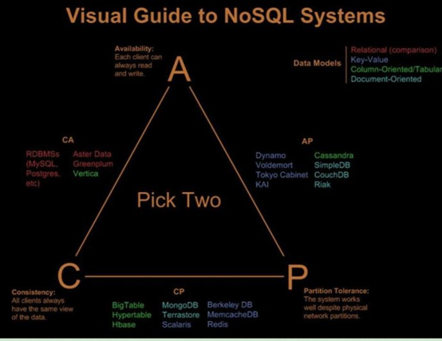
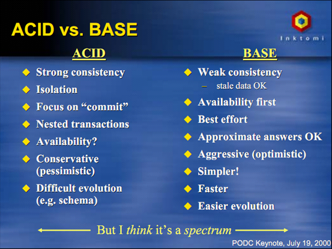

## 一、分布式缓存

### 1、哈希取余算法

用户每次读写操作都是根据公式：hash(key)%N，其中 N 代表节点数，计算出哈希值，决定数据映射到哪个节点。

优点：简单，预估好数据规划好节点，每台服务器固定处理一部分请求，起到负载均衡的作用。

缺点：节点扩容、缩容都需要重新计算节点的映射关系，数据迁移量大，数据泛洪。

### 2、一致性哈希算法

一致性哈希环：根据 hash(key)%(2^32^-1)  这个算法构成的结果集形成的环形空间。

节点映射：将集群中各个IP节点映射到环上的某个位置，hash(host|ip)%(2^32^-1)。

落键规则：根据一致性哈希算法 hash(key)%(2^32^-1) 得到键在环上的位置，沿顺时针方向寻找到的第一个节点即为该键的存储节点。

优点：提高了容错性和扩展性，增减节点时，仅影响该节点在 hash 环上顺时针相邻的节点。

缺点：节点太少时，若两个节点相距很近，会导致数据倾斜，数据存储不均匀。

虚拟节点机制：为了解决数据倾斜问题，可以在服务器 ip 或主机的后面增加编号，生成虚拟节点。数据定位算法不变，只是多了一个虚拟节点到实际节点的映射。

### ...有界负载一致性 hash

### 3、哈希槽算法

哈希槽算法解决均匀分布的问题，在数据和节点之间抽象出 slot 层，用于管理数据和节点之间的关系。

槽数量：2^14 = 16384

槽：slot = CRC16(key)%16384

哈希：解决的是映射问题，便于数据分配。

槽：解决的是粒度问题，便于数据移动。

Redis-Cluster 采用的分区方式：哈希槽算法。

- 把16384槽按照节点数量进行平均分配，由节点进行管理
- 对每个key按照CRC16规则进行hash运算
- 把hash结果对16383进行取余
- 把余数发送给Redis节点
- 节点接收到数据，验证是否在自己管理的槽编号的范围
  - 如果在自己管理的槽编号范围内，则把数据保存到数据槽中，然后返回执行结果
  - 如果在自己管理的槽编号范围外，则会把数据发送给正确的节点，由正确的节点来把数据保存在对应的槽中

注意：Redis-Cluster 的节点之间会共享消息，每个节点都会知道是哪个节点负责哪个范围内的数据槽。

虚拟槽分布方式中，由于每个节点管理一部分数据槽，数据保存到数据槽中。当节点扩容或者缩容时，对数据槽进行重新分配迁移即可，数据不会丢失。 

### 4、缓存模式

#### （1）数据一致性

- 同步操作 DB；
- 同步操作 Cache；
- 利用 Job 消费消息，重新补偿一次缓存操作。

#### （2）多级缓存

#### （3）热点缓存

- 小表广播，从 RemoteCache 提升为 LocalCache，APP 定时更新，甚至可以让运营平台支持广播刷新 LocalCache。
- 主动预约。

#### （4）缓存穿透/击穿

- 缓存短暂零值；
- 布隆过滤器：未匹配到数据则一定不存在，匹配到数据不一定存在；

- singlefly：对同一个失效 key 的多个请求，只有一个请求执行对 key 的更新操作，其余均等待结果返回。（源码就是waitgroup+atomic+mutex） 

- 分布式锁：只有一个线程去查询后端的服务，某个线程在查询后端服务的同时，其他线程没有获得分布式锁的权限，需要进行等待。（不建议）

#### （5）缓存雪崩

缓存大面积失效，或缓存服务宕机。

- key 过期时间随机（事前）；
- 设置缓存高可用集群，出事切换（事后）；
- 用限流降级、服务熔断的方式防止缓存雪崩（事后）；
- singleflight 只允许单个线程查询数据和写缓存（事前）；
- 预热缓存（事前）。

### 5、缓存小技巧

## 二、分布式事务

### 1、本地事务

关系型数据库事务的 4 个基本特性 ACID：

- 原子性（Atomicity）：一个事务内的所有操作要么都执行，要么都不执行。
- 一致性（Consistency）：数据满足完整性约束，不存在中间状态。
- 隔离性（Isolation）：多个事务并发执行时，互不干扰。
- 持久性（Durability）：事务完成后结果永久保存。

### 2、分布式事务基础理论

#### （1）CAP 理论

> CAP 定理主要描述的是状态

CAP 定理表达了一个分布式系统里不可能同时满足以下三个特性：

- 数据一致性（Consistency）：对调用者而言，数据具有强一致性；

一致性是指写操作后的读操作可以读取到最新的数据状态，当数据分布在多个节点上，从任意结点读取到的数据都是最新的状态。

- 服务可用性（Availability）：所有请求在一定时间内得到响应，可终止，不会一直等待；可用性是对结果的要求。

可用性是指任何事务操作都可以得到响应结果，且不会出现响应超时或响应错误。

分布式系统可用性的特点：所有请求都有响应，且不会出现响应超时或响应错误。

- 分区容忍性（Partition-tolerance）：在网络分区的情况下，被分隔的节点仍能正常对外服务。

通常分布式系统的各个结点部署在不同的子网，这就是网络分区，不可避免的会出现由于网络问题而导致结点之间通信失败，此时仍可对外提供服务，这叫分区容忍性。

> CAP 的组合方式

一个分布式系统理论上最多只能同时满足：C、A、P 三项中的两项。

- AP：放弃一致性，追求分区容忍性和可用性。（这是很多分布式系统设计时的选择）
- CP：放弃可用性，追求一致性和分区容忍性。（如：zookeeper，跨行转账）
- CA：放弃分区容忍性，即不进行分区，不需考虑网络和节点挂掉的问题，则可以实现一致性和可用性。那么系统将不是一个标准的分布式系统。（关系型数据库就满足 CA 架构）

#### （2）Base 理论

是 CAP 理论的一种妥协，由于 CAP 只能二选一，Base 理论降低了发生分区容错时，对可用性和一致性的要求。

- 基本可用（Basically Availble）：分布式系统在出现故障时，允许损失部分可用功能，保证核心功能可用。（可能响应延长、可能服务降级）；
- 软状态/柔性事务（Soft State）：允许系统中的数据存在中间状态，并认为该中间状态不会影响系统整体可用性。
- 最终一致性（Eventual Consistency）：节点数据同步可以存在延时，但在一定的期限后必须达成数据一致，状态为最终状态。

> ACID vs BASE

| ACID                   | BASE                   |
| ---------------------- | ---------------------- |
| 强一致性               | 弱一致性（容忍旧数据） |
| 隔离性                 | 可用性优先             |
| 专注于提交             | 尽最大努力             |
| 嵌套事务               | 大概的答复             |
| 可用性                 | 侵略性的（乐观的）     |
| 保守（悲观的）         | 更简单的               |
| 进化困难（例如：模式） | 更快                   |
|                        | 更容易进化             |

#### （3）数据一致性模型

- 强一致性
- 弱一致性
- 最终一致性
- 因果一致性：因果关系的操作顺序得到保证。
- 会话一致性

### 3、分布式事务解决方案

> 分布式事务用于在分布式系统中保证不同节点之间的数据一致性。

分布式事务的实现有很多种，最具有代表性的是由 Oracle Tuxedo 系统提出的 XA 分布式事务协议。XA 协议包含两阶段提交协议（Two-phase commit protocol）和三阶段提交协议（3PC）两种实现。

XA 协议中包含两个角色：事务协调者和事务参与者。

#### （1）2PC

> 强一致性

2PC 是一种强一致性设计，用事务协调者来协调管理各参与者的提交和回滚。

2PC的传统方案是在数据库层面实现的，如 Oracle、MySQL 都支持 2PC 协议。

**准备阶段**：事务协调者给每个参与者发送 Prepare 消息，每个数据库参与者在本地执行事务，并写本地的 Undo/Redo 日志，此时事务没有提交。（Undo 日志是记录修改前的数据，用于数据库回滚，Redo 日志是记录修改后的数据，用于提交事务后写入数据文件）

**提交阶段**：如果事务协调者收到了参与者的执行失败或者超时消息时，直接给每个参与者发送回滚（Rollback）消息；否则，发送提交（Commit）消息；参与者根据事务管理器的指令执行提交或者回滚操作，并释放事务处理过程中使用的锁资源。

2PC 的问题：

- 性能问题：同步阻塞协议，协调者需要等待所有参与者响应才会进行下一步操作，需要等待两阶段结束才释放资源。
- 协调者单点故障问题
- 丢失消息导致的不一致问题

#### （2）3PC（了解）

> 强一致性事务，数据库层面。

XA 三阶段提交在两阶段提交的基础上增加了CanCommit 阶段，并且引入了超时机制。一旦事物参与者迟迟没有接到协调者的 commit 请求，会自动进行本地 commit。这样有效解决了协调者单点故障的问题。但是性能问题和不一致的问题仍然没有根本解决。

准备阶段（CanCommit）：询问此时的参与者是否有条件接这个事务，不会一来就干活直接锁资源，使得在某些资源不可用的情况下所有参与者都阻塞着。

预提交阶段（PreCommit）：

提交阶段（DoCommit）：

#### （3）TCC

> 补偿性事务

TCC 是 Try、Commit、Cancel 三种指令的缩写，其逻辑模式类似于XA两阶段提交，但是实现方式是在代码层面来人为实现。对业务的侵入性较大，每个操作都需要实现对应的三个方法。

- Try：指的是预留，即资源的预留和锁定。
- Confirm：确认操作，这一步其实就是真正的执行了。
- Cancel：撤销操作，可以理解为把预留阶段的动作撤销。

 

TCC 对业务的侵入较大和业务紧耦合，需要根据特定的场景和业务逻辑来设计相应的操作。所以 TCC 可以跨数据库、跨不同的业务系统来实现事务。

还有一点要注意，撤销和确认操作的执行可能需要重试，因此还需要保证操作的幂等。

注意：

- 空回滚
- 防悬挂

#### （4）本地消息表

> 最终一致性

要解决消息的可靠存储，实际上是需要解决 MySQL 存储和 message 存储的一致性问题。事务消息一旦被可靠的持久化，我们整个分布式事务变为了最终一致性。

- 在同一事务中，执行业务并将消息放入消息表中；
- 然后调下一个操作，调用成功后，更新消息表状态；
- 调用失败，用后台任务定时扫描本地消息表，并调用对应的服务，成功后更新消息状态；
- 重试，需要保证对应服务的方法是幂等的，一般会有最大重试次数，超过次数记录预警，人工处理。

#### （5）MQ 事务

> 最终一致性

利用消息中间件来异步完成事务的后一半更新，实现系统的最终一致性。这个方式避免了像 XA 协议那样的性能问题。

#### （6）最大努力通知（Best Effort）

> 最终一致性

只有消息被消费才能保障最终业务数据的完整性，所以我们要尽最大努力，把消息送达到下游的业务消费方。适用于对时间不敏感的业务，例如短信通知。

本地消息表、MQ 事务 都是尽最大努力，所以最大努力通知其实只是表明了一种柔性事务的思想：我已经尽力我最大的努力想达成事务的最终一致了。

我们发现，所有努力送达的模型，必须是先预扣（预占资源）的做法。

#### （7）Seata

Seata 的设计目标其一是对业务无侵入，因此从业务无侵入的 2PC 方案着手，在传统 2PC的基础上演进，并解决 2PC 方案面临的问题。

Seata 把一个分布式事务理解成一个包含了若干分支事务的全局事务。全局事务的职责是协调其下管辖的分支事务达成一致，要么一起成功提交，要么一起失败回滚。

Seata 定义了 3 个组件来协议分布式事务的处理过程： 

- Transaction Coordinator（TC）：事务协调器，它是独立的中间件，需要独立部署运行，它维护全局事务的运行状态，接收 TM 指令发起全局事务的提交与回滚，负责与 RM 通信协调各各分支事务的提交或回滚。
- Transaction Manager（TM）： 事务管理器，TM 需要嵌入应用程序中工作，它负责开启一个全局事务，并最终向 TC 发起全局提交或全局回滚的指令。
- Resource Manager（RM）：控制分支事务，负责分支注册、状态汇报，并接收事务协调器 TC 的指令，驱动分支（本地）事务的提交和回滚。

> Seata实现2PC与传统2PC的差别

架构层次方面：传统 2PC 方案的 RM 实际上是在数据库层，RM 本质上就是数据库自身，通过 XA 协议实现，而 Seata 的 RM 是以 jar 包的形式作为中间件层部署在应用程序这一侧的。

两阶段提交方面：传统 2PC无论第二阶段的决议是 commit 还是 rollback ，事务性资源的锁都要保持到 Phase2 完成才释放。而 Seata 的做法是在 Phase1 就将本地事务提交，这样就可以省去 Phase2 持锁的时间，整体提高效率。