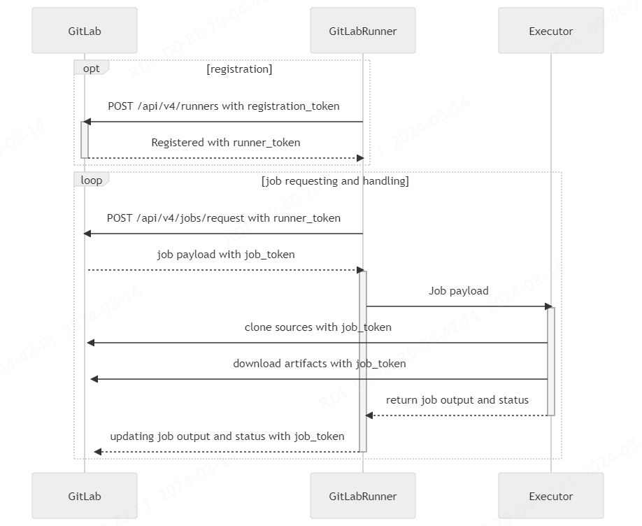

## 一、安装 & 部署

> CentOS 7

### 1、安装和配置必须的依赖项

在 CentOS 7上，下面的命令也会在系统防火墙中打开 HTTP、HTTPS 和 SSH 访问。这是一个可选步骤，如果您打算仅从本地网络访问极狐GitLab，则可以跳过它。

```
sudo yum install -y curl policycoreutils-python openssh-server perl
sudo systemctl enable sshd
sudo systemctl start sshd
sudo firewall-cmd --permanent --add-service=http
sudo firewall-cmd --permanent --add-service=https
sudo systemctl reload firewalld
```

（可选）下一步，安装 Postfix 以发送电子邮件通知。如果您想使用其他解决方案发送电子邮件，请跳过此步骤并在安装极狐GitLab 后[配置外部 SMTP 服务器](https://docs.gitlab.cn/omnibus/settings/smtp.html)。

```
sudo yum install postfix
sudo systemctl enable postfix
sudo systemctl start postfix
```

在安装 Postfix 的过程中可能会出现一个配置界面，在该界面中选择“Internet Site”并按下回车。把“mail name”设置为您服务器的外部 DNS 域名并按下回车。如果还有其它配置界面出现，继续按下回车以接受默认配置。

### 2、下载/安装 GitLab

> Linux

```shell
# 配置极狐 GitLab 软件源镜像
curl -fsSL https://packages.gitlab.cn/repository/raw/scripts/setup.sh | /bin/bash

# 开始安装
sudo EXTERNAL_URL="http://172.16.66.13:666" yum install -y gitlab-jh

# 安装完成
[2024-03-12T09:29:04+08:00] INFO: Report handlers complete
Infra Phase complete, 9/856 resources updated in 39 seconds
gitlab Reconfigured!
Restarting previously running JiHu GitLab services
ok: run: alertmanager: (pid 320819) 0s
ok: run: gitaly: (pid 300208) 2317s
ok: run: gitlab-exporter: (pid 320841) 0s
ok: run: gitlab-kas: (pid 320843) 0s
ok: run: gitlab-workhorse: (pid 320859) 0s
ok: run: logrotate: (pid 320876) 1s
ok: run: nginx: (pid 320882) 0s
ok: run: node-exporter: (pid 321079) 1s
ok: run: postgres-exporter: (pid 321085) 0s
ok: run: postgresql: (pid 300885) 2304s
ok: run: puma: (pid 321093) 0s
ok: run: redis: (pid 300984) 2300s
ok: run: redis-exporter: (pid 321100) 1s
ok: run: sidekiq: (pid 321111) 0s

         ___ __  __         _______ __  __          __
        / (_) / / /_  __   / ____(_) /_/ /   ____ _/ /_
   __  / / / /_/ / / / /  / / __/ / __/ /   / __ `/ __ \
  / /_/ / / __  / /_/ /  / /_/ / / /_/ /___/ /_/ / /_/ /
  \____/_/_/ /_/\__,_/   \____/_/\__/_____/\__,_/_.___/

```

> 安装位置：

```
# 配置文件
/etc/gitlab/gitlab.rb

# 数据目录
/var/opt/gitlab/

# 日志目录
/var/log/gitlab/

# 管理 GitLab

# 重新加载配置
gitlab-ctl reconfigure

# 重启服务
gitlab-ctl restart
```

> Docker

```shell
# 安装
sudo docker run --detach \
  --hostname 172.16.66.231:666 \
  --publish 443:443 --publish 666:666 --publish 222:22 \
  --name gitlab \
  --restart always \
  --volume /srv/gitlab/config:/etc/gitlab \
  --volume /srv/gitlab/logs:/var/log/gitlab \
  --volume /srv/gitlab/data:/var/opt/gitlab \
  --shm-size 256m \
  registry.gitlab.cn/omnibus/gitlab-jh:latest

# 进入容器
sudo docker exec -it gitlab /bin/bash

# 修改配置

vi /etc/gitlab/gitlab.rb

`
# 通过 HTTP 连接
32 external_url "http://172.16.66.231:666/"

# 通过 SSH 连接
684 gitlab_rails['gitlab_shell_ssh_port'] = 222

`

# 查看 Root 密码
sudo docker exec -it gitlab grep 'Password:' /etc/gitlab/initial_root_password
```


### 3、访问极狐GitLab 实例并登录

访问：http://172.16.66.13:666

用户名默认为：root

随机密码：`/etc/gitlab/initial_root_password`

注意：出于安全原因，24 小时后，`/etc/gitlab/initial_root_password` 会被第一次 `gitlab-ctl reconfigure` 自动删除，因此若使用随机密码登录，建议安装成功初始登录成功之后，立即修改初始密码。

### 4、卸载 Linux 软件包（Omnibus）

```
# （可选）在删除极狐GitLab 软件包（使用 apt 或 yum）之前，删除由 Omnibus GitLab 创建的所有用户和群组：
sudo gitlab-ctl stop && sudo gitlab-ctl remove-accounts

# 如果您在删除帐户或组时遇到问题，请手动运行 userdel 或 groupdel 来删除它们。您可能还想从 /home/ 中手动删除剩余的用户主目录。

# 要保留您的数据（代码库、数据库、配置），请停止极狐GitLab 并删除其 supervision 进程：
sudo systemctl stop gitlab-runsvdir
sudo systemctl disable gitlab-runsvdir
sudo rm /usr/lib/systemd/system/gitlab-runsvdir.service
sudo systemctl daemon-reload
sudo gitlab-ctl uninstall

# 要删除所有数据：
sudo gitlab-ctl cleanse && sudo rm -r /opt/gitlab

# 卸载软件包
sudo yum remove gitlab-jh
```


## 二、CI / CD

### 1、概念

通过软件开发的持续方法，您可以持续构建、测试和部署迭代代码更改。这种迭代过程有助于减少您基于有缺陷或失败的先前版本开发新代码的机会。 使用这种方法，您可以努力减少从开发新代码到部署的人工干预，甚至根本不需要干预。

#### 持续集成（Continuous Integration）

开发人员每天多次推送代码更改。对于每次推送到仓库，您可以创建一组脚本来自动构建和测试您的应用程序。这些脚本有助于减少您在应用程序中引入错误的机会。

这种做法称为持续集成。提交给应用程序的每个更改，甚至是开发分支，都会自动且连续地构建和测试。这些测试可确保更改通过您为应用程序建立的所有测试、指南和代码合规性标准。

#### 持续交付（Continuous Delivery）

[持续交付](https://continuousdelivery.com/) 是超越持续集成的一步。每次将代码更改推送到代码库时，不仅会构建和测试您的应用程序，还会持续部署应用程序。但是，对于持续交付，您需要手动触发部署。

持续交付会自动检查代码，但需要人工干预以手动和战略性地触发更改的部署。

#### 持续部署（Continuous Deployment）

[持续部署](https://www.airpair.com/continuous-deployment/posts/continuous-deployment-for-practical-people) 是超越持续集成的又一步，类似于持续交付。不同之处在于，不是手动部署应用程序，而是将其设置为自动部署。不需要人工干预。

#### GitLab CI / CD 工作流


#### 深入了解 CI / CD 工作流程

如果您深入了解工作流程，您可以看到 GitLab 在 DevOps 生命周期的每个阶段可用的功能。


#### 外部 CI / CD 服务器

- Jenkins
- Drone


### 2、GitLab Runner

#### （1）核心概念

- Runner：

  是运行 GitLab CI/CD 流水线作业（Job）的代理。

- Runner 注册：

  注册 Runner 时，GitLab 实例和安装了 Runner 的机器之间会建立通信。

- 执行器：

  注册 Runner 时，必须选择一个执行器。

  执行器决定了每个作业运行的环境。

  常用的执行器有 SSH、Shell、Docker、Kubernetes 等。

- Runner 范围：

  Runner 范围用于限制 Runner 的访问权限，如可将 Runner 用于指定的群组或项目，分为三种类型：

  - 共享 Runner（GitLab 实例级）：用于所有项目。
  - 群组 Runner（群组级）：用于群组中的所有项目和子群组。
  - 项目 Runner（项目级）：用于单个项目。

  Runner 的范围在注册期间定义（注册后范围不可更改），因此知道其适用的项目。

- 标签：

  注册 Runner 时，可以向其添加标签。

  当运行 CI/CD 作业时，通过分配的标签确定要使用的 Runner。 标签是为作业过滤可用 Runner 列表的唯一方式。

  例如，如果一个 Runner 有 `go` 标签，您可以将此代码添加到您项目中的 `.gitlab-ci.yml` 文件：

  ```
  job:
    tags:
      - go
  ```

  当运行作业时，使用带有 `go` 标签的 Runner。

#### （2）安装 Runner

> Linux

```shell
# 配置源
curl -L "https://packages.gitlab.com/install/repositories/runner/gitlab-runner/script.rpm.sh" | sudo bash

# 安装
sudo yum install gitlab-runner
```

> Docker

```shell
docker run -d \
  --name gitlab-runner \
  --restart always \
  -v /srv/gitlab-runner/config:/etc/gitlab-runner \
  -v /var/run/docker.sock:/var/run/docker.sock \
  gitlab/gitlab-runner:latest
```

#### （3）注册 Runner

先决条件：

- 安装 Runner。
- GitLab 中创建 Runner（拿到 runner 的身份验证令牌）。

> Linux

```shell
# 交互式
> sudo gitlab-runner register

Runtime platform                                    arch=amd64 os=linux pid=42930 revision=782c6ecb version=16.9.1
Running in system-mode.

Enter the GitLab instance URL (for example, https://gitlab.com/):
# http://172.16.66.231:666/
Enter the registration token:
# glrt-TTxs9rUzzPZBE9t4KrVs
Verifying runner... is valid                        runner=TTxs9rUzz
Enter a name for the runner. This is stored only in the local config.toml file:
[centos-113]:# test
Enter an executor: docker, docker-windows, docker+machine, kubernetes, instance, shell, ssh, virtualbox, docker-autoscaler, custom, parallels:
# docker
Enter the default Docker image (for example, ruby:2.7):
# alpine
Runner registered successfully. Feel free to start it, but if it's running already the config should be automatically reloaded!

Configuration (with the authentication token) was saved in "/etc/gitlab-runner/config.toml"


# 使用最常见的选项注册 Runner
> sudo gitlab-runner register \
  --non-interactive \
  --url "http://172.16.56.43:666/" \
  --token "glrt-_sTLNH5TefU1CqiVLEYh" \
  --executor "docker" \
  --docker-image "docker" \
  --description "docker-runner"

Runtime platform                                    arch=amd64 os=linux pid=51283 revision=782c6ecb version=16.9.1
Running in system-mode.

Verifying runner... is valid                        runner=5MtG4jJTz
Runner registered successfully. Feel free to start it, but if it's running already the config should be automatically reloaded!

Configuration (with the authentication token) was saved in "/etc/gitlab-runner/config.toml"
```

> Docker

```shell
# 交互式
> docker run --rm -it \
  -v /srv/gitlab-runner/config:/etc/gitlab-runner \
  gitlab/gitlab-runner register

# 单行注册命令
# --non-interactive 非交互式
> docker run --rm \
  -v /srv/gitlab-runner/config:/etc/gitlab-runner \
  gitlab/gitlab-runner register \
  --non-interactive \
  --executor "docker" \
  --docker-image docker:latest \
  --url "http://172.16.56.231:666/" \
  --token "glrt-N82VbJT-YBiAVoA4hs6V" \
  --description "test"
```

#### （4）Runner 执行器

执行器支持不同的构建项目的平台和方法论。 以下表格展示了每个执行器的关键事实，帮助您选择要使用的执行器。

|          执行器          | SSH  | Shell | VirtualBox | Parallels | Docker | Kubernetes |  自定义  |
| :----------------------: | :--: | :---: | :--------: | :-------: | :----: | :--------: | :------: |
|  为每个构建清理构建环境  |  ✗   |   ✗   |     ✓      |     ✓     |   ✓    |     ✓      | 有条件的 |
| 重用之前的克隆（如果有） |  ✓   |   ✓   |     ✗      |     ✗     |   ✓    |     ✗      | 有条件的 |
| 保护 Runner 文件系统访问 |  ✓   |   ✗   |     ✓      |     ✓     |   ✓    |     ✓      | 有条件的 |
|     迁移 Runner 机器     |  ✗   |   ✗   |    部分    |   部分    |   ✓    |     ✓      |    ✓     |
|   并发构建的零配置支持   |  ✗   |   ✗   |     ✓      |     ✓     |   ✓    |     ✓      | 有条件的 |
|       复杂构建环境       |  ✗   |   ✗   |     ✓      |     ✓     |   ✓    |     ✓      |    ✓     |
|       修复构建问题       | 简单 | 简单  |    困难    |   困难    |  适中  |    适中    |   适中   |

#### （5）Runner 执行流程



### 3、`.gitlab-ci.yml` 文件

> 流水线配置：在仓库的根目录下创建 `.gitlab-ci.yml` 文件。

极狐GitLab CI/CD 流水线配置包括：

- 全局关键字：

  控制流水线的行为，或导入额外的流水线配置。

- 作业关键字：

  流水线由一系列（至少一个）作业组成。

#### （1）全局关键字

| 关键字   | 类型     | 描述                       |
| :------- | -------- | :------------------------- |
| default  | object   | 作业关键字的自定义默认值。 |
| stages   | []string | 流水线阶段的名称和顺序。   |
| workflow | object   | 控制运行的流水线类型。     |
| include  | []object | 从其他 YAML 文件导入配置。 |

##### default

以下作业关键字可以定义默认值：

> after_script、artifacts、before_script、cache、hooks、image、interruptible、retry、services、tags、timeout

```yaml
# 定义全局默认镜像
default:
  image: alpine

# 作业1 使用默认镜像 alpine
job-1:
  script: bundle exec rspec

# 作业配置优先级 ＞ 全局配置
# 作业2 使用自己的镜像 go:1.17
job-2:
  image: go:1.17
  script: bundle exec rspec

# 使用 inherit 来控制 default 和 variable 的继承
# 作业3 不继承任何 default 关键字
job-3:
  script: echo "This job does not inherit any default keywords."
  inherit:
    default: false
```

##### stages

使用 stages 来定义阶段（作业组），stages 项的顺序即作业的执行顺序：

- 同一阶段的作业并行运行。
- 下一阶段的作业在上一阶段的作业成功完成后运行。

在作业中使用 stage 来定义作业所属的阶段。

```yaml
# 如果 .gitlab-ci.yml 文件中没有定义 stages
# 那么默认的流水线阶段是：
stages:
 - .pre
 - build
 - test
 - deploy
 - .post

# 自定义阶段
# build -> test -> deploy ==> passed.
# 如果任何作业失败，流水线将被标记为 failed. 
# 并且后续阶段的作业不会启动，当前阶段的作业继续运行。
# 如果作业未指定 stage，则默认分配到 test 阶段。
# 如果定义了一个阶段，但没有作业使用它，则该阶段在流水线中不可见。
stages:
  - build
  - test
  - deploy
```

要使作业更早开始并忽略阶段顺序，请使用 needs 关键字。

##### workflow

使用 `workflow` 来确定是否创建流水线。在顶层定义此关键字，使用单个 `rules` 关键字，类似于在作业中定义的 `rules`。

```yaml
# workflow:name 定义流水线的名称
# 合法的名称：字符串 & CI/CD 变量
workflow:
  name: 'Pipeline name'

# workflow:rule 定义流水线规则
# 接收的关键字：
#  - if：检查此规则以确定何时运行流水线。
#  - when：指定当 if 规则为 true 时要做什么。
#      - 运行流水线 when: always （默认）
#      - 阻止流水线运行 when: never
#  - variable：如果未定义，则使用在别处定义的变量。
# 当没有规则为 true 时，流水线不会运行。

# 示例：匹配情况下执行（IF）
workflow:
  name: 'Name'
  rules:
    # 条件1 如果提交标题（提交消息的第一行）以 -draft 结尾，则中止运行
    # =~ 和 !~ 表达式右侧的变量被认为是正则表达式
    - if: "$CI_COMMIT_TITLE =~ /-draft$/"
      when: never

    # 条件2 控制合并请求流水线何时运行：合并请求
    - if: "$CI_PIPELINE_SOURCE == 'merge_request_event'"

    # 条件3 控制分支流水线和标签流水线何时运行：git push
    - if: "$CI_PIPELINE_SOURCE == 'push'"

    # 条件4 控制标签流水线何时运行：git push
    - if: "$CI_COMMIT_TAG == 'push'"

    # 提交5 控制分支流水线何时运行：默认分支
    - if: "$CI_COMMIT_BRANCH == $CI_DEFAULT_BRANCH"

# 示例：排除情况下执行（ELSE）
# 阻止了计划或 push（分支和标签）的流水线执行
# 运行所有其他流水线类型
workflow:
  rules:
    - if: '$CI_PIPELINE_SOURCE == "schedule"'
      when: never
    - if: '$CI_PIPELINE_SOURCE == "push"'
      when: never
    - when: always

# workflow:rules:variables 定义特定流水线条件的变量
# 当条件匹配时，将创建该变量并可供流水线中的所有作业使用。
# 如果该变量已在全局级别定义，则 workflow 变量优先并覆盖全局变量。
# 示例
variables:
  PipelineName: 'default_pipeline_name'

workflow:
  name: '$PipelineName'
  rules:
    - if: '$CI_PIPELINE_SOURCE == "merge_request_event"'
      variables:
        # 覆盖全局变量 PipelineName
        PipelineName: 'MR pipeline: $CI_MERGE_REQUEST_SOURCE_BRANCH_NAME'
    - if: '$CI_MERGE_REQUEST_LABELS =~ /pipeline:run-in-ruby3/'
      variables:
        # 定义一个新变量
        IS_A_FEATURE: "true"

job-1:
  script: "echo $PipelineName"
  variables:
    PipelineName: "job1-default-deploy"
  rules:
    - if: $CI_COMMIT_REF_NAME == $CI_DEFAULT_BRANCH
      variables:
        # 重写在作业级别定义的 PipelineName。
        DEPLOY_VARIABLE: "job1-deploy-production"
```

`workflow:rules:variables` 成为所有作业中可用的全局变量，包括默认将变量转发到下游流水线的 trigger 作业。 如果下游流水线使用相同的变量，则变量被上游变量值覆盖。请务必：

- 在每个项目的流水线配置中使用唯一的变量名称。
- 在触发器作业中使用 `inherit:variables` 并列出要转发到下游流水线的确切变量。

##### include

使用 include 在 CI/CD 配置中包含外部 YAML 文件。 您可以将一个长的 .gitlab-ci.yml 文件拆分为多个文件以提高可读性，或减少同一配置在多个位置的重复。

您还可以将模板文件存储在中央仓库中并将它们包含在项目中。

include 子键：

> include:local
> include:project
> include:remote
> include:template

```yaml
# include:local 示例
# 包含来自同一仓库中的文件
include:
  - local: '/templates/.gitlab-ci-template.yml'
# or
include: '.gitlab-ci-production.yml'

# include:project 示例
# 包含来自另一个私有项目的文件
include:
  - project: 'my-group/my-project'
    ref: 'main'                                      # Git branch
    #ref: 'v1.0.0'                                    # Git tag
    #ref: '787123b47f14b552955ca2786bc9542ae66fee5b'  # Git sha
    file: '/templates/.gitlab-ci-template.yml'
  - project: 'my-group/my-subgroup/my-project-2'
    file:
      - '/templates/.builds.yml'
      - '/templates/.tests.yml'

# include:remote 示例
# 使用带有完整 URL 的 include:remote 来包含来自不同位置的文件。
# 只能包含公共项目或模板
include:
  - remote: 'https://gitlab.com/example-project/-/raw/main/.gitlab-ci.yml'

# include:template 示例
# 包含 [.gitlab-ci.yml 模板](https://jihulab.com/gitlab-cn/gitlab/-/tree/master/lib/gitlab/ci/templates)。
include:
  - template: Auto-DevOps.gitlab-ci.yml
```


#### （2）作业关键字

| 关键字             | 类型           | 描述                                                         |
| :----------------- | -------------- | :----------------------------------------------------------- |
| after_script       | array/string   | 定义在每个作业之后运行的命令数组，包括失败的作业。           |
| allow_failure      | boolean/object | 允许作业失败。失败的作业不会导致流水线失败。                 |
| artifacts          | object         | 指定在作业 succeeds, fails, always 时附加到作业的文件和目录列表。 |
| before_script      | array/string   | 定义一系列命令，这些命令应该在每个作业的 `script` 命令之前运行，但在 `artifacts` 恢复之后。 |
| cache              |                | 应在后续运行之间缓存的文件列表。                             |
| coverage           |                | 给定作业的代码覆盖率设置。                                   |
| dast_configuration |                | 在作业级别使用来自 DAST 配置文件的配置。                     |
| dependencies       |                | 通过提供要从中获取产物的作业列表，来限制将哪些产物传递给特定作业。 |
| environment        |                | 作业部署到的环境的名称。                                     |
| except             |                | 控制何时不创建作业。                                         |
| extends            |                | 使用 `extends` 来继承作业配置。它是 [YAML 锚点](https://docs.gitlab.cn/jh/ci/yaml/yaml_optimization.html#锚点) 的替代方案，并且更加灵活和可读。 |
| hooks              |                | 指定在作业执行的某些阶段在 runner 上执行的命令列表，例如在检索 Git 代码库之前，使用 `hooks:pre_get_sources_script` 指定要在 runner 上执行的命令列表。。 |
| image              | string         | 指定 Docker executor 用来运行 CI/CD 作业的 Docker 镜像的名称。 |
| inherit            |                | 选择所有作业继承的全局默认值。                               |
| interruptible      |                | 定义当新运行使作业变得多余时，是否可以取消作业。             |
| needs              | array          | 使用 `needs:` 来不按顺序执行作业。使用 `needs` 的作业之间的关系可以可视化为有向无环图。 |
| only               |                | 控制何时创建作业。                                           |
| pages              |                | 上传作业的结果，与 GitLab Pages 一起使用。                   |
| parallel           |                | 配置并行运行的作业实例数（1~200）。                          |
| release            |                | 指示运行器生成 release 对象。                                |
| resource_group     |                | 限制作业并发。                                               |
| retry              |                | 配置作业失败时重试的次数。<br/>使用 `retry:when` 和 `retry:max` 对特定的失败情况重试作业的最大次数。 |
| rules              | array/null     | 包含或排除流水线中的作业。                                   |
| script             | array/string   | 指定 runner 要执行的命令。                                   |
| secrets            |                | 作业所需的 CI/CD secret 信息。                               |
| services           | array          | 指定您的脚本成功运行所需的任何其他 Docker 镜像。             |
| stage              | array/string   | 定义作业在哪个 stage 中运行。同一个 stage 中的作业可以并行执行。<br/>如果没有定义 stage，则作业默认使用 test 阶段。 |
| tags               | array          | 从项目可用的所有 runner 列表中选择一个特定的 runner。        |
| timeout            |                | 定义优先于项目范围设置的自定义作业级别超时。                 |
| trigger            |                | 定义下游流水线触发器。                                       |
| variables          |                | 在作业级别定义作业变量。                                     |
| when               |                | 配置作业运行的条件。默认 `when: on_success`。                |

##### artifacts（产物）

使用 artifacts 指定在作业 succeeds, fails, 或 always 时附加到作业的文件和目录列表。

作业完成后，产物将发送到 GitLab。如果大小不大于最大产物大小，它们可以在 GitLab UI 中下载。

默认情况下，后期的作业会自动下载早期作业创建的所有产物。您可以使用 dependencies 控制作业中的产物下载行为。

使用 needs 关键字时，作业只能从 needs 配置中定义的作业下载产物。

默认只收集成功作业的作业产物，产物在缓存后恢复。

```
job:
  artifacts:
  paths:
    - binaries/
  exclude:
    - binaries/**/*.o
```


##### after_script

在 after_script 中指定的脚本在一个新的 shell 中执行，与任何 before_script 或 script 命令分开。结果：

- 将当前工作目录设置回默认值（根据定义运行程序如何处理 Git 请求的变量）。
- 无权访问由 before_script 或 script 中定义的命令完成的更改，包括：
  - 在 script 脚本中导出的命令别名和变量。
  - 作业树之外的更改（取决于 runner），例如由 before_script 或 script 脚本安装的软件。
- 有一个单独的超时，它被硬编码为 5 分钟。
- 不要影响作业的退出代码。如果 script 部分成功并且 after_script 超时或失败，作业将退出，代码为 0（Job Succeeded）。

如果作业超时或被取消，则不会执行 after_script 命令。 

##### stage

如果作业在不同的 runner 上运行，则它们可以并行运行。

如果您只有一个 runner，如果 runner 的 concurrent 设置大于 1，作业可以并行运行。

`stage: .pre` 和 `stage: .post`

- 使用 `.pre` 阶段在流水线开始时运行作业。`.pre` 始终是流水线的第一阶段。用户定义的阶段在 `.pre` 之后执行。 您不必在 stages 中定义 `.pre`。

- 使用 `.post` 阶段使作业在流水线的末尾运行。`.post` 始终是流水线的最后阶段。用户定义的阶段在 `.post` 之前执行。 你不必在 `stages` 中定义 `.post`。

- 如果流水线仅包含 `.pre` 或 `.post` 阶段的作业，则它不会运行。 在不同的阶段必须至少有一项其他作业。

##### rules

不能在 rules 中使用作业脚本中创建的 dotenv 变量，因为在任何作业运行之前都会评估规则。

rules 替换了 only/except，并且它们不能在同一个作业中一起使用。如果为一个作业配置这两个关键字，则系统会返回一个 `key may not used with rules` 错误。

rules 子键：

> if、changes、exists、allow_failure、variables、when。

```yaml
# rules:if 指定何时向流水线添加作业
# 注：=~ 和 !~ 表达式右侧的变量被认为是正则表达式。
job:
  script: echo "Hello, Rules!"
  rules:
    - if: $CI_MERGE_REQUEST_SOURCE_BRANCH_NAME =~ /^feature/ && $CI_MERGE_REQUEST_TARGET_BRANCH_NAME != $CI_DEFAULT_BRANCH
      when: never
    - if: $CI_MERGE_REQUEST_SOURCE_BRANCH_NAME =~ /^feature/
      when: manual
      allow_failure: true
    - if: $CI_MERGE_REQUEST_SOURCE_BRANCH_NAME
      # when 默认为：on_success

# rules:changes 通过检查对特定文件的更改来指定何时将作业添加到流水线
# 如果流水线是合并请求流水线，请检查 Dockerfile 是否有更改。
# 如果 Dockerfile 已更改，则将作业作为手动作业添加到流水线中，即使作业未触发，流水线也会继续运行（allow_failure: true）。
# 每个 rules:changes 部分最多可以定义 50 个样式或文件路径。
# 如果 Dockerfile 没有改变，不要将作业添加到任何流水线（与 when: never 相同）。
docker build:
  script: docker build -t my-image:$CI_COMMIT_REF_SLUG .
  rules:
    - if: '$CI_PIPELINE_SOURCE == "merge_request_event"'
      changes:
        - Dockerfile
      # rules:changes:paths 与 rules:changes 相同 
      #changes:
      #  paths:
      #    - Dockerfile
      
      # 指定要比较哪个 ref 下的文件（rules:changes:paths 指定的）更改。
      # 可选值：分支名称、标签名称、提交 SHA
      compare_to: 'refs/heads/branch1'
      # when: on_success（默认）、when: delay、 when: always
      when: manual
      # 允许作业失败，不停止流水线（默认为：false）
      allow_failure: true

# rules:exists 当仓库中存在某些文件时，使用 exists 来运行作业。
job:
  script: docker build -t my-image:$CI_COMMIT_REF_SLUG .
  rules:
    - exists:
        - Dockerfile
```

##### when

- on_success （默认）：仅当早期阶段没有作业失败或具有 allow_failure: true 时才运行作业。
- on_failure：仅当早期阶段至少有一个作业失败时才运行作业。早期阶段具有 allow_failure: true 的作业始终被认为是成功的。
- never：无论早期阶段的作业状态如何，都不要运行作业。只能在 rules 部分或 workflow: Rules 中使用。
- always：无论早期阶段的作业状态如何，都运行作业，也可以在 workflow:rules 中使用。
- manual：仅在手动触发时运行作业。
- delayed：延迟作业的执行指定的持续时间。

### 4、流水线


### 5、作业

#### （1）流水线中的作业顺序

流水线中作业的顺序取决于流水线图的类型。

- 对于完整流水线图，作业按名称排序。
- 对于流水线迷你图，作业按状态排序，然后按名称排序。

作业状态的顺序是：

- failed
- warning
- pending
- running
- manual
- scheduled
- canceled
- success
- skipped
- created

#### （2）作业名称限制

您不能将这些关键字用作作业名称：

> image、services、stages、types、before_script、after_script、variables、cache、include、true、false、nil。

作业名称不得超过 255 个字符。

为您的作业使用唯一名称。如果多个作业具有相同的名称，则只会将一个添加到流水线中，并且很难预测会选择哪一个。

#### （3）流水线中分组作业

要创建一组作业，请在 [CI/CD 流水线配置文件] 中，将每个作业名称和数字用斜线（`/`）或冒号 (`:`)或空格分隔：

```
build 1/3:
build 2/3:
build 3/3:

test 1:3:
test 2:3:
test 3:3:

deploy 1 3:
deploy 2 3:
deploy 3 3:
```

#### （4）隐藏作业

```yaml
# 1 注释
# hidden_job:
#   script:
#     - run test

# 2 以点（.）开头的作业名称，它不会被 GitLab CI/CD 处理
.hidden_job:
  script:
    - run test
```


### 6、变量

[预定义变量](https://docs.gitlab.cn/jh/ci/variables/predefined_variables.html)

### 7、在 CI/CD 作业中启用 Docker 命令

要为 CI/CD 作业启用 Docker 命令，有三种方式：

- Shell executor（主机 Docker）
- Docker-in-Docker（Docker 容器中启动 Docker）
- Docker 套接字绑定（主机 Docker）

#### （1）shell executor


#### （2）docker-in-docker

```yml
build:
  tags:
    - docker-in-docker
  stage: build
  # 注意：包含了 docker:20.10.16-dind 服务，才可以在作业脚本中使用 docker
  services:
    - name: docker:24.0.2-dind
  rules:
    - if: $CI_COMMIT_BRANCH == 'dev'
  before_script:
    - docker info
  script:
    # 如果镜像已存在则删除
    - if [ $(docker images -aq $PROJECT_NAME:latest) ]; then docker rmi -f $PROJECT_NAME:latest; fi
    - docker build -t $PROJECT_NAME -f Dockerfile .
    - docker images
    - docker image save $PROJECT_NAME -o release/$PROJECT_NAME.img
    - ls -lh
  artifacts:
    paths: [ "release/$PROJECT_NAME.img" ]
```

#### （3）host-docker


### 8、案例

先决条件：

- 注册一个 runner，让所有作业都在 Docker 容器中运行。（Runner 注册时指定 Docker 执行器）
- 指定在哪个容器中运行作业。（在 .gitlab-ci.yml 文件中指定一个镜像）
- 可选。在容器中运行其他服务，如 MySQL。（在 .gitlab-ci.yml 文件中指定 services）

目录结构：

```
hello
  ├─ binaries
       └─ ...
  ├─ .gitignore
  ├─ .gitlab-ci.yml
  ├─ docker-compose.yml
  ├─ Dockerfile
  ├─ go.mod
  ├─ main.go
  └─ ...
```

#### （1）注册 Runner 

```shell
# 在 【docker-in-docker（dind）】 中执行作业
# 用于 docker build
# tags: docker-in-docker, go-build, docker-build
#
# 要使用 Docker-in-Docker，必须在 Docker 容器中使用 privileged = true
> docker run --rm \
  -v /srv/gitlab-runner/config:/etc/gitlab-runner \
  gitlab/gitlab-runner register \
  --non-interactive \
  --url "http://172.16.56.53:666/" \
  --token "glrt-RnCEoH6SMgeDgfPyoTYd" \
  --executor "docker" \
  --description "docker-in-docker Runner" \
  --docker-image "docker:24.0.2" \
  --docker-privileged \
  --docker-volumes "/certs/client"

# 在【主机 Docker】中执行作业
# 用于 docker run 
# tags: host-docker, docker-run
#
# 要使 Docker 在镜像上下文中可用，您需要将 /var/run/docker.sock 挂载到启动的容器中
> docker run --rm \
  -v /srv/gitlab-runner/config:/etc/gitlab-runner \
  gitlab/gitlab-runner register \
  --non-interactive \
  --url "http://172.16.56.53:666/" \
  --token "glrt-_sTLNH5TefU1CqiVLEYh" \
  --executor "docker" \
  --description "host-docker Runner" \
  --docker-image "docker:24.0.0" \
  --docker-volumes "/var/run/docker.sock:/var/run/docker.sock"

# 查看配置
> sudo cat /srv/gitlab-runner/config/config.toml

[[runners]]
  name = "docker-in-docker Runner"
  url = "http://172.16.66.231:666/"
  id = 1
  token = "glrt-p2f8e-XWJx7yhmxHx1xp"
  token_obtained_at = 2024-03-25T02:56:54Z
  token_expires_at = 0001-01-01T00:00:00Z
  executor = "docker"
  [runners.docker]
    tls_verify = false
    image = "docker:24.0.2"
    privileged = true
    disable_entrypoint_overwrite = false
    oom_kill_disable = false
    disable_cache = false
    volumes = ["/certs/client", "/cache"]
    shm_size = 0
    network_mtu = 0

[[runners]]
  name = "host-docker Runner"
  url = "http://172.16.66.231:666/"
  id = 2
  token = "glrt-H17-uNMhXpzTioekskHV"
  token_obtained_at = 2024-03-25T02:58:16Z
  token_expires_at = 0001-01-01T00:00:00Z
  executor = "docker"
  [runners.cache]
    MaxUploadedArchiveSize = 0
  [runners.docker]
    tls_verify = false
    image = "docker:24.0.2"
    privileged = false
    disable_entrypoint_overwrite = false
    oom_kill_disable = false
    disable_cache = false
    volumes = ["/var/run/docker.sock:/var/run/docker.sock", "/cache"]
    shm_size = 0
    network_mtu = 0
```

#### （2）流水线配置文件（`.gitlab-ci.yml`）

```yml
variables:
  CONTAINER_NAME: "${CI_PROJECT_NAME}"
  IMAGE_NAME: "${CI_PROJECT_NAME}:latest"

stages:
  - build
  - deploy

# ===================== test ===================== #

test_build:
  tags:
    - host-docker
    - test
  stage: build
  rules:
    - if: $CI_COMMIT_BRANCH == 'dev'
  before_script:
    - docker info
    - echo $CONTAINER_NAME
    - echo $IMAGE_NAME
  script:
    # 如果镜像已存在则删除
    - if [ $(docker images -aq $IMAGE_NAME) ]; then docker rmi -f $IMAGE_NAME; fi
    - docker build -t $IMAGE_NAME -f Dockerfile .
    - docker images
    - docker image save $IMAGE_NAME -o binaries/$IMAGE_NAME.img
    - ls -lh
  artifacts:
    paths: [ "binaries/$IMAGE_NAME.img" ]

test_deploy:
  tags:
    - host-docker
    - test
  stage: deploy
  needs:
    - test_build
  rules:
    - if: $CI_COMMIT_BRANCH == 'dev'
  before_script:
    - docker info
  script:
    # 如果容器已存在则删除
    - if [ $(docker ps -aq --filter name=$CONTAINER_NAME) ]; then docker rm -f $CONTAINER_NAME; fi
    # 如果镜像已存在则删除
    - if [ $(docker images -aq $IMAGE_NAME) ]; then docker rmi -f $IMAGE_NAME; fi
    - docker image load -i binaries/$IMAGE_NAME.img
    # 后台启动
    - docker compose up -d

# ===================== prod ===================== #

prod_build:
  tags:
    - host-docker
    - prod
  stage: build
  rules:
    - if: $CI_COMMIT_BRANCH == 'master'
  before_script:
    - docker info
  script:
    # 如果镜像已存在则删除
    - if [ $(docker images -aq $IMAGE_NAME) ]; then docker rmi -f $IMAGE_NAME; fi
    - docker build -t $IMAGE_NAME -f Dockerfile .
    - docker images
    - docker image save $IMAGE_NAME -o binaries/$IMAGE_NAME.img
    - ls -lh
  artifacts:
    paths: [ "binaries/$IMAGE_NAME.img" ]

prod_deploy:
  tags:
    - host-docker
    - prod
  stage: deploy
  needs:
    - prod_build
  rules:
    - if: $CI_COMMIT_BRANCH == 'master'
      when: manual
  before_script:
    - docker info
  script:
    # 如果容器已存在则删除
    - if [ $(docker ps -aq --filter name=$CONTAINER_NAME) ]; then docker rm -f $CONTAINER_NAME; fi
    # 如果镜像已存在则删除
    - if [ $(docker images -aq $IMAGE_NAME) ]; then docker rmi -f $IMAGE_NAME; fi
    - docker image load -i binaries/$IMAGE_NAME.img
    # 后台启动
    - docker compose up -d
```

#### （3）docker-compose.yml

```yml
services:
  api:
    container_name: hello
    image: hello:latest
    volumes:
      - /data/hello/app.yaml:/app/app.yaml
      - /data/hello/log/:/app/log/
      - /data/hello/storage/:/app/storage/
    ports:
      - 8080:80
```

#### （4）Dockerfile

```dockerfile
## Build
# 第一构建阶段：仅用于 build 出可执行文件
# AS <NAME> 命名构建阶段
FROM golang:1.18-alpine AS build

WORKDIR /app/

COPY . .

RUN go build -o server main.go

## Deploy
# 第二构建阶段：这里的改变将影响生成的镜像
# 轻量的 alpine：适用于静态二进制文件的精益部署
FROM alpine AS deploy

WORKDIR /app/

# 从 build 阶段复制 server
# 该文件仅存在于前一个 Docker 阶段，因此需要用 --from=build 来复制它
COPY --from=build /app/server /app/

# 链接动态库兼容
# RUN mkdir /lib64 && ln -s /lib/libc.musl-x86_64.so.1 /lib64/ld-linux-x86-64.so.2

EXPOSE 80

CMD ["/app/server"]
```

#### （5）main.go

```go
package main

import (
	"io"
	"log"
	"net/http"
)

func HelloServer(w http.ResponseWriter, req *http.Request) {
	resp := `<H1>hello, world!</h1>`
	io.WriteString(w, resp)
}

func main() {
	http.HandleFunc("/hello", HelloServer)

	log.Println("ListenAndServe \t http://127.0.0.1:1234/hello")
	err := http.ListenAndServe(":1234", nil)
	if err != nil {
		log.Fatal("ListenAndServe: ", err)
	}
}
```


## 三、工具链集成

1、集成构建工具


2、集成代码质量


3、制品库集成


4、自动化测试集成

