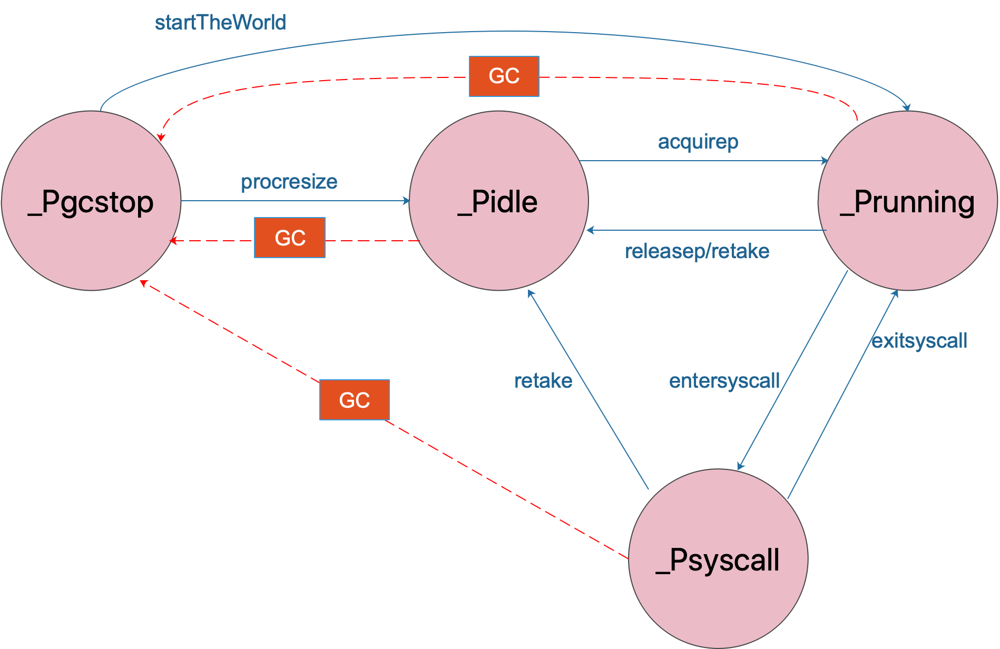
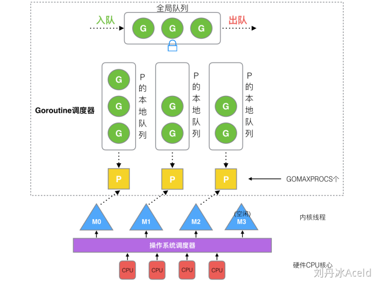
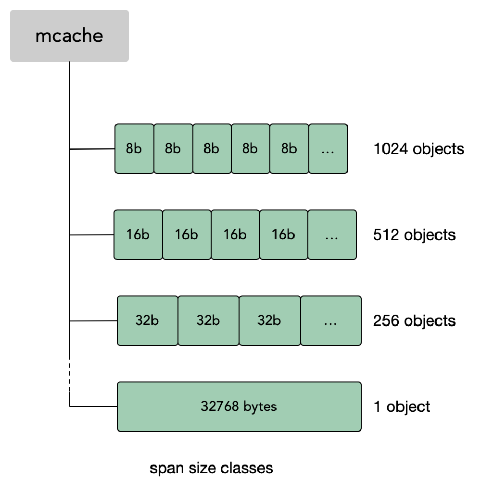

## 一、Go 谚语

- Don't communicate by sharing memory, share memory by communicating.
  - 不要通过共享内存来通信，通过通信来共享内存。

- Concurrency is not parallelism.
  - 并发不是并行。
- Channels orchestrate; mutexes serialize.
  - 通道是协调的，互斥是串行的。
- The bigger the interface, the weaker the abstraction.
  - 接口越大，抽象性越弱。

- Make the zero value useful.
  - 让零值变得有用。

- `interface{}` says nothing.
  - `interface{}` 什么也没说。

- Gofmt's style is no one's favorite, yet gofmt is everyone's favorite.
  - Gofmt 的风格没有人喜欢，但 Gofmt 却是大家的最爱。

- A little copying is better than a little dependency.
  - 复制一点总比依赖一点好。

- Syscall must always be guarded with build tags.
  - Syscall 必须始终用 build 标签来保护。

- Cgo must always be guarded with build tags.
  - Cgo 必须始终用构建标签来保护。

- Cgo is not Go.
  - Cgo 不是 Go。

- With the unsafe package there are no guarantees.
  - 使用 unsafe 包没有任何保证。
- Clear is better than clever.
  - 清晰的比聪明的好。
- Reflection is never clear.
  - 反射从来不是清晰的。

- Errors are values.
  - 错误是值。（考虑失败，而不是成功。）

- Don't just check errors, handle them gracefully.
  - 不要只是检查错误，要优雅地处理它们。

- Design the architecture, name the components, document the details.
  * 设计架构，命名组件，记录细节。

- Documentation is for users.
  - 文档是为用户准备的。

* Don't panic.
  * 不要 panic。


## 二、数据结构

### 1、基本类型

#### （1）int...

```go
package main

import (
    "fmt"
    "unsafe"
)

func main() {
    fmt.Println(unsafe.Sizeof(int8(127)))                  // 1 Byte
    fmt.Println(unsafe.Sizeof(int16(32767)))               // 2 Byte
    fmt.Println(unsafe.Sizeof(int32(2147483647)))          // 4 Byte
    fmt.Println(unsafe.Sizeof(int64(9223372036854775807))) // 8 Byte
    fmt.Println(unsafe.Sizeof(int(9223372036854775807)))   // 8 Byte
} 
```

#### （2）string

> string 是一个 []byte

```go
// src/runtime/string.go

type stringStruct struct {
    str unsafe.Pointer // 指向 []byte 的指针，8 Byte
    len int            // 长度，8 Byte
}

fmt.Println(unsafe.Sizeof(string("abc")))   // 16 Byte
```

#### （3）struct

>  结构体的域在内存中是紧挨着排列的。 

```go
package main

import (
    "fmt"
    "unsafe"
)

func main() {
    aa := struct {
        a int8 // 1 Byte
        b int8 // 1 Byte
    }{
        a: 1, // 0xc00000a088
        b: 2, // 0xc00000a089
    }

    // AA     size(aa)=2     &aa=0xc00000a088     &aa.a=0xc00000a088     &aa.b=0xc00000a089
    fmt.Printf("AA\t size(aa)=%d\t &aa=%p\t &aa.a=%p\t &aa.b=%p\n", unsafe.Sizeof(aa), &aa, &aa.a, &aa.b)

    ab := struct {
        a int    // 8 Byte
        b string // 16 Byte
    }{
        a: 1,   // 0xc000004078
        b: "b", // 0xc000004080 = 0xc000004078 + 8Byte
    }

    // AB     size(ab)=24  &ab=0xc000004078     &ab.a=0xc000004078     &ab.b=0xc000004080
    fmt.Printf("AB\t size(ab)=%d\t &ab=%p\t &ab.a=%p\t &ab.b=%p\n", unsafe.Sizeof(ab), &ab, &ab.a, &ab.b)
}

/**
 * 0xc000004078
 * ..........79
 * ..........7A
 * ..........7B
 * ..........7C
 * ..........7D
 * ..........7E
 * ..........7F
 * 0xc000004080
 */
```

### 2、Slice

#### （1）数据结构

```go
/* src/runtime/slice.go */

type slice struct {
    array unsafe.Pointer    // 8 Byte
    len   int                // 8 Byte
    cap   int                // 8 Byte
}
```

#### （2）Grow

在对 slice 进行 append 等操作时，可能会造成 slice 的自动扩容。其扩容时的大小增长规则是：（Go V1.18 前）

- 如果新的大小是当前大小2倍以上，则大小增长为新大小；
- 否则循环以下操作：如果当前大小小于 1024，按每次 2 倍增长，否则每次按当前大小 1/4 增长。直到增长的大小超过或等于新大小。

```go
func growslice(et *_type, old slice, cap int) slice {
    // ...
    
    newcap := old.cap
    doublecap := newcap + newcap
    if cap > doublecap {
        newcap = cap
    } else {
        if old.cap < 1024 {
            newcap = doublecap
        } else {
            // Check 0 < newcap to detect overflow
            // and prevent an infinite loop.
            for 0 < newcap && newcap < cap {
                newcap += newcap / 4
            }
            // Set newcap to the requested cap when
            // the newcap calculation overflowed.
            if newcap <= 0 {
                newcap = cap
            }
        }
    }
    
    // ...
}
```


#### （3）slice 与 unsafe.Pointer 相互转换 

有时候可能需要使用一些比较 tricky 的技巧，比如利用 make 弄一块内存自己管理，或者用 cgo 之类的方式得到的内存，转换为 Go 类型使用。

从 slice 中得到一块内存地址是很容易的：

```
s := make([]byte, 200)
ptr := unsafe.Pointer(&s[0])
```

从一个内存指针构造出Go语言的slice结构相对麻烦一些，比如其中一种方式：

```
var ptr unsafe.Pointer
s := ((*[1<<10]byte)(ptr))[:200]
```

先将`ptr`强制类型转换为另一种指针，一个指向`[1<<10]byte`数组的指针，这里数组大小其实是假的。然后用slice操作取出这个数组的前200个，于是`s`就是一个200个元素的slice。

或者这种方式：

```
var ptr unsafe.Pointer
var s1 = struct {
    addr uintptr
    len int
    cap int
}{ptr, length, length}
s := *(*[]byte)(unsafe.Pointer(&s1))
```

把slice的底层结构写出来，将addr，len，cap等字段写进去，将这个结构体赋给s。相比上一种写法，这种更好的地方在于cap更加自然，虽然上面写法中实际上1<<10就是cap。

或者使用reflect.SliceHeader的方式来构造slice，比较推荐这种做法：

```
var o []byte
sliceHeader := (*reflect.SliceHeader)((unsafe.Pointer(&o)))
sliceHeader.Cap = length
sliceHeader.Len = length
sliceHeader.Data = uintptr(ptr)
```


### 3、Map

#### （1）数据结构


```go
/* src/runtime/map.go */

const (
    // 一个 bucket 最多能放的元素数：2^3
    bucketCntBits = 3
    bucketCnt     = 1 << bucketCntBits

    // load factor = 13/2
    loadFactorNum = 13
    loadFactorDen = 2

    // 超过这两个 size 的对应对象，会被转为指针
    maxKeySize   = 128
    maxValueSize = 128
    
    // tophash 除了放正常的高 8 位的 hash 值
    // 还会在空闲、迁移时存储一些特征的状态值
    // 所以合法的 tophash(指计算出来的那种)，最小也应该是 4
    // 小于 4 的表示的都是我们自己定义的状态值
    emptyRest      = 0 // cell is empty, 在较高的索引位置或 overflow 中不再有非空单元格，bucket 的初始状态
    emptyOne       = 1 // this cell is empty
    evacuatedX     = 2 // key/value is valid. 被迁移到大表的前半部分
    evacuatedY     = 3 // 同上, 但被迁移到大表的后半部分
    evacuatedEmpty = 4 // cell is empty, bucket is evacuated.
    minTopHash     = 5 // 正常填充单元格的最小 tophash
    
    // flags
    iterator     = 1 // 可能存在 buckets 迭代器
    oldIterator  = 2 // 可能存在 oldbuckets 迭代器
    hashWriting  = 4 // 有一个 G 正在写 map
    sameSizeGrow = 8 // 当前 map 已 Growth 到相同大小的 new map
)    

// A header for a Go map.
type hmap struct {
    count     int // Map 的元素个数，必须是第一个（内置 len() 使用该值）
    flags     uint8
    B         uint8  // 桶容量的幂（最多可放 loadFactor * 2^B 个元素，再多就要 hashGrow 了）
    noverflow uint16 // overflow 的 bucket 的近似数
    hash0     uint32 // hash seed

    buckets    unsafe.Pointer // 2^B 大小的数组，如果 count == 0，可能是 nil
    // 等量扩容时，bucket 与 oldbucket 长度相等
    // 双倍扩容时，bucket 长度是 oldbucket 的两倍，bucket 的前一半是 oldbucket
    // 只有在 growing 时是非 nil
    oldbuckets unsafe.Pointer 
    nevacuate  uintptr        // 转移进度计数器（小于此值的桶已转移）

    extra *mapextra // 当 key 和 value 都可以 inline 的时候，就会用这个字段
}

// map 的额外信息
type mapextra struct {
    // 如果 key 和 value 都不包含指针，并且可以被 inline(<=128 Byte)
    // 使用 extra 来存储 overflow bucket，这样可以避免 GC 扫描整个 map
    // 然而 bmap.overflow 也是个指针。这时候我们只能把这些 overflow 的指针
    // 都放在 hmap.extra.overflow 和 hmap.extra.oldoverflow 中了
    // overflow 包含的是 hmap.buckets 的 overflow 的 bucket
    // oldoverflow 包含扩容时的 hmap.oldbuckets 的 overflow 的 bucket
    overflow    *[]*bmap // hmap.buckets 的溢出桶
    oldoverflow *[]*bmap // hmap.oldbuckets 的溢出桶

    // 下一个空闲的溢出桶（预分配）
    nextOverflow *bmap
}

// A bucket for a Go map.
// 在编译期间会产生新的结构体 bucket
type bmap struct {
    // tophash 通常包含此 bucket 中每个键的哈希值的顶部字节。
    // 如果 tophash[0]＜minTopHash，则tophash[0] 为桶抽空状态。
    tophash [bucketCnt]uint8 // 存储 hash 值的高 8 位
    
    // 随后是 bucketCnt 个 keys 和 bucketCnt 个 elems。
    // 注意：将所有键打包在一起，然后将所有元素打包在一起的代码比交替的 key/elem/key/elem/... 复杂，
    // 但它允许我们消除填充（内存对齐），e.g. map[int64]int8.
    // keys [bucketCnt]keytype
    // elems [bucketCnt]elemtype
    
    // 随后是一个溢出指针。
    // overflow *bmap   // 溢出 bucket 的地址
}
```

#### （2）初始化

> make(map[k]v, size) 

```go
// make(map[k]v) 或 make(map[k]v, size) 当 size <= bucketCnt 时，
// 用 makemap_small 创建，并且分配在 heap 上
func makemap_small() *hmap {
    h := new(hmap)
    h.hash0 = fastrand()
    return h
}

// make(map[k]v, hint)
// 如果编译器认为 map 和第一个 bucket 可以直接创建在栈上，h 和 bucket 可能都是非空
// h != nil，可以直接在 h 内创建 map
// 如果 h.buckets != nil，其指向的 bucket 可以作为第一个 bucket 来使用
func makemap(t *maptype, hint int, h *hmap) *hmap {
    mem, overflow := math.MulUintptr(uintptr(hint), t.bucket.size)
    if overflow || mem > maxAlloc {
        hint = 0
    }

    // initialize Hmap
    if h == nil {
        h = new(hmap)
    }
    h.hash0 = fastrand()

    // 按照提供的元素个数，找一个可以放得下这么多元素的 B 值
    // For hint < 0 overLoadFactor returns false since hint < bucketCnt.
    B := uint8(0)
    for overLoadFactor(hint, B) {
        B++
    }
    h.B = B
    
    // 分配初始的 hash table
    // 如果 B == 0，buckets 字段会由 mapassign 来 lazily 分配
    // 因为如果 hint 很大的话，对这部分内存归零会花比较长时间
    if h.B != 0 {
        var nextOverflow *bmap
        h.buckets, nextOverflow = makeBucketArray(t, h.B)
        if nextOverflow != nil {
            h.extra = new(mapextra)
            h.extra.nextOverflow = nextOverflow
        }
    }

    return h
}

// makeBucketArray 为 map buckets 初始化底层数组
// 1<<b 是需要分配的最小数量 buckets
// dirtyalloc 要么是 nil，要么就是之前由 makeBucketArray 使用同样的 t 和 b 参数
// 分配的数组
// 如果 dirtyalloc 是 nil，那么就会分配一个新数组，否则会清空掉原来的 dirtyalloc
// 然后重用这部分内存作为新的底层数组
func makeBucketArray(t *maptype, b uint8, dirtyalloc unsafe.Pointer) (buckets unsafe.Pointer, nextOverflow *bmap) {
    // base = 1 << b
    base := bucketShift(b)
    nbuckets := base
    // 对于比较小的 b 来说，不太可能有 overflow buckets
    // 这里省掉一些计算消耗
    if b >= 4 {
        // Add on the estimated number of overflow buckets
        // required to insert the median number of elements
        // used with this value of b.
        nbuckets += bucketShift(b - 4)
        sz := t.bucket.size * nbuckets
        up := roundupsize(sz)
        if up != sz {
            nbuckets = up / t.bucket.size
        }
    }

    if dirtyalloc == nil {
        buckets = newarray(t.bucket, int(nbuckets))
    } else {
        // dirtyalloc 之前就是用上面的 newarray(t.bucket, int(nbuckets))
        // 生成的，所以是非空
        buckets = dirtyalloc
        size := t.bucket.size * nbuckets
        if t.bucket.kind&kindNoPointers == 0 {
            memclrHasPointers(buckets, size)
        } else {
            memclrNoHeapPointers(buckets, size)
        }
    }

    if base != nbuckets {
        // 我们预分配了一些 overflow buckets
        // 为了让追踪这些 overflow buckets 的成本最低
        // 我们这里约定，如果预分配的 overflow bucket 的 overflow 指针是 nil
        // 那么 there are more available by bumping the pointer.
        // 我们需要一个安全的非空指针来作为 last overflow bucket，直接用 buckets 就行了
        nextOverflow = (*bmap)(add(buckets, base*uintptr(t.bucketsize)))
        last := (*bmap)(add(buckets, (nbuckets-1)*uintptr(t.bucketsize)))
        last.setoverflow(t, (*bmap)(buckets))
    }
    return buckets, nextOverflow
}
```

#### （3）key 定位过程

经过 hash(key) 计算后等到 64 位的 hash 值（×64 操作系统）。

```
┌──────────┬─────────────────────────────────────────────────────┬───────┐ 
│ 10010111 │ 000011110110110010001111001010100010010110010101010 │ 01010 │
└──────────┴─────────────────────────────────────────────────────┴───────┘ 
tophash：151                                                      低(B=5)位：10
```

- 落桶规则：根据 hash(key) 的低 B 位决定落入哪个桶。

  B=5 时，桶数量为 2^5^=32，落入桶 bucket[10]。

- 桶内位置：根据 hash(key) 的高 8 位计算 tophash。

  - 最开始桶内还没有 key，新加入的 key 会放入桶的第一个空位；

  - 当两个不同的 key 落在同一个桶中（哈希冲突）时，在 bucket 中，从前往后找到第一个空位；
  - 一个 bucket 在存储满 8 个元素后，会创建新的 overflowBucket，挂在 bucket 的 overflow 指针上；

  - 在查找 key 时，先找到对应的 bucket，再去遍历 bucket 中的 key。
  - 如果 bucket 中没找到，并且 overflow 不为空，还要继续去 overflow 中遍历，直到找到目标或所有槽位都找遍了。

  

> **【Notes】** 哈希冲突的解决方法：

- 1、闭散列（开放定址法）：将 key 放入冲突位置的下一个空位置（线性探测）。

  弊端：一旦发生哈希冲突，容易产生数据堆积，查找时会多次重复比较，大大降低查找效率，即踩踏效应。

  二次探测：平方式的跳跃找下一个空位置。

  载荷因子：是哈希表装满程度的标志因子（Go 的载荷因子为 6.5/8 ）。

  致命：直接删除闭散列中的元素会影响其它元素的搜索。因此闭散列最大的缺陷就是空间利用率低。

- 2、开散列（链地址法、开链法）：将冲突的 key 用单链表链接起来，链表的头结点存在哈希表中。

  极端情况：所有的数都冲突到一个桶中，这个桶中的数据就会太多。此时应将链表改换为 **红黑树**。

  

#### （4）元素访问

> mapaccess 系列函数实现了 map 的访问。

流程：

- 计算 hash(key)；
- 如果存在 oldbuckets，则先在 oldbuckets 中定位 bucket，如果定位到的 bucket 已迁移，转到步骤 3；
- 在 buckets 中定位桶，遍历 key。

```go
// mapaccess1 返回指向 h[key] 的指针。
// 从不返回 nil，相反，如果键不在 Map 中，它将返回 elem 类型的零值对象的引用。
func mapaccess1(t *maptype, h *hmap, key unsafe.Pointer) unsafe.Pointer {
    // ...
    
    // 返回零值的引用
    return unsafe.Pointer(&zeroVal[0])
}

// v, ok := m[k] 的底层实现
func mapaccess2(t *maptype, h *hmap, key unsafe.Pointer) (unsafe.Pointer, bool) {
    // map 为空，或者元素数为 0，直接返回未找到
    if h == nil || h.count == 0 {
        return unsafe.Pointer(&zeroVal[0]), false
    }
    // 有一个 G 正在写 map，读写冲突
    if h.flags&hashWriting != 0 {
        throw("concurrent map read and map write")
    }
    // 不同类型的 key，所用的 hash 算法是不一样的
    // 具体可以参考 algarray
    alg := t.key.alg
    // 计算哈希值，加入 hash seed
    hash := alg.hash(key, uintptr(h.hash0))
    // 如果 B = 3，那么结果用二进制表示就是 111
    // 如果 B = 4，那么结果用二进制表示就是 1111
    m := bucketMask(h.B)
    // 1 落桶规则
    // bucketMask & 低 B 位，可以 select 出对应 bucket 的位置
    b := (*bmap)(unsafe.Pointer(uintptr(h.buckets) + (hash&m)*uintptr(t.bucketsize)))
    // 会用到 h.oldbuckets 时，说明 map 发生了扩容
    // 这时候，新的 buckets 里可能还没有老的内容
    // 所以一定要在老的里面找，否则有可能发生“消失”的诡异现象
    if c := h.oldbuckets; c != nil {
        if !h.sameSizeGrow() {
            // 说明之前只有一半的 bucket，需要除 2
            m >>= 1
        }
        oldb := (*bmap)(unsafe.Pointer(uintptr(c) + (hash&m)*uintptr(t.bucketsize)))
        if !evacuated(oldb) {
            b = oldb
        }
    }
    // 2 计算 tophash（高 8 位的哈希值）
    top := tophash(hash)
bucketloop:    
    // 第一层循环，先遍历桶 b，再遍历 b.overflow...
    for ; b != nil; b = b.overflow(t) {
        // 第二层循环，遍历桶中的 [8]tophash 
        for i := uintptr(0); i < bucketCnt; i++ {
            // 循环对比 bucket 中的 tophash 数组
            // 如果找到了相等的 tophash，那说明就是这个 bucket 了
            if b.tophash[i] != top {
                // 剩余部分全部为空
                if b.tophash[i] == emptyRest {
                    break bucketloop
                }
                continue
            }
            // key 定位公式
            k := add(unsafe.Pointer(b), dataOffset+i*uintptr(t.keysize))
            if t.indirectkey {
                k = *((*unsafe.Pointer)(k))
            }
            if alg.equal(key, k) {
                // value 定位公式
                v := add(unsafe.Pointer(b), dataOffset+bucketCnt*uintptr(t.keysize)+i*uintptr(t.valuesize))
                if t.indirectvalue {
                    v = *((*unsafe.Pointer)(v))
                }
                return v, true
            }
        }
    }

    // 所有 bucket 都没有找到，返回零值和 false
    return unsafe.Pointer(&zeroVal[0]), false
}

// 返回 key 和 elem
// 遍历 map 时使用
func mapaccessK(t *maptype, h *hmap, key unsafe.Pointer) (unsafe.Pointer, unsafe.Pointer) {
    // ...
    
    return nil, nil
}
```

#### （5）遍历

- mapiterinit() 初始化 map 迭代器 hiter；
- mapiternext() 中就会从 it.startBucket 的 it.offset 号的 cell 开始遍历，取出其中的 key 和 value，直到又回到起点 bucket，完成遍历过程。
- 如果遇到扩容，遍历操作会按照新 bucket 的序号顺序进行，碰到老 bucket 未搬迁的情况时，要在老 bucket 中找到将来要搬迁到新 bucket 来的 key。  

```go
// 主要靠这三个函数实现

// map 迭代器初始化
func mapiterinit(t *maptype, h *hmap, it *hiter) {
    // ...
    
    // 生成随机数 r
    r := uintptr(fastrand())
    if h.B > 31-bucketCntBits {
        r += uintptr(fastrand()) << 31
    }

    // 从哪个 bucket 开始遍历
    it.startBucket = r & (uintptr(1)<<h.B - 1)
    // 从 bucket 的哪个 cell 开始遍历
    it.offset = uint8(r >> h.B & (bucketCnt - 1))
    
    // ...
}

// 
func mapiternext(it *hiter) {}

// 
func mapaccessK(t *maptype, h *hmap, key unsafe.Pointer) (unsafe.Pointer, unsafe.Pointer) {}
```

#### （6）赋值

- 计算 hash(key)，定位 bucket；
- 如果 bucket 在 oldbuckets 中，将其重新 hash 到 buckets 中；
- 在 bucket 中，查找空闲位置，如果已经存在需要插入的 key，则更新对应的 value；
- 根据 bucket 中元素的个数，判断是否 grow；
- 如果对应的 bucket 已经满了，重新申请新的 bucket 作为 overflow；
- 将 key/value 插入 bucket 中。

```go
func mapassign(t *maptype, h *hmap, key unsafe.Pointer) unsafe.Pointer {
    // ...
    
    // 扩容
    // 如果达到了最大 load factor，或有太多的 overflow buckets
    // 并且还没有 growing，那就开始 growing
    if !h.growing() && (overLoadFactor(h.count+1, h.B) || tooManyOverflowBuckets(h.noverflow, h.B)) {
        hashGrow(t, h)
        // Growing 会使所有内容无效，所以需要再来一次
        goto again
    }
}
```

#### （7）删除

```go
func mapdelete(t *maptype, h *hmap, key unsafe.Pointer) {

}
```

#### （8）扩容

> 扩容触发在 mapassign 中，触发的两种情况：

- **overLoadFactor()**：判断 count 是否达到最大 load factor。

  即 count >= 6.5 * 2^B^，这时候说明大部分的桶可能都快满了，如果插入新元素，有大概率需要挂在 overflow 的桶上。 

- **tooManyOverflowBuckets()**：判断 overflow bucket 是否过多。

  - 当 bucket 总数 < 2^15^ 时，如果 overflow 的 bucket 总数 >= bucket 的总数，那么我们认为 overflow 的桶太多了。 
  - 当 bucket 总数 >= 2^15^ 时，那我们直接和 2^15^ 比较，overflow 的 bucket >= 2^15^ 时，即认为溢出桶太多了。 

  由于我们对 map 一边插入，一边删除，会导致其中很多桶出现空洞，这样使得 bucket 使用率不高，存储的比较稀疏，查找时效率会下降。

> 两种情况官方采用了不同的解决方法：

- 情况1：将 B+1，使 hmap 的 buckets 扩容一倍。
- 情况2：通过移动 bucket 的内容，使其密集排列从而提高 bucket 的利用率。

> 注意：

渐渐式扩容：扩容后的迁移操作并不是一次性完成，而是逐步的完成（在 insert 和 remove 时每次搬移 1-2 个 pair），Go语言使用的是增量扩容。 

```go
// hash 扩容
func hashGrow(t *maptype, h *hmap) {
    // 如果已经超过了 load factor 的阈值，那么需要对 map 进行扩容，即 B = B + 1，bucket 总数会变为原来的二倍
    // 如果还没到阈值，那么只需要保持相同数量的 bucket，横向拍平就行了
    bigger := uint8(1)
    if !overLoadFactor(h.count+1, h.B) {
        bigger = 0
        h.flags |= sameSizeGrow
    }
    oldbuckets := h.buckets
    newbuckets, nextOverflow := makeBucketArray(t, h.B+bigger, nil)

    flags := h.flags &^ (iterator | oldIterator)
    if h.flags&iterator != 0 {
        flags |= oldIterator
    }
    // commit the grow (atomic wrt gc)
    h.B += bigger
    h.flags = flags
    h.oldbuckets = oldbuckets
    h.buckets = newbuckets
    h.nevacuate = 0
    h.noverflow = 0

    if h.extra != nil && h.extra.overflow != nil {
        // 把当前的 overflow 赋值给 oldoverflow
        if h.extra.oldoverflow != nil {
            throw("oldoverflow is not nil")
        }
        h.extra.oldoverflow = h.extra.overflow
        h.extra.overflow = nil
    }
    if nextOverflow != nil {
        if h.extra == nil {
            h.extra = new(mapextra)
        }
        h.extra.nextOverflow = nextOverflow
    }

    // 实际的哈希表元素的拷贝工作是在 growWork() 和 evacuate() 中增量慢慢地进行的
}

// 报告放置在 2^B 桶中的项是否超过 loadFactor
// 即 hmap.count > 6.5 * 2^B 
func overLoadFactor(count int, B uint8) bool {
    return count > bucketCnt && uintptr(count) > loadFactorNum*(bucketShift(B)/loadFactorDen)
}

// 报告对于具有 2^B 桶的 map，noverflow bucket 是否过多。
// 注意：overflow bucket 中的大部分桶必须稀疏使用，如果使用密集（8个中使用大于 6.5个），则已经触发 overLoadFactor Grow。
func tooManyOverflowBuckets(noverflow uint16, B uint8) bool {
    // 如果阈值太低，会做额外的工作
    // 如果阈值太高，map 的扩容和收缩会保留大量未使用的内存（太多意味着 overflow 与 bucket 一样多）
    // See incrnoverflow for more details.
    if B > 15 {
        B = 15
    }
    // 编译器在这里没有看到 B<16；mask B 以生成较短的移位码。
    return noverflow >= uint16(1)<<(B&15)
}

func growWork(t *maptype, h *hmap, bucket uintptr) {
    // 确保我们移动的 oldbucket 对应的是我们马上就要用到的那一个
    evacuate(t, h, bucket&h.oldbucketmask())

    // 如果还在 growing 状态，再多移动一个 oldbucket
    if h.growing() {
        evacuate(t, h, h.nevacuate)
    }
}

func evacuate(t *maptype, h *hmap, oldbucket uintptr) {
    b := (*bmap)(add(h.oldbuckets, oldbucket*uintptr(t.bucketsize)))
    newbit := h.noldbuckets()
    if !evacuated(b) {
        // TODO: reuse overflow buckets instead of using new ones, if there
        // is no iterator using the old buckets.  (If !oldIterator.)

        // xy 包含的是移动的目标
        // x 表示新 bucket 数组的前(low)半部分
        // y 表示新 bucket 数组的后(high)半部分
        var xy [2]evacDst
        x := &xy[0]
        x.b = (*bmap)(add(h.buckets, oldbucket*uintptr(t.bucketsize)))
        x.k = add(unsafe.Pointer(x.b), dataOffset)
        x.v = add(x.k, bucketCnt*uintptr(t.keysize))

        if !h.sameSizeGrow() {
            // 如果 map 大小(hmap.B)增大了，那么我们只计算 y
            // 否则 GC 可能会看到损坏的指针
            y := &xy[1]
            y.b = (*bmap)(add(h.buckets, (oldbucket+newbit)*uintptr(t.bucketsize)))
            y.k = add(unsafe.Pointer(y.b), dataOffset)
            y.v = add(y.k, bucketCnt*uintptr(t.keysize))
        }

        for ; b != nil; b = b.overflow(t) {
            k := add(unsafe.Pointer(b), dataOffset)
            v := add(k, bucketCnt*uintptr(t.keysize))
            for i := 0; i < bucketCnt; i, k, v = i+1, add(k, uintptr(t.keysize)), add(v, uintptr(t.valuesize)) {
                top := b.tophash[i]
                if top == empty {
                    b.tophash[i] = evacuatedEmpty
                    continue
                }
                if top < minTopHash {
                    throw("bad map state")
                }
                k2 := k
                if t.indirectkey {
                    k2 = *((*unsafe.Pointer)(k2))
                }
                var useY uint8
                if !h.sameSizeGrow() {
                    // 计算哈希，以判断我们的数据要转移到哪一部分的 bucket
                    // 可能是 x 部分，也可能是 y 部分
                    hash := t.key.alg.hash(k2, uintptr(h.hash0))
                    if h.flags&iterator != 0 && !t.reflexivekey && !t.key.alg.equal(k2, k2) {
                        // 为什么要加 reflexivekey 的判断，可以参考这里:
                        // https://go-review.googlesource.com/c/go/+/1480
                        // key != key，只有在 float 数的 NaN 时会出现
                        // 比如:
                        // n1 := math.NaN()
                        // n2 := math.NaN()
                        // fmt.Println(n1, n2)
                        // fmt.Println(n1 == n2)
                        // 这种情况下 n1 和 n2 的哈希值也完全不一样
                        // 这里官方表示这种情况是不可复现的
                        // 需要在 iterators 参与的情况下才能复现
                        // 但是对于这种 key 我们也可以随意对其目标进行发配
                        // 同时 tophash 对于 NaN 也没啥意义
                        // 还是按正常的情况下算一个随机的 tophash
                        // 然后公平地把这些 key 平均分布到各 bucket 就好
                        useY = top & 1 // 让这个 key 50% 概率去 Y 半区
                        top = tophash(hash)
                    } else {
                        // 这里写的比较 trick
                        // 比如当前有 8 个桶
                        // 那么如果 hash & 8 != 0
                        // 那么说明这个元素的 hash 这种形式
                        // xxx1xxx
                        // 而扩容后的 bucketMask 是
                        //    1111
                        // 所以实际上这个就是
                        // xxx1xxx & 1000 > 0
                        // 说明这个元素在扩容后一定会去下半区，即Y部分
                        // 所以就是 useY 了
                        if hash&newbit != 0 {
                            useY = 1
                        }
                    }
                }

                if evacuatedX+1 != evacuatedY {
                    throw("bad evacuatedN")
                }

                b.tophash[i] = evacuatedX + useY // evacuatedX + 1 == evacuatedY
                dst := &xy[useY]                 // 移动目标

                if dst.i == bucketCnt {
                    dst.b = h.newoverflow(t, dst.b)
                    dst.i = 0
                    dst.k = add(unsafe.Pointer(dst.b), dataOffset)
                    dst.v = add(dst.k, bucketCnt*uintptr(t.keysize))
                }
                dst.b.tophash[dst.i&(bucketCnt-1)] = top // mask dst.i as an optimization, to avoid a bounds check
                if t.indirectkey {
                    *(*unsafe.Pointer)(dst.k) = k2 // 拷贝指针
                } else {
                    typedmemmove(t.key, dst.k, k) // 拷贝值
                }
                if t.indirectvalue {
                    *(*unsafe.Pointer)(dst.v) = *(*unsafe.Pointer)(v)
                } else {
                    typedmemmove(t.elem, dst.v, v)
                }
                dst.i++
                // These updates might push these pointers past the end of the
                // key or value arrays.  That's ok, as we have the overflow pointer
                // at the end of the bucket to protect against pointing past the
                // end of the bucket.
                dst.k = add(dst.k, uintptr(t.keysize))
                dst.v = add(dst.v, uintptr(t.valuesize))
            }
        }
        // Unlink the overflow buckets & clear key/value to help GC.
        if h.flags&oldIterator == 0 && t.bucket.kind&kindNoPointers == 0 {
            b := add(h.oldbuckets, oldbucket*uintptr(t.bucketsize))
            // Preserve b.tophash because the evacuation
            // state is maintained there.
            ptr := add(b, dataOffset)
            n := uintptr(t.bucketsize) - dataOffset
            memclrHasPointers(ptr, n)
        }
    }

    if oldbucket == h.nevacuate {
        advanceEvacuationMark(h, t, newbit)
    }
}
```

#### （9）indirectkey 和 indirectvalue

indirectkey 和 indirectvalue 在 map 里实际存储的是指针，会造成 GC 扫描时，扫描更多的对象。至于是否是 indirect，依然是由编译器来决定的，依据是: 

1. key > 128 字节时，indirectkey = true
2. value > 128 字节时，indirectvalue = true

#### （10）注意

- 可比较的类型（除 slice、map、function）都可以作为 map 的 key。
- 不能对 map 的 key 或 value 取址。
- map 不是线程安全的。


### 4、Chan

> CSP（Communicating Sequential Processes）：通信顺序进程

#### （1）数据结构


```go
/* src/runtime/chan.go */

type hchan struct {
    qcount   uint           // 队列中的元素数
    dataqsiz uint           // 环形队列的总大小（容量）
    buf      unsafe.Pointer // 指向环形数组
    elemsize uint16    // chan 元素的大小
    closed   uint32 // 是否被关闭
    elemtype *_type // element type
    sendx    uint   // 发送索引
    recvx    uint   // 接收索引
    recvq    waitq  // 接收等待者 G 队列
    sendq    waitq  // 发送等待者 G 队列

    // lock protects all fields in hchan, as well as several
    // fields in sudogs blocked on this channel.
    //
    // Do not change another G's status while holding this lock
    // (in particular, do not ready a G), as this can deadlock
    // with stack shrinking.
    lock mutex
}

type waitq struct {
    first *sudog
    last  *sudog
}
```

#### （2）make

```go
func makechan(t *chantype, size int) *hchan {
    elem := t.elem

    // compiler checks this but be safe.
    if elem.size >= 1<<16 {
        throw("makechan: invalid channel element type")
    }
    if hchanSize%maxAlign != 0 || elem.align > maxAlign {
        throw("makechan: bad alignment")
    }

    mem, overflow := math.MulUintptr(elem.size, uintptr(size))
    if overflow || mem > maxAlloc-hchanSize || size < 0 {
        panic(plainError("makechan: size out of range"))
    }

    // 如果 hchan 中的元素不包含有指针，那么就没什么和 GC 相关的信息了
    var c *hchan
    switch {
    case mem == 0:
        // Queue or element size is zero.
        // 如果 channel 的缓冲区大小是 0: var a = make(chan int)
        // 或者 channel 中的元素大小是 0: struct{}{}
        c = (*hchan)(mallocgc(hchanSize, nil, true))
        // Race detector uses this location for synchronization.
        c.buf = c.raceaddr()
    case elem.ptrdata == 0:
        // Elements do not contain pointers.
        // Allocate hchan and buf in one call.
        // 通过位运算知道 channel 中的元素不包含指针
        // 占用空间 = hchan + 元素数*元素大小
        // 这种情况下 gc 不会对 channel 中的元素进行 scan
        c = (*hchan)(mallocgc(hchanSize+mem, nil, true))
        c.buf = add(unsafe.Pointer(c), hchanSize)
    default:
        // Elements contain pointers.
        // 和上面那个 case 的写法的区别:调用了两次分配空间的函数 new/mallocgc
        c = new(hchan)
        c.buf = mallocgc(mem, elem, true)
    }

    c.elemsize = uint16(elem.size)
    c.elemtype = elem
    c.dataqsiz = uint(size)
    lockInit(&c.lock, lockRankHchan)

    return c
}
```

#### （3）send

```go
// 编译代码中 c <- x 的入口点
//go:nosplit
func chansend1(c *hchan, elem unsafe.Pointer) {
    chansend(c, elem, true, getcallerpc())
}

// 单通道 send/recv 通用
// 如果 block 非 nil，即非阻塞，无法完成时返回。
// 当睡眠通道被关闭时，使用 g.param == nil 唤醒睡眠。
func chansend(c *hchan, ep unsafe.Pointer, block bool, callerpc uintptr) bool {
    // chan 未初始化
    if c == nil {
        // 对于不阻塞的，直接返回
        if !block {
            return false
        }
        // 向 nil channel 发送数据会永久阻塞
        // gopark() 挂起当前 G
        gopark(nil, nil, waitReasonChanSendNilChan, traceEvGoStop, 2)
        throw("unreachable")
    }

    if raceenabled {
        racereadpc(c.raceaddr(), callerpc, funcPC(chansend))
    }
    
    // 对于不阻塞的 sender，快速检测失败场景
    // 
    // 未关闭 && 队列满
    if !block && c.closed == 0 && full(c) {
        return false
    }

    var t0 int64
    if blockprofilerate > 0 {
        t0 = cputicks()
    }

    // 并发安全
    lock(&c.lock)
    
    // 已关闭
    if c.closed != 0 {
        // 解锁
        unlock(&c.lock)
        panic(plainError("send on closed channel"))
    }
    
    // 找到一个等待中的 receiver。
    // 将要发送的值直接传递给 receiver，绕过 chan.buf（如果有的话）。
    if sg := c.recvq.dequeue(); sg != nil {
        // Found a waiting receiver. We pass the value we want to send
        // directly to the receiver, bypassing the channel buffer (if any).
        send(c, sg, ep, func() { unlock(&c.lock) }, 3)
        return true
    }
    
    // 缓冲区还有空间
    if c.qcount < c.dataqsiz {
        // 从 c.sendx 位置入队
        qp := chanbuf(c, c.sendx)
        if raceenabled {
            racenotify(c, c.sendx, nil)
        }
        // 将 G 的数据拷贝到 buffer 中，ep => qp
        typedmemmove(c.elemtype, qp, ep)
        // 环形数组
        c.sendx++
        if c.sendx == c.dataqsiz {
            c.sendx = 0
        }
        c.qcount++
        // 解锁
        unlock(&c.lock)
        return true
    }

    // 如果不需要阻塞，则直接返回错误
    if !block {
        unlock(&c.lock)
        return false
    }
    
    // chan 满了， sender 会阻塞
    gp := getg() // 当前 G
    mysg := acquireSudog()
    mysg.releasetime = 0
    if t0 != 0 {
        mysg.releasetime = -1
    }
    // 构造 sudog
    mysg.elem = ep
    mysg.waitlink = nil
    mysg.g = gp
    mysg.isSelect = false
    mysg.c = c
    gp.waiting = mysg
    gp.param = nil
    // 入 sendq 队列
    c.sendq.enqueue(mysg)
    // 当前 G 休眠：从 Grunning -> Gwaiting
    atomic.Store8(&gp.parkingOnChan, 1)
    gopark(chanparkcommit, unsafe.Pointer(&c.lock), waitReasonChanSend, traceEvGoBlockSend, 2)
    // 确保正在发送的值在接收方将其复制出来之前保持活跃。
    // sudog 有一个指向栈对象的指针，但 sudog 不被视为栈跟踪程序的根。
    KeepAlive(ep)

    // 有人将我们唤醒
    // someone woke us up.
    if mysg != gp.waiting {
        // 先判断当前是不是合法的休眠中
        throw("G waiting list is corrupted")
    }
    gp.waiting = nil
    gp.activeStackChans = false
    closed := !mysg.success
    gp.param = nil
    if mysg.releasetime > 0 {
        blockevent(mysg.releasetime-t0, 2)
    }
    // 解绑 mysg 上的 chan
    mysg.c = nil
    releaseSudog(mysg)
    if closed {
        if c.closed == 0 {
            throw("chansend: spurious wakeup")
        }
        // 唤醒后发现 channel 被关了
        panic(plainError("send on closed channel"))
    }
    return true
}

// send processes a send operation on an empty channel c.
// The value ep sent by the sender is copied to the receiver sg.
// The receiver is then woken up to go on its merry way.
// Channel c must be empty and locked.  send unlocks c with unlockf.
// sg must already be dequeued from c.
// ep must be non-nil and point to the heap or the caller's stack.
// 
// send() 处理 empty chan（无缓冲空间）上的发送操作
// sender（当前G）发送的值 ep 会被直接拷贝到 receiver sg，并唤醒 sg.g
// Channel 必须为 empty（因为 c.recvq 非空）and locked（send 使用 unlockf 解锁）
// sg 必须已经从 chan 中出队（调用处已经 c.recvq.dequeue()）
// ep 必须 non-nil，且指向堆或调用者的栈
func send(c *hchan, sg *sudog, ep unsafe.Pointer, unlockf func(), skip int) {
    if raceenabled {
        if c.dataqsiz == 0 {
            racesync(c, sg)
        } else {
            racenotify(c, c.recvx, nil)
            racenotify(c, c.recvx, sg)
            c.recvx++
            if c.recvx == c.dataqsiz {
                c.recvx = 0
            }
            c.sendx = c.recvx // c.sendx = (c.sendx+1) % c.dataqsiz
        }
    }
    // receiver 的 sudog 已经在对应区域分配过空间，直接拷贝数据即可
    // sender 发送的值 ep 被复制到 receiver sg
    if sg.elem != nil {
        sendDirect(c.elemtype, sg, ep)
        sg.elem = nil
    }
    // receiverG
    gp := sg.g
    // 解锁
    unlockf()
    gp.param = unsafe.Pointer(sg)
    sg.success = true
    if sg.releasetime != 0 {
        sg.releasetime = cputicks()
    }
    // 唤醒 receiverG
    // skip 打印栈相关
    goready(gp, skip+1)
}

// 向无缓冲的 chan 发送数据、从无元素的 chan 接收数据，
// 都会导致一个 G 操作另一个 G 的栈
func sendDirect(t *_type, sg *sudog, src unsafe.Pointer) {
    // src is on our stack, dst is a slot on another stack.

    // 直接进行内存"搬迁"
    // 如果目标地址的栈发生了栈收缩，当我们读出了 sg.elem 后，就不能修改真正的 dst 位置的值了
    // 因此需要在读和写之前加上一个屏障
    dst := sg.elem
    typeBitsBulkBarrier(t, uintptr(dst), uintptr(src), t.size)
    // No need for cgo write barrier checks because dst is always
    // Go memory.
    memmove(dst, src, t.size)
}
```

#### （4）recv

```go
// 编译代码中 <-ch 的入口点
// go:nosplit
func chanrecv1(c *hchan, elem unsafe.Pointer) {
    chanrecv(c, elem, true)
}

// 编译代码中 v, ok := <-ch 的入口点
// elem 指向 v
// ok 接收 received 
// go:nosplit
func chanrecv2(c *hchan, elem unsafe.Pointer) (received bool) {
    _, received = chanrecv(c, elem, true)
    return
}

// 在 chan 上接收并将接收到的数据写入 ep
// ep 可以是 nil，在这种情况下，接收的数据被忽略
// 如果 block == false（非阻塞型）并且没有可用的元素，则返回 false, false
// 否则，如果 chan 已关闭，则将 *ep 置零并返回 true, false
// 否则，用元素填充 *ep 并返回 true, true
// 如果 ep 非 nil 必须指向堆或调用方的栈
func chanrecv(c *hchan, ep unsafe.Pointer, block bool) (selected, received bool) {
    // raceenabled: don't need to check ep, as it is always on the stack
    // or is new memory allocated by reflect.

    if debugChan {
        print("chanrecv: chan=", c, "\n")
    }

    if c == nil {
        // 非阻塞模式下的 nil chan，直接返回 false, false
        if !block {
            return
        }
        // 从 nil channel 接收数据会永久阻塞
        // gopark() 挂起当前 G
        gopark(nil, nil, waitReasonChanReceiveNilChan, traceEvGoStop, 2)
        throw("unreachable")
    }

    // 在非阻塞模式下，快速检测到失败，不用获取锁，快速返回
    // 观察到 chan 未准备好接收（无数据）
    if !block && empty(c) {
        // 继续观察到 chan 未关闭，使用原子加载
        // 由于 chan 不能重复开启，因此其后观察到的 chan 未关闭，
        // 意味着第一次观察时 chan 也未关闭。
        // 这种情况下直接返回 false, false
        if atomic.Load(&c.closed) == 0 {
            return
        }
        // chan 被不可逆转的关闭
        // 重新检查 chan 是否有待接收的数据
        if empty(c) {
            // closed and empty.
            if raceenabled {
                raceacquire(c.raceaddr())
            }
            // ep 置零
            if ep != nil {
                typedmemclr(c.elemtype, ep)
            }
            return true, false
        }
    }

    var t0 int64
    if blockprofilerate > 0 {
        t0 = cputicks()
    }

    lock(&c.lock)
    // closed and empty.
    if c.closed != 0 && c.qcount == 0 {
        if raceenabled {
            raceacquire(c.raceaddr())
        }
        unlock(&c.lock)
        // 置零
        if ep != nil {
            typedmemclr(c.elemtype, ep)
        }
        return true, false
    }

    // 寻找一个等待中的 sender
    // 1. 非缓冲型 chan：直接进行内存拷贝（sender G => receiver G）
    // 2. 缓冲型 chan：从队列头部接收数据并将发送方的值添加到队列尾部（对于环形队列，是同一个位置）
    if sg := c.sendq.dequeue(); sg != nil {
        recv(c, sg, ep, func() { unlock(&c.lock) }, 3)
        return true, true
    }

    // 缓冲区中有数据，正常接收
    if c.qcount > 0 {
        // Receive directly from queue
        // 从 c.recvx 位置获取值
        qp := chanbuf(c, c.recvx)
        if raceenabled {
            racenotify(c, c.recvx, nil)
        }
        if ep != nil {
            typedmemmove(c.elemtype, ep, qp)
        }
        // 清理环形数组中相应位置的值
        typedmemclr(c.elemtype, qp)
        // 环形数组
        c.recvx++
        if c.recvx == c.dataqsiz {
            c.recvx = 0
        }
        c.qcount--
        unlock(&c.lock)
        return true, true
    }

    if !block {
        unlock(&c.lock)
        return false, false
    }

    // 没有可用的 sender 阻塞 chan
    // no sender available: block on this channel.
    gp := getg()
    mysg := acquireSudog()
    mysg.releasetime = 0
    if t0 != 0 {
        mysg.releasetime = -1
    }
    // No stack splits between assigning elem and enqueuing mysg
    // on gp.waiting where copystack can find it.
    mysg.elem = ep // 接收数据的地址，存入 elem
    mysg.waitlink = nil
    gp.waiting = mysg
    mysg.g = gp
    mysg.isSelect = false
    mysg.c = c
    gp.param = nil
    // receiver sudog Enqueue c.recvq
    c.recvq.enqueue(mysg)
    // 将当前 G 挂起
    atomic.Store8(&gp.parkingOnChan, 1)
    gopark(chanparkcommit, unsafe.Pointer(&c.lock), waitReasonChanReceive, traceEvGoBlockRecv, 2)

    // 被唤醒
    // someone woke us up
    if mysg != gp.waiting {
        throw("G waiting list is corrupted")
    }
    gp.waiting = nil
    gp.activeStackChans = false
    if mysg.releasetime > 0 {
        blockevent(mysg.releasetime-t0, 2)
    }
    success := mysg.success
    gp.param = nil
    mysg.c = nil
    releaseSudog(mysg)
    return true, success
}
// recv processes a receive operation on a full channel c.
// There are 2 parts:
// 1) The value sent by the sender sg is put into the channel
//    and the sender is woken up to go on its merry way.
// 2) The value received by the receiver (the current G) is
//    written to ep.
// For synchronous channels, both values are the same.
// For asynchronous channels, the receiver gets its data from
// the channel buffer and the sender's data is put in the
// channel buffer.
// Channel c must be full and locked. recv unlocks c with unlockf.
// sg must already be dequeued from c.
// A non-nil ep must point to the heap or the caller's stack.
// 
// recv() 处理 full chan 上的接收操作
// P1. sender sg 发送的值被放入 chan，发送者被唤醒
// P2. receiver（当前 G）接收的值被写入 ep
// 对于 sync chan，两个值相同，直接复制。
// 对于 async chan，接收方从 chan 获取数据，发送方将数据放入 chan
// chan 必须 full and clocked（recv 使用 unclockf 解锁）
// sg 必须已经从 c 中出队（调用处已经 c.sendq.dequeue()）
// non-nil 的 ep 必须指向堆或调用方栈
func recv(c *hchan, sg *sudog, ep unsafe.Pointer, unlockf func(), skip int) {
    // 非缓冲型 chan
    if c.dataqsiz == 0 {
        if raceenabled {
            racesync(c, sg)
        }
        // 未忽略接收的数据
        if ep != nil {
            // copy data from sender
            // 直接从 sender: sg 复制到当前 G: ep
            recvDirect(c.elemtype, sg, ep)
        }
    } else {
        // 缓冲型 chan，且队列已满
        // 从队头取出一条数据，使发送方在队尾入队数据（环形数组特点，队列满时为同一位置）
        qp := chanbuf(c, c.recvx)       
        if raceenabled {
            racenotify(c, c.recvx, nil)
            racenotify(c, c.recvx, sg)
        }
        // copy data from queue to receiver
        if ep != nil {
            typedmemmove(c.elemtype, ep, qp) // 1. recv 出队头
        }
        // copy data from sender to queue
        typedmemmove(c.elemtype, qp, sg.elem) // 2. send 入队尾
        // 环形数组
        c.recvx++
        if c.recvx == c.dataqsiz {
            c.recvx = 0
        }
        // c.sendx++
        c.sendx = c.recvx // c.sendx = (c.sendx+1) % c.dataqsiz
    }
    sg.elem = nil
    // senderG
    gp := sg.g
    // 解锁
    unlockf()
    gp.param = unsafe.Pointer(sg)
    sg.success = true
    if sg.releasetime != 0 {
        sg.releasetime = cputicks()
    }
    // 唤醒 senderG
    goready(gp, skip+1)
}

// 非缓冲型，直接复制
func recvDirect(t *_type, sg *sudog, dst unsafe.Pointer) {
    // dst 在我们的堆或栈上，src 在另一个栈上。
    // chan clocked，因此 src 在此操作期间不会移动。
    src := sg.elem
    typeBitsBulkBarrier(t, uintptr(dst), uintptr(src), t.size)
    memmove(dst, src, t.size)
}
```

#### （5）close

```go
func closechan(c *hchan) {
    // 关闭一个 nil channel，panic
    if c == nil {
        panic(plainError("close of nil channel"))
    }

    // 加锁判断是否已关闭
    lock(&c.lock)
    if c.closed != 0 {
        unlock(&c.lock)
        // 关闭 closed channel，panic
        panic(plainError("close of closed channel"))
    }

    if raceenabled {
        callerpc := getcallerpc()
        racewritepc(c.raceaddr(), callerpc, funcPC(closechan))
        racerelease(c.raceaddr())
    }

    // 修改为关闭状态
    c.closed = 1

    // gList 是 Gs 列表
    // G 一次只能在一个 gQueue 或 gList 上
    var glist gList

    // release all readers
    // 释放所有 receiver waiter
    for {
        sg := c.recvq.dequeue()
        if sg == nil {
            break
        }
        // 待接收数据的地址
        if sg.elem != nil {
            // 置零
            typedmemclr(c.elemtype, sg.elem)
            sg.elem = nil
        }
        if sg.releasetime != 0 {
            sg.releasetime = cputicks()
        }
        // receiverG
        gp := sg.g
        gp.param = unsafe.Pointer(sg)
        sg.success = false
        if raceenabled {
            raceacquireg(gp, c.raceaddr())
        }
        glist.push(gp)
    }

    // release all writers (they will panic)
    // 释放所有 sender waiter（他们会 panic）。
    // 在不了解 channel 还有没有接收者的情况下，不能贸然关闭 channel。
    for {
        sg := c.sendq.dequeue()
        if sg == nil {
            break
        }
        // 待发送的数据 清除
        sg.elem = nil
        if sg.releasetime != 0 {
            sg.releasetime = cputicks()
        }
        // senderG
        gp := sg.g
        gp.param = unsafe.Pointer(sg)
        sg.success = false
        if raceenabled {
            raceacquireg(gp, c.raceaddr())
        }
        glist.push(gp)
    }
    unlock(&c.lock)

    // Ready all Gs now that we've dropped the channel lock.
    // chan 已解锁，唤醒所有 Gs。
    for !glist.empty() {
        gp := glist.pop()
        gp.schedlink = 0
        goready(gp, 3)
    }
}
```

#### （6）happened before

- 第 n 个 send 一定 `happened before` 第 n 个 **receive finished**，无论是缓冲型还是非缓冲型的 channel。

```go
package main

var done = make(chan bool)
var msg string

func hello() {
    msg = "hello"
    done <- true
}

func main() {
    go hello()
    // 先发送才能接收完成，msg 赋值为 hello
    <-done
    println(msg)
}

// ==================
// hello
```

- 对于容量为 m 的缓冲型 channel，第 n 个 `receive` 一定 `happened before` 第 n+m 个 **send finished**。

- 对于非缓冲型的 channel，第 n 个 receive 一定 `happened before` 第 n 个 **send finished**。

```go
package main

var done = make(chan bool)
var msg string

func hello() {
    msg = "hello"
    <-done
}

func main() {
    go hello()
    // 非缓冲型的 chan
    // receive 一定发生在 send finished 前
    done <- true
    println(msg)
}

// ==================
// hello
```

```go
package main

var done = make(chan bool)
var msg string

func hello() {
    msg = "hello"
    <-done
}

func main() {
    // 先 send，则 deadlock
    done <- true
    go hello()
    println(msg)
}

// ==================
// fatal error: all goroutines are asleep - // deadlock!
//
// goroutine 1 [chan send]:
// main.main()
//     F:/GoProject/memory/main.go:12 +0x45
```

- channel close 一定 `happened before` receiver 得到通知。

  src：先设置 closed = 1，再唤醒 Gs。

#### （7）应用

- 停止信号
- 定时任务
- 消息队列
- 控制并发数

```go
var limit = make(chan int, 3)

func main() {
    // …………
    for _, w := range work {
        go func() {
            defer <-limit
            
            limit <- 1
            w()
        }()
    }
    // …………
}
```


### 5、Interface

#### （1）数据结构

```go
/* src/runtime/runtime2.go */

// iface 包含 func 的 interface
//
// type Interface interface{
//     Test()  
// }
type iface struct {
    tab  *itab
    data unsafe.Pointer
}

// eface 不包含 func 的 interface
//
// var x interface{}
type eface struct {
    _type *_type         // size 8 正好对应 assembly 部分 *face 结构插入
    data  unsafe.Pointer // 数据部分
}

// layout of Itab known to compilers
// allocated in non-garbage-collected memory
// Needs to be in sync with
// ../cmd/compile/internal/gc/reflect.go:/^func.dumptabs.
type itab struct {
    inter *interfacetype // 接口的类型
    _type *_type         // 实体的类型
    hash  uint32 // copy of _type.hash. Used for type switches.
    _     [4]byte
    fun   [1]uintptr // variable sized. fun[0]==0 means _type does not implement inter.
}

/* src/runtime/type.go */
type _type struct {
    // 类型大小
    size       uintptr 
    ptrdata    uintptr // 保存所有指针的内存前缀大小
    // 类型的 hash 值
    hash       uint32
    // 类型的 flag，和反射相关
    tflag      tflag
    // 内存对齐相关
    align      uint8
    fieldalign uint8
    // 类型的编号，有bool, slice, struct 等等等等
    kind       uint8
    alg        *typeAlg
    // gc 相关
    gcdata    *byte
    str       nameOff
    ptrToThis typeOff
}
```

#### （2）检测类型是否实现了接口 

```go
package main

import "io"

type Test struct {
}

// 实现 io.Write 接口的 Write()
// 使用值接收者和指针接收者的区别：
// - 用值接收者实现接口，接口类型的变量能存结构体和结构体指针类型（值接收者默认实现了指针接收者）
// - 用指针接收者实现接口，接口类型的变量只能存结构体指针类型
// 
// 这里用指针接收者的话
// var _ io.Writer = Test{} 编译不通过
func (t Test) Write(p []byte) (n int, err error) {
    return 0, nil
}

func main() {
    var _ io.Writer = Test{}
    var _ io.Writer = (*Test)(nil)
}

```

#### （3）类型转换

```go
// 普通类型转 eface
var x interface{}
var y = 100
x = y // 直接赋值

// eface 转普通类型
z = x.(int) // 类型断言（只有 interface{} 支持断言）
```


## 三、GPM 调度器

### 1、Thread & Goroutine

#### （1）进程

进程是程序在操作系统中的一次执行过程，系统进行资源分配和调度的一个独立单位。

#### （2）线程

线程：是进程的一个执行实体，是 CPU 调度和分配的基本单位，它是比进程更小的能独立运行的基本单位。

一个进程可以创建和撤销多个线程，同一个进程中的多个线程之间可以**并发**执行。

#### （3）协程（提高CPU利用率）

协程：独立的栈空间，共享堆空间，调度由用户自己控制，本质上有点类似于用户级线程，这些用户级线程的调度也是自己实现的。

一个线程上可以跑多个协程，协程是轻量级的线程。

一个线程可以分为：【内核态线程】和【用户态线程】。

一个用户态线程必须绑定一个内核态线程，但是 CPU 不知道用户态线程的存在，它只知道它运行的是一个内核态线程（Linux 的 PCB 进程控制模块）。

内核线程依然叫线程（thread），用户线程就叫协程（co-routine）。

> 协程和线程的映射关系：

- N:1（N 个协程绑定1个线程）

优点：协程在用户态即完成切换，不会陷入到内核态，线程切换非常的轻量快速。

缺点：无法利用多核CPU，某个协程阻塞造成线程阻塞，本进程的其它协程都无法执行，失去并发能力。

- 1:1（1个协程绑定1个线程）

这种最容易实现，协程的调度都由 CPU 完成，不存在 N:1 的缺点。但协程的创建、删除、切换的代价都由 CPU 完成，代价略高，跟多进程/多线程模型无异。

- M:N（M个协程绑定N个线程）

是 N:1 和 1:1 类型的结合，克服了以上 2 种模型的缺点，实现起来最为复杂。

能够利用多核，但过于依赖协程调度器的优化和算法。

#### （4）Goroutine

Goroutine：是一个与其他 goroutines 并行运行在同一地址空间的 Go 函数或方法。一个运行的程序由一个或更多个 goroutine 组成。它与线程、协程、进程等不同，它是一个 goroutine。—— Rob Pike

goroutine 来自协程的概念，让一组可复用的函数运行在一组线程之上，即使有协程阻塞，该线程的其它协程也可以被 `runtime` 调度，转移到其它可运行的线程上。

最关键的是，程序员看不到这些底层细节，降低了编程的难度，提供更容易的并发。

#### （5）Thread & Goroutine 对比

|              | Goroutine                                                    | Thread                                                       | 进程                           |
| ------------ | ------------------------------------------------------------ | ------------------------------------------------------------ | ------------------------------ |
| 内存占用     | 2KB（不够用时会自动扩容）                                    | 为了避免操作系统线程栈的溢出，默认会为其分配一个较大的栈内存（1-8 MB，线程标准 POSIX），初始化完成后其大小不能改变。还需要一个 guard page 用于隔离。 | 虚拟内存 4GB（32 位 操作系统） |
| 创建销毁开销 | 用户态线程，开销小。                                         | 内核级交互（陷入内核），开销大。                             |                                |
| 调度         | 由 Go 的 runtime 调度，切换时间约 200 ns（用户态、3个寄存器），调度灵活。 | 线程由 CPU 调度是抢占式的；线程切换会消耗 1000-1500 ns（上下文保存成本高、寄存器多、公平性、复杂时间计算统计） |                                |
| 复杂性       | 简单                                                         | 线程的创建和退出复杂，线程间通讯复杂（share memory）         |                                |


### 2、并发介绍

#### （1）单进程时代（不需要调度器）

- 单一的执行流程，计算机只能一个任务一个任务处理；
- 进程阻塞所带来的 CPU 时间浪费。

#### （2）多进程/多线程时代（并发）

- 进程拥有太多的资源，进程的创建、切换、销毁都会占用很长的时间。进程/线程的数量越多，切换成本就越大，CPU 都浪费在进程调度上；
- 多线程开发设计变得更加复杂，需要考虑很多同步竞争问题，如锁、竞争冲突等；
- 进程/线程的高内存占用：
  - 进程占用内存：虚拟内存 4GB（32 位 操作系统）；
  - 线程占用内存：约 4MB；
- 高 CPU 调度消耗：时间片轮转。

> 并发不是并行

并发主要由切换时间片来实现“同时”运行，并行则是直接利用多核实现多线程的运行，go 可以设置并行数（GOMAXPROCS），以发挥多核计算机的能力。 


### 3、旧版调度器（GM 模型）

> GM 调度器（Go 1.2 前）


M 想要执行、放回 G 都必须访问全局 G 队列，并且多个 M 访问同一资源需要加锁进行保证互斥/同步，所以全局 G 队列是有互斥锁保护的。

缺点：

- 激烈的锁竞争（全局互斥锁）；
- M 转移 G 会造成延迟和额外的系统负载。
- G 调度到同一个 M 的概率不高，数据局部性不好。
- 严重的线程阻塞/解锁。


### 4、GMP 模型

#### （1）G：Goroutine

```go
// src/runtime/runtime2.go

const (
    // G status
    // 除了指示 G 的一般状态之外，G 状态的作用类似于 goroutine 栈上的锁（因此它能够执行用户代码）。

    _Gidle            = iota // 0 => G 刚刚分配，尚未初始化。
    _Grunnable               // 1 => G 在可运行队列中（就绪）。
    _Grunning                // 2 => G 正在运行（分配到了 MP）。
    _Gsyscall                // 3 => G 正在执行系统调用。
    _Gwaiting                // 4 => G 运行时被阻塞。（在等待队列中）
    _Gmoribund_unused        // 5 => G 当前未使用，但在 gdb 脚本中进行了硬编码。
    _Gdead                   // 6 => G 当前未使用。它可能只是退出，在自由列表中，或者只是被初始化。
    _Genqueue_unused         // 7 => G 当前未使用。
    _Gcopystack              // 8 => G 的堆栈正在移动。
    _Gpreempted              // 9 => G 为了一个暂停的 G 抢占而自行停止。
)

type g struct {
    // Stack parameters.
    // stack describes the actual stack memory: [stack.lo, stack.hi).
    // stackguard0 is the stack pointer compared in the Go stack growth prologue.
    // It is stack.lo+StackGuard normally, but can be StackPreempt to trigger a preemption.
    // stackguard1 is the stack pointer compared in the C stack growth prologue.
    // It is stack.lo+StackGuard on g0 and gsignal stacks.
    // It is ~0 on other goroutine stacks, to trigger a call to morestackc (and crash).

    // stack 描述了实际的栈内存：[stack.lo, stack.hi).
    stack       stack   // offset known to runtime/cgo
    // stackguard0 是 Go 栈增长 prologue 中作比较的栈指针
    // 用 sp 寄存器和 stackguard0 来做比较，如果 sp < stackguard0 （栈向低地址方向增长），
    // 那么就触发栈拷贝和调度
    // 正常情况下 stackguard0 = stack.lo + StackGuard
    // 不过 stackguard0 在需要进行调度时，会被修改为 StackPreempt 以触发抢占
    stackguard0 uintptr // offset known to liblink
    // stackguard1 是 C 栈增长 prologue 中作比较的栈指针
    // 在 g0 和 gsignal 栈上，其值为 stack.lo + StackGuard
    // 它在其它 G 栈上为 ~0（按 0 取反），以触发 morestack 调用（并奔溃）
    stackguard1 uintptr // offset known to liblink

    _panic       *_panic // innermost panic - offset known to liblink
    _defer       *_defer // innermost defer
    // 当前绑定的 M
    m            *m      // current m; offset known to arm liblink
    // G 的运行现场
    sched        gobuf
    syscallsp    uintptr        // if status==Gsyscall, syscallsp = sched.sp to use during gc
    syscallpc    uintptr        // if status==Gsyscall, syscallpc = sched.pc to use during gc
    stktopsp     uintptr        // expected sp at top of stack, to check in traceback
    // wakeup 时的传入参数
    param        unsafe.Pointer // passed parameter on wakeup
    atomicstatus uint32
    stackLock    uint32 // sigprof/scang lock; TODO: fold in to atomicstatus
    goid         int64
    // 指向全局队列里下一个 g
    schedlink    guintptr
    // g 被阻塞之后的近似时间
    waitsince    int64      // approx time when the g become blocked
    waitreason   waitReason // if status==Gwaiting

    // 抢占标记，这个为 true 时，stackguard0 是等于 stackpreempt 的
    preempt       bool // preemption signal, duplicates stackguard0 = stackpreempt
    preemptStop   bool // transition to _Gpreempted on preemption; otherwise, just deschedule
    preemptShrink bool // shrink stack at synchronous safe point

    // asyncSafePoint is set if g is stopped at an asynchronous
    // safe point. This means there are frames on the stack
    // without precise pointer information.
    asyncSafePoint bool

    paniconfault bool // panic (instead of crash) on unexpected fault address
    gcscandone   bool // g has scanned stack; protected by _Gscan bit in status
    throwsplit   bool // must not split stack
    // activeStackChans indicates that there are unlocked channels
    // pointing into this goroutine's stack. If true, stack
    // copying needs to acquire channel locks to protect these
    // areas of the stack.
    // 表示有未锁定的 chan 指向这个 G 的栈。
    // 如果为 true，则栈复制需要获取 chan 锁以保护栈的这些区域。
    activeStackChans bool
    // parkingOnChan indicates that the goroutine is about to
    // park on a chansend or chanrecv. Used to signal an unsafe point
    // for stack shrinking. It's a boolean value, but is updated atomically.
    // 表示 G 即将在 chansend 或 chanrecv 上 park
    parkingOnChan uint8

    raceignore     int8     // ignore race detection events
    sysblocktraced bool     // StartTrace has emitted EvGoInSyscall about this goroutine
    // syscall 返回之后的 cputicks，用来做 tracing
    sysexitticks   int64    // cputicks when syscall has returned (for tracing)
    traceseq       uint64   // trace event sequencer
    tracelastp     puintptr // last P emitted an event for this goroutine
    lockedm        muintptr
    sig            uint32
    writebuf       []byte
    sigcode0       uintptr
    sigcode1       uintptr
    sigpc          uintptr
    // 创建该 G 的语句的指令地址
    gopc           uintptr         // pc of go statement that created this goroutine
    ancestors      *[]ancestorInfo // ancestor information goroutine(s) that created this goroutine (only used if debug.tracebackancestors)
    // G 函数的指令地址
    startpc        uintptr         // pc of goroutine function
    racectx        uintptr
    waiting        *sudog         // sudog structures this g is waiting on (that have a valid elem ptr); in lock order
    cgoCtxt        []uintptr      // cgo traceback context
    labels         unsafe.Pointer // profiler labels
    timer          *timer         // cached timer for time.Sleep
    // 该 g 是否正在参与 select，是否已经有人从 select 中胜出
    selectDone     uint32         // are we participating in a select and did someone win the race?

    // Per-G GC state

    // gcAssistBytes is this G's GC assist credit in terms of
    // bytes allocated. If this is positive, then the G has credit
    // to allocate gcAssistBytes bytes without assisting. If this
    // is negative, then the G must correct this by performing
    // scan work. We track this in bytes to make it fast to update
    // and check for debt in the malloc hot path. The assist ratio
    // determines how this corresponds to scan work debt.
    gcAssistBytes int64
}

// Stack 描述 Go 执行栈，范围是 [lo, hi)
type stack struct {
    lo uintptr // 低地址
    hi uintptr // 高地址
}

// G 的运行现场
type gobuf struct {
    sp   uintptr        // sp 寄存器
    pc   uintptr        // pc 寄存器
    g    guintptr       // g 指针
    ctxt unsafe.Pointer // GC 相关
    ret  sys.Uintreg    // 保存系统调用的返回值
    lr   uintptr        // 这是在 arm 上用的寄存器
    bp   uintptr        // 开启 GOEXPERIMENT=framepointer，才会有这个
}

// sudog represents a g in a wait list, such as for sending/receiving
// on a channel.
//
// sudog is necessary because the g ↔ synchronization object relation
// is many-to-many. A g can be on many wait lists, so there may be
// many sudogs for one g; and many gs may be waiting on the same
// synchronization object, so there may be many sudogs for one object.
//
// sudogs are allocated from a special pool. Use acquireSudog and
// releaseSudog to allocate and free them.

// 当 g 遇到阻塞，或需要等待的场景时，会被打包成 sudog 这样一个结构。
//
// sudog 表示等待列表中的 g，例如在 chan 上的 sendq/recvq。
// sudog 是必要的，因为 g ↔ 同步对象关系是多对多的。
// 一个 g 可以在很多等待列表中，所以一个 g 可能有很多 sudog；
// 许多 gs 可能正在等待同一个同步对象，因此一个对象可能有许多 sudog。
// sudog 是从一个特殊的池中分配的。使用 acquireSudog 和 releaseSudog 来分配和释放它们。
type sudog struct {
    // The following fields are protected by the hchan.lock of the
    // channel this sudog is blocking on. shrinkstack depends on
    // this for sudogs involved in channel ops.
    // 该 sudog 的以下字段由阻塞在 chan 中的 hchan.lock 保护
    g *g

    next *sudog
    prev *sudog
    elem unsafe.Pointer // data element (may point to stack)

    // The following fields are never accessed concurrently.
    // For channels, waitlink is only accessed by g.
    // For semaphores, all fields (including the ones above)
    // are only accessed when holding a semaRoot lock.
    // 以下字段则永远不会被并发访问
    // 对于 chan 来说，waitlink 只会被 g 访问
    // 对于信号量来说，所有的字段，包括上面的那些字段都只在持有 semaRoot 锁时才可以被访问

    acquiretime int64
    releasetime int64
    ticket      uint32

    // isSelect indicates g is participating in a select, so
    // g.selectDone must be CAS'd to win the wake-up race.
    // isSelect 表示一个 g 是否正在参与 select 操作
    // 所以 g.selectDone 必须用 CAS 来操作，以胜出唤醒的竞争
    isSelect bool

    // success indicates whether communication over channel c
    // succeeded. It is true if the goroutine was awoken because a
    // value was delivered over channel c, and false if awoken
    // because c was closed.
    // Success 表示通过通道 c 的通信是否成功。
    // 如果唤醒 G 是因为向通道 c 传递了一个值，则为 true;
    // 如果唤醒 G 是因为 c 被关闭，则为 false。
    success bool

    parent   *sudog // semaRoot binary tree
    waitlink *sudog // g.waiting list or semaRoot
    waittail *sudog // semaRoot
    c        *hchan // channel
}
```


#### （2）M：Machine （Thread）

M 是运行 goroutine 的实体；

如果不对该线程栈提供内存的话，系统会给该线程栈提供内存（不同操作系统提供的线程栈大小不同）。当指定了线程栈，则 M.stack→G.stack，M 的 PC 寄存器指向 G 提供的函数，然后去执行。

```go
// src/runtime/runtime2.go

// m 代表工作线程，保存了自身使用的栈信息
// m 对应一个 pthread，pthread 也会对应唯一的内核线程（task_struct）
type m struct {
    // 用来执行调度指令的 G
    g0      *g     // goroutine with scheduling stack
    morebuf gobuf  // gobuf arg to morestack
    divmod  uint32 // div/mod denominator for arm - known to liblink

    // Fields not known to debuggers.
    procid        uint64       // for debuggers, but offset not hard-coded
    gsignal       *g           // signal-handling g
    goSigStack    gsignalStack // Go-allocated signal handling stack
    sigmask       sigset       // storage for saved signal mask
    // 通过 tls 结构体实现 m 与工作线程的绑定
    // 这里是线程本地存储
    tls           [6]uintptr   // thread-local storage (for x86 extern register)
    mstartfn      func()
    // 当前运行的 G
    curg          *g       // current running goroutine
    caughtsig     guintptr // goroutine running during fatal signal
    // 当前 M 绑定的 P（如果不执行 go 代码，则为 nil）
    p             puintptr // attached p for executing go code (nil if not executing go code)
    nextp         puintptr
    // 在执行系统调用之前附加的 P
    oldp          puintptr // the p that was attached before executing a syscall
    // 工作线程 id
    id            int64
    mallocing     int32
    throwing      int32
    // 该字段不等于空的话，要保持 curg 始终在这个 m 上运行
    preemptoff    string // if != "", keep curg running on this m
    locks         int32
    dying         int32
    profilehz     int32
    // m 正在自旋
    spinning      bool // m is out of work and is actively looking for work
    // m 正阻塞在 note 上
    blocked       bool // m is blocked on a note

    newSigstack   bool // minit on C thread called sigaltstack
    printlock     int8
    // m 正在执行 cgo 调用
    incgo         bool   // m is executing a cgo call
    freeWait      uint32 // if == 0, safe to free g0 and delete m (atomic)
    fastrand      [2]uint32
    needextram    bool
    traceback     uint8
    ncgocall      uint64      // number of cgo calls in total
    ncgo          int32       // number of cgo calls currently in progress
    cgoCallersUse uint32      // if non-zero, cgoCallers in use temporarily
    cgoCallers    *cgoCallers // cgo traceback if crashing in cgo call
    doesPark      bool        // non-P running threads: sysmon and newmHandoff never use .park
    park          note
    // 记录所有 M 的链表
    alllink       *m // on allm
    schedlink     muintptr
    lockedg       guintptr
    createstack   [32]uintptr // stack that created this thread.
    lockedExt     uint32      // tracking for external LockOSThread
    lockedInt     uint32      // tracking for internal lockOSThread
    // 正在等待锁的下一个 m
    nextwaitm     muintptr    // next m waiting for lock
    waitunlockf   func(*g, unsafe.Pointer) bool
    waitlock      unsafe.Pointer
    waittraceev   byte
    waittraceskip int
    startingtrace bool
    syscalltick   uint32
    freelink      *m // on sched.freem

    // mFixup is used to synchronize OS related m state (credentials etc)
    // use mutex to access.
    mFixup struct {
        lock mutex
        fn   func(bool) bool
    }

    // these are here because they are too large to be on the stack
    // of low-level NOSPLIT functions.
    libcall   libcall
    libcallpc uintptr // for cpu profiler
    libcallsp uintptr
    libcallg  guintptr
    // 存储 windows 平台的 syscall 参数
    syscall   libcall // stores syscall parameters on windows

    vdsoSP uintptr // SP for traceback while in VDSO call (0 if not in call)
    vdsoPC uintptr // PC for traceback while in VDSO call

    // preemptGen counts the number of completed preemption
    // signals. This is used to detect when a preemption is
    // requested, but fails. Accessed atomically.
    preemptGen uint32

    // Whether this is a pending preemption signal on this M.
    // Accessed atomically.
    signalPending uint32

    dlogPerM

    mOS

    // Up to 10 locks held by this m, maintained by the lock ranking code.
    locksHeldLen int
    locksHeld    [10]heldLockInfo
}
```

#### （3）P：Processor

处理器，包含了运行 goroutine 的资源，线程想要运行 goroutine，必须先获取 P，P 中还包含了可运行的 G 队列（本地队列）；

```go
// src/runtime/runtime2.go

const (
    // P status

    // P 空闲或正在其它状态之间切换
    _Pidle = iota
    // P 由 M 拥有，仅允许该 M 更改 P 的状态（转换为：_Pidle、_Psyscall、_Pgcstop）。M 还可以将 P 移交给另一 M。
    _Prunning
    // P 应系统调用空闲，使用轻量级转换并保持 M 关联性（m.oldp -> P）。
    // 离开 _Psyscall 必须使用 CAS 完成，以窃取或重新获取 P。
    _Psyscall
    // P 被停止用于 STW，并由 STW 的 M 拥有。从 _Prunning 转换到_Pgcstop 会导致 M 释放 P 并停止。
    // P 保留其运行队列，STW 将在具有非空运行队列的 P 上重新启动调度程序。
    _Pgcstop
    // 不再使用 P（GOMAXPROCS 减少）
    _Pdead
)

// p 保存 go 运行时所必须的资源
type p struct {
    id          int32
    status      uint32 // one of pidle/prunning/...
    link        puintptr
    // 每次调度程序调用时自增（每 61 次检查全局队列）
    schedtick   uint32     // incremented on every scheduler call
    // 每次系统调用时自增
    syscalltick uint32     // incremented on every system call
    // 用于 sysmon 线程记录被监控 p 的系统调用时间和运行时间
    sysmontick  sysmontick // last tick observed by sysmon
    // 指向绑定的 m（如果空闲，则为 nil）
    m           muintptr   // back-link to associated m (nil if idle)
    mcache      *mcache
    pcache      pageCache
    raceprocctx uintptr

    deferpool    [5][]*_defer // pool of available defer structs of different sizes (see panic.go)
    deferpoolbuf [5][32]*_defer

    // Cache of goroutine ids, amortizes accesses to runtime·sched.goidgen.
    goidcache    uint64
    goidcacheend uint64

    // Queue of runnable goroutines. Accessed without lock.
    // 可运行的 goroutines 队列（本地队列，最多 256 个）。无锁访问。
    runqhead uint32
    runqtail uint32
    runq     [256]guintptr
    // runnext, if non-nil, is a runnable G that was ready'd by
    // the current G and should be run next instead of what's in
    // runq if there's time remaining in the running G's time
    // slice. It will inherit the time left in the current time
    // slice. If a set of goroutines is locked in a
    // communicate-and-wait pattern, this schedules that set as a
    // unit and eliminates the (potentially large) scheduling
    // latency that otherwise arises from adding the ready'd
    // goroutines to the end of the run queue.
    //
    // 亲缘性调度优化（优先执行）
    // 如果 G 的时间片到但还未执行完，那么它应该被添加到 runnext 而不是 runq 中。
    // 消除 communicate-and-wait 模式下，将 G 添加到运行队列末尾所产生的延迟。
    //
    // runnext 非空时，代表的是一个 runnable 状态的 G，
    // 这个 G 被当前 G 修改为 ready 状态，相比 runq 中的 G 有更高的优先级。
    // 如果当前 G 还有剩余的可用时间，那么就应该运行这个 G
    // 运行之后，nextG 会继承当前 G 的剩余时间
    runnext guintptr

    // Available G's (status == Gdead)
    // 空闲的 Gs
    gFree struct {
        gList
        n int32
    }

    sudogcache []*sudog
    sudogbuf   [128]*sudog

    // Cache of mspan objects from the heap.
    mspancache struct {
        // We need an explicit length here because this field is used
        // in allocation codepaths where write barriers are not allowed,
        // and eliminating the write barrier/keeping it eliminated from
        // slice updates is tricky, moreso than just managing the length
        // ourselves.
        len int
        buf [128]*mspan
    }

    tracebuf traceBufPtr

    // traceSweep indicates the sweep events should be traced.
    // This is used to defer the sweep start event until a span
    // has actually been swept.
    traceSweep bool
    // traceSwept and traceReclaimed track the number of bytes
    // swept and reclaimed by sweeping in the current sweep loop.
    traceSwept, traceReclaimed uintptr

    palloc persistentAlloc // per-P to avoid mutex

    _ uint32 // Alignment for atomic fields below

    // The when field of the first entry on the timer heap.
    // This is updated using atomic functions.
    // This is 0 if the timer heap is empty.
    timer0When uint64

    // The earliest known nextwhen field of a timer with
    // timerModifiedEarlier status. Because the timer may have been
    // modified again, there need not be any timer with this value.
    // This is updated using atomic functions.
    // This is 0 if the value is unknown.
    timerModifiedEarliest uint64

    // Per-P GC state
    gcAssistTime         int64 // Nanoseconds in assistAlloc
    gcFractionalMarkTime int64 // Nanoseconds in fractional mark worker (atomic)

    // gcMarkWorkerMode is the mode for the next mark worker to run in.
    // That is, this is used to communicate with the worker goroutine
    // selected for immediate execution by
    // gcController.findRunnableGCWorker. When scheduling other goroutines,
    // this field must be set to gcMarkWorkerNotWorker.
    gcMarkWorkerMode gcMarkWorkerMode
    // gcMarkWorkerStartTime is the nanotime() at which the most recent
    // mark worker started.
    // 当前标记 worker 的开始时间，单位纳秒
    gcMarkWorkerStartTime int64

    // gcw is this P's GC work buffer cache. The work buffer is
    // filled by write barriers, drained by mutator assists, and
    // disposed on certain GC state transitions.
    gcw gcWork

    // wbBuf is this P's GC write barrier buffer.
    //
    // TODO: Consider caching this in the running G.
    wbBuf wbBuf

    runSafePointFn uint32 // if 1, run sched.safePointFn at next safe point

    // statsSeq is a counter indicating whether this P is currently
    // writing any stats. Its value is even when not, odd when it is.
    statsSeq uint32

    // Lock for timers. We normally access the timers while running
    // on this P, but the scheduler can also do it from a different P.
    timersLock mutex

    // Actions to take at some time. This is used to implement the
    // standard library's time package.
    // Must hold timersLock to access.
    timers []*timer

    // Number of timers in P's heap.
    // Modified using atomic instructions.
    numTimers uint32

    // Number of timerModifiedEarlier timers on P's heap.
    // This should only be modified while holding timersLock,
    // or while the timer status is in a transient state
    // such as timerModifying.
    adjustTimers uint32

    // Number of timerDeleted timers in P's heap.
    // Modified using atomic instructions.
    deletedTimers uint32

    // Race context used while executing timer functions.
    timerRaceCtx uintptr

    // preempt is set to indicate that this P should be enter the
    // scheduler ASAP (regardless of what G is running on it).
    preempt bool

    pad cpu.CacheLinePad
}
```

  

#### （4）Scheduler：调度器

```go
// src/runtime/runtime2.go

// 全局调度器，全局只有一个 schedt 类型的实例
type schedt struct {
    // ...
    
    // 空闲的 P's
    pidle      puintptr
    
    // Global runnable queue.
    runq     gQueue
    runqsize int32
}
```


#### （5）GMP 协调关系



> 属性介绍
>

- 全局队列：P 的本地队列满时，会放一半 G 到全局队列去；阻塞的 syscall 返回时找不到空闲的 P 也会放到全局队列。
- P 的本地队列：同全局队列类似，存放数量最多为 256 个。新建 G 优先加入到 P 的本地队列，若本地队列满了，则会把本地队列中一半的 G 移动到全局队列。
- P 列表：所有的 P 都在程序启动时创建，并保存在数组中，最多有 `GOMAXPROCS` 个（可配置）。
- M：线程想运行任务就得获取P，从 P 的本地队列获取 G，P 队列为空时，M 也会尝试从全局队列**拿**一批G放到P的本地队列，或从其他P的本地队列**偷**一半放到自己P的本地队列。M运行G，G执行之后，M会从P获取下一个G，不断重复下去。
- Goroutine 调度器：将可运行的 goroutine 分配到工作线程 M 上。

- 操作系统调度器：负责把内核线程 M 分配到 CPU 的核上执行。

> M 的数量问题

- Go 语言本身的限制：Go 程序启动时，会设置M的最大数量（默认 10000）。但是内核很难支持这么多的线程数，所以这个限制可以忽略。
- runtime/debug 包中的 SetMaxThreads函数，可以设置 M 的最大数量。
- M 与 P 的数量没有绝对关系，一个 M 阻塞了，并且没有空闲的 M 来关联并运行 P 时，就会创建新的 M。

> 设计策略
>

1）**复用线程**：避免频繁的创建、销毁线程，而是对线程的复用。

- WorkStealing 机制：当本线程无可运行的 G 时，尝试从全局队列或其他线程绑定的 P 偷取 G，而不是销毁线程。
- HandOff 机制：当本线程因为 G 进行系统调用或 IO 阻塞时，线程释放绑定的 P，把 P 转移给其他空闲的线程执行。

2）**利用并行**：参数 `GOMAXPROCS` 配置 P 的数量（默认为 CPU 的核数），最多利用 CPU 并行运行的核数。

3）**抢占**：在 Go 中，一个 goroutine 最多占用 CPU 10ms，防止其它 goroutine 饥饿。这就是 goroutine 不同于 coroutine 的一个地方。

4）**全局队列**：新的调度器中依然有全局 G 队列，但功能已经被弱化了，当 M 执行 WorkStealing 从其它 P 偷不到 G 时，它可以从全局 G 队列获取 G。

#### （6）GMP 总结

Go 调度器很轻量也很简单，足以撑起 goroutine 的调度工作，并且让 Go 具有了原生（强大）并发的能力。Go 调度本质是把大量的 goroutine 分配到少量线程上去执行，并利用多核并行，实现更强大的并发。

- 单一全局互斥锁（Sched.Lock）和集中状态存储

  G 被分成全局队列和 P 的本地队列，全局队列依旧是全局锁，但是使用场景明显很少，P 本地队列使用无锁访问，使用原子操作面对并发。

- Goroutine 传递

  G 创建时就在 P 的本地队列，可以避免在 G 之间传递（窃取除外），G 对 P 的数据局部性好; 当 G 开始执行了，系统调用返回后 M 会尝试获取可用 P，获取到了的话可以避免在 M 之间传递。而且优先获取调用阻塞前的 P，所以 G 对 M 数据局部性好，G 对 P 的数据局部性也好

- Per-M 持有内存缓存（M.mcache）

  内存 mcache 只存在 P 结构中，P 最多只有 GOMAXPROCS 个，远小于 M 的个数，所以内存没有过多的消耗。

- 严重的线程阻塞/解锁

  通过引入自旋，保证任何时候都有处于等待状态的自旋 M，避免在等待可用的 P 和 G 时频繁的阻塞和唤醒。

  

### 5、GMP 调度分析

#### （1）WorkStealing

- 每调度 61 次检查一次全局队列，防止全局队列饥饿；
- 检查本地队列，当本地队列没有可运行的 G 时，尝试从其它 P 中偷取一半的 G。
- 尝试若干次失败窃取都失败之后，会从全局队列获取。
- 从全局队列（GQ）取一批 G 放到本地队列（LQ）时的计算公式：`n = min(len(GQ)/GOMAXPROCS + 1, cap(LQ)/2)`

注意：每次从全局队列取的时候不要取太多，给其它 P 留一点，这是从全局队列到 P 本地队列的负载均衡。

```go
// src/runtime/proc.go

// One round of scheduler: find a runnable goroutine and execute it.
// Never returns.
// 一轮调度程序：找到一个可运行的 goroutine 并执行它。
func schedule() {
    // 其它资料的总结
    // only 1/61 of the time, check the global runnable queue for a G.
    // if not found, check the local queue.
    // if not found,
    //     try to steal from other Ps.
    //     if not, check the global runnable queue.
    //     if not found, poll network.
    
    
    // 1 每隔一段时间（每61轮调度后）检查一次全局可运行队列，以确保公平性，防止全局队列饥饿。
    if gp == nil {
        // Check the global runnable queue once in a while to ensure fairness.
        // Otherwise two goroutines can completely occupy the local runqueue
        // by constantly respawning each other.
        if _g_.m.p.ptr().schedtick%61 == 0 && sched.runqsize > 0 {
            lock(&sched.lock)
            gp = globrunqget(_g_.m.p.ptr(), 1)
            unlock(&sched.lock)
        }
    }
    
    // 2 如果未找到，检查本地队列
    if gp == nil {
        gp, inheritTime = runqget(_g_.m.p.ptr())
        // We can see gp != nil here even if the M is spinning,
        // if checkTimers added a local goroutine via goready.
    }
    
    // 3 如果未找到，查找要执行的可运行 goroutine
    if gp == nil {
        gp, inheritTime = findrunnable() // blocks until work is available
    }
    
    // ...
    
    execute(gp, inheritTime)
} 

// 查找要执行的可运行 goroutine。
// 试图从其他P中窃取、从本地或全局队列中获取g、轮询网络。
func findrunnable() (gp *g, inheritTime bool) {
    // 1 尝试从其它 P steal
    // 2 如果未找到，检查全局队列
    // 3 如果未找到，poll network
}
```

#### （2）Handoff

G 调用 syscall 后会解绑 P，然后 M 和 G 进入阻塞，P 的状态变为 `_Psyscall` ，此时 P 不能被调度给其它 M，如果在短时间内 syscall 结束，M 会优先来重新获取这个 P，能获取到就继续绑定执行，这样有利于数据的局部性。

syscall 结束后 M 按如下规则执行直到满足其中一个条件：

- 尝试获取同一个 P（m.oldp），恢复执行 G。
- 尝试从 P 的空闲列表中获取 P，恢复执行 G。
- 找不到空闲的 P，将 G 放回全局队列，M 放回空闲 M 列表。

注意：当使用了 Syscall，Go 无法限制 Blocked OS threads 的数量。使用 syscall 写程序要认真考虑 pthread（内核线程） 耗尽的问题。

```

```


#### （3）Spinning Thread

> 自旋线程：没有 G 但处于运行状态的 M（循环执行调度逻辑），目的是不断寻找 G。

两种类型的自旋：

（1）M 型自旋：M 找 P 绑定（有空闲的 P 就绑定）

（2）MP 型自旋：MP 找 G 运行（有 runable 的 G 就执行）

注意：

- 自旋线程也会浪费 CPU，为什么不销毁？因为创建和销毁 M 也会浪费 CPU，希望有 G 时能立马被 M 处理。
- 过多的自旋线程也会浪费 CPU，所以系统中最多有 GOMAXPROCS 个自旋线程，多余 M 将休眠。
- 当有 M 型自旋时，MP 型自旋就不阻塞，阻塞会释放 P，释放的 P 会立马被 M 自旋抢走，没必要。

自旋线程何时创建：

- 当新 G 创建时，如果有可用 P，G 就可以被立即执行，即便不在同一个 P 也无妨，所以我们要保留一个 MP 型自旋，保证新 G 被立即运行。
- 当 M 进入 syscall 时，M 不知道何时可以醒来，解绑的 P 需要新的 M 来执行，所以我们要保留一个 M 型自旋，来绑定 P。
- 如果 M 从空闲变成活跃，意味着可能一个处于自旋状态的 M 进入工作状态，这时要检查并确保还有一个 M 型自旋存在，防止有 P 空闲。

#### （4）sysmon

> sysmon：系统监视器（system monitor），实现抢占式调度。

它无需 P 也可以运行，每 20us~10ms 循环一次，循环完就 sleep 一会，利用变动的周期避免空转，如果每次循环都没什么需要做的事，那么 sleep 的时间就会加大。

- 释放闲置超过 5 分钟的 span 物理内存；

- 如果超过 2 分钟没有垃圾回收，强制执行；

- 将长时间未处理的 netpoll 添加到全局队列；

- 向长时间运行的 G 任务发出抢占式调度；

  当 P 在 M 上执行时间超过 10ms，sysmon 调用 preemptone 将 G 标记为 `_Gpreempted`。

  异步抢占，注册 sigurg 信号，通过 sysmon 检测，对 M 线程发送信号，触发注册的 handler，它往当前 G 的 PC 中插一条指令（调用某个方法），在处理完 handler，G 恢复后，自己把自己推到了全局队列中。

- 收回因 syscall 长时间阻塞的 P；

  在执行 syscall 时，如果某个 P 的 G 执行超过一个 sysmon tick（10ms），就会把它设为 idle，重新调度给需要的 M，强制解绑。

#### （5）Network poller

Go 所有的 I/O 都是阻塞的，通过 goroutine + channel 来处理并发。

G 发起的网络 I/O 操作也不会导致 M 被阻塞（仅阻塞 G），从而不会导致大量 M 被创建出来。将异步 I/O 转换为阻塞 I/O 的部分称为 netpoller。打开或接受连接都被设置为非阻塞模式。如果你试图对其进行 I/O 操作，并且文件描述符数据还没有准备好，G 会进入 gopark 函数，将当前正在执行的 G 状态保存起来。然后切换到新的堆栈上执行新的 G。

gopark 将 G 置为 waiting 状态，等待显示 goready 唤醒，在 poller 中用得较多，还有锁、chan 等。

#### （6）Scheduler Affinity

> 亲缘性调度

在 chan 来回通信的 G 会导致频繁的 blocks，即频繁的在本地队列中重新排队。然而，由于本地队列是 FIFO 实现，如果另一个 G 占用线程，unblock-G 不能保证尽快运行。

同时 Go 亲缘性调度的一些限制：Work-stealing、syscall。

Go 1.5 针对 communicate-and-wait（通信等待）模式，进行了亲缘性调度优化，引入了一个特殊字段 runnext，优先执行 unblock-G。

#### （7）scheduler 情景

- `go func()`：新建 G，Go scheduler 会考虑调度；
- GC：由于 GC 的 G 也需要在 M 上运行，因此肯定会发生调度。
- syscall：G 阻塞 M，所以会被调度走。
- 内存同步访问：atomic、mutex、channel 操作会使 G 阻塞，因此被调度走。


### 6、Goroutine 的生命周期

> 源码

```go
// src/runtime/proc.go

// Goroutine scheduler
// The scheduler's job is to distribute ready-to-run goroutines over worker threads.
//
// The main concepts are:
// G - goroutine.
// M - worker thread, or machine.
// P - processor, a resource that is required to execute Go code.
//     M must have an associated P to execute Go code, however it can be
//     blocked or in a syscall w/o an associated P.
//
// Design doc at https://golang.org/s/go11sched.

var (
    m0           m
    g0           g
    mcache0      *mcache
    raceprocctx0 uintptr
)
```

**M0**：是程序主线程，M0 对应的实例会在全局变量 runtime.m0 中，不需要在 heap 上分配，M0 负责执行初始化操作和启动第一个 G， 在之后 M0 就和其他的 M 一样了。

**G0**：G0 仅用于负责调度 G，即 schedule() 函数。每次启动一个 M 都会创建自己的 G0，G0 不指向任何可执行的函数，在调度或系统调用时会使用 G0 的栈空间，全局变量的 G0 是 M0 的 G0。

#### （1）go func() 调度流程图

> 调度流程图


> 程序流程图

 

#### （2）调度分析

- runtime 创建最初的线程 M0 和 G0，并把两者关联。

- 调度初始化：初始化 M0、栈、垃圾回收，创建和初始化 P 列表。

- 代码编译后，M0 的 G0 会创建一个指向 `runtime.main()` 的 G（main G），并将其加入 P 的本地队列。

  runtime.main() 的执行流程：启动 sysmon 线程；启动 GC 协程；执行 init()，各包中的 init；执行 main.main()。

- 启动 M0，M0 已经绑定了 P，从 P 的本地获取到 G（main goroutine）。

  运行新 G 时将唤醒 P 绑定 M，go func() 中触发 Wakeup 唤醒机制：

  有空闲的 P 而没有在 spinning 状态的 M 时，需要去唤醒或创建一个 M。当 M 首次创建时，会执行一个特殊的 g0，由它负责管理和调度 G。

- G 拥有栈，M 根据 G 中的栈信息和调度信息设置运行环境。

- M 运行 G。

- G 退出。

- 再次回到 M 获取可运行的 G，循环下去，直到 main.main 退出，runtime.main 执行 defer 和 panic 处理，或调用 runtime.exit 退出程序。

#### （3）特殊 g0

Go 基于两种断点将 G 调度到线程上：

- 当 G 阻塞时：系统调用、互斥锁或 chan。阻塞的 G 进入睡眠模式/进入队列，并允许 Go 安排和运行等待其他的 G。
- 在函数调用期间，如果 G 必须扩展其堆栈。这个断点允许 Go 调度另一个 G 并避免运行 G 占用 CPU。

在这两种情况下，运行调度程序的 g0 将当前 G 替换为另一个 G，即 ready to run。然后，选择的 G 替换 g0 并在 M 上运行。与常规 G 相反，g0 有一个固定和更大的栈。

- Defer 函数的分配。
- GC 收集，比如 STW、扫描 G 的堆栈和标记、清除操作。
- 栈扩容，当需要的时候，由 g0 进行扩栈操作。

#### （4）Schedule

在 Go 中，G 的切换相当轻便，其中需要保存的状态仅仅涉及以下两个：

- Goroutine 在停止运行前执行的指令，程序当前要运行的指令是记录在程序计数器（PC）中的，G 稍后将在同一个指令处恢复运行。
- G 的堆栈信息，以便再次运行时还原局部变量。

从 g 到 g0 或从 g0 到 g 的切换是相当迅速的，它们只包含少量固定的指令。相反，对于调度阶段，调度程序需要检查许多资源以便确定下一个要运行的 G。

- 当前 g 阻塞在 chan 上并切换到 g0：
  - PC 和堆栈指针一起保存在内部结构中；
  - 将 g0 设置为正在运行的 goroutine；
  - g0 的堆栈替换当前堆栈；
- g0 寻找新的 Goroutine 来运行；
- g0 使用所选的 Goroutine 进行切换： 
  - PC 和堆栈指针是从其内部结构中获取的；
  - 程序跳转到对应的 PC 地址；


### 7、可视化 GMP 编程

#### （1） go tool trace

> `runtime/trace` 是 Go 的执行跟踪程序包。可以捕获大量执行事件，如 goroutine、系统调用、GC、堆、处理器等的相关事件，并将它们以紧凑的形式写入 IO。
>
> 可以使用 `go tool trace` 工具分析跟踪。

```go
package main

import (
    "fmt"
    "log"
    "os"
    "runtime/trace"
)

func main() {

    f, err := os.Create("trace.out")
    if err != nil {
        log.Fatalln("os.Create:", err)
    }
    defer f.Close()

    // trace 记录运行时的信息
    if err := trace.Start(f); err != nil {
        log.Fatalln("trace.Start:", err)
    }
    defer trace.Stop()

    // main
    fmt.Println("Hello World")
}
```

> 运行程序后，会得到一个 `trace.out` 文件

```
# 用 trace 工具打开并提供可视化的 Web 页面
go tool trace trace.out
```

> 参数分析：

Goroutines（Goroutine 信息）：

| Counter    | Series             | Time（时间轴） | Value（数量） | 备注 |
| ---------- | ------------------ | -------------- | ------------- | ---- |
| Goroutines | GCWaiting          | 0              | 0             | G0   |
| Goroutines | Runnable（可运行） | 0              | 1             |      |
| Goroutines | Running（运行中）  | 0              | 0             |      |

Heap（堆栈信息）：

| Counter | Series              | Time | Value |
| ------- | ------------------- | ---- | ----- |
| Heap    | NextGC（下次回收）  | 0    | 0     |
| Heap    | Allocated（已分配） | 0    | 1     |

Threads（线程信息）：

| Counter | Series                | Time | Value | 备注 |
| ------- | --------------------- | ---- | ----- | ---- |
| Threads | InSyscall（系统调用） | 0    | 0     | M0   |
| Threads | Running（运行中）     | 0    | 1     |      |

PROCS（P 信息）：


#### （2）Debug trace

```
# 编译
go build main.go

# 通过 Debug 方式运行
GODEBUG=schedtrace=1000 ./main

SCHED 0ms: gomaxprocs=6 idleprocs=5 threads=6 spinningthreads=0 idlethreads=3 runqueue=0 [0 0 0 0 0 0]
```

> 结果分析

| SCHED           |                                  |
| --------------- | -------------------------------- |
| 0ms             | 时间轴                           |
| gomaxprocs      | 处理器 P 的数量，默认为 CPU 核数 |
| idleprocs       | 空闲的 P 数量                    |
| threads         | 线程 M 的数量                    |
| spinningthreads | 处于自旋状态的 M 数量            |
| idlethread      | 空闲的 M 数量                    |
| runqueue        | 全局队列中G的数量                |
| [0 0 0 0 0 0]   | P 的本地队列中的 G 数量          |


## 四、内存分配原理

### 1、逃逸分析

#### （1）堆栈的定义

Go 有两个地方可以分配内存：一个全局堆空间用来动态分配内存，另一个是每个 goroutine 都有的自身栈空间（2KB）。

- 栈：栈区的内存一般由编译器自动进行分配和释放，其中存储着函数的入参以及局部变量，这些参数会随着函数的创建而创建，函数的返回而销毁。（push & release）
- 堆：堆区的内存一般由编译器和工程师自己共同进行管理分配，交给 runtime GC 来释放。堆上分配必须找到一块足够大的内存来存放新的变量数据。后续释放时，垃圾回收器扫描堆空间寻找不再被使用的对象。

堆和栈相比，堆适合不可预知大小的内存分配。但是为此付出的代价是分配速度较慢，而且会形成内存碎片。栈内存分配则会很快，栈分配内存只需要两个 CPU 指令（分配：`PUSH` 和 释放：`RELEASE`）。而堆分配内存首先需要去找到一块大小合适的内存块，之后要通过垃圾回收才能释放，会占用比较大的系统开销（占用 CPU 25%）。

通过逃逸分析，可以尽量把那些不需要分配到堆上的变量直接分配到栈上，减轻分配堆内存开销，减少 GC 的压力，提高程序的运行速度。

#### （2）[stack_or_heap](https://go.dev/doc/faq#stack_or_heap)

从正确性的角度看，您不需要知道。Go 中的每个变量只要有引用就会一直存在。变量的存储位置（堆、栈）和语言的语义无关。

存储位置对于写出高性能的程序确实有影响。如果可能，Go 编译器将为该函数的堆栈侦(stack frame)中的函数分配本地变量。但是如果编译器在函数返回后无法证明变量未被引用，则编译器必须在会被垃圾回收的堆上分配变量以避免悬空指针错误。此外，如果局部变量非常大，将它存储在堆而不是栈上可能更有意义。

在当前编译器中，如果变量存在取址，则该变量是堆上分配的候选变量。但是基础的逃逸分析可以将那些生存不超过函数返回值的变量识别出来，并且因此可以分配在栈上。

#### （3）逃逸分析

逃逸分析：通过检查变量的作用域是否超出了它所在的栈来决定是否将它分配在堆上的技术。

逃逸：变量的作用域超出了它所在的栈。

逃逸分析在大多数语言里属于静态分析，在编译期由静态代码分析来决定一个值是否能被分配在栈帧上，还是需要逃逸到堆上。

作用：

- 减少 GC 压力，栈上的变量，随着函数退出后系统直接回收，不需要标记后再清除。
- 减少内存碎片的产生。
- 减轻分配堆内存的开销，提高程序的运行速度。

> 栈分配廉价，堆分配昂贵。

#### （4）超过栈帧(stack frame)

当一个函数被调用时，会在两个相关的帧边界间进行上下文切换。从调用函数切换到被调用函数，如果函数调用时需要传递参数，那么这些参数值也要传递到被调用函数的帧边界中。Go 语言中帧边界间的数据传递是按值传递的。任何在函数 getRandom 中的变量在函数返回时，都将不能访问。Go 查找所有变量超过当前函数栈侦的，把它们分配到堆上，避免 outlive 变量。

当 getRandom() 返回时，它的栈空间会回收，而 main().r -> getRandom().r，会出现悬空指针，故 getRandom().r 需要分配到堆上。

#### （5）`-gcflags` 逃逸分析

```go
package main

import (
    "fmt"
)

func getNum() *int {
    num := 100
    return &num
}

// 逃逸分析案例
func main() {
    x := getNum()

    fmt.Println(*x)
}

// ===================================
// go run -gcflags '-m -l' main.go      # -l 让 getNum() 不被内联
// ===================================
// # command-line-arguments
// escape_analysis\main.go:8:5: moved to heap: num   // num 已移动到堆
// escape_analysis\main.go:16:16: ... argument does not escape
// escape_analysis\main.go:16:17: *x escapes to heap // *x 逃逸到堆
// 100
```

`*x` 逃逸分析：因为 fmt.Println() 参数为 interface{}，编译期间很难确定其参数的具体类型，所以也会发生逃逸。

> 常见的逃逸情景：

多级间接赋值容易导致逃逸：Data.Field = Value（= 代表赋值或传参），如果 Data，Field 都是引用类的数据类型，则会导致 Value 逃逸。

Go 语言中的引用类数据类型有 func，interface，slice，map，chan，*Type。

- 一个值被分享到函数栈帧范围之外
- 在 for 循环外申明，在 for 循环内分配，同理闭包
- 发送指针或者带有指针的值到 channel 中
- 在一个切片上存储指针或带指针的值
- slice 的背后数组被重新分配了
- 在 interface 类型上调用方法


### 2、连续栈

#### （1）分段栈（Segmented stacks）

Go 应用程序运行时，每个 goroutine 都维护着一个自己的栈区，这个栈区只能自己使用不能被其他 goroutine 使用。栈区的初始大小是2KB(比 x86_64 架构下线程的默认栈2M 要小很多)，在 goroutine 运行的时候栈区会按照需要增长和收缩，占用的内存最大限制的默认值在64位系统上是1GB。

- v1.0 ~ v1.1 — 最小栈内存空间为 4KB
- v1.2 — 将最小栈内存提升到了 8KB
- v1.3 — 使用连续栈替换之前版本的分段栈
- v1.4 — 将最小栈内存降低到了 2KB

#### （2）Hot split 问题

分段栈的实现方式存在 “hot split” 问题，如果栈快满了，那么下一次的函数调用会强制触发栈扩容。当函数返回时，新分配的 “stack chunk” 会被清理掉。如果这个函数调用产生的范围是在一个循环中，会导致严重的性能问题，频繁的 alloc/free。

Go 不得不在1.2版本把栈默认大小改为8KB，降低触发热分裂的问题，但是每个 goroutine 内存开销就比较大了。直到实现了连续栈(contiguous stack)，栈大小才改为2KB。

#### （3）连续栈(Contiguous stacks)

采用复制栈的实现方式，在热分裂场景中不会频发释放内存，即不像分配一个新的内存块并链接到老的栈内存块，而是会分配一个两倍大的内存块并把老的内存块内容复制到新的内存块里，当栈缩减回之前大小时，我们不需要做任何事情。

- runtime.newstack 分配更大的栈内存空间
- runtime.copystack 将旧栈中的内容复制到新栈中
- 将指向旧栈对应变量的指针重新指向新栈
- runtime.stackfree 销毁并回收旧栈的内存空间

如果栈区的空间使用率不超过1/4，那么在垃圾回收的时候使用 runtime.shrinkstack 进行栈缩容，同样使用 copystack

#### （4）栈扩容

Go 运行时判断栈空间是否足够，所以在 call function 中会插入 runtime.morestack，但每个函数调用都判定的话，成本比较高。在编译期间通过计算 sp、func stack framesize 确定需要哪个函数调用中插入 runtime.morestack。

- 当函数是叶子节点，且栈帧小于等于 112 ，不插入指令

- 当叶子函数栈帧大小为 120 -128 或者 非叶子函数栈帧大小为 0 -128，SP < stackguard0

- 当函数栈帧大小为 128 - 4096

  SP - framesize < stackguard0 - StackSmall

- 大于 StackBig
  SP-stackguard+StackGuard <= framesize + (StackGuard-StackSmall)


### 3、内存结构

#### （1）内存管理

TCMalloc 是 Thread Cache Malloc 的简称，是 Go 内存管理的起源，Go 的内存管理是借鉴了 TCMalloc：

- 内存碎片

  随着内存不断的申请和释放，内存上会存在大量的碎片，降低内存的使用率。为了解决内存碎片，可以将 2 个连续的未使用的内存块合并，减少碎片。

- 大锁

  同一进程下的所有线程共享相同的内存空间，它们申请内存时，需要加锁，如果不加锁就存在同一块内存被 2 个线程同时访问的问题。


#### （2）小于 32kb 内存分配

我们需要先知道几个重要的概念：

- **page**：内存页，一块 8KB 大小的内存空间。Go 与操作系统之间的内存申请和释放，都是以 page 为单位的。
- **span**：内存块，一个或多个连续的 page 组成一个 span。
- **sizeclass**：空间规格，每个 span 都带有一个 sizeclass，标记着该 span 中的 page 应该如何使用。
- **object**：对象，用来存储一个变量数据内存空间，一个 span 在初始化时，会被切割成一堆等大的 object。假设 object 的大小是 16B，span 大小是 8K，那么就会把 span 中的 page 就会被初始化 8K / 16B = 512 个 object。



当程序里发生了 32kb 以下的小块内存申请时，Go 会从一个叫做的 mcache 的本地缓存给程序分配内存。这样的一个内存块里叫做 mspan，它是要给程序分配内存时的分配单元。

在 Go 的调度器模型里，每个线程  M 会绑定给一个处理器 P，在单一粒度的时间里只能做多处理运行一个 goroutine，每个 P 都会绑定一个上面说的本地缓存 mcache。当需要进行内存分配时，当前运行的 goroutine 会从 mcache 中查找可用的 mspan。从本地 mcache 里分配内存时不需要加锁，这种分配策略效率更高。

申请内存时都分给他们一个 mspan 这样的单元会不会产生浪费。其实 mcache 持有的这一系列的mspan 并不都是统一大小的，而是按照大小，从8kb 到 32kb 分了大概 67*2 类的 mspan。

每个内存页分为多级固定大小的“空闲列表”，这有助于减少碎片。类似的思路在 Linux Kernel、Memcache 都可以见到 Slab-Allactor。

如果分配内存时 mcachce 里没有空闲的对口 sizeclass 的 mspan 了，Go 里还为每种类别的 mspan 维护着一个 mcentral。

mcentral 的作用是为所有 mcache 提供切分好的 mspan 资源。每个 central 会持有一种特定大小的全局 mspan 列表，包括已分配出去的和未分配出去的。 每个 mcentral 对应一种 mspan，当工作线程的 mcache 中没有合适(也就是特定大小的)的mspan 时就会从 mcentral 去获取。

mcentral 被所有的工作线程共同享有，存在多个 goroutine 竞争的情况，因此从 mcentral 获取资源时需要加锁。mcentral 里维护着两个双向链表，nonempty 表示链表里还有空闲的 mspan 待分配。empty 表示这条链表里的 mspan 都被分配了object 或缓存 mcache 中。

......

#### （3）小于 16b 内存分配

对于小于16字节的对象(且无指针)，Go 语言将其划分为了tiny 对象。划分 tiny 对象的主要目的是为了处理极小的字符串和独立的转义变量。对 json 的基准测试表明，使用 tiny 对象减少了12%的分配次数和20%的堆大小。tiny 对象会被放入class 为2的 span 中。

- 首先查看之前分配的元素中是否有空余的空间。
- 如果当前要分配的大小不够，例如要分配16字节的大小，这时就需要找到下一个空闲的元素。

tiny 分配的第一步是尝试利用分配过的前一个元素的空间，达到节约内存的目的。

#### （4）大于 32kb 内存分配

Go 没法使用工作线程的本地缓存 mcache 和全局中心缓存 mcentral 上管理超过32KB的内存分配，所以对于那些超过32KB的内存申请，会直接从堆上(mheap)上分配对应的数量的内存页(每页大小是8KB)给程序。

- freelist
- treap
- radix tree + pagecache

#### （5）内存分配


一般小对象通过 mspan 分配内存；大对象则直接由 mheap 分配内存。

- Go 在程序启动时，会向操作系统申请一大块内存，由 mheap 结构全局管理(现在 Go 版本不需要连续地址了，所以不会申请一大堆地址)。
- Go 内存管理的基本单元是 mspan，每种 mspan 可以分配特定大小的 object。
- mcache, mcentral, mheap 是 Go 内存管理的三大组件，mcache 管理线程在本地缓存的 mspan；mcentral 管理全局的 mspan 供所有线程。


### 4、优化实践

- 小对象结构体合并
- slice、map 预创建
- 长调用栈
- 避免频繁创建临时对象
- 字符串拼接 strings.Builder
- 不必要的 memory copy
- 分析内存逃逸


### 5、内存重排

内存重排是指程序在实际运行时对内存的访问顺序和代码编写时的顺序不一致，主要是为了提高运行效率。分别是硬件层面的 `CPU 重排` 和软件层面的 `编译器重排`。


## 五、GC 机制

垃圾回收（Garbage Collection，简称GC）是编程语言中提供的自动的内存管理机制，自动释放不需要的对象，让出存储器资源，无需程序员手动执行。

Golang 中的垃圾回收主要应用三色标记法，GC 过程和其他用户 goroutine 可并发运行，但需要一定时间的 **STW（stop the world）**，STW 的过程中，CPU 不执行用户代码，全部用于垃圾回收，这个过程的影响很大，Golang 进行了多次的迭代优化来解决这个问题。

主流的垃圾回收算法：

- 引用计数；
- 追踪式垃圾回收；

Go 现在用的三色标记法就属于追踪式垃圾回收算法的一种。


### 1、Mark and Sweep

> Go V1.3 之前主要使用的是标记-清除（mark and sweep）算法。

STW：GC 的一些阶段需要停止所有的 mutator 以确定当前的引用关系，否则可能影响标记结果的正确性。

Root：根对象是 mutator 不需要通过其它对象就可以直接访问到的对象（如全局对象、栈对象中的数据等），通过 Root 对象，可以追中到其它存活对象。

> 流程：

- STW：Stop the World

- Mark：通过 Root 寻找所有的可达对象，并进行标记。
- Sweep：对堆对象迭代，回收未标记的对象。

- Start the World

标记清除的缺点：

- STW：GC 执行期间需要把真个程序完全暂停，出现卡顿（重要问题）。

- 标记需要扫描整个 heap，分配速度慢。
- 清除数据会产生 heap 碎片，内存碎片率高。


### 2、三色并发标记

> Go V1.5 主要使用三色并发标记法。

并发 GC 包含两层含义：

- Mark 或 Sweep 并行：

  GC 时整体 STW，对象引用关系不会再改变，对 Mark 或 Sweep 任务分块执行。

- 应用程序与 GC 并发执行：

  V1.3 以前使用 Mark&Sweep，全过程 STW。

  V1.3 分离了 Mark 和 Sweep，Mark 过程 STW，Sweep 过程并发执行。

  V1.5 在标记过程中使用三色标记法，Mark & Sweep 都并发执行，但标记阶段的前后需要 STW 一定时间来做 GC 的准备工作和栈的 re-scan。

> 三色标记流程：

1. 新创建的对象，默认都标记为白色；

2. 每次 GC 回收开始，会从 Root 开始遍历所有对象，把遍历到的对象从白色集合放入灰色集合；

   注意：本次遍历为非递归形式，只遍历一次。

3. 遍历灰色集合，将灰色对象引用的对象从白色集合放入灰色集合，之后将此灰色对象放入黑色集合；

4. 重复第3步，直到灰色集合中为空；

5. 回收所有的白色标记表的对象，也就是回收垃圾。


> 在并发标记过程中，若出现以下两个条件，会导致数据丢失：
>

- 白色对象被黑色对象引用；（白色被挂载黑色下）
- 灰色对象到白色对象的可达关系遭到破坏；（灰色同时丢了该白色）


### 3、屏障机制

> 屏障技术只在堆区应用，不在栈上使用，保证栈的运行效率。

如果对栈上的写操作做拦截，那么流程代码会非常复杂，并且性能下降会非常大，得不偿失。根据局部性的原理，大部分的操作都是在栈上，函数入参、函数调用导致的压栈出栈、局部变量、协程栈等。

#### （1）强-弱三色不变式

- 强三色不变式：不存在黑色对象引用到白色对象的指针。
- 弱三色不变式：所有被黑色对象引用的白色对象都处于灰色保护状态。

#### （2）插入屏障（Write Barrier）

插入屏障：在 A 对象引用 B 对象时（A→B），将 B 标记为灰色。满足强三色不变式。（不存在黑色对象引用白色对象，因为白色被强制标为灰色）

- 初始化 GC 任务，包括开启写屏障和开启辅助 GC，统计 root 对象的任务数量等，这个过程需要 STW（非常短暂）。
- 三色标记流程......
- 完成标记工作，重新扫描栈（re-scan），这个过程也需要 STW（时间大约为 10~100 ms）。
- 回收垃圾，该过程后台并行执行。


缺点：

结束时需要STW来重新扫描栈，标记栈上引用的白色对象的存活。

#### （3）删除屏障

删除屏障：被删除的对象，如果为灰色或白色，则将它标记为灰色。满足弱三色不变式（保护灰色对象到白色对象的路径不断）。

- 三色标记流程

缺点：回收精度低，某对象即使被删除了最后一个指向它的指针也依旧可以活过这一轮，在下一轮 GC 中才被回收。


### 4、混合写屏障

> Go V1.8 引入了混合写屏障机制（hybrid write barrier）。

1. GC开始将栈上的对象全部扫描并标记为黑色（之后不再进行第二次重复扫描，无需 STW）。
2. GC期间，任何在栈上创建的新对象，均为黑色。
3. 被删除的对象标记为灰色。
4. 被添加的对象标记为灰色。


Golang 中的混合写屏障满足`弱三色不变式`，结合了删除写屏障和插入写屏障的优点，只需要在开始时并发扫描各个 goroutine 的栈，使其变黑并一直保持，这个过程不需要 STW，而标记结束后，因为栈在扫描后始终是黑色的，也无需再进行 re-scan 操作了，减少了 STW 的时间。


### 5、总结

GoV1.3- 普通标记清除法，整体过程需要启动STW，效率极低。

GoV1.5- 三色标记法， 堆空间启动写屏障，栈空间不启动，全部扫描之后，需要重新扫描一次栈(需要STW)，效率普通

GoV1.8-三色标记法，混合写屏障机制， 栈空间不启动，堆空间启动。整个过程几乎不需要STW，效率较高。


### 6、可视化 GC

#### （1）`GODEBUG=gctrace=1`

```go
package main

import (
    "log"
    "runtime"
    "time"
)

func test() {
    // slice 会动态扩容，用slice来做堆内存申请
    container := make([]int, 8)

    log.Println(" ===> loop begin.")
    for i := 0; i < 32*1000*1000; i++ {
        container = append(container, i)
    }
    log.Println(" ===> loop end.")
}

func main() {
    log.Println("Start.")

    test()

    log.Println("force gc.")
    runtime.GC() //强制调用gc回收

    log.Println("Done.")

    time.Sleep(3600 * time.Second) //睡眠，保持程序不退出
}

// ======================================================
// GODEBUG=gctrace=1 go run main.go
// ======================================================

/*
2022/11/04 11:32:34 Start.
2022/11/04 11:32:34  ===> loop begin.
gc 1 @0.002s 12%: 0.006+3.0+0.73 ms clock, 0.039+0/0.10/1.9+4.4 ms cpu, 4->7->4 MB, 5 MB goal, 6 P
gc 2 @0.006s 14%: 0.006+6.8+0.002 ms clock, 0.036+0/6.6/0.017+0.013 ms cpu, 9->9->4 MB, 10 MB goal, 6 P
gc 3 @0.014s 13%: 0.007+5.6+0.002 ms clock, 0.047+0/5.3/0.017+0.012 ms cpu, 10->10->6 MB, 11 MB goal, 6 P
gc 4 @0.021s 13%: 0.008+7.6+0.003 ms clock, 0.050+0/7.2/0.018+0.018 ms cpu, 16->16->10 MB, 17 MB goal, 6 P
gc 5 @0.030s 14%: 0.007+15+0.034 ms clock, 0.046+0/15/0.030+0.20 ms cpu, 25->25->15 MB, 26 MB goal, 6 P
gc 6 @0.048s 14%: 0.009+17+0.032 ms clock, 0.058+0/17/0.032+0.19 ms cpu, 40->40->24 MB, 41 MB goal, 6 P
gc 7 @0.070s 14%: 0.012+22+0.045 ms clock, 0.075+0/22/0.023+0.27 ms cpu, 62->62->38 MB, 63 MB goal, 6 P
gc 8 @0.097s 14%: 0.009+32+0.033 ms clock, 0.058+0/32/0.019+0.20 ms cpu, 97->97->59 MB, 98 MB goal, 6 P
gc 9 @0.138s 14%: 0.010+50+0.038 ms clock, 0.060+0/50/0.022+0.22 ms cpu, 152->152->93 MB, 153 MB goal, 6 P
gc 10 @0.206s 14%: 0.011+78+0.034 ms clock, 0.069+0/78/0.049+0.20 ms cpu, 238->238->145 MB, 239 MB goal, 6 P
gc 11 @0.303s 14%: 0.011+120+0.032 ms clock, 0.066+0/120/0.020+0.19 ms cpu, 373->373->227 MB, 374 MB goal, 6 P
gc 12 @0.453s 9%: 0.012+184+0.032 ms clock, 0.074+0/0.18/184+0.19 ms cpu, 582->582->355 MB, 583 MB goal, 6 P
2022/11/04 11:32:35  ===> loop end.
2022/11/04 11:32:35 force gc.
gc 13 @0.791s 7%: 0.012+0.26+0.002 ms clock, 0.077+0/0.12/0+0.012 ms cpu, 602->602->0 MB, 710 MB goal, 6 P (forced)
2022/11/04 11:32:35 Done.

# 系统定时回收
GC forced
gc 11 @120.288s 0%: 0.080+1.9+0.011 ms clock, 0.48+0/1.9/2.8+0.067 ms cpu, 2->2->0 MB, 4 MB goal, 6 P
GC forced
gc 14 @124.557s 0%: 0.039+0.50+0.007 ms clock, 0.23+0/0.38/0.21+0.043 ms cpu, 0->0->0 MB, 4 MB goal, 6 P
...
*/
```

```
# 格式：
gc # @#s #%: #+#+# ms clock, #+#/#/#+# ms cpu, #->#-># MB, # MB goal, # P

# 含义：
	gc #        GC次数的编号，每次GC时递增
    @#s         距离程序开始执行时的时间
    #%          GC占用的执行时间百分比
    #+#+#       垃圾回收的时间，分别为STW（stop-the-world）清扫的时间+并发标记和扫描的时间+STW标记的时间
    #+#/#/#+#   GC占用cpu时间
    #->#-># MB  GC开始，结束，以及当前活跃堆内存的大小，单位M
    # MB goal   全局堆内存大小
    # P         GC使用processor的数量
    (forced)    本次 GC 由 runtime.GC() 调用触发

    gc #        GC次数的编号，每次GC时递增
    @#s         距离程序开始执行的时间
    #%          GC 占用 CPU 比率
    #+#+#       GC 的时间（wall clock）
    			标记开始时，STW 所花时间
    			标记过程中，并发标记所花时间
    			标记终止时，STW 所花时间
    #+#/#/#+#   GC占用cpu时间（cpu time）
    			标记开始时， STW 所花时间
    			标记过程中，标记辅助所花时间
    			标记过程中，并发标记所花时间
    			标记过程中，GC 空闲的时间
    			标记终止时， STW 所花费的时间
    #->#-># MB	GC 开始|结束|标记为活跃 的堆内存大小
    # MB goal   标记结束时，堆大小的预测值
    # P         P 的数量
    (forced)    本次 GC 由 runtime.GC() 调用触发
```

> 结论：
>

1、test() 函数执行完后，切片所申请的堆空间都被GC回收了。

2、此时 top 指令查询内存的时候依然被占用，说明GC回收了应用层的内存后，可能并没有及时将内存归还系统。

3、 wall clock 实际执行时间 与  cpu time  的关系：

- wall clock < cpu time: 充分利用多核
- wall clock ≈ cpu time: 未并行执行
- wall clock > cpu time: 多核优势不明显

#### （2）`debug.ReadGCStats`

```go
func printGCStats() {
	t := time.NewTicker(time.Second)
	s := debug.GCStats{}
	for {
		select {
		case <-t.C:
			debug.ReadGCStats(&s)
			fmt.Printf("gc %d last@%v, PauseTotal %v\n", s.NumGC, s.LastGC, s.PauseTotal)
		}
	}
}
func main() {
	go printGCStats()
	(...)
}

// GCStats 收集有关最近 GC 的信息
type GCStats struct {
	LastGC         time.Time       // 上次收集时间
	NumGC          int64           // GC 次数
	PauseTotal     time.Duration   // 所有收集暂停总时长
	Pause          []time.Duration // 暂停历史，最近的第一
	PauseEnd       []time.Time     // 暂停结束时间历史记录，最近的第一
	PauseQuantiles []time.Duration
}
```

#### （3）runtime.ReadMemStats

```go
package main

import (
    "log"
    "runtime"
    "time"
)

func readMemStats() {

    var ms runtime.MemStats

    runtime.ReadMemStats(&ms)

    log.Printf(" ===> Alloc:%d(bytes) HeapIdle:%d(bytes) HeapReleased:%d(bytes)", ms.Alloc, ms.HeapIdle, ms.HeapReleased)
}

func test() {
    //slice 会动态扩容，用slice来做堆内存申请
    container := make([]int, 8)

    log.Println(" ===> loop begin.")
    for i := 0; i < 32*1000*1000; i++ {
        container = append(container, i)
        if ( i == 16*1000*1000) {
            readMemStats()
        }
    }

    log.Println(" ===> loop end.")
}

func main() {
    log.Println(" ===> [Start].")

    readMemStats()
    test()
    readMemStats()

    log.Println(" ===> [force gc].")
    runtime.GC() //强制调用gc回收

    log.Println(" ===> [Done].")
    readMemStats()

    go func() {
        for {
            readMemStats()
            time.Sleep(10 * time.Second)
        }
    }()

    time.Sleep(3600 * time.Second) //睡眠，保持程序不退出
}
```

```
go run main.go 

2022/11/04 11:57:32  ===> [Start].
2022/11/04 11:57:32  ===> Alloc:106184(bytes) HeapIdle:3497984(bytes) HeapReleased:3465216(bytes)
2022/11/04 11:57:32  ===> loop begin.
2022/11/04 11:57:32  ===> Alloc:238557272(bytes) HeapIdle:251543552(bytes) HeapReleased:30294016(bytes)
2022/11/04 11:57:33  ===> loop end.
2022/11/04 11:57:33  ===> Alloc:763945128(bytes) HeapIdle:195911680(bytes) HeapReleased:34283520(bytes)
2022/11/04 11:57:33  ===> [force gc].
2022/11/04 11:57:33  ===> [Done].
# Alloc 申请并使用的内存下降（GC 已回收）
2022/11/04 11:57:33  ===> Alloc:98472(bytes) HeapIdle:959758336(bytes) HeapReleased:34283520(bytes)
2022/11/04 11:57:33  ===> Alloc:99312(bytes) HeapIdle:959717376(bytes) HeapReleased:34275328(bytes)
2022/11/04 11:57:43  ===> Alloc:99528(bytes) HeapIdle:959717376(bytes) HeapReleased:34283520(bytes)
# HeapReleased 堆释放内存量上升（GC 将内存归还系统）
2022/11/04 11:57:53  ===> Alloc:100112(bytes) HeapIdle:959717376(bytes) HeapReleased:957554688(bytes)
2022/11/04 11:58:03  ===> Alloc:100688(bytes) HeapIdle:959717376(bytes) HeapReleased:957554688(bytes)
```


## 六、性能分析工具

### 1、运行时间与 CPU 利用率

#### （1）shell 内置 time 指令

```bash
$ time go run main.go

real    0m0.919s    
user    0m0.000s
sys     0m0.015s
```

| 指标 | 说明                               |
| ---- | ---------------------------------- |
| real | 从程序开始到结束，实际度过的时间。 |
| user | 程序在用户态度过的时间。           |
| sys  | 程序在内核态度过的时间。           |

#### （2）/usr/bin/time 指令

```bash
$ /usr/bin/time -v go run main.go 

Command being timed: "go run main.go"
User time (seconds): 0.17
System time (seconds): 0.06
Percent of CPU this job got: 150%
Elapsed (wall clock) time (h:mm:ss or m:ss): 0:00.15
Average shared text size (kbytes): 0
Average unshared data size (kbytes): 0
Average stack size (kbytes): 0
Average total size (kbytes): 0
Maximum resident set size (kbytes): 40700
Average resident set size (kbytes): 0
Major (requiring I/O) page faults: 3
Minor (reclaiming a frame) page faults: 13857
Voluntary context switches: 1023
Involuntary context switches: 252
Swaps: 0
File system inputs: 0
File system outputs: 2360
Socket messages sent: 0
Socket messages received: 0
Signals delivered: 0
Page size (bytes): 4096
Exit status: 0
```

功能更强大：

- CPU占用率；
- 内存使用情况；
- Page Fault 情况；
- 进程切换情况；
- 文件系统IO；
- Socket 使用情况；


### 2、内存使用情况

#### （1）内存占用情况查看

```go
package main

import (
    "log"
    "runtime"
    "time"
)

func test() {
    //slice 会动态扩容，用slice来做堆内存申请
    container := make([]int, 8)

    log.Println(" ===> loop begin.")
    for i := 0; i < 32*1000*1000; i++ {
        container = append(container, i)
    }
    log.Println(" ===> loop end.")
}

func main() {
    log.Println("Start.")

    test()

    log.Println("force gc.")
    runtime.GC() //强制调用gc回收

    log.Println("Done.")

    time.Sleep(3600 * time.Second) //睡眠，保持程序不退出
}
```

```
# 运行
go run main.go

# top 查看内存占用情况
top -p $(pidof main)

top - 11:25:50 up 5 days,  5:20, 10 users,  load average: 0.33, 0.23, 0.25
Tasks:   1 total,   0 running,   1 sleeping,   0 stopped,   0 zombie
%Cpu(s):  0.7 us,  0.4 sy,  0.0 ni, 98.8 id,  0.1 wa,  0.0 hi,  0.1 si,  0.0 st
MiB Mem :   7956.8 total,   1005.3 free,   2156.3 used,   4795.2 buff/cache
MiB Swap:   4096.0 total,   4087.9 free,      8.1 used.   5371.6 avail Mem 

    PID USER      PR  NI    VIRT    RES    SHR S  %CPU  %MEM     TIME+ COMMAND                                                                                                                                                                
 950591 root      20   0 1786424  31472   1196 S   0.0   0.4   0:01.79 main 
 
 
# 结果 RES：31472
# 未退出的 main 进程有 830M 的内存被占用
# 期望：test() 函数执行完后，内存应该被释放。
```


#### （2）pprof 工具（未实现）

> pprof 工具支持网页上查看内存的使用情况，需要在代码中添加一个协程即可。

```go
import (
    "net/http"
    _ "net/http/pprof"
)

go func() {
    log.Println(http.ListenAndServe("localhost:6060", nil))
}()

/*
# 查看堆剖面
go tool pprof http://localhost:6060/debug/pprof/heap

# 查看周期30秒的CPU剖面
go tool pprof http://localhost:6060/debug/pprof/profile

# 查看go程阻塞剖面
go tool pprof http://localhost:6060/debug/pprof/block

# 查看所有可用的剖面
http://localhost:6060/debug/pprof/
*/
```


### 3、CPU 性能分析


### 4、汇编

```
go tool compile -S main.go

    -l 关闭内联
    -S
    -N 关闭编译器优化
```


### 5、Go 编译&链接过程

#### （1）文本文件

```go
package main

import "fmt"

func main() {
	fmt.Println("hello world")
}
```

> 用 vim 打开 main.go 文件，在命令行模式下输入： `:%!xxd`
>
> 就能在 vim 里以十六进制查看文件内容。

```powershell
# 地址值   # 文本对应的 ASCII 字符                     # 代码
00000000: 7061 636b 6167 6520 6d61 696e 0a0a 696d  package main..im
00000010: 706f 7274 2022 666d 7422 0a0a 6675 6e63  port "fmt"..func
00000020: 206d 6169 6e28 2920 7b0a 2020 2020 666d   main() {.    fm
00000030: 742e 5072 696e 746c 6e28 2268 656c 6c6f  t.Println("hello
00000040: 2077 6f72 6c64 2229 0a7d 0a               world").}.
```

#### （2）从源文件到可执行文件

 

#### （3）编译过程

编译过程就是对源文件进行词法分析、语法分析、语义分析、优化，最后生成汇编代码文件，以 `.s` 作为文件后缀。

之后，汇编器会将汇编代码转变成机器可以执行的指令。由于每一条汇编语句几乎都与一条机器指令相对应，所以只是一个简单的一一对应，比较简单，没有语法、语义分析，也没有优化这些步骤。

编译器是将高级语言翻译成机器语言的一个工具，编译过程一般分为 6 步：扫描、语法分析、语义分析、源代码优化、代码生成、目标代码优化。 

 

- 词法分析（lexical analysis）：是计算机科学中将字符序列转换为标记（Tokens）序列的过程。

  进行词法分析的程序或函数叫作词法分析器，也叫扫描器（Scanner），该函数可供语法分析器调用。

  Golang 扫描器支持的 Tokens：`${GOROOT}/src/cmd/compile/internal/syntax/tokens.go`。

  Golang 的扫描器：`${GOROOT}/src/cmd/compile/internal/syntax/scanner.go`。

- 语法分析：语法分析是根据某种特定的形式文法（Grammar）对 Tokens 序列构成的输入文本进行分析并确定其语法结构的一种过程，生成以表达式为节点的语法树（Syntax Tree）。

  Golang 的语法分析器：`${GOROOT}/src/cmd/compile/internal/syntax/parser.go`。

- 语义分析：类型检查是 Go 语言编译的第二个阶段，在词法和语法分析之后我们得到了每个文件对应的抽象语法树，随后的类型检查会遍历抽象语法树中的节点，对每个节点的类型进行检验，找出其中存在的语法错误。 

- 中间代码生成：中间代码的生成过程其实就是从 AST 抽象语法树到 SSA 中间代码的转换过程，在这期间会对语法树中的关键字在进行一次更新，更新后的语法树会经过多轮处理转变最后的 SSA 中间代码。
- 目标代码生成与优化：目的就是要生成能在不同 CPU 架构上运行的代码。

#### （4）链接过程

编译过程是针对单个文件进行的，文件与文件之间不可避免地要引用定义在其他模块的全局变量或者函数，这些变量或函数的地址只有在此阶段才能确定。

链接过程就是要把编译器生成的一个个目标文件链接成可执行文件。最终得到的文件是分成各种段的，比如数据段、代码段、BSS段等等，运行时会被装载到内存中。各个段具有不同的读写、执行属性，保护了程序的安全运行。


## 七、其它

### Mutex 的几种实现：

Barging：（提高吞吐量）当锁被释放时，它会唤醒第一个等待者，然后把锁交给它。

Handsoff：当锁被释放时，锁会一直持有直到第一个等待者准备好获取锁。一个互斥锁的 handsoff 会完美地平衡两个 goroutine 之间的锁分配，但是会降低性能，降低了吞吐量。

Spining：自旋模式在等待队列为空或者应用程序重度使用锁时效果不错。parking 和 unparking 所需的性能开销成本比自旋大得多。