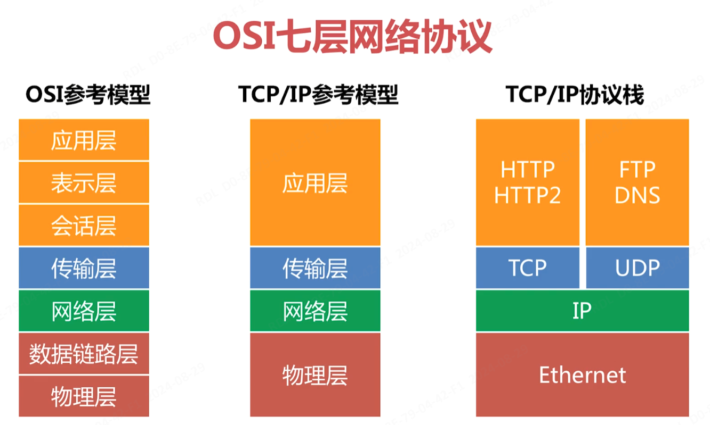
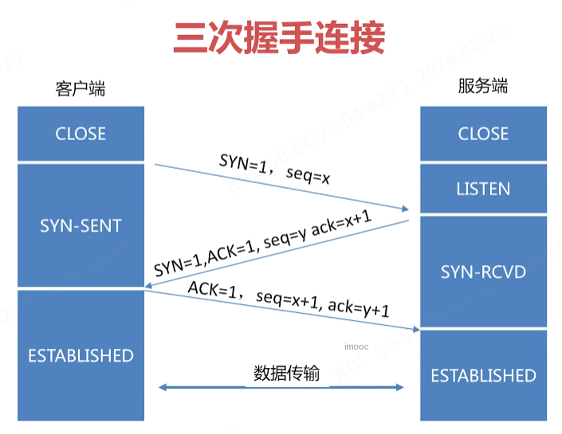
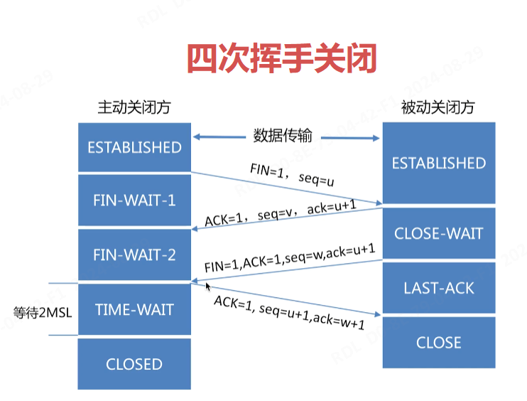
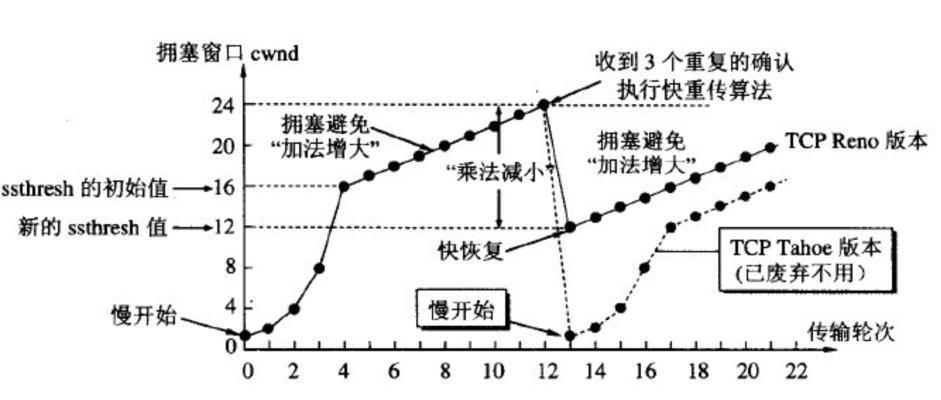

网关应具备的基本功能：

- 支持多种协议代理：tcp/http/websocket/grpc
- 支持多种负载均衡策略：随机/轮询/权重/hash
- 支持服务发现：主动探测/自动服务发现

- 支持横向扩容

网关处理高并发的措施：

- 限流：请求 QPS 限制
- 熔断：错误率达阈值则服务熔断
- 降级：确保核心业务可用
- 权限认证：请求拦截

## 计算机网络基础

OSI 七层网络协议



经典协议与数据包

- HTTP

  ```
  # Request
  GET / HTTP/1.1
  Accept: application/json, text/javascript, */*; q=0.01
  Accept-Encoding: gzip, deflate, br, zstd
  Accept-Language: zh-CN,zh;q=0.9
  Cache-Control: no-cache
  Connection: keep-alive
  Cookie: 
  Host: www.baidu.com
  Pragma: no-
  
  # Response
  HTTP/1.1 200 OK
  Content-Length: 720
  Content-Type: text/plain; charset=UTF-8
  Date: Thu, 29 Aug 2024 08:38:21 GMT
  ```

- websocket

  ```
  GET /ws HTTP/1.1
  Host: server.example.com
  Upgrade: websocket
  Connection: Upgrade
  Sec-WebSocket-Key: ***
  
  HTTP/1.1 101 Switching Protocols
  Upgrade: websocket
  Connection: Upgrade
  Sec-WebSocket-Accept: ***
  Sec-WebSocket-Protocol: chat
  ```


三次握手与四次挥手

三次握手：是为了保证连接是双工的，可靠更多的是通过重传机制来保证。



四次挥手：因为连接是双工的，双方必须都收到对方的 FIN 包及确认才可关闭。



抓包工具 tcpdump

```sh
$ sudo tcpdump -i enp3s0 port 80 and host www.baidu.com
tcpdump: verbose output suppressed, use -v or -vv for full protocol decode
listening on enp3s0, link-type EN10MB (Ethernet), capture size 262144 bytes
# 另开一个连接，执行：`curl www.baidu.com`

# Flags 说明：
#  [S]  SYNC：同步
#  [.]  ACK： 确认
#  [P]  PSH： 推送
#  [F]  FIN： 完成
#  [R]  RST： 重置
#  [S.] SYNC, ACK
#  [P.] data, ACK
#  [F.] FIN, ACK

# 三次握手
# 1 Client: 发送 TCP 同步序列（SYN）和序列号（seq=1108233746），请求建立连接
17:11:48.646766 IP 172.16.56.53.55018 > www.baidu.com.http: Flags [S], seq 1108233746, win 64240, options [mss 1460,sackOK,TS val 2973186482 ecr 0,nop,wscale 7], length 0
# 2 Server: 回复同步&确认序列（SYN & ACK），seq=731604706，ack=1108233747（client.seq + 1）
17:11:48.668321 IP www.baidu.com.http > 172.16.56.53.55018: Flags [S.], seq 731604706, ack 1108233747, win 8192, options [mss 1452,sackOK,nop,nop,nop,nop,nop,nop,nop,nop,nop,nop,nop,wscale 5], length 0
# 3 Client: 回复确认序列（ACK）和确认号
17:11:48.668390 IP 172.16.56.53.55018 > www.baidu.com.http: Flags [.], ack 1, win 502, length 0

# 数据传输
# data-1 Client：发送 HTTP GET 请求，发送 PUH & ACK，seq 1:78，序列号 1，数据长度 77
17:11:48.668576 IP 172.16.56.53.55018 > www.baidu.com.http: Flags [P.], seq 1:78, ack 1, win 502, length 77: HTTP: GET / HTTP/1.1
# data-2 Server：确认收到的最大边界 78，剩余窗口数：win 2452
17:11:48.700029 IP www.baidu.com.http > 172.16.56.53.55018: Flags [.], ack 78, win 2452, length 0
# data-3 Server：响应 ack 78 的第一段数据 [1:1441]
17:11:48.700885 IP www.baidu.com.http > 172.16.56.53.55018: Flags [P.], seq 1:1441, ack 78, win 2452, length 1440: HTTP: HTTP/1.1 200 OK
# data-4 Client：确认收到的最大边界 1441
17:11:48.700915 IP 172.16.56.53.55018 > www.baidu.com.http: Flags [.], ack 1441, win 501, length 0
# data-5 Server：响应 ack 78 第二段数据 [1441:2782]
17:11:48.701310 IP www.baidu.com.http > 172.16.56.53.55018: Flags [P.], seq 1441:2782, ack 78, win 2452, length 1341: HTTP
# data-6 Client：确认收到的最大边界 2782
17:11:48.701325 IP 172.16.56.53.55018 > www.baidu.com.http: Flags [.], ack 2782, win 501, length 0

# 四次挥手
# 1 Client：主动关闭连接，发送 FIN & ACK，seq 78
17:11:48.701609 IP 172.16.56.53.55018 > www.baidu.com.http: Flags [F.], seq 78, ack 2782, win 501, length 0
# data-7 Server： 重试 ack 78 第二段数据 [1441:2782]
17:11:48.701898 IP www.baidu.com.http > 172.16.56.53.55018: Flags [P.], seq 1441:2782, ack 78, win 2452, length 1341: HTTP
# data-8 Client：确认
17:11:48.701930 IP 172.16.56.53.55018 > www.baidu.com.http: Flags [.], ack 2782, win 501, options [nop,nop,sack 1 {1441:2782}], length 0
# 2 Server：回复确认 ACK，确认号 ack = 79（client.seq + 1）
17:11:48.770350 IP www.baidu.com.http > 172.16.56.53.55018: Flags [.], ack 79, win 2452, length 0
# ==============================
#  CLOSE-WAIT
#  出现大量 close_wait 的原因：
#  - 并发请求太多导致
#  - 被动关闭方未及时释放端口资源导致
# ==============================
# 3 Server：发送 FIN & ACK
17:11:48.770353 IP www.baidu.com.http > 172.16.56.53.55018: Flags [F.], seq 2782, ack 79, win 2452, length 0
# 4 Client：回复 ACK，ack 2783（server.seq + 1）
17:11:48.770435 IP 172.16.56.53.55018 > www.baidu.com.http: Flags [.], ack 2783, win 501, length 0
# =========================================================
#  TIME-WAIT：2MSL
#  MSL:Maximum Segment Lifetime，最大段的生命周期：30s ~ 60s
#  保证 TCP 协议的全双工连接能够可靠关闭
#  保证这次连接的重复数据段从网络中消失
# ===========================================================
# Server：发送重置 RST 包（异常），可能是因为某些网络问题或服务端的异常导致
# RST 包表明连接被立即终止，不再接收任何数据。
17:11:51.785802 IP www.baidu.com.http > 172.16.56.53.55018: Flags [R], seq 731607489, win 0, length 0
```

TCP 拥塞控制与流量控制

TCP 流量控制：

- 由于通讯双方网速不同，任一方发送过快都会导致对方消息处理不过来，所以就需要把数据放到缓冲区中。
- 如果缓冲区满了，发送方还在发送，那接收方只能把数据包丢弃，因此需要控制发送速率。
- 缓冲区剩余大小称之为接收窗口，用 win 表示，如果 win = 0，则发送方停止发送。

拥塞控制：

- 拥塞控制是调解网络的负载。
- 接收方网络资源繁忙，因未及时响应 ACK 导致发送方重传大量数据，这将会导致网络更加拥堵。
- 拥塞控制是动态调整 win 大小，不只是依赖缓冲区大小确定窗口大小。
- 拥塞控制分为两部分：
  - 慢开始和拥塞避免
  - 快速重传和快速恢复



粘包、拆包

- 应用程序写入的数据大于套接字缓冲区大小，这将会发生拆包。
- 应用程序写入数据小于套接字缓冲区大小，网卡将应用多次写入的数据发送到网络上，这将发送粘包。
- 进行 MSS（最大报文长度）大小的 TCP 分段，当 TCP 报文长度 - TCP头部长度 ＞ MSS 的时候将发生拆包。
- 接收方不及时读取套接字缓冲区数据，这将发送粘包。

如何获取完整应用数据报文

- 使用带消息头的协议，头部写入包长度，然后再读取包内容。
- 设置定长消息，每次读取定长内容，长度不够时空位补固定字符。
- 设置消息边界，服务端从网络流中按消息边界分离出消息内容，一般使用 `\n`。


> server.go

```go
// server.go
package main

import (
	"io"
	"log"
	"net"
)

func handle(conn net.Conn) {
	// 处理完后关闭连接
	defer conn.Close()

	client := conn.RemoteAddr()
	log.Printf("client connected: %s -> %s", client, conn.LocalAddr())

	// 这个切片用于接收消息
	var msg = make([]byte, 1024)
	for {
		// 从连接中获取消息，未获取到消息时，阻塞
		n, err := conn.Read(msg)
		if err != nil {
			if err == io.EOF {
				log.Println(client, "closed...")
				return
			}

			log.Fatal("Read Error:", err)
		}

		log.Print(client, ":", string(msg[:n]))
	}

}

// 监听端口
// 接收客户端的连接请求
// 处理客户端的请求（goroutine）
func main() {
	addr := ":1027"

	// 监听端口
	listener, err := net.Listen("tcp", addr)
	if err != nil {
		log.Fatal("Listen Error:", err)
	}
	defer listener.Close()

	// Addr 返回监听的网络地址
	log.Println("server listen: ", listener.Addr())

	// 循环等待连接
	for {
		// Accept 等待并返回下一个连接
		conn, err := listener.Accept()
		if err != nil {
			log.Fatal("Accept Error:", err)
		}

		// 用协程响应各个请求
		go handle(conn)
	}
}
```

> client.go

```go
// client.go
package main

import (
	"bufio"
	"log"
	"net"
	"os"
	"strings"
)

// 建立连接
// 发送请求
// 关闭连接
func main() {
	conn, err := net.Dial("tcp", ":1027")
	if err != nil {
		log.Fatal("Dial Error:", err)
	}
	defer conn.Close()

	// 从命令行读取输入
	inputReader := bufio.NewReader(os.Stdin)
	for {
		input, err := inputReader.ReadBytes('\n')
		if err != nil {
			log.Fatal("Read Error:", err)
		}

		q := strings.TrimSpace(string(input))
		if q == "exit" || q == "q" {
			break
		}

		// 往连接中发送消息
		n, err := conn.Write(input)
		if err != nil {
			log.Fatal("Write：", err)
		}

		log.Println("send bytes:", n)
	}
}
```

netstat

```
# Netstat 命令用于显示各种网络相关信息，如网络连接，路由表，接口状态(Interface Statistics)，masquerade 连接，多播成员 (Multicast Memberships) 等。

  netstat [-vWeenNcCF] [<Af>] -r         
  netstat {-V|--version|-h|--help}
  netstat [-vWnNcaeol] [<Socket> ...]
  netstat { [-vWeenNac] -i | [-cnNe] -M | -s [-6tuw] }

        -r, --route              显示路由表
        -i, --interfaces         display interface table
        -g, --groups             display multicast group memberships
        -s, --statistics         display networking statistics (like SNMP)
        -M, --masquerade         display masqueraded connections

        -v, --verbose            显示详细信息
        -W, --wide               don't truncate IP addresses
        -n, --numeric            不解析名称
        --numeric-hosts          不解析主机名
        --numeric-ports          忽略端口名称
        --numeric-users          忽略用户名
        -N, --symbolic           resolve hardware names
        -e, --extend             显示更多信息
        -p, --programs           display PID/Program name for sockets
        -o, --timers             display timers
        -c, --continuous         continuous listing

        -l, --listening          display listening server sockets
        -a, --all                display all sockets (default: connected)
        -F, --fib                display Forwarding Information Base (default)
        -C, --cache              display routing cache instead of FIB
        -Z, --context            display SELinux security context for sockets

  <Socket>={-t|--tcp} {-u|--udp} {-U|--udplite} {-S|--sctp} {-w|--raw}
           {-x|--unix} --ax25 --ipx --netrom
  <AF>=Use '-6|-4' or '-A <af>' or '--<af>'；默认： inet
  列出所有支持的协议：
    inet (DARPA Internet) inet6 (IPv6) ax25 (AMPR AX.25)
    netrom (AMPR NET/ROM) ipx (Novell IPX) ddp (Appletalk DDP)
    x25 (CCITT X.25)

```


