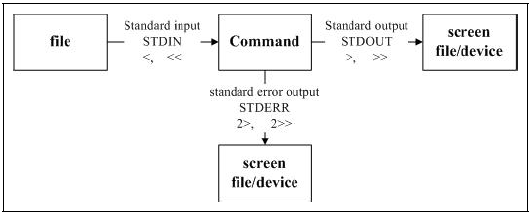

# 一、安装 & 配置

## 1.1、概述

Unix 的由来：20 世纪 70 年代，由贝尔实验室的 Ken tompsom 和 Dennis richres 共同创造的 C 语言编写而成。近期 Ken tompsom 又创造了 Go 语言。

GNU 计划：对互联网发展有巨大影响的计划（开源），由 Richard  Stallman 发起。

Linux 之父：Linus Torvalds，Git 创作者。

Linux 主要发行版本：Ubuntu、RedHat、CentOS、Debian、Fedora、SuSE、OpenSUSE。

[Linux 内核源码](https://www.kernel.org/)

## 1.2、安装 CentOS 7

- [VirtualBox 下载](https://www.virtualbox.org/)
- [CentOS 下载](https://www.centos.org/download/) （推荐使用阿里云镜像下载）
- [安装教程](https://www.cnblogs.com/Young-wind/p/5852180.html)

注：若安装虚拟机时，只有32位的可供选择，可能是 BIOS 没有开启虚拟技术。
```
# 启用虚拟机功能
dism.exe /online /enable-feature /featurename:Microsoft-Windows-Subsystem-Linux /all /norestart
```

## 1.3、网络配置

### 1、访问外网（NAT）

在虚拟机中无法 ping 通外网时：

```sh
# 1 VirtualBox 配置：设置 > 网络 > 网卡 1 > 连接方式：网络地址转换（NAT）

# 2 修改网络配置文件： `ifcfg-enp0s3`  （网络地址转换(NAT) 对应的配置）
$ vim /etc/sysconfig/network-scripts/ifcfg-enp0s3
`
TYPE=Ethernet
PROXY_METHOD=none
BROWSER_ONLY=no
BOOTPROTO=dhcp
DEFROUTE=yes
IPV4_FAILURE_FATAL=no
IPV6INIT=yes
IPV6_AUTOCONF=yes
IPV6_DEFROUTE=yes
IPV6_FAILURE_FATAL=no
IPV6_ADDR_GEN_MODE=stable-privacy
NAME=enp0s3
UUID=6ae4e71b-23d5-42e5-8e05-48e2e6b36d21
DEVICE=enp0s3
# ONBOOT=no
ONBOOT=yes   # 修改为 yes
`

# 3 重启网络服务
service network restart

# 4 Ping 测试
#  -c 5  发送 5 次 ping 请求，否则一直发送
ping -c 5 www.baidu.com 
```

### 2、主机访问（Host-Only）

主机无法连接到虚拟机时：

- 用 `ip addr` 命令查看网卡信息，是否存在 `enp0s8` 网卡，默认没有。

- VirtualBox 配置：设置 > 网络 > 网卡 2 > 启用网络连接 =>  连接方式：仅主机（Host-Only）网络。

- 修改网络配置文件： `ifcfg-enp0s8`，类似 `ifcfg-enp0s3`。

- 再次用 `ip addr` 命令查看网卡信息：

```
enp0s8: ...
	...
	inet 192.168.56.102/24 ...
	...
```

- 用 SSH 连接到虚拟机：

```
ssh root@192.168.1.159
```

### 3、网络连接模式

|                       | NAT  | Bridged Adapter |   Internal   |   Host-Only    |
| --------------------: | :--: | :-------------: | :----------: | :------------: |
|     **虚拟机 → 主机** |  √   |        √        |      ×       | 默认不能需设置 |
|     **主机 → 虚拟机** |  ×   |        √        |      ×       |       √        |
| **虚拟机 → 其他主机** |  √   |        √        |      ×       | 默认不能需设置 |
| **其他主机 → 虚拟机** |  ×   |        √        |      ×       | 默认不能需设置 |
|        **虚拟机之间** |  ×   |        √        | 同网段下可以 |       √        |

（1）网络地址转换（NAT）

连接这个网卡可以访问外部网络，但是外部网络不可访问虚拟机。

原理：在主机上创建一个虚拟网卡，与虚拟机的 IP 同网段，主机与虚拟机之前形成一个网络。

（2）桥接网卡（Bridged Adapter）

这个网络完全可以共享主机网络，主机网络发生变化时，也跟随变化，IP 也随之变动。

优点：局域网内的其它主机可以访问到虚拟机。

缺点：会占用局域网中同网段的一个 IP，易造成 IP 冲突。

（3）仅主机（Host-Only）

这个网络也可以用来主机访问虚拟机以及虚拟机上web服务，但是虚拟机不可访问外网。

原理：相当于一个独立网络。

## 1.4、开关机

```sh
# 不指定选项和参数，默认1分钟后关闭电脑（shutdown -h 1）
shutdown [选项] [时间] 

# 立即重启（或 reboot）
shutdown -r now

# 立即关机（或 poweroff 或 halt）
shutdown -h now

# 取消关机计划
shutdown -c
```

## 1.5、常用命令

```sh
# 自动补全（命令、参数）：tab
# 清屏：clear
# 结束进程：Ctrl+c

# 通配符：
    *
    ?	匹配1个字符
    []	字符组中的任何一个（如：[abc] [1-9]）

# 帮助指令：
    man <command>  获得帮助信息
    help <command> 获得Shell内置命令的帮助信息


# 输出内容到控制台
echo [Options] <Content>

例：
    输出环境变量：echo $PATH 
    输出内容并写入文件：echo 'Hello World' > hello

# 后台运行 &
$ sleep 5 &

```

### 1、修改主机名

```sh
# 修改主机名（reboot 生效）
vi /etc/hostname

`
local.domain
`
```

### 2、ssh 免密

- 将 .101 的 SSH 公钥 `~/.ssh/id_rsa.pub` 写入 .102 的 `~/.ssh/authorized_keys` 则可实现 101 到 102 的免密登录和 scp 操作。
- 注意：如果 `~/.ssh/authorized_keys` 文件及其目录让本用户之外的用户拥有写权限，那么 sshd 都会拒绝使用 `~/.ssh/authorized_keys` 文件中的 key 来进行认证。

### 3、环境变量

```sh
# 查看：
echo $PATH


# 设置：

# 方法1：一次性的设置
export PATH=$PATH:dir1[:dir2]

# 方法2：永久性的设置，所有用户有效，需重启或使用 source 命令生效

将方法1的配置添加到文件 `/etc/profile` 的末尾。

# 方法3：永久性的设置，针对一个用户有效，需重启或使用 source 命令生效

将方法1的配置添加到文件 `~/.bashrc` 的末尾。
```

### 4、日期时间

```sh
# ---------------
#  日期时间
# ---------------

# 显示日期
$ date
2023年 03月 19日 星期日 01:09:11 CST

$ date '+%Y-%m-%d %H:%M:%S'
2023-03-19 01:10:41

# 或
#  %F    完整日期格式，等价于 %Y-%m-%d
#  %T    时间，等价于 %H:%M:%S
$ date '+%F %T'
2023-03-19 01:10:41

# 时间戳
# 1970-01-01 00:00:00 UTC 以来的秒数
$ date "+%s"
1714977891

# 设置日期
$ date -s "0000-00-00 00:00:00"

# 日历
cal [选项] [[[日] 月] 年]

选项：
    -1, --one        只显示当前月份(默认)
    -3, --three      显示上个月、当月和下个月
    -s, --sunday     周日作为一周第一天
    -m, --monday     周一用为一周第一天
    -j, --julian     输出儒略日
    -y, --year       输出整年

$ cal
      五月 2024
日 一 二 三 四 五 六
          1  2  3  4
 5  6  7  8  9 10 11
12 13 14 15 16 17 18
19 20 21 22 23 24 25
26 27 28 29 30 31
```

### 5、lscpu

```sh
# 显示 CPU 架构信息
lscpu [Options]

Options：
 -a, --all               同时打印在线和离线 CPU (-e 选项默认值)
 -b, --online            只打印在线 CPU (-p 选项默认值)
 -B, --bytes             print sizes in bytes rather than in human readable format
 -C, --caches[=<list>]   info about caches in extended readable format
 -c, --offline           只打印离线 CPU
 -J, --json              use JSON for default or extended format
 -e, --extended[=<列表>] 打印扩展的可读格式
 -p, --parse[=<列表>]    打印可解析格式
 -s, --sysroot <目录>    以指定目录作为系统根目录
 -x, --hex               打印十六进制掩码而非 CPU 列表
 -y, --physical          打印物理 ID 而非逻辑 ID
     --output-all        print all available columns for -e, -p or -C

 -h, --help              display this help
 -V, --version           display version

Available output columns for -e or -p:
           CPU  逻辑 CPU 数量
          CORE  逻辑核心数量
        SOCKET  逻辑(CPU)座数量
          NODE  逻辑 NUMA 节点数量
          BOOK  逻辑 book 数
        DRAWER  逻辑抽屉号
         CACHE  显示 CPU 间是如何共享缓存的
  POLARIZATION  虚拟硬件上的 CPU 调度模式
       ADDRESS  CPU 的物理地址
    CONFIGURED  显示超级监督(hypervisor)是否分配了 CPU
        ONLINE  显示 Linux 当前是否在使用该 CPU
        MAXMHZ  显示 CPU 的最大 MHz
        MINMHZ  显示 CPU 的最小 MHz

Available output columns for -C:
      ALL-SIZE  size of all system caches
         LEVEL  cache level
          NAME  cache name
      ONE-SIZE  size of one cache
          TYPE  cache type
          WAYS  ways of associativity


$ lscpu
# CPU 的架构名称
Architecture:          x86_64
# CPU 的操作模式
CPU op-mode(s):        32-bit, 64-bit
# 字节序
Byte Order:            Little Endian
# 逻辑核心数 = 物理核心数 * 每个核心的线程数 = 96 * 2 = 192
# 物理核心数 = 插槽数 * 每个插槽的核心数 = 4 * 24 = 96
CPU(s):                192
# 当前在线的 CPU 列表
On-line CPU(s) list:   0-191
# 每个核心的线程数，如果是 1，则是超线程（Hyper-Threading）
Thread(s) per core:    2
# 每个 CPU 插槽的核心数
Core(s) per socket:    24
# 安装在主板上的 CPU 插槽数
Socket(s):             4
# 非统一内存访问（NUMA）节点的数量
NUMA node(s):          4
# 制造商 ID
Vendor ID:             GenuineIntel
# CPU 系列
CPU family:            6
# 型号
Model:                 85
# 型号名称
Model:                 Intel(R) Xeon(R) Platinum 8260 CPU @ 2.40GHz
# 步进版本
Stepping:              7
# CPU 频率
CPU MHz:               1898.291
CPU max MHz:           3900.0000
CPU min MHz:           1000.0000
BogoMIPS:              4800.00
# 显示 CPU 是否支持虚拟化技术（如：Intel VT-x 或 AMD-V）
Virtualization:        VT-x
# 第 1 级缓存
L1d cache:             32K
# 第 1 级指令缓存
L1i cache:             32K
L2 cache:              1024K
L3 cache:              36608K
# 每个 NUMA 节点上的 CPU
NUMA node0 CPU:        0,4,8,12,16,20,24,28,32,36,40,44,48,52,56,60,64,68,72,76,80,84,88,92,96,100,104,108,112,116,120,124,128,132,136,140,144,148,152,156,160,164,168,172,176,180,184,188
NUMA node1 CPU:        1,5,9,13,17,21,25,29,33,37,41,45,49,53,57,61,65,69,73,77,81,85,89,93,97,101,105,109,113,117,121,125,129,133,137,141,145,149,153,157,161,165,169,173,177,181,185,189
NUMA node2 CPU:        2,6,10,14,18,22,26,30,34,38,42,46,50,54,58,62,66,70,74,78,82,86,90,94,98,102,106,110,114,118,122,126,130,134,138,142,146,150,154,158,162,166,170,174,178,182,186,190
NUMA node3 CPU:        3,7,11,15,19,23,27,31,35,39,43,47,51,55,59,63,67,71,75,79,83,87,91,95,99,103,107,111,115,119,123,127,131,135,139,143,147,151,155,159,163,167,171,175,179,183,187,191
# 显示 CPU 支持的特性和功能
Flags:                 fpu vme de pse tsc msr pae mce cx8 apic sep mtrr pge mca cmov pat pse36 clflush dts acpi mmx fxsr sse sse2 ss ht tm pbe syscall nx pdpe1gb rdtscp lm constant_tsc art arch_perfmon pebs bts rep_good nopl xtopology nonstop_tsc aperfmperf eagerfpu pni pclmulqdq dtes64 monitor ds_cpl vmx smx est tm2 ssse3 sdbg fma cx16 xtpr pdcm pcid dca sse4_1 sse4_2 x2apic movbe popcnt tsc_deadline_timer aes xsave avx f16c rdrand lahf_lm abm 3dnowprefetch epb cat_l3 cdp_l3 invpcid_single intel_ppin ssbd mba rsb_ctxsw ibrs ibpb stibp ibrs_enhanced tpr_shadow vnmi flexpriority ept vpid fsgsbase tsc_adjust bmi1 hle avx2 smep bmi2 erms invpcid rtm cqm mpx rdt_a avx512f avx512dq rdseed adx smap clflushopt clwb intel_pt avx512cd avx512bw avx512vl xsaveopt xsavec xgetbv1 cqm_llc cqm_occup_llc cqm_mbm_total cqm_mbm_local dtherm ida arat pln pts pku ospke avx512_vnni md_clear spec_ctrl intel_stibp flush_l1d arch_capabilities
```


## 1.6、运行级别

```sh
# 查看系统默认运行级别
systemctl get-default

multi-user.target    # 3

# 设置系统默认运行级别
systemctl set-default multi-user.target

# 通过 init 来切换不同的运行级别
init [0123456]

说明：
    0 关机
    1 单用户【找回密码】
    2 多用户状态没有网络服务
    3 多用户状态有网络服务：multi-user.target
    4 系统未使用，保留给用户
    5 图形界面：graphical.target
    6 系统重启
    
# 运行级别 1 的应用：[找回 root 密码]（www.baidu.com）
```

## 1.7、SSH 远程登录


# 二、目录&文件

## 2.1 文件权限

### 1、文件属性（ls）

Linux 一般将文件可存取的身份分为三个类别： owner/group/others，且三种身份各有 read/write/execute 等权限。

```sh
# list 列出文件
ls [Options...] [Files...]

列出给定文件（默认为当前目录）的信息。
如果不指定 -cftuvSUX 中任意一个或 --sort 选项，则根据字母大小排序。

常用选项：
    -a, --all             显示所有文件，包括隐藏文件（以 . 开头的文件）
    -h, --human-readable  与 -l 和 -s 一起，以易于阅读的格式输出文件大小（例如 1K 234M 2G等）
    -i, --inode           显示每个文件的索引编号（inode 号）
    -I, --ignore=模式      不显示任何匹配指定 shell <模式>的项目
    -l                    列表显示文件，使用较长格式列出信息
    -r, --reverse         逆序排列
    -R, --recursive       递归显示子目录
    -1                    每行只列出一个文件


# 列出当前目录的文件，文件大小带单位
$ ls -lh
-rw-r--r--. 1 root root 7.4M 9月  23 16:19 tree.txt


# 结果说明：
文件类型及权限 | 引用数 | 文件所有者 | 文件所属组 | 文件大小 | 最后修改时间：月 日 年/时间 | 文件名

# 文件类型及权限分解：
[-]             代表文件类型
[rw-][r--][r--] 代表三种身份的 rwx 权限
.               表示启用了selinux，空表示没有开启
```

（1）文件类型

- 普通文件 [-]
  - 纯文本文件（ASCII）
  - 二进制文件（binary）：如可执行程序。
  - 数据格式文件（data）：某些程序的特定格式文件。

- 目录 [d]（directory）
- 链接文件 [l]（link）
- 设备文件 （device）
  - 区块设备文件 [b]（block），用于存储数据，以提供系统随机存取的周边设备，如软盘、硬盘。
  - 字符设备文件 [c]（character），是一些序列埠的周边设备，如键盘、鼠标等。
- 网络套接字 [s]（sockets），常在 /run 或 /tmp 目录中看到这种文件类型。
- 管道 [p]（pipeline）

（2）文件权限

```
[rw-][r--][r--] 分别代表三种身份的权限：
    rw-  文件所有者的权限
    r--  文件所属组的权限
    r--  其它用户的权限

    读(r)/写(w)/执行(x)/无权限(-)
```

> 案例

```sh
$ ll /data/

-rwxrw-r--  1 dev  devgroup     0 7月   9 16:29 README
drwxr-xr--  2 dev  devgroup  4096 7月   9 16:26 src/

# 所属组的权限将被组中成员继承。
# 对文件拥有写（权限）不代表可以删除文件，同时还需要对该目录的写权限才可删除文件。
# devgroup 对 src 目录有 r-w 权限，可以进入本目录进行工作，但是不能在本目录下进行写入的动作。
# other 对 src 目录有 r-- 权限，虽然有 r ，但是没有 x，因此并不能进入此目录。
```

> 实用指令

```sh 
# 统计当前目录下的文件数量
$ ls -l | grep '^-' | wc -l

# 统计当前目录下的目录数量
$ ls -l | grep '^d' | wc -l

# 递归统计（包括子孙）文件/文件夹 数量
$ ls -lR | grep '^-' | wc -l

# 以树形结构打印目录
$ yum install tree
$ tree [目录]
```


### 2、改变文件属性与权限

#### （1）chgrp

```sh
# 改变文件所属组
chgrp [选项]... 用户组 文件...

Options:
  -c, --changes           类似 verbose 选项，但仅在做出修改时进行报告
  -f, --silent, --quiet   不显示大多数错误消息
  -v, --verbose           输出各个处理的文件的诊断信息
      --dereference       影响每个符号链接的原始引用文件（这是默认行为），而非符号链接本身
  -h, --no-dereference    只影响符号链接，而非被引用的任何文件（仅当系统支持更改符号链接的所有者时，该选项才有用）
      --no-preserve-root  不特殊对待“/”（默认行为）
      --preserve-root     不允许在“/”上递归操作
      --reference=<file>  使用<参考文件>的属组信息而非指定一个<用户组>的值
  -R, --recursive         递归操作文件和目录

以下选项是在指定了 -R 选项时被用于设置如何遍历目录结构体系。
如果您指定了多于一个选项，那么只有最后一个会生效。

  -H                     如果命令行参数是一个指向目录的符号链接，则对其进行遍历
  -L                     遍历每一个遇到的指向目录的符号链接
  -P                     不遍历任何符号链接（默认）


# 将 /data/src 及其子目录下所有文件的所属组改为 dev
$ chgrp dev /data/src

# 使用 --reference 选项，
# 把指定 src 的所属组设置为与参考文件 README 相同
$ chgrp --reference=/data/README /data/src
```

#### （2）chown

```sh
# 改变文件所有者和所属组
chown [选项]... [所有者][:组] 文件...

Options:
  -c, --changes          类似 verbose 选项，但仅在做出修改时进行报告
  -f, --silent, --quiet  不显示大多数错误消息
  -v, --verbose          输出各个处理的文件的诊断信息
      --dereference      影响每个符号链接的原始引用文件（这是默认行为），而非符号链接本身
  -h, --no-dereference   只影响符号链接，而非被引用的任何文件（仅当系统支持更改符号链接的所有者时，该选项才有用）
      --from=当前所有者:当前所属组  只当每个文件的所有者和组符合选项所指定时才更改所有者和组。
                                其中一个可以省略，这时已省略的属性就不需要符合原有的属性。
      --no-preserve-root  不特殊对待“/”（默认行为）
      --preserve-root     不允许在“/”上递归操作
      --reference=<file>  使用指定<参考文件>的所有者和所属组信息，而非手工指定 所有者:组 的值
  -R, --recursive         递归操作文件和目录

以下选项是在指定了 -R 选项时被用于设置如何遍历目录结构体系。
如果您指定了多于一个选项，那么只有最后一个会生效。

  -H                     如果命令行参数是一个指向目录的符号链接，则对其进行遍历
  -L                     遍历每一个遇到的指向目录的符号链接
  -P                     不遍历任何符号链接（默认）


如果没有指定所有者，则不会更改所有者信息。若所属组若没有指定也不会对其更改，但当加上 ':' 时 GROUP 会更改为指定所有者的主要组。所有者和所属组可以是数字或名称。

示例：
  chown root /u         将 /u 的属主更改为"root"。
  chown root:staff /u   和上面类似，但同时也将其属组更改为"staff"。
  chown -hR root /u     将 /u 及其子目录下所有文件的属主更改为"root"
```

#### （3）chmod

```sh
# 改变文件的权限
chmod [Optinos] 模式[,模式] 文件...
chmod [Optinos] 八进制模式 文件...

Options:
  -c, --changes           类似 verbose 选项，但仅在做出修改时进行报告
  -f, --silent, --quiet   不显示大多数错误消息
  -v, --verbose           输出各个处理的文件的诊断信息
      --no-preserve-root  不特殊对待“/”（默认行为）
      --preserve-root     不允许在“/”上递归操作
      --reference=<file>  使用参考文件的模式而非给定模式的值
  -R, --recursive         递归修改文件和目录


符号模式：
  chmod [u|g|o|a][+|-|=][r|w|x] <files...>
  
  1 身份：
    u    所有者
    g    所属组
    o    其它人
    a    全部身份（默认）
  2 操作：
    +    添加权限
    -    去除权限
    =    设置权限
  3 权限：
    r    可读
    w    可写
    x    可执行


八进制模式:
  chmod 777 <files...>
    
    777 => 111 111 111 
    三组二进制分别代表 u g o 的 rwx 权限，0 无权限，1 有权限
	
# 给 file 的全部人添加 x 权限
$ chmod +x file     给文件添加可执行权限（所有者、组、其它）

# 给 file 的所有者添加 x 权限
$ chmod u+x file    给文件所有者添加可执行权限

# 分别设置权限
$ chmod u=rwx,g=rx,o=- file    

# 设置 file 全部人都有 rwx 权限
$ chmod 777 file    用八进制数来设置权限

# 设置 file 所有者有 rwx 权限，所属组有 rw 权限，其他人无权限
$ chmod 760 file

# -R 对 script 目录下的所有文件添加可执行权限
$ chmod -R +x script/ 
```

### 3、文件权限的意义

（1）对文件

文件是实际存放数据的，包括一般文本文件、数据库内容档、二进制可可执行文件（binary program）等。

- r （read）：可读取此一文件的实际内容，如读取文本文件的文字内容等；

- w （write）：可以编辑、新增或者是修改该文件的内容（但不含删除该文件）；

- x （execute）：该文件具有可以被系统执行的权限。

（2）对目录

- r （read contents in directory）：表示具有读取目录结构清单的权限，即 ls。

- w （modify contents of directory）：表示你具有改变该目录结构清单的权限，即可以创建、删除、移动、重命名当前目录下的文件和目录。

- x （access directory）：目录不可以被执行，因此目录的 x 代表能否进入该目录成为工作目录， 即 cd。

## 2.2、目录结构

> Linux 目录配置的依据：FHS（Filesystem Hierarchy Standard）

### 1、根目录（/）

根目录是整个系统最重要的一个目录，所有的目录都是由根目录衍生出来的，同时根目录也与开机/还

原/系统修复等动作有关。

因此 FHS 建议：根目录（/）所在分区应该越小越好， 且应用程序所安装的软件最好不要与根目录放在同一

个分区内，保持根目录越小越好。 如此不但性能较佳，根目录所在的文件系统也较不容易发生问题。

```sh
/
├── bin -> usr/bin        可以被 root 和普通用户执行的指令（cd, cp, ls, ...）
├── boot                  启动目录，包括 Linux 核心文件、开机菜单、开机所需配置文件
├── dev                   设备目录
├── etc                   配置文件目录
├── home                  普通用户目录
├── lib -> usr/lib        放置开机和 /bin 或 /sbin 下的指令调用的函数库
├── lib32 -> usr/lib32
├── lib64 -> usr/lib64
├── libx32 -> usr/libx32
├── lost+found            当文件系统发生错误时保留遗失的片段（仅 ext2/ext3/ext4 格式会产生）
├── media                 媒体目录：放置可移除的设备，包括软盘、光盘、DVD 等
├── mnt                   [mount] 暂时挂载额外设备
├── opt                   放置第三方协力软件
├── proc                  [process] 虚拟文件系统，放置进程信息、周边设备状态、网络状态等内存数据
├── root                  root用户目录
├── run                   系统开机后所产生的各项信息
├── sbin -> usr/sbin      仅 root 可执行的设置系统环境的指令（shutdown, fdisk, mount, ...）
├── srv                   [service] 存放网络服务所需要取用的数据，如 WWW、FTP
├── sys                   虚拟文件系统（不占磁盘空间），记录核心与系统硬件信息
├── tmp                   普通用户或是正在执行的程序暂时放置文件
├── usr                   [Unix Software Resource] 放置 Unix 操作系统软件资源
└── var                   放置变动性的数据
```

### 2、/usr

依据 FHS 的基本定义，/usr 里面放置的数据属于可分享的与不可变动的（shareable, static）。

```sh
/usr
├── bin      放置所有普通用户能执行的指令（新版 CentOS-7 包含全部用户指令），此目录下不应该有子目录
├── games
├── include  c/c++ 等程序语言的依赖文件
├── lib      与 /lib 功能相同
├── lib32
├── lib64
├── libexec  不被普通用户使用的可执行文件或脚本（script）等
├── libx32
├── local    系统管理员在本机自行安装的软件
├── sbin     非系统正常运行所需要的系统指令，如网络服务器软件的服务指令（daemon）。
├── share    放置只读架构的数据文件，包括共享文件
└── src      一般源代码建议放置到这里
```

### 3、/var

```
/var
├── backups
├── cache        应用程序本身运行过程中会产生的一些暂存盘
├── crash
├── lib          程序本身执行的过程中，需要使用到的数据文件放置的目录。如：/var/lib/mysql/
├── local
├── lock -> /run/lock
├── log          登录文件放置的目录
├── mail         放置个人电子邮件信箱的目录，/var/spool/mail -> /var/mail
├── metrics
├── opt
├── run -> /run  程序或者是服务启动后的 PID 放置目录
├── snap
├── spool        放置排队等待其他程序使用的数据，使用后删除。
└── tmp
```


## 2.3 文件与目录管理

### 1、目录/文件管理

#### （1）cd

```sh
# change directory
cd [Options] [目录]

    改变 shell 工作目录。
    改变当前目录至 DIR 目录。默认的 DIR 目录是 shell 变量 HOME 的值。

# 打印当前工作目录的名字
pwd [Options]
    


# 特殊目录表示：
    /     根目录
    .     代表当前目录
    ..    代表上级目录
    -     代表前一个工作目录
    #     root 的 home 目录
    $     普通用户的 home 目录
    ~     当前用户的 home 目录
    ~account  代表 account 用户的主目录

# 打印并切换回上一个工作目录
$ cd -
```

#### （2）mkdir & rmdir

```sh
# 创建目录
mkdir [Options] <DIR...>

Options：
  -m, --mode       设置权限模式（类似 chmod），不能是 a=rwx - umask
  -p, --parents    根据需要制作父级目录，目录已存在也不报错
  -v, --verbose    每次创建新目录都显示信息

# 创建目录，并指定权限
$ mkdir -m 744 a b c
$ ll
总用量 20
drwxr--r-- 5 dev dev 4096 5月  23 17:22 ./
drwxr-xr-x 7 dev dev 4096 5月  23 15:09 ../
drwxr--r-- 2 dev dev 4096 5月  23 17:22 a/
drwxr--r-- 2 dev dev 4096 5月  23 17:22 b/
drwxr--r-- 2 dev dev 4096 5月  23 17:22 c/

# 按需创建父级
$ mkdir -p a/b/c/d
$ tree
.
├── a
│   └── b
│       └── c
│           └── d
├── b
└── c


# 删除空目录
rmdir [Options] <DIR...>

Options:
      --ignore-fail-on-non-empty    忽略仅由目录非空产生的所有错误
  -p, --parents                     删除指定目录及其各个上级文件夹


# 以下命令等价
$ rmdir -p a/b/c
$ rmdir a/b/c a/b a
```

#### （3）touch

```sh
# 更新文件的访问和修改时间
# 当文件不存在时，创建一个空文件
touch [Options] <文件, ...>

Options:
    -a  更新访问时间
    -m  更改修改时间
```

#### （4）cp

```sh
# 拷贝文件 & 目录
cp [Options] <源文件> <目标文件>

Options:
    -i  覆盖前提示
    -r  递归复制目录及其子目录内的所有内容（拷贝目录时必须）
    -T  将目标目录视作普通文件
```

#### （5）rm

```sh
# 删除文件 & 目录
rm [Options] <文件, ...>

Options:
    -f, --force  强制删除，忽略不存在的文件和参数，从不提示
    -r, -R, --recursive  递归删除目录及其内容
    -d, --dir    删除空目录

注：默认 rm 不会删除目录，使用 rm -r 删除目录及其内容
```

#### （6）mv

```sh
# 重命名或移动文件 & 文件夹
mv [选项] 源文件 目标文件

选项：
    -f, --force			覆盖前不询问
    -i, --interactive	覆盖前询问
    -n, --no-clobber	不覆盖已存在文件
    
注：指定 -i、-f、-n 中的多个时，仅最后一个生效。
```

#### （7）basename & dirname

```sh
# 取得文件名
$ basename /etc/sysconfig/network
network 

# 取得目录名
$ dirname /etc/sysconfig/network
/etc/sysconfig
```

#### （8）scp

```sh
# 拷贝到远程
scp -P port <文件> user@host:File

例：scp my.ini root@192.168.0.159:/usr/mysql/

# 从远程到本机
scp root@192.168.0.159:/etc/hosts ./
```

#### （9）ln

> 硬链接（hard link）

硬链接是指同一个文件系统中的多个文件名指向同一个数据块（inode）的情况。它们共享相同的内容，属性和权限。

- 硬链接与原始文件之间没有区别，它们是完全平等的。删除任何一个链接都不会影响其他链接。

- 硬链接不能跨越不同的文件系统，因为每个文件系统都有自己独立的 inode 空间。

- 硬链接只能链接到文件，不支持链接到目录。

- 硬链接不占用磁盘，因为它们共享相同的 inode 和磁盘块，因此通常更高效。

> 软链接（symbolic link）

简单理解为一个文件的内容是另一个文件的路径
    ① 类似于Windows的快捷方式
    ② 可以对目录创建
    ③ 可以跨文件系统

> inode

inode 是文件系统中的一个概念，又称文件索引节点，包含文件的基础信息以及数据块的指针。

元信息类似于文件属性，包括文件的创建者、创建日期、文件大小、文件权限等信息，实际信息存储在块中，而存储文件元信息的区域就叫做 inode。一个文件必须占用一个 inode，并且至少占用一个 block。

```sh
Usage: 
  ln [OPTION]... [-T] <TARGET> <LINK_NAME>   (1st form)
  ln [OPTION]... <TARGET>                    (2nd form)
  ln [OPTION]... <TARGET...> <DIRECTORY>     (3rd form)
  ln [OPTION]... -t <DIRECTORY> <TARGET...>  (4th form)

第 1 种格式：创建一个名为 <LINK_NAME> 的 <TARGET> 链接。
第 2 种格式：在当前目录中创建一个指向 <TARGET> 的链接。
第 3, 4 种格式：在 <DIRECTORY> 中创建的每个指向 <TARGET...> 的链接。

默认创建硬链接，当使用 --symbolic 时创建符号链接。
默认情况下，创建每个目标时不应存在与新链接的名称相同的文件。
创建硬链接时，每个指定的 <TARGET> 都必须存在。软链接可以指向任意的位置；
当链接解析正常时，将其解析为一个相对于其父目录的相对链接。

Options：
      --backup[=CONTROL]      为每个已存在的目标文件创建备份文件
  -b                          类似--backup，但不接受任何参数
  -d, -F, --directory         允许超级用户尝试创建指向目录的硬链接
                              （注意：此操作可能因系统限制而失败)
  -f, --force                 强行删除任何已存在的目标文件
  -i, --interactive           删除目标文件前进行确认
  -L, --logical               如目标为符号链接，本次创建链接时将其解引用
  -n, --no-dereference        如果给定<链接名>是一个链接至某目录的符号链接，
                                将其作为普通文件处理
  -P, --physical              创建直接指向符号链接文件的硬链接
  -r, --relative              创建相对于链接位置的符号链接
  -s, --symbolic              创建符号链接而非硬链接（默认创建硬链接）
  -S, --suffix=后缀            自行指定备份文件的后缀
  -t, --target-directory=目录  在指定<目录>中创建链接
  -T, --no-target-directory   总是将给定的<链接名>当作普通文件
  -v, --verbose               列出每个链接的文件名称


########## 创建硬链接 ##########

$ mkdir hard_links
$ echo 'hello world' > hello
$ tree
├── hello
└── links

1 directory, 1 file

# 格式 1：在 hard_links 目录创建一个名为 world 指向的当前 hello 的硬链接
$ ln hello hard_links/world

# 显示每个文件的索引编号（inode 号）
# hello 和 world 文件的 inode 一样，引用数为 2
$ ll -i hello hard_links/world
6561537 -rw-rw-r-- 2 dev dev 12 5月  23 19:51 hard_links/world
6561537 -rw-rw-r-- 2 dev dev 12 5月  23 19:51 hello

# 格式 2：在当前目录下创建一个指向上级 hello 的硬链接（默认同名）
# 并用 -v 列出每个链接的文件名
$ cd hard_links
$ ln -v ../hello
'./hello' => '../hello'
$ ll -i ../hello hello world
6561537 -rw-rw-r-- 3 dev dev 12 5月  23 19:51 ../hello
6561537 -rw-rw-r-- 3 dev dev 12 5月  23 19:51 hello
6561537 -rw-rw-r-- 3 dev dev 12 5月  23 19:51 world

# 格式 3：在指定目录中创建指定的链接
$ mkdir all
$ ln -v hello world all/
'all/hello' => 'hello'
'all/world' => 'world'

# 格式 4：在指定目录中创建指定的链接
$ mkdir all-t
$ ln -v -t all-t/ hello world
'all-t/hello' => 'hello'
'all-t/world' => 'world'


# 在指定目录下创建硬链接（并用 -v 列出每个链接的文件名）
$ mkdir link
$ ln -v hello link/hello
'link/hello' => 'hello'

########## 创建软链接 ##########

# 在 /data/database/ 创建指向 /data/taxonomy 的软链接
$ ln -v -s /data/taxonomy /data/database/
'/data/database/taxonomy' => '/data/taxonomy'
$ cd /data/database/ && ll taxonomy
lrwxrwxrwx 1 dell dell 14 5月  20 12:06 taxonomy -> /data/taxonomy/
```

### 2、文件内容查看

#### （1）cat & tac

```sh
# 将<文件>或标准输入组合输出到标准输出
cat [Options] <文件, ...>

Options:
    -b  对非空行进行编号
    -n  对所有行进行编号（包含空行）
    
注：
    如果没有指定文件，或者文件为 `-`，则从标准输入读取。
    与 more 结合，翻页显示 cat <File> | more

# 倒序输出 cat
tac [Options] <文件, ...>
```

#### （2）more & less

```sh
# 分页显示文件内容（留痕）
more [Options] <文件 ,...>

说明：
    more 指令是一个基于 VI 编辑器的文本过滤器，它以全屏幕的方式按页显示文本内容。
    【其它命令 | more】：分页显示其它命令执行的结果。
    more 内置了若干快捷键（交互指令）：
    |--------|------------------|
    | space  | 向下翻一页         |
    | Enter  | 向下翻一行         |
    | q      | 退出（结束分页）    |
    | Ctrl+F | 向下滚动一屏       |
    | Ctrl+B | 返回上一屏         |
    | =      | 输出当前行号       |
    | :f     | 输出文件名和当前行号 |
    |--------|------------------|


# 与 more 功能一样（动态加载）
less [选项] 文件名

说明：
    其它命令 | less：分页显示其它命令执行的结果
```

#### （3）head & tail

```sh
# 打印每个文件的【前】 n 行（默认10行）
head [Options] <文件, ...>

Options：
    -c, --bytes   打印前 c 字节
    -n, --lines   打印前 n 行


# 打印每个文件的【后】 n 行（默认10行）
tail [Options] <文件, ...>

Options：
    -c, --bytes   打印前 c 字节
    -n, --lines   打印前 n 行
    -f, --follow  监听文件的更新
    -F            等同 --follow=name --retry
        --max-unchanged-stats=N  with -f，重新打开一个在迭代 N 次（默认5）后没有更改大小的 FILE，检查它是否已被取消链接或重命名（旋转日志）。
        --pid=PID                with -f，在 PID 终止后进程终止
        --retry                  若文件无法访问，重试
```

#### （4）od

```
用法：od [选项]... [文件]...
　或：od [-abcdfilosx]... [文件] [[+]偏移量[.][b]]
　或：od --traditional [选项]... [文件] [[+]偏移量[.][b] [+][标签][.][b]]

以无歧义的表示方式将指定文件输出至标准输出，默认为八进制字节形式。
如果指定了多于一个文件，将它们以列出的顺序连接起来作为输入。

如果没有指定文件，或者文件为"-"，则从标准输入读取。

如果两个调用格式都适用，系统会在最后一个运算量以"+"或数字开始
(如果有两个运算量)的情况下采用第二种格式。
偏移量是指 -j 偏移量。标签是第一个字节的伪地址，
随着累积过程递增。偏移量和标签如果冠以"0x"或"0X"前缀则
表示十六进制数；后缀"."代表八进制数，后缀"b"表示乘以 512。

必选参数对长短选项同时适用。
  -A, --address-radix=RADIX   output format for file offsets; RADIX is one
                                of [doxn], for Decimal, Octal, Hex or None
      --endian={big|little}   swap input bytes according the specified order
  -j, --skip-bytes=BYTES      skip BYTES input bytes first
  -N, --read-bytes=BYTES      limit dump to BYTES input bytes
  -S BYTES, --strings[=BYTES]  output strings of at least BYTES graphic chars;
                                3 is implied when BYTES is not specified
  -t, --format=TYPE           select output format or formats
  -v, --output-duplicates     do not use * to mark line suppression
  -w[BYTES], --width[=BYTES]  output BYTES bytes per output line;
                                32 is implied when BYTES is not specified
      --traditional           accept arguments in third form above
      --help            显示此帮助信息并退出
      --version         显示版本信息并退出


传统格式命令可混合使用，不同的格式可叠加：
  -a   即 -t a， 使用命名的字符，忽略高阶位
  -b   即 -t o1，使用八进制单字节字符
  -c   即 -t c， 使用可打印字符或者反斜杠转义的特殊字符
  -d   即 -t u2，使用无符号十进制双字节字符
  -f    即 -t fF，指定浮点数对照输出格式
  -i    即 -t dl，指定十进制整数对照输出格式
  -l    即 -t dL，指定十进制长整数对照输出格式
  -o    即 -t o2，指定双字节单位八进制数的对照输出格式
  -s    即 -t d2，指定双字节单位十进制数的对照输出格式
  -x    即 -t x2，指定双字节单位十六进制数的对照输出格式


TYPE is made up of one or more of these specifications:
  a          named character, ignoring high-order bit
  c          printable character or backslash escape
  d[SIZE]    signed decimal, SIZE bytes per integer
  f[SIZE]    floating point, SIZE bytes per float
  o[SIZE]    octal, SIZE bytes per integer
  u[SIZE]    unsigned decimal, SIZE bytes per integer
  x[SIZE]    hexadecimal, SIZE bytes per integer

SIZE is a number.  For TYPE in [doux], SIZE may also be C for
sizeof(char), S for sizeof(short), I for sizeof(int) or L for
sizeof(long).  If TYPE is f, SIZE may also be F for sizeof(float), D
for sizeof(double) or L for sizeof(long double).

Adding a z suffix to any type displays printable characters at the end of
each output line.


BYTES is hex with 0x or 0X prefix, and may have a multiplier suffix:
  b    512
  KB   1000
  K    1024
  MB   1000*1000
  M    1024*1024
and so on for G, T, P, E, Z, Y.
```

#### （5）nl

```
用法：nl [选项]... [文件]...
将指定的各个<文件>添加行号标注后写到标准输出。
```

#### （6）grep

```sh
grep [OPTIONS...] PATTERN [FILE...]

在每个 FILE 或标准输入中搜索 PATTERN。
默认情况下，PATTERN 是一个基本的正则表达式（BRE）。
PATTERN 可以包括多个模式字符串，使用换行符进行分隔。

常用：
    -E  使用扩展正则表达式
    -e  用指定的<模式>匹配
    -i	不区分大小写查找
    -v	显示不包含匹配文本的所有行（排除）
    -m  得到给定<次数>次匹配后停止
    -n	显示匹配行及行号


模式选择与解释：
  -E, --extended-regexp    <PATTERN> 是扩展正则表达式
  -F, --fixed-strings      <PATTERN> 是字符串
  -G, --basic-regexp       <PATTERN> 是基本正则表达式
  -P, --perl-regexp        <PATTERN> 是 Perl 正则表达式
  -e, --regexp=<模式>       用指定的<模式>字符串来进行匹配操作
  -f, --file=<文件>         从给定<文件>中取得<模式>
  -i, --ignore-case        在模式和数据中忽略大小写
      --no-ignore-case     不要忽略大小写（默认）
  -w, --word-regexp        强制<模式>仅完全匹配字词
  -x, --line-regexp        强制<模式>仅完全匹配整行
  -z, --null-data          数据行以一个 0 字节结束，而非换行符

杂项:
  -s, --no-messages        不显示错误信息
  -v, --invert-match       选中不匹配的行

输出控制：
  -m, --max-count=<次数>    得到给定<次数>次匹配后停止
  -b, --byte-offset        输出的同时打印字节偏移
  -n, --line-number        输出的同时打印行号
      --line-buffered      每行输出后刷新输出缓冲区
  -H, --with-filename      为输出行打印文件名
  -h, --no-filename        输出时不显示文件名前缀
      --label=<标签>        将给定<标签>作为标准输入文件名前缀
  -o, --only-matching       只显示行中非空匹配部分
  -q, --quiet, --silent     不显示所有常规输出
      --binary-files=TYPE   设定二进制文件的 TYPE（类型）；
                            TYPE 可以是 'binary'、'text' 或 'without-match'
  -a, --text                等同于 --binary-files=text
  -I                        等同于 --binary-files=without-match
  -d, --directories=ACTION  读取目录的方式；
                            ACTION 可以是'read', 'recurse', 'skip'
  -D, --devices=ACTION      读取设备、先入先出队列、套接字的方式；
                            ACTION 可以是'read'或'skip'
  -r, --recursive           等同于 --directories=recurse
  -R, --dereference-recursive       同上，但遍历所有符号链接
      --include=GLOB        只查找匹配 GLOB（文件模式）的文件
      --exclude=GLOB        跳过匹配 GLOB 的文件
      --exclude-from=FILE   跳过所有匹配给定文件内容中任意模式的文件
      --exclude-dir=GLOB    跳过所有匹配 GLOB 的目录
  -L, --files-without-match  只打印没有匹配上的<文件>的名称
  -l, --files-with-matches  只打印有匹配的<文件>的名称
  -c, --count               只打印每个<文件>中的匹配行数目
  -T, --initial-tab         行首制表符对齐（如有必要）
  -Z, --null                在<文件>名最后打印空字符

文件控制:
  -B, --before-context=NUM  打印匹配文本及其前面 NUM 行
  -A, --after-context=NUM   打印匹配文本及其后面 NUM 行
  -C, --context=NUM         打印匹配文本及其上下 NUM 行
  -NUM                      等同于 --context=NUM
      --color[=WHEN],
      --colour[=WHEN]       使用标记高亮匹配字串；
                            WHEN 可以是“always”、“never”或“auto”
  -U, --binary              不要清除行尾的 CR 字符（MSDOS/Windows）

# 管道
# 其他命令返回结果 | grep [选项] PATTERN

# 查看当前可登录用户
> grep /bin/bash /etc/passwd
root:x:0:0:root:/root:/bin/bash
dev:x:1000:1000:DEV,,,:/home/dev:/bin/bash
czy:x:1001:1001:chenzeyu,,,:/home/czy:/bin/bash
zgs:x:1002:27:,,,:/home/zgs:/bin/bash

# 指定模式匹配
> grep -e '/bin/bash$' /etc/passwd
root:x:0:0:root:/root:/bin/bash
dev:x:1000:1000:DEV,,,:/home/dev:/bin/bash
czy:x:1001:1001:chenzeyu,,,:/home/czy:/bin/bash
zgs:x:1002:27:,,,:/home/zgs:/bin/bash

# 查 root 和 dev 用户
> grep -e '^root\|^dev' /etc/passwd
root:x:0:0:root:/root:/bin/bash
dev:x:1000:1000:DEV,,,:/home/dev:/bin/bash

# 查看 root 组
> cat /etc/group | grep root
root:x:0:

# 查看 DB 日志匹配的行及前 1 行（Caller）
> grep -B 1 375588859863400463 log/2024-07-31_db.log
2024/08/05 11:49:53 E:/CODE/ssns-api.readline.cn/service/business/task.go:40
[2.949ms] [rows:1] SELECT * FROM `rd_task` WHERE id = 375588859863400463 AND `rd_task`.`deleted_at` = 0 ORDER BY `rd_task`.`id` LIMIT 1
```

#### （7）sed

```
# 查看 10 ~ 20 行的内容
sed -n '10,20p' file.txt
```

#### （8）awk

#### （9）cut

#### （10）wc

#### （11）sort

#### （12）stat

#### （13）uniq

### 3、默认权限与隐藏权限

#### （1）umask 

```sh
# 查看或设置 umask 的值，用来确定创建文件的默认权限。
umask [-p] [-S] [模式]

    显示或设定文件模式掩码。

    选项：
      -p        如果省略 MODE 模式，以可重用为输入的格式输入
      -S        以符号形式输出，否则以八进制数格式输出


# 以八进制形式输出 umask
$ umask
0002

# 以符号形式输出 umask
$ umask -S
u=rwx,g=rwx,o=rx

# 设置 umask
$ umask 0022
$ umask -S
u=rwx,g=rx,o=rx


# umask 与文件和目录的权限关系：
  umask: 0022 => 000 010 010
  创建目录的权限 => rwx r-x r-x （取反）
  创建文件的权限 => rw- r-- r-- （目录的权限去掉 x）
	

# 修改配置文件（永久生效）：
  所有用户：/etc/profile
  单个用户：~/.profile 或 ~/.bash_profile
```

#### （2）lsattr 

```sh
# 显示文件隐藏属性
lsattr [-RVadlv] [files...]

Options:
    -a  显示所有文件和目录的属性，包括隐藏属性。
    -d  只显示目录的属性，而不是其中的文件。
    -R  递归显示所有子目录的属性。
    -v  显示文件或目录的版本信息。

# 显示根目录（/）的隐藏属性
$ lsattr -d /
--------------e----- /
```

#### （3）chattr

```sh
# 修改文件隐藏属性，提高系统的稳定性
chattr [-RVf] [-+=aAcCdDeijsStTu] [-v version] files...

操作：
    +  增加某一个特殊参数，其他原本存在参数则不动。
    -  移除某一个特殊参数，其他原本存在参数则不动。
    =  设置一定，且仅有后面接的参数

参数：
  A  存取此文件（或目录）时，他的存取时间 atime 将不会被修改，可避免 I/O 较慢的机器过度的存取磁盘。
     （目前建议使用文件系统挂载参数处理这个项目）
  S  默认文件是非同步写入磁盘的， 加 S 属性后，文件的修改会同步写入磁盘中。
  a  文件将只能增加数据，而不能删除也不能修改数据，只有 root 才能设置这属性。
  c  自动的将此文件压缩，在读取的时候将会自动解压缩，但是在储存的时候，将会先进行压缩后再储存。
  d  当 dump 程序被执行的时候，设置 d 属性将可使该文件（或目录）不会被 dump 备份
  i  文件不能被删除、改名、设置链接，无法新增数据，提高系统安全性，只有 root 能设置此属性。
  s  如果这个文件被删除，他将会被完全的移除出这个硬盘空间，完全无法挽救。
  u  与 s 相反的，如果该文件被删除了，则数据内容其实还存在磁盘中，可以使用来救援该文件。
  
注意1：属性设置常见的是 a 与 i 的设置值，而且很多设置值必须要身为 root 才能设置
注意2：xfs 文件系统仅支持 AadiS 而已

# 设置 ssh 免登文件不可被修改
$ lsattr ~/.ssh/authorized_keys
--------------e----- /home/dev/.ssh/authorized_keys
# +i 属性
$ sudo chattr +i ~/.ssh/authorized_keys
# 再次查看
$ lsattr ~/.ssh/authorized_keys
----i---------e----- /home/dev/.ssh/authorized_keys
```

#### （4）特殊权限：SUID, SGID, SBIT

```sh
# /tmp 的特殊权限 t
# /usr/bin/passwd 的特殊权限 s
$ ls -ld /tmp ; ls -l /usr/bin/passwd
drwxrwxrwt 16 root root 4096 7月  10 17:26 /tmp
-rwsr-xr-x 1 root root 68208 2月   6 20:49 /usr/bin/passwd

# SUID
# 当 s 标志出现在文件拥有者的 x 权限上时，就被称为 Set UID，简称为 SUID 的特殊权限。
# SUID 的限制与功能：
# SUID 权限仅对二进制程序（binary program）有效；
# 执行者对于该程序需要具有 x 的可执行权限；
# 本权限仅在执行该程序的过程中有效 （run-time）；
# 执行者将具有该程序拥有者 （owner） 的权限。

# SGID
# 当 s 标志出现在群组的 x 权限上时，则称为 Set GID, 简称 SGID 的特殊权限。
# SGID 对二进制程序有用；
# 程序执行者对于该程序来说，需具备 x 的权限；
# 执行者在执行的过程中将会获得该程序群组的支持！
```

#### （5）file

```sh
# 文件类型查看
$ file README
README: ASCII text
```


### 4、指令与文件搜寻

#### （1）which

```sh
# 在环境变量 $PATH 中搜索指定命令的绝对路径，并返回第一个匹配的结果
# 使用 which 可以检查某个命令是否存在，以及执行的到底是哪个命令

Usage: which [-a] <COMMAND...>

Options:
    -a  显示所有匹配的位置

# 查看 which 的所有位置
> which -a which
/usr/bin/which
/bin/which

# 查看 docker 的绝对路径
> which docker
/usr/bin/docker

# 查找 history 的位置【找不到】
# 因为 history 是 bash 内置的指令，不在 $PATH 变量中
$ which -a history

# 通过 type 查看
$ type history
history 是 shell 内嵌
```

#### （2）whereis

```sh
whereis [Options] [-BMS <dir>... -f] <file>

定位某个命令的二进制文件、源码和帮助页文件。

Options：
 -b        只搜索二进制文件
 -B <目录>  定义二进制文件查找路径
 -m        只搜索手册和信息
 -M <目录>  定义 man 和 info 查找路径
 -s        只搜索源代码
 -S <目录>  定义源代码查找路径
 -f        终止 <目录> 参数列表
 -u        搜寻不在上述三个项目当中的其他特殊文件
 -l        输出有效查找路径

# bash: 程序、bash路径、bash的man手册路径
> whereis bash
bash: /usr/bin/bash /etc/bash.bashrc /usr/share/man/man1/bash.1.gz

# 依次输出
> whereis -b bash
bash: /usr/bin/bash /etc/bash.bashrc
> whereis -m bash
bash: /usr/share/man/man1/bash.1.gz
> whereis -s bash
bash: 

# 指定查询路径
> whereis -b bash -B /usr -f
bash: /usr/bin/bash /etc/bash.bashrc
```

#### （3）locate & updatedb

```sh
# 在 mlocate 数据库中搜索条目
locate [OPTION]... [PATTERN]...

  -A, --all              only print entries that match all patterns
  -b, --basename         match only the base name of path names
  -c, --count            仅打印找到的条目数
  -d, --database DBPATH  use DBPATH instead of default database (which is
                         /var/lib/mlocate/mlocate.db)
  -e, --existing         only print entries for currently existing files
  -L, --follow           follow trailing symbolic links when checking file
                         existence (default)
  -i, --ignore-case      匹配模式时忽略大小写差异
  -l, --limit, -n LIMIT  限制输出（或 count）数量
  -m, --mmap             ignored, for backward compatibility
  -P, --nofollow, -H     don't follow trailing symbolic links when checking file
                         existence
  -0, --null             separate entries with NUL on output
  -S, --statistics       不搜索条目，打印每个已使用数据库的统计信息
  -q, --quiet            report no error messages about reading databases
  -r, --regexp REGEXP    基本正则表达式
      --regex            扩展正则表达式
  -s, --stdio            ignored, for backward compatibility
  -V, --version          print version information
  -w, --wholename        match whole path name (default)

# 找出系统中的所有 authorized_keys 文件
$  locate authorized_keys
/root/.ssh/authorized_keys
/usr/share/augeas/lenses/dist/authorized_keys.aug

# 打印数据库信息
$ locate -S
数据库 /var/lib/mlocate/mlocate.db:
        204,134 文件夹
        4,206,252 文件
        575,053,251 文件名中的字节数
        89,983,518 字节用于存储数据库

# 新建文件
$ touch new_ycz
# 找不到
# 因为数据默认每天更新一次（CentOS-7）
$ locate new_ycz
# 手动更新数据库，再次查找
# 根据 /etc/updatedb.conf 配置文件搜寻系统硬盘内的文件名
# 并更新 /var/lib/mlocate 内的数据库文件
$ updatedb
$ locate new_ycz
/data/wwwroot/test.ssns-api/new_ycz
```

#### （4）find

```sh
find [-H] [-L] [-P] [-Olevel] [-D help|tree|search|stat|rates|opt|exec] [path...] [expression]

find [PATH] [Options] [Action]

Options：
# 时间相关：
  -mtime, -atime, -ctime  修改时间/访问时间/创建时间，单位：天，+表示几天前，-表示几天内
    mtime -4    列出 4 天内被修改过的文件（ ≤n 天）
    mtime 4     列出第 4~5 天之间被修改过的文件（ (n, n+1] 天 ）
    mtime +4    列出 5 天前被修改过的文件（ ≥n+1 天）
  -mmin, -amin, -cmin     修改时间/访问时间/创建时间，单位：分钟
    mmin -m    m 分钟内
    mmin m     (m, m+1] 分钟之间
    mmin +m    m+1 分钟之前

# 时间相关选项的参数（+ - =）图解：
      ←  +4  →  │ 4 |   ←  -4  →    |
  ←─────────────┴───┴───┴───┴───┴───┘
          n ... 5   4   3   2   1   0

# 用户&用户组相关：
  -uid <uid>, -user <name>     按文件所属者查找
  -gid <gid>, -group <name>    按文件所属组查找
  -nouser                      查找无归属者的文件
  -nogroup                     查找无归属组的文件

# 文件权限及名称相关：
  -name <file>        按文件名搜索（可以通过*模糊匹配）
  -size [+-]<SIZE>    按文件大小搜索：大于(+)、小于(-)或等于 SIZE 的文件
                      （单位：c 代表 Byte，k 代表 KB, M 代表 MB）
  -type               按文件类型搜索（f/b/c/d/p/l）
                      普通文件(f) 设备文件(b,c) 目录(d) 链接文件(l) socket(s) FIFO(p)
  -perm <mode>        搜索文件权限完全等于 mode 的文件
  -perm <-mode>       搜索文件权限包含 mode 的文件
  -perm </mode>       搜索文件权限包含任一 mode 的文件

# 额外：
  -exec cmd \;        对 find 的结果执行 cmd，注意 -exec 的结束标志为 `;`
  -print              打印到屏幕上（默认）

# ==============
#  1 时间相关选项
# ==============

# 查找当前目录下的所有文件
$ find

# 查找 /etc 目录下，1 天内被修改过的文件
$ find /etc -mtime -1
# 或
$ find /etc -mtime 0

# 查找 /etc 目录下，日期比 /etc/passwd 新的文件
$ find /etc -newer /etc/passwd

# ====================
#  2 用户&用户组相关选项
# ====================

# 查找 /etc 目录下，归属 root 的文件
$ find /etc -uid 0
# 或
$ find /etc -user root

# 查找 /etc 目录下，没有归属者的文件
$ find /etc -nouser

# ======================
#  3 文件权限及名称相关选项
# ======================

# 查找 /etc 目录下，文件名为 passwd 的文件
$ find /etc -name passwd
/etc/passwd
/etc/pam.d/passwd

# 查找当前目录下的.log 文件
$ find -name *.log
./log/2024-06-20_db.log
./log/2024-06-21_db.log

# 查找当前目录下 size < 1024B 的文件
$ find -size -1024c

# 查找当前目录下 size 等于 4K 的文件
$ find -size 4k

# 查找当前目录下的文件夹
$ find -type d

# ===========
#  4 额外选项
# ===========

# find 的结果会被放置到 {} 位置中
# -exec 的结束符是 \;
# find 的额外动作就是：ls -l {find result}
$ sudo find /etc -name passwd -exec ls -l {} \;
-rw-r--r-- 1 root root 3280 7月   1 16:24 /etc/passwd
-rw-r--r-- 1 root root 92 2月   7  2020 /etc/pam.d/passwd
```

> find 按 perm 权限搜索专栏

```sh
# 生成 perm 文件的 Shell 脚本（文件名为 perm 的八进制形式）

$ vim gen_perm_file.sh

#!/bin/bash

for u in {0..7}
do
    for g in {0..7}
    do
        for o in {0..7}
        do
            perm=$(printf "%03d" $[$u*100+$g*10+$o])
            # echo $perm
            touch $perm
            chmod $perm $perm
        done
    done
done

# 生成 perm 文件（512 个）
$ bash gen_perm_file.sh

# 查看文件数量（包含一个 gen_perm_file.sh）
$ ls -l | grep ^- | wc -l
513

# 3.1 完全匹配
# 查找权限为 644 的文件
#  仅匹配 rw-r--r--
$ find -perm 644
./644

# 3.2 包含匹配
# 查找权限包含 644 的文件（匹配权限 >= 644 的文件）
#  匹配 '[6,7][4,5,6,7][4,5,6,7]' => 32
$  find -perm -644 | sort
./644
./645
./646
./647
./654
./655
./656
./657
./664
./665
./666
./667
./674
./675
./676
./677
./744
./745
./746
./747
./754
./755
./756
./757
./764
./765
./766
./767
./774
./775
./776


# 3.3 包含任一匹配
#  匹配 644 => rw-r--r--
#  即匹配 [user 有 rw 权限的] 或 [group 有 r 权限的] 或 [other 有 r 权限的]
$ find -perm /644

# 搜索归属者有 x 权限的文件
# 匹配：'[1,3,5,7][0-7][0-7]' => 4*8*8 = 256个
#  --x******
#  -wx******
#  rwx******
$ find -perm /100 | sort | wc -l

# 搜索归属者有 w 或 x 权限的文件
# 匹配 '[1,2,3,5,6,7][0-7][0-7]' => 6*8*8 = 384个
#  --x******
#  -w-******
#  -wx******
#  r-x******
#  rw-******
#  rwx******
$ find -perm /300 | sort | wc -l
```

> 列出所有情况的权限文件

```sh
$ ll
---------- 1 dev dev     0 7月  12 09:55 000
---------x 1 dev dev     0 7月  12 09:55 001*
--------w- 1 dev dev     0 7月  12 09:55 002
--------wx 1 dev dev     0 7月  12 09:55 003*
-------r-- 1 dev dev     0 7月  12 09:55 004
-------r-x 1 dev dev     0 7月  12 09:55 005*
-------rw- 1 dev dev     0 7月  12 09:55 006
-------rwx 1 dev dev     0 7月  12 09:55 007*
------x--- 1 dev dev     0 7月  12 09:55 010*
------x--x 1 dev dev     0 7月  12 09:55 011*
------x-w- 1 dev dev     0 7月  12 09:55 012*
------x-wx 1 dev dev     0 7月  12 09:55 013*
------xr-- 1 dev dev     0 7月  12 09:55 014*
------xr-x 1 dev dev     0 7月  12 09:55 015*
------xrw- 1 dev dev     0 7月  12 09:55 016*
------xrwx 1 dev dev     0 7月  12 09:55 017*
-----w---- 1 dev dev     0 7月  12 09:55 020
-----w---x 1 dev dev     0 7月  12 09:55 021*
-----w--w- 1 dev dev     0 7月  12 09:55 022
-----w--wx 1 dev dev     0 7月  12 09:55 023*
-----w-r-- 1 dev dev     0 7月  12 09:55 024
-----w-r-x 1 dev dev     0 7月  12 09:55 025*
-----w-rw- 1 dev dev     0 7月  12 09:55 026
-----w-rwx 1 dev dev     0 7月  12 09:55 027*
-----wx--- 1 dev dev     0 7月  12 09:55 030*
-----wx--x 1 dev dev     0 7月  12 09:55 031*
-----wx-w- 1 dev dev     0 7月  12 09:55 032*
-----wx-wx 1 dev dev     0 7月  12 09:55 033*
-----wxr-- 1 dev dev     0 7月  12 09:55 034*
-----wxr-x 1 dev dev     0 7月  12 09:55 035*
-----wxrw- 1 dev dev     0 7月  12 09:55 036*
-----wxrwx 1 dev dev     0 7月  12 09:55 037*
----r----- 1 dev dev     0 7月  12 09:55 040
----r----x 1 dev dev     0 7月  12 09:55 041*
----r---w- 1 dev dev     0 7月  12 09:55 042
----r---wx 1 dev dev     0 7月  12 09:55 043*
----r--r-- 1 dev dev     0 7月  12 09:55 044
----r--r-x 1 dev dev     0 7月  12 09:55 045*
----r--rw- 1 dev dev     0 7月  12 09:55 046
----r--rwx 1 dev dev     0 7月  12 09:55 047*
----r-x--- 1 dev dev     0 7月  12 09:55 050*
----r-x--x 1 dev dev     0 7月  12 09:55 051*
----r-x-w- 1 dev dev     0 7月  12 09:55 052*
----r-x-wx 1 dev dev     0 7月  12 09:55 053*
----r-xr-- 1 dev dev     0 7月  12 09:55 054*
----r-xr-x 1 dev dev     0 7月  12 09:55 055*
----r-xrw- 1 dev dev     0 7月  12 09:55 056*
----r-xrwx 1 dev dev     0 7月  12 09:55 057*
----rw---- 1 dev dev     0 7月  12 09:55 060
----rw---x 1 dev dev     0 7月  12 09:55 061*
----rw--w- 1 dev dev     0 7月  12 09:55 062
----rw--wx 1 dev dev     0 7月  12 09:55 063*
----rw-r-- 1 dev dev     0 7月  12 09:55 064
----rw-r-x 1 dev dev     0 7月  12 09:55 065*
----rw-rw- 1 dev dev     0 7月  12 09:55 066
----rw-rwx 1 dev dev     0 7月  12 09:55 067*
----rwx--- 1 dev dev     0 7月  12 09:55 070*
----rwx--x 1 dev dev     0 7月  12 09:55 071*
----rwx-w- 1 dev dev     0 7月  12 09:55 072*
----rwx-wx 1 dev dev     0 7月  12 09:55 073*
----rwxr-- 1 dev dev     0 7月  12 09:55 074*
----rwxr-x 1 dev dev     0 7月  12 09:55 075*
----rwxrw- 1 dev dev     0 7月  12 09:55 076*
----rwxrwx 1 dev dev     0 7月  12 09:55 077*
---x------ 1 dev dev     0 7月  12 09:55 100*
---x-----x 1 dev dev     0 7月  12 09:55 101*
---x----w- 1 dev dev     0 7月  12 09:55 102*
---x----wx 1 dev dev     0 7月  12 09:55 103*
---x---r-- 1 dev dev     0 7月  12 09:55 104*
---x---r-x 1 dev dev     0 7月  12 09:55 105*
---x---rw- 1 dev dev     0 7月  12 09:55 106*
---x---rwx 1 dev dev     0 7月  12 09:55 107*
---x--x--- 1 dev dev     0 7月  12 09:55 110*
---x--x--x 1 dev dev     0 7月  12 09:55 111*
---x--x-w- 1 dev dev     0 7月  12 09:55 112*
---x--x-wx 1 dev dev     0 7月  12 09:55 113*
---x--xr-- 1 dev dev     0 7月  12 09:55 114*
---x--xr-x 1 dev dev     0 7月  12 09:55 115*
---x--xrw- 1 dev dev     0 7月  12 09:55 116*
---x--xrwx 1 dev dev     0 7月  12 09:55 117*
---x-w---- 1 dev dev     0 7月  12 09:55 120*
---x-w---x 1 dev dev     0 7月  12 09:55 121*
---x-w--w- 1 dev dev     0 7月  12 09:55 122*
---x-w--wx 1 dev dev     0 7月  12 09:55 123*
---x-w-r-- 1 dev dev     0 7月  12 09:55 124*
---x-w-r-x 1 dev dev     0 7月  12 09:55 125*
---x-w-rw- 1 dev dev     0 7月  12 09:55 126*
---x-w-rwx 1 dev dev     0 7月  12 09:55 127*
---x-wx--- 1 dev dev     0 7月  12 09:55 130*
---x-wx--x 1 dev dev     0 7月  12 09:55 131*
---x-wx-w- 1 dev dev     0 7月  12 09:55 132*
---x-wx-wx 1 dev dev     0 7月  12 09:55 133*
---x-wxr-- 1 dev dev     0 7月  12 09:55 134*
---x-wxr-x 1 dev dev     0 7月  12 09:55 135*
---x-wxrw- 1 dev dev     0 7月  12 09:55 136*
---x-wxrwx 1 dev dev     0 7月  12 09:55 137*
---xr----- 1 dev dev     0 7月  12 09:55 140*
---xr----x 1 dev dev     0 7月  12 09:55 141*
---xr---w- 1 dev dev     0 7月  12 09:55 142*
---xr---wx 1 dev dev     0 7月  12 09:55 143*
---xr--r-- 1 dev dev     0 7月  12 09:55 144*
---xr--r-x 1 dev dev     0 7月  12 09:55 145*
---xr--rw- 1 dev dev     0 7月  12 09:55 146*
---xr--rwx 1 dev dev     0 7月  12 09:55 147*
---xr-x--- 1 dev dev     0 7月  12 09:55 150*
---xr-x--x 1 dev dev     0 7月  12 09:55 151*
---xr-x-w- 1 dev dev     0 7月  12 09:55 152*
---xr-x-wx 1 dev dev     0 7月  12 09:55 153*
---xr-xr-- 1 dev dev     0 7月  12 09:55 154*
---xr-xr-x 1 dev dev     0 7月  12 09:55 155*
---xr-xrw- 1 dev dev     0 7月  12 09:55 156*
---xr-xrwx 1 dev dev     0 7月  12 09:55 157*
---xrw---- 1 dev dev     0 7月  12 09:55 160*
---xrw---x 1 dev dev     0 7月  12 09:55 161*
---xrw--w- 1 dev dev     0 7月  12 09:55 162*
---xrw--wx 1 dev dev     0 7月  12 09:55 163*
---xrw-r-- 1 dev dev     0 7月  12 09:55 164*
---xrw-r-x 1 dev dev     0 7月  12 09:55 165*
---xrw-rw- 1 dev dev     0 7月  12 09:55 166*
---xrw-rwx 1 dev dev     0 7月  12 09:55 167*
---xrwx--- 1 dev dev     0 7月  12 09:55 170*
---xrwx--x 1 dev dev     0 7月  12 09:55 171*
---xrwx-w- 1 dev dev     0 7月  12 09:55 172*
---xrwx-wx 1 dev dev     0 7月  12 09:55 173*
---xrwxr-- 1 dev dev     0 7月  12 09:55 174*
---xrwxr-x 1 dev dev     0 7月  12 09:55 175*
---xrwxrw- 1 dev dev     0 7月  12 09:55 176*
---xrwxrwx 1 dev dev     0 7月  12 09:55 177*
--w------- 1 dev dev     0 7月  12 09:55 200
--w------x 1 dev dev     0 7月  12 09:55 201*
--w-----w- 1 dev dev     0 7月  12 09:55 202
--w-----wx 1 dev dev     0 7月  12 09:55 203*
--w----r-- 1 dev dev     0 7月  12 09:55 204
--w----r-x 1 dev dev     0 7月  12 09:55 205*
--w----rw- 1 dev dev     0 7月  12 09:55 206
--w----rwx 1 dev dev     0 7月  12 09:55 207*
--w---x--- 1 dev dev     0 7月  12 09:55 210*
--w---x--x 1 dev dev     0 7月  12 09:55 211*
--w---x-w- 1 dev dev     0 7月  12 09:55 212*
--w---x-wx 1 dev dev     0 7月  12 09:55 213*
--w---xr-- 1 dev dev     0 7月  12 09:55 214*
--w---xr-x 1 dev dev     0 7月  12 09:55 215*
--w---xrw- 1 dev dev     0 7月  12 09:55 216*
--w---xrwx 1 dev dev     0 7月  12 09:55 217*
--w--w---- 1 dev dev     0 7月  12 09:55 220
--w--w---x 1 dev dev     0 7月  12 09:55 221*
--w--w--w- 1 dev dev     0 7月  12 09:55 222
--w--w--wx 1 dev dev     0 7月  12 09:55 223*
--w--w-r-- 1 dev dev     0 7月  12 09:55 224
--w--w-r-x 1 dev dev     0 7月  12 09:55 225*
--w--w-rw- 1 dev dev     0 7月  12 09:55 226
--w--w-rwx 1 dev dev     0 7月  12 09:55 227*
--w--wx--- 1 dev dev     0 7月  12 09:55 230*
--w--wx--x 1 dev dev     0 7月  12 09:55 231*
--w--wx-w- 1 dev dev     0 7月  12 09:55 232*
--w--wx-wx 1 dev dev     0 7月  12 09:55 233*
--w--wxr-- 1 dev dev     0 7月  12 09:55 234*
--w--wxr-x 1 dev dev     0 7月  12 09:55 235*
--w--wxrw- 1 dev dev     0 7月  12 09:55 236*
--w--wxrwx 1 dev dev     0 7月  12 09:55 237*
--w-r----- 1 dev dev     0 7月  12 09:55 240
--w-r----x 1 dev dev     0 7月  12 09:55 241*
--w-r---w- 1 dev dev     0 7月  12 09:55 242
--w-r---wx 1 dev dev     0 7月  12 09:55 243*
--w-r--r-- 1 dev dev     0 7月  12 09:55 244
--w-r--r-x 1 dev dev     0 7月  12 09:55 245*
--w-r--rw- 1 dev dev     0 7月  12 09:55 246
--w-r--rwx 1 dev dev     0 7月  12 09:55 247*
--w-r-x--- 1 dev dev     0 7月  12 09:55 250*
--w-r-x--x 1 dev dev     0 7月  12 09:55 251*
--w-r-x-w- 1 dev dev     0 7月  12 09:55 252*
--w-r-x-wx 1 dev dev     0 7月  12 09:55 253*
--w-r-xr-- 1 dev dev     0 7月  12 09:55 254*
--w-r-xr-x 1 dev dev     0 7月  12 09:55 255*
--w-r-xrw- 1 dev dev     0 7月  12 09:55 256*
--w-r-xrwx 1 dev dev     0 7月  12 09:55 257*
--w-rw---- 1 dev dev     0 7月  12 09:55 260
--w-rw---x 1 dev dev     0 7月  12 09:55 261*
--w-rw--w- 1 dev dev     0 7月  12 09:55 262
--w-rw--wx 1 dev dev     0 7月  12 09:55 263*
--w-rw-r-- 1 dev dev     0 7月  12 09:55 264
--w-rw-r-x 1 dev dev     0 7月  12 09:55 265*
--w-rw-rw- 1 dev dev     0 7月  12 09:55 266
--w-rw-rwx 1 dev dev     0 7月  12 09:55 267*
--w-rwx--- 1 dev dev     0 7月  12 09:55 270*
--w-rwx--x 1 dev dev     0 7月  12 09:55 271*
--w-rwx-w- 1 dev dev     0 7月  12 09:55 272*
--w-rwx-wx 1 dev dev     0 7月  12 09:55 273*
--w-rwxr-- 1 dev dev     0 7月  12 09:55 274*
--w-rwxr-x 1 dev dev     0 7月  12 09:55 275*
--w-rwxrw- 1 dev dev     0 7月  12 09:55 276*
--w-rwxrwx 1 dev dev     0 7月  12 09:55 277*
--wx------ 1 dev dev     0 7月  12 09:55 300*
--wx-----x 1 dev dev     0 7月  12 09:55 301*
--wx----w- 1 dev dev     0 7月  12 09:55 302*
--wx----wx 1 dev dev     0 7月  12 09:55 303*
--wx---r-- 1 dev dev     0 7月  12 09:55 304*
--wx---r-x 1 dev dev     0 7月  12 09:55 305*
--wx---rw- 1 dev dev     0 7月  12 09:55 306*
--wx---rwx 1 dev dev     0 7月  12 09:55 307*
--wx--x--- 1 dev dev     0 7月  12 09:55 310*
--wx--x--x 1 dev dev     0 7月  12 09:55 311*
--wx--x-w- 1 dev dev     0 7月  12 09:55 312*
--wx--x-wx 1 dev dev     0 7月  12 09:55 313*
--wx--xr-- 1 dev dev     0 7月  12 09:55 314*
--wx--xr-x 1 dev dev     0 7月  12 09:55 315*
--wx--xrw- 1 dev dev     0 7月  12 09:55 316*
--wx--xrwx 1 dev dev     0 7月  12 09:55 317*
--wx-w---- 1 dev dev     0 7月  12 09:55 320*
--wx-w---x 1 dev dev     0 7月  12 09:55 321*
--wx-w--w- 1 dev dev     0 7月  12 09:55 322*
--wx-w--wx 1 dev dev     0 7月  12 09:55 323*
--wx-w-r-- 1 dev dev     0 7月  12 09:55 324*
--wx-w-r-x 1 dev dev     0 7月  12 09:55 325*
--wx-w-rw- 1 dev dev     0 7月  12 09:55 326*
--wx-w-rwx 1 dev dev     0 7月  12 09:55 327*
--wx-wx--- 1 dev dev     0 7月  12 09:55 330*
--wx-wx--x 1 dev dev     0 7月  12 09:55 331*
--wx-wx-w- 1 dev dev     0 7月  12 09:55 332*
--wx-wx-wx 1 dev dev     0 7月  12 09:55 333*
--wx-wxr-- 1 dev dev     0 7月  12 09:55 334*
--wx-wxr-x 1 dev dev     0 7月  12 09:55 335*
--wx-wxrw- 1 dev dev     0 7月  12 09:55 336*
--wx-wxrwx 1 dev dev     0 7月  12 09:55 337*
--wxr----- 1 dev dev     0 7月  12 09:55 340*
--wxr----x 1 dev dev     0 7月  12 09:55 341*
--wxr---w- 1 dev dev     0 7月  12 09:55 342*
--wxr---wx 1 dev dev     0 7月  12 09:55 343*
--wxr--r-- 1 dev dev     0 7月  12 09:55 344*
--wxr--r-x 1 dev dev     0 7月  12 09:55 345*
--wxr--rw- 1 dev dev     0 7月  12 09:55 346*
--wxr--rwx 1 dev dev     0 7月  12 09:55 347*
--wxr-x--- 1 dev dev     0 7月  12 09:55 350*
--wxr-x--x 1 dev dev     0 7月  12 09:55 351*
--wxr-x-w- 1 dev dev     0 7月  12 09:55 352*
--wxr-x-wx 1 dev dev     0 7月  12 09:55 353*
--wxr-xr-- 1 dev dev     0 7月  12 09:55 354*
--wxr-xr-x 1 dev dev     0 7月  12 09:55 355*
--wxr-xrw- 1 dev dev     0 7月  12 09:55 356*
--wxr-xrwx 1 dev dev     0 7月  12 09:55 357*
--wxrw---- 1 dev dev     0 7月  12 09:55 360*
--wxrw---x 1 dev dev     0 7月  12 09:55 361*
--wxrw--w- 1 dev dev     0 7月  12 09:55 362*
--wxrw--wx 1 dev dev     0 7月  12 09:55 363*
--wxrw-r-- 1 dev dev     0 7月  12 09:55 364*
--wxrw-r-x 1 dev dev     0 7月  12 09:55 365*
--wxrw-rw- 1 dev dev     0 7月  12 09:55 366*
--wxrw-rwx 1 dev dev     0 7月  12 09:55 367*
--wxrwx--- 1 dev dev     0 7月  12 09:55 370*
--wxrwx--x 1 dev dev     0 7月  12 09:55 371*
--wxrwx-w- 1 dev dev     0 7月  12 09:55 372*
--wxrwx-wx 1 dev dev     0 7月  12 09:55 373*
--wxrwxr-- 1 dev dev     0 7月  12 09:55 374*
--wxrwxr-x 1 dev dev     0 7月  12 09:55 375*
--wxrwxrw- 1 dev dev     0 7月  12 09:55 376*
--wxrwxrwx 1 dev dev     0 7月  12 09:55 377*
-r-------- 1 dev dev     0 7月  12 09:55 400
-r-------x 1 dev dev     0 7月  12 09:55 401*
-r------w- 1 dev dev     0 7月  12 09:55 402
-r------wx 1 dev dev     0 7月  12 09:55 403*
-r-----r-- 1 dev dev     0 7月  12 09:55 404
-r-----r-x 1 dev dev     0 7月  12 09:55 405*
-r-----rw- 1 dev dev     0 7月  12 09:55 406
-r-----rwx 1 dev dev     0 7月  12 09:55 407*
-r----x--- 1 dev dev     0 7月  12 09:55 410*
-r----x--x 1 dev dev     0 7月  12 09:55 411*
-r----x-w- 1 dev dev     0 7月  12 09:55 412*
-r----x-wx 1 dev dev     0 7月  12 09:55 413*
-r----xr-- 1 dev dev     0 7月  12 09:55 414*
-r----xr-x 1 dev dev     0 7月  12 09:55 415*
-r----xrw- 1 dev dev     0 7月  12 09:55 416*
-r----xrwx 1 dev dev     0 7月  12 09:55 417*
-r---w---- 1 dev dev     0 7月  12 09:55 420
-r---w---x 1 dev dev     0 7月  12 09:55 421*
-r---w--w- 1 dev dev     0 7月  12 09:55 422
-r---w--wx 1 dev dev     0 7月  12 09:55 423*
-r---w-r-- 1 dev dev     0 7月  12 09:55 424
-r---w-r-x 1 dev dev     0 7月  12 09:55 425*
-r---w-rw- 1 dev dev     0 7月  12 09:55 426
-r---w-rwx 1 dev dev     0 7月  12 09:55 427*
-r---wx--- 1 dev dev     0 7月  12 09:55 430*
-r---wx--x 1 dev dev     0 7月  12 09:55 431*
-r---wx-w- 1 dev dev     0 7月  12 09:55 432*
-r---wx-wx 1 dev dev     0 7月  12 09:55 433*
-r---wxr-- 1 dev dev     0 7月  12 09:55 434*
-r---wxr-x 1 dev dev     0 7月  12 09:55 435*
-r---wxrw- 1 dev dev     0 7月  12 09:55 436*
-r---wxrwx 1 dev dev     0 7月  12 09:55 437*
-r--r----- 1 dev dev     0 7月  12 09:55 440
-r--r----x 1 dev dev     0 7月  12 09:55 441*
-r--r---w- 1 dev dev     0 7月  12 09:55 442
-r--r---wx 1 dev dev     0 7月  12 09:55 443*
-r--r--r-- 1 dev dev     0 7月  12 09:55 444
-r--r--r-x 1 dev dev     0 7月  12 09:55 445*
-r--r--rw- 1 dev dev     0 7月  12 09:55 446
-r--r--rwx 1 dev dev     0 7月  12 09:55 447*
-r--r-x--- 1 dev dev     0 7月  12 09:55 450*
-r--r-x--x 1 dev dev     0 7月  12 09:55 451*
-r--r-x-w- 1 dev dev     0 7月  12 09:55 452*
-r--r-x-wx 1 dev dev     0 7月  12 09:55 453*
-r--r-xr-- 1 dev dev     0 7月  12 09:55 454*
-r--r-xr-x 1 dev dev     0 7月  12 09:55 455*
-r--r-xrw- 1 dev dev     0 7月  12 09:55 456*
-r--r-xrwx 1 dev dev     0 7月  12 09:55 457*
-r--rw---- 1 dev dev     0 7月  12 09:55 460
-r--rw---x 1 dev dev     0 7月  12 09:55 461*
-r--rw--w- 1 dev dev     0 7月  12 09:55 462
-r--rw--wx 1 dev dev     0 7月  12 09:55 463*
-r--rw-r-- 1 dev dev     0 7月  12 09:55 464
-r--rw-r-x 1 dev dev     0 7月  12 09:55 465*
-r--rw-rw- 1 dev dev     0 7月  12 09:55 466
-r--rw-rwx 1 dev dev     0 7月  12 09:55 467*
-r--rwx--- 1 dev dev     0 7月  12 09:55 470*
-r--rwx--x 1 dev dev     0 7月  12 09:55 471*
-r--rwx-w- 1 dev dev     0 7月  12 09:55 472*
-r--rwx-wx 1 dev dev     0 7月  12 09:55 473*
-r--rwxr-- 1 dev dev     0 7月  12 09:55 474*
-r--rwxr-x 1 dev dev     0 7月  12 09:55 475*
-r--rwxrw- 1 dev dev     0 7月  12 09:55 476*
-r--rwxrwx 1 dev dev     0 7月  12 09:55 477*
-r-x------ 1 dev dev     0 7月  12 09:55 500*
-r-x-----x 1 dev dev     0 7月  12 09:55 501*
-r-x----w- 1 dev dev     0 7月  12 09:55 502*
-r-x----wx 1 dev dev     0 7月  12 09:55 503*
-r-x---r-- 1 dev dev     0 7月  12 09:55 504*
-r-x---r-x 1 dev dev     0 7月  12 09:55 505*
-r-x---rw- 1 dev dev     0 7月  12 09:55 506*
-r-x---rwx 1 dev dev     0 7月  12 09:55 507*
-r-x--x--- 1 dev dev     0 7月  12 09:55 510*
-r-x--x--x 1 dev dev     0 7月  12 09:55 511*
-r-x--x-w- 1 dev dev     0 7月  12 09:55 512*
-r-x--x-wx 1 dev dev     0 7月  12 09:55 513*
-r-x--xr-- 1 dev dev     0 7月  12 09:55 514*
-r-x--xr-x 1 dev dev     0 7月  12 09:55 515*
-r-x--xrw- 1 dev dev     0 7月  12 09:55 516*
-r-x--xrwx 1 dev dev     0 7月  12 09:55 517*
-r-x-w---- 1 dev dev     0 7月  12 09:55 520*
-r-x-w---x 1 dev dev     0 7月  12 09:55 521*
-r-x-w--w- 1 dev dev     0 7月  12 09:55 522*
-r-x-w--wx 1 dev dev     0 7月  12 09:55 523*
-r-x-w-r-- 1 dev dev     0 7月  12 09:55 524*
-r-x-w-r-x 1 dev dev     0 7月  12 09:55 525*
-r-x-w-rw- 1 dev dev     0 7月  12 09:55 526*
-r-x-w-rwx 1 dev dev     0 7月  12 09:55 527*
-r-x-wx--- 1 dev dev     0 7月  12 09:55 530*
-r-x-wx--x 1 dev dev     0 7月  12 09:55 531*
-r-x-wx-w- 1 dev dev     0 7月  12 09:55 532*
-r-x-wx-wx 1 dev dev     0 7月  12 09:55 533*
-r-x-wxr-- 1 dev dev     0 7月  12 09:55 534*
-r-x-wxr-x 1 dev dev     0 7月  12 09:55 535*
-r-x-wxrw- 1 dev dev     0 7月  12 09:55 536*
-r-x-wxrwx 1 dev dev     0 7月  12 09:55 537*
-r-xr----- 1 dev dev     0 7月  12 09:55 540*
-r-xr----x 1 dev dev     0 7月  12 09:55 541*
-r-xr---w- 1 dev dev     0 7月  12 09:55 542*
-r-xr---wx 1 dev dev     0 7月  12 09:55 543*
-r-xr--r-- 1 dev dev     0 7月  12 09:55 544*
-r-xr--r-x 1 dev dev     0 7月  12 09:55 545*
-r-xr--rw- 1 dev dev     0 7月  12 09:55 546*
-r-xr--rwx 1 dev dev     0 7月  12 09:55 547*
-r-xr-x--- 1 dev dev     0 7月  12 09:55 550*
-r-xr-x--x 1 dev dev     0 7月  12 09:55 551*
-r-xr-x-w- 1 dev dev     0 7月  12 09:55 552*
-r-xr-x-wx 1 dev dev     0 7月  12 09:55 553*
-r-xr-xr-- 1 dev dev     0 7月  12 09:55 554*
-r-xr-xr-x 1 dev dev     0 7月  12 09:55 555*
-r-xr-xrw- 1 dev dev     0 7月  12 09:55 556*
-r-xr-xrwx 1 dev dev     0 7月  12 09:55 557*
-r-xrw---- 1 dev dev     0 7月  12 09:55 560*
-r-xrw---x 1 dev dev     0 7月  12 09:55 561*
-r-xrw--w- 1 dev dev     0 7月  12 09:55 562*
-r-xrw--wx 1 dev dev     0 7月  12 09:55 563*
-r-xrw-r-- 1 dev dev     0 7月  12 09:55 564*
-r-xrw-r-x 1 dev dev     0 7月  12 09:55 565*
-r-xrw-rw- 1 dev dev     0 7月  12 09:55 566*
-r-xrw-rwx 1 dev dev     0 7月  12 09:55 567*
-r-xrwx--- 1 dev dev     0 7月  12 09:55 570*
-r-xrwx--x 1 dev dev     0 7月  12 09:55 571*
-r-xrwx-w- 1 dev dev     0 7月  12 09:55 572*
-r-xrwx-wx 1 dev dev     0 7月  12 09:55 573*
-r-xrwxr-- 1 dev dev     0 7月  12 09:55 574*
-r-xrwxr-x 1 dev dev     0 7月  12 09:55 575*
-r-xrwxrw- 1 dev dev     0 7月  12 09:55 576*
-r-xrwxrwx 1 dev dev     0 7月  12 09:55 577*
-rw------- 1 dev dev     0 7月  12 09:55 600
-rw------x 1 dev dev     0 7月  12 09:55 601*
-rw-----w- 1 dev dev     0 7月  12 09:55 602
-rw-----wx 1 dev dev     0 7月  12 09:55 603*
-rw----r-- 1 dev dev     0 7月  12 09:55 604
-rw----r-x 1 dev dev     0 7月  12 09:55 605*
-rw----rw- 1 dev dev     0 7月  12 09:55 606
-rw----rwx 1 dev dev     0 7月  12 09:55 607*
-rw---x--- 1 dev dev     0 7月  12 09:55 610*
-rw---x--x 1 dev dev     0 7月  12 09:55 611*
-rw---x-w- 1 dev dev     0 7月  12 09:55 612*
-rw---x-wx 1 dev dev     0 7月  12 09:55 613*
-rw---xr-- 1 dev dev     0 7月  12 09:55 614*
-rw---xr-x 1 dev dev     0 7月  12 09:55 615*
-rw---xrw- 1 dev dev     0 7月  12 09:55 616*
-rw---xrwx 1 dev dev     0 7月  12 09:55 617*
-rw--w---- 1 dev dev     0 7月  12 09:55 620
-rw--w---x 1 dev dev     0 7月  12 09:55 621*
-rw--w--w- 1 dev dev     0 7月  12 09:55 622
-rw--w--wx 1 dev dev     0 7月  12 09:55 623*
-rw--w-r-- 1 dev dev     0 7月  12 09:55 624
-rw--w-r-x 1 dev dev     0 7月  12 09:55 625*
-rw--w-rw- 1 dev dev     0 7月  12 09:55 626
-rw--w-rwx 1 dev dev     0 7月  12 09:55 627*
-rw--wx--- 1 dev dev     0 7月  12 09:55 630*
-rw--wx--x 1 dev dev     0 7月  12 09:55 631*
-rw--wx-w- 1 dev dev     0 7月  12 09:55 632*
-rw--wx-wx 1 dev dev     0 7月  12 09:55 633*
-rw--wxr-- 1 dev dev     0 7月  12 09:55 634*
-rw--wxr-x 1 dev dev     0 7月  12 09:55 635*
-rw--wxrw- 1 dev dev     0 7月  12 09:55 636*
-rw--wxrwx 1 dev dev     0 7月  12 09:55 637*
-rw-r----- 1 dev dev     0 7月  12 09:55 640
-rw-r----x 1 dev dev     0 7月  12 09:55 641*
-rw-r---w- 1 dev dev     0 7月  12 09:55 642
-rw-r---wx 1 dev dev     0 7月  12 09:55 643*
-rw-r--r-- 1 dev dev     0 7月  12 09:55 644
-rw-r--r-x 1 dev dev     0 7月  12 09:55 645*
-rw-r--rw- 1 dev dev     0 7月  12 09:55 646
-rw-r--rwx 1 dev dev     0 7月  12 09:55 647*
-rw-r-x--- 1 dev dev     0 7月  12 09:55 650*
-rw-r-x--x 1 dev dev     0 7月  12 09:55 651*
-rw-r-x-w- 1 dev dev     0 7月  12 09:55 652*
-rw-r-x-wx 1 dev dev     0 7月  12 09:55 653*
-rw-r-xr-- 1 dev dev     0 7月  12 09:55 654*
-rw-r-xr-x 1 dev dev     0 7月  12 09:55 655*
-rw-r-xrw- 1 dev dev     0 7月  12 09:55 656*
-rw-r-xrwx 1 dev dev     0 7月  12 09:55 657*
-rw-rw---- 1 dev dev     0 7月  12 09:55 660
-rw-rw---x 1 dev dev     0 7月  12 09:55 661*
-rw-rw--w- 1 dev dev     0 7月  12 09:55 662
-rw-rw--wx 1 dev dev     0 7月  12 09:55 663*
-rw-rw-r-- 1 dev dev     0 7月  12 09:55 664
-rw-rw-r-x 1 dev dev     0 7月  12 09:55 665*
-rw-rw-rw- 1 dev dev     0 7月  12 09:55 666
-rw-rw-rwx 1 dev dev     0 7月  12 09:55 667*
-rw-rwx--- 1 dev dev     0 7月  12 09:55 670*
-rw-rwx--x 1 dev dev     0 7月  12 09:55 671*
-rw-rwx-w- 1 dev dev     0 7月  12 09:55 672*
-rw-rwx-wx 1 dev dev     0 7月  12 09:55 673*
-rw-rwxr-- 1 dev dev     0 7月  12 09:55 674*
-rw-rwxr-x 1 dev dev     0 7月  12 09:55 675*
-rw-rwxrw- 1 dev dev     0 7月  12 09:55 676*
-rw-rwxrwx 1 dev dev     0 7月  12 09:55 677*
-rwx------ 1 dev dev     0 7月  12 09:55 700*
-rwx-----x 1 dev dev     0 7月  12 09:55 701*
-rwx----w- 1 dev dev     0 7月  12 09:55 702*
-rwx----wx 1 dev dev     0 7月  12 09:55 703*
-rwx---r-- 1 dev dev     0 7月  12 09:55 704*
-rwx---r-x 1 dev dev     0 7月  12 09:55 705*
-rwx---rw- 1 dev dev     0 7月  12 09:55 706*
-rwx---rwx 1 dev dev     0 7月  12 09:55 707*
-rwx--x--- 1 dev dev     0 7月  12 09:55 710*
-rwx--x--x 1 dev dev     0 7月  12 09:55 711*
-rwx--x-w- 1 dev dev     0 7月  12 09:55 712*
-rwx--x-wx 1 dev dev     0 7月  12 09:55 713*
-rwx--xr-- 1 dev dev     0 7月  12 09:55 714*
-rwx--xr-x 1 dev dev     0 7月  12 09:55 715*
-rwx--xrw- 1 dev dev     0 7月  12 09:55 716*
-rwx--xrwx 1 dev dev     0 7月  12 09:55 717*
-rwx-w---- 1 dev dev     0 7月  12 09:55 720*
-rwx-w---x 1 dev dev     0 7月  12 09:55 721*
-rwx-w--w- 1 dev dev     0 7月  12 09:55 722*
-rwx-w--wx 1 dev dev     0 7月  12 09:55 723*
-rwx-w-r-- 1 dev dev     0 7月  12 09:55 724*
-rwx-w-r-x 1 dev dev     0 7月  12 09:55 725*
-rwx-w-rw- 1 dev dev     0 7月  12 09:55 726*
-rwx-w-rwx 1 dev dev     0 7月  12 09:55 727*
-rwx-wx--- 1 dev dev     0 7月  12 09:55 730*
-rwx-wx--x 1 dev dev     0 7月  12 09:55 731*
-rwx-wx-w- 1 dev dev     0 7月  12 09:55 732*
-rwx-wx-wx 1 dev dev     0 7月  12 09:55 733*
-rwx-wxr-- 1 dev dev     0 7月  12 09:55 734*
-rwx-wxr-x 1 dev dev     0 7月  12 09:55 735*
-rwx-wxrw- 1 dev dev     0 7月  12 09:55 736*
-rwx-wxrwx 1 dev dev     0 7月  12 09:55 737*
-rwxr----- 1 dev dev     0 7月  12 09:55 740*
-rwxr----x 1 dev dev     0 7月  12 09:55 741*
-rwxr---w- 1 dev dev     0 7月  12 09:55 742*
-rwxr---wx 1 dev dev     0 7月  12 09:55 743*
-rwxr--r-- 1 dev dev     0 7月  12 09:55 744*
-rwxr--r-x 1 dev dev     0 7月  12 09:55 745*
-rwxr--rw- 1 dev dev     0 7月  12 09:55 746*
-rwxr--rwx 1 dev dev     0 7月  12 09:55 747*
-rwxr-x--- 1 dev dev     0 7月  12 09:55 750*
-rwxr-x--x 1 dev dev     0 7月  12 09:55 751*
-rwxr-x-w- 1 dev dev     0 7月  12 09:55 752*
-rwxr-x-wx 1 dev dev     0 7月  12 09:55 753*
-rwxr-xr-- 1 dev dev     0 7月  12 09:55 754*
-rwxr-xr-x 1 dev dev     0 7月  12 09:55 755*
-rwxr-xrw- 1 dev dev     0 7月  12 09:55 756*
-rwxr-xrwx 1 dev dev     0 7月  12 09:55 757*
-rwxrw---- 1 dev dev     0 7月  12 09:55 760*
-rwxrw---x 1 dev dev     0 7月  12 09:55 761*
-rwxrw--w- 1 dev dev     0 7月  12 09:55 762*
-rwxrw--wx 1 dev dev     0 7月  12 09:55 763*
-rwxrw-r-- 1 dev dev     0 7月  12 09:55 764*
-rwxrw-r-x 1 dev dev     0 7月  12 09:55 765*
-rwxrw-rw- 1 dev dev     0 7月  12 09:55 766*
-rwxrw-rwx 1 dev dev     0 7月  12 09:55 767*
-rwxrwx--- 1 dev dev     0 7月  12 09:55 770*
-rwxrwx--x 1 dev dev     0 7月  12 09:55 771*
-rwxrwx-w- 1 dev dev     0 7月  12 09:55 772*
-rwxrwx-wx 1 dev dev     0 7月  12 09:55 773*
-rwxrwxr-- 1 dev dev     0 7月  12 09:55 774*
-rwxrwxr-x 1 dev dev     0 7月  12 09:55 775*
-rwxrwxrw- 1 dev dev     0 7月  12 09:55 776*
-rwxrwxrwx 1 dev dev     0 7月  12 09:55 777*
```


### 5、文件压缩与解压

> 常见的压缩文件扩展名：

```
*.Z        compress 程序压缩的文件
*.zip      zip 程序压缩的文件
*.gz       gzip 程序压缩的文件
*.bz2      bzip2 程序压缩的文件
*.xz       xz 程序压缩的文件
*.tar      tar 程序打包的数据，并没有压缩过
*.tar.gz   tar 程序打包的文件，其中并且经过 gzip 的压缩
*.tar.bz2  tar 程序打包的文件，其中并且经过 bzip2 的压缩
*.tar.xz   tar 程序打包的文件，其中并且经过 xz 的压缩
```


#### （1）gzip / gunzip

> 只能压缩单个文件，不压缩目录

```
# 压缩文件：生成 FILE.gz，删除原文件
gzip [选项] [文件]

选项：
    -d  等价于 gunzip 解压文件

# 解压文件，删除原压缩文件
gunzip [选项] [文件]
```

#### （2）bzip2 / bunzip2

```
bzip2  [选项] [文件]
bunzip2 [选项] [文件]

选项：
    -k	压缩或解压后保留原文件

说明：
    用法与 gzip/gunzip 相同，只是多了一个 -k 选项；
    使用 bzip2 压缩文件的后缀为 bz2。
```

#### （3）tar 

> 可以将多个文件或目录进行压缩

```
tar [选项...] [FILE]...

选项：
    -c	压缩
    -x	解压
    -z	使用 gzip
    -j	使用 bzip2
    -f	指定处理文件
    -v	显示（压缩解压过程的）详细信息
    -C	指定解压后存放文件的目录
    
例：
  压缩：
    tar -zcvf gitlab.tar gitlab
  解压：
    tar -zxvf php-7.3.30.tar.gz
```

#### （4）zip / unzip

```
zip [-options] [-b path] [-t mmddyyyy] [-n suffixes] [zipfile list] [-xi list]

默认操作是从 list 中添加或替换 zipfile 条目，其中可以包括特殊名称 - 以压缩标准输入。
如果省略了 zipfile 和 list，zip 会将 stdin 压缩为 stdout。
```

## 2.4 文本编辑器（vi | vim）

> 终端编辑工具有：vi、vim、emacs 等。
>
> 系统默认自带 vi 编辑器。
>
> vim 是 vi 的增加版，如：语法高亮、代码补全、编译及错误跳转等功能。

### 1、vi 的基本使用

#### （1）一般模式

以 vi 打开一个文件就直接进入到一般模式（默认模式）。

在这个模式下， 可以使用“上下左右”按键来移动光标，还可以进行删除字符、删除整列、复制、粘贴等操作。

在任意模式下按 ESC 键回到一般模式。

> 打开文件

```sh
# 若文件存在，则直接打开。
# 若文件不存在，则新建文件，不修改时不会创建空文件。
vi filename

# 打开文件，光标定位到第n行
vi filename +n

# 打开文件，光标定位到最后一行
vi filename +
```

> 按键说明

```sh
# =========
#  光标移动
# =========

# 单行（列）移动
←, h    向左移动 1 列
↓, j    向下移动 1 行
↑, k    向上移动 1 行
→, l    向右移动 1 列

+       向下移动 1 行（将光标重置到行首）
-       向上移动 1 行（将光标重置到行首）

# 多行（列）移动
n↓                    向下移动 n 行
n[Enter]              向下移动 n 行
n[space]              向右移动 n 列（行尾自动换行）
w, W, [Shift] + [→]   移动到下一个单词首（以空格划分）
e, E                  移动到下一个单词尾
# 翻页移动（预览功能）
[Ctrl] + [f]  向下翻 1 页（forward）
[Ctrl] + [b]  向上翻 1 页（backward）
[Ctrl] + [d]  向下翻半页（down）
[Ctrl] + [u]  向上翻半页（up）

# =========
#  光标定位
# =========
0, [Home]    定位到行首
^            定位到行首第一个非空字符
$, [End]     定位到行尾
H  定位到当前页的首行
M  定位到当前页的中间行
L  定位到当前页的末行

gg  定位到文档的首行
G   定位到文档的末行
nG  定位到指定的行

# ==========
#  查找与替换
# ==========

# / 或 ? 都是搜索关键词，
# 主要区别在于查找上一处、下一处的关键词互换了
/keyword    查找下一处（n），查找上一处（N）
?keyword    查找下一处（N），查找上一处（n）

# 在所有行中查找 abc 替换成 123
# g 代表全局替换，可选
:%s/abc/123/g

# 将 1 ~ 10 行的 abc 替换成 123 
:1,10s/abc/123/g

# 将 1 ~ $ 行（全部行）的 abc 替换成 123
:1,$s/abc/123/g

# 将 1 ~ $ 行（全部行）的 abc 替换成 123
# c 每次替换前需确认
:1,$s/abc/123/gc
替换为 123 (y/n/a/q/l/^E/^Y)？
  y  替换当前
  n  不替换
  a  替换全部
  q  退出替换
  l  替换当前并退出

# =====================
#  删除（剪切）、复制、粘贴
# =====================

# 删除（剪切）字符
x    删除一个字符
nx   删除 n 个字符
dd   删除 1 行
ndd  删除 n 行

dnG  从当前行删除到第 n 行
dG   从当前行删除到最后一行
d0   从当前位置删除到行首
d$   从当前位置删除到行尾

%d   删除所有行

# 复制
yy     复制 1 行
nyy    复制 n 行

ynG    从当前行复制到第 n 行
yG     从当前行复制到最后一行
y0     从当前位置复制到行首
y$     从当前位置复制到行尾

# 粘贴（剪切或复制的内容）
p  粘贴到当前字符后
P  粘贴到当前字符前

# 删除当前行的换行符（两行合并）
J

# 撤销与反撤销
u            撤销
[Ctrl] + r   重做

# 保存并退出
ZZ    等价于 :wq
```

#### （2）编辑模式

主要用来编辑文本，正常模式下输入以下字符进入编辑模式。

```
i  在光标所在字符前开始输入文本
I  在行首第一个非空白字符处开始输入文本
a  在光标所在字符后开始输入文本
A  在行尾开始输入文本
o  在光标所在行的下面新增一行来开始输入文本
O  在光标所在行的上面新增一行来开始输入文本
s  删除光标所在字符开始输入
S  删除光标所在行开始输入
```

#### （3）命令行模式

在一般模式下，输入 `:`、`/`、`?` 进入命令行模式。

在这个模式下，可以进行搜寻数据、读取、存盘、大量取代字符、离开 vi 、显示行号等操作。

```
:w    保存文件
:q    退出软件
:x    保存退出（:wq）
:!    强制操作
:e!   放弃修改

:w <filename>        将当前文件内容写入新文件（相当于 cp）
:n1,n2 w <filename>  将指定行的内容写入新文件
:r <filename>        读取指定文件，插入当前位置

# 设置环境变量
:set nu      显示行号
:set nonu    隐藏行号
```

### 2、vim 额外功能

#### （1）可视模式

> 可视模式主要用作批量操作

```sh
# 一般模式下输入以下命令进入可视模式
v        可视字符模式（通过左右逐个选择字符）
V        可视行模式（通过上下选择行数）
Ctrl+v   可视块模式（通过上下左右选择行数和列数）

# 可视模式下的可用命令
y  复制
d  删除（剪切）
p  粘贴

# 例1：多行注释
① Esc 进入正常模式；
② Ctrl+v 进入可视化块模式；
③ 利用上下左右调整需要注释的行数及列数；
④ Shift+i 进入插入模式，插入注释符：“#”；
⑤ 再次按 Esc，即可完成多行注释。

# 例2：取消多行注释
① Esc 进入正常模式；
② Ctrl+v 进入可视化块模式；
③ 利用上下左右调整需要注释的行数及列数；
④ 按 d 即可取消注释。
```

#### （2）多文件编辑

> 用于复制其它文件的内容。

```
# 打开两个文件
vim file_a file_b file_c

# 查看正在编辑的文件
# %a 当前选中的文件
:files
  1 %a   "file_a"                          第 1 行
  2      "file_b"                          第 0 行
  3      "file_c"                          第 0 行
请按 ENTER 或其它命令继续

# 切换文件
:n  切换到下一个文件
:N  切换到上一个文件
```

#### （3）分区窗口

> 同时显示多个文件

```
# 开启分区窗口
:sp <filename>

# 切换窗口
[Ctrl]+w+↑
[Ctrl]+w+↓

# 退出窗口
[Ctrl]+w+ q
```

#### （4）语法提示

```
[ctrl]+x & [ctrl]+n    通过目前正在编辑的这个“文件的内容文字”作为关键字，予以补齐
[ctrl]+x & [ctrl]+f    以当前目录内的“文件名”作为关键字，予以补齐
[ctrl]+x & [ctrl]+o    以扩展名作为语法补充，以 vim 内置的关键字，予以补齐
```

#### （5）vi/vim 配置项

- 一次性配置（命令模式下操作，仅针对本次打开文件有效）

```sh
# 查看已 set 的值
:set
--- 选项 ---
  autoindent          expandtab         nomodeline            ruler               shiftwidth=4        tabstop=4           ttymouse=sgr
  background=dark     helplang=cn         number              scroll=29           smartindent         ttyfast
  backspace=indent,eol,start
  fileencoding=utf-8
  fileencodings=ucs-bom,utf-8,default,latin1
  printoptions=paper:a4
  suffixes=.bak,~,.swp,.o,.info,.aux,.log,.dvi,.bbl,.blg,.brf,.cb,.ind,.idx,.ilg,.inx,.out,.toc

# 查看所有可用选项
:set all


# Options
:set nu|nonu                   " 行号: 显示|不显示
:set fileeccodings=utf-8,gbk   " 设置字符集
:set hlsearch|nohlsearch       " 搜索结果：高亮|不高亮
:set autoindent|noautoindent   " 缩进：自动缩进|不自动缩进
:set tabstop=4                 " 设置缩进字符数
:set backup
:set ruler                     " 显示右下角的状态
:set showmode                  " 显示左下角的状态
:set backspace=0|1|2           " 
:syntax on|off                 " 语法检查：开|关
:set bg=dark|light             " 背景颜色
```

- 配置文件： `~/.vimrc`（永久生效）

````shell 
# 编辑配置文件
vi ~/.vimrc

`
set nu
set ...

" Indent & Tab
set autoindent      " 自动保留上一行的缩进
set smartindent     " 以 { 结尾的行，在新行会触发缩进
set tabstop=4       " Tab 宽度，4 空格
set shiftwidth=4    " 自动缩进时的宽度，4 空格
set expandtab       " 将 Tab 转换为空格，而不是 \t（注意不能打开 Makefile 文件）

" 粘贴格式不错乱，两种都可以暂不知道区别
set clipboard=unnamed      " 系统缓冲区中的内容
set clipboard=unnamedplus  " 系统剪切板里的内容  
`

# 立即生效
source ~/.vimrc
````

### 3、vi/vim 键盘图


# 三、用户 & 用户组

## 1、用户管理

```sh
# 显示当前登录用户
# 与 id -un 相同
whoami

# 新增用户
# useradd [Options] <username> # 有点问题
adduser 

Options：
    -d, --home-dir 新账户的home目录，不指定则在/home下创建一个与用户名相同的目录
    -g, --gid      新账户主组的名称或ID
    -G, --groups   新账户的附加组列表
    -p, --password 新账户的密码
    -s, --shell    新账户登录的shell，若用户已经创建，则用 `chsh 用户名 -s /sbin/nologin` 禁止登录
    -u, --uid      指定用户ID，必须大于500

# 删除用户
userdel [Options] <username>

Options:
    -f, --force        强制删除
    -r, --remove       同时删除 `/home/username` 目录和邮件池 `/var/mail/username`
    -Z, --selinux-user 为用户删除所有的 SELinux 用户映射

# 修改用户密码
passwd [Options] <username>

Options:
    -k, --keep-tokens       保持身份验证令牌不过期
    -d, --delete            删除已命名帐号的密码（仅限 root 用户）
    -l, --lock              锁定指名帐户的密码（仅限 root 用户）
    -u, --unlock            解锁指名账户的密码（仅限 root 用户）
    -e, --expire            终止指名帐户的密码（仅限 root 用户）
    -f, --force             强制执行操作

注：
    1.只有 root 用户可以指定 username，普通用户不能指定，默认修改当前登录用户的密码
    2.用户密码文件 `/etc/shadow`

# 查看所有用户
cat /etc/passwd

# 切换用户
su <username>

注：不指定 USER 默认切换到 root 用户

# 注销用户
# （仅能在Linux服务器执行，不能在Xshell执行）
logout

# 以 root 身份执行命令
sudo <command>

" 特殊标识
    #  超级用户
    $  普通用户
    ~  用户 home 目录
```

## 2、用户组管理（角色）

```sh
# 添加用户组
groupadd [Options] <Group>

# 删除用户组
groupdel [Options] <Group>

# 向用户组中添加或删除用户（重新登录生效）
gpasswd [Options] <Group>

Options:
    -a, --add USER          向组中添加用户 USER
    -d, --delete USER       从组中删除用户 USER
    -M, --members USER,...  设置组的成员列表（批量）

# 查看系统中的所有组
cat /etc/group

# 查看用户及组信息
id <用户名>

uid=0(root) gid=0(root) 组=0(root),27(sudo),998(docker)
```

## 3、相关文件

#### （1）/etc/passwd

```
# 用户文件
cat /etc/passwd

root:x:0:0:root:/root:/bin/bash
========================================
用户名:密码:uid:gid:注释性描述:home目录:登录Shell
```

#### （2）/etc/shadow

```
# 密码文件
cat /etc/shadow

root:$6$/Cbjf5XNFuA/ePr8$Ry.nB1tjFfE3yKV9BUdxi0YBRNiZKAc2hVQoRKkZrqWTSm8cPftKzjTdMJb3XgIUiXlYPv.0KypCDb2hr2O7K.::0:99999:7:::
========================================
用户名:密码:最后一次修改时间:最小时间间隔:最大时间间隔:警告时间:不活动时间:失效时间:标志
```

#### （3）/etc/group

```
# 用户组文件
cat /etc/group

root:x:0:
====================
组名:密码:gid:组内用户列表（隐藏）
```

# 四、系统性能监控

1、查看系统版本


2、cpuinfo


3、meminfo


# 五、定时任务 Cron

### 1、cron 服务

```
# 查看 cron 状态
service cron status

# 操作 cron 服务
/etc/init.d/cron start
/etc/init.d/cron stop
/etc/init.d/cron restart
```

### 2、crontab 用法

```
# 修改 crontab 文件，如果文件不存在会自动创建。 
crontab –e

# 显示 crontab 文件
crontab –l

# 删除 crontab 文件
crontab -r

# 删除 crontab 文件前提醒用户
crontab -ir
```

### 3、crontab 格式

```sh
# Example of job definition:
# .---------------- minute (0 - 59)
# |  .------------- hour (0 - 23)
# |  |  .---------- day of month (1 - 31)
# |  |  |  .------- month (1 - 12)
# |  |  |  |  .---- day of week (0 - 6) (Sunday=0 or 7)
# |  |  |  |  |
# *  *  *  *  * <command>

# 特殊符号
    * 代表所有的取值范围内的数字
    / 代表每的意思，"/5" 表示每5个单位
    - 代表从某个数字到某个数字
    , 分开几个离散的数字
	
# 例
    * * * * *		# 每分钟执行
    0 6 * * *		# 每天 6:00 执行
    */30 * * * *	# 每 30 分钟执行
    0 9-18/1 * * *	# 9:00-18:00 每小时执行
    0 0,8,16 * * *	# 每天的 0:00,8:00,16:00 执行
```


# 六、磁盘与文件系统管理

### 1、磁盘名称组成

```sh
# 磁盘名称组成：
    <磁盘类型标识符><盘号><分区号>
    
# 磁盘类型：
    IDE 硬盘（hd）
    SCSI 或 SATA 硬盘（sd）
    虚拟硬盘（vd）
    ...

# 盘号：
    a  基本盘
    b  基本从属盘
    c  辅助主盘
    d  辅助从属盘

# 分区号：
    1 ~ 4    主分区
    5 ~ 128  逻辑分区

主分区（1 ~ 4）：是硬盘上最基本的分区类型，一个硬盘最多可以划分为 4 个主分区。主分区可用于安装操作系统和存储数据。每个主分区都会被赋予一个独立的标识符，如：`/dev/sda1`。
扩展分区（5 ~ 128）：相当于一个独立的小磁盘，它有独立的分区表，不能独立存在。扩展分区必须建立在主分区之上，且必须在扩展分区上建立逻辑分区才能存放数据。

# 常见磁盘类型名称：
hda
 ├─hda1
 └─hda2
hdb
 └─hda1

sda
 ├─sda1
 └─sda2
 
vda
 └─vda1
```

### 2、lsblk

```sh
# list block
# 列出所有块设备（硬盘、USB 存储驱动器、光盘、软盘）
lsblk [Options] [<设备> ...]

Options:
    -a, --all               打印所有设备
    -b, --bytes             以字节为单位而非易读的格式来打印 SIZE
    -d, --nodeps            不打印从属设备(slave)或占位设备(holder)
    -D, --discard           打印时丢弃能力
    -e, --exclude <list>    显示排除主设备号的设备（默认排除：内存盘）
    -I, --include <list>    显示包含主设备号的设备
    -f, --fs                输出文件系统信息
    -i, --ascii             只使用 ascii 字符
    -m, --perms             输出权限信息
    -l, --list              使用列表格式的输出
    -n, --noheadings        不打印标题
    -o, --output <list>     指定输出列
    -p, --paths             打印完整设备路径
    -P, --pairs             使用 key=value 输出格式
    -r, --raw               使用原生输出格式
    -s, --inverse           反向依赖
    -t, --topology          输出拓扑信息
    -S, --scsi              输出有关 SCSI 设备的信息

# Available output columns:
        NAME  设备名
       KNAME  internal kernel device name
     MAJ:MIN  主:次 设备号
      FSTYPE  文件系统类型
  MOUNTPOINT  挂载点
       LABEL  filesystem LABEL
        UUID  filesystem UUID
   PARTLABEL  分区 LABEL
    PARTUUID  分区 UUID
          RA  read-ahead of the device
          RO  只读设备：0 否，1 是
          RM  可移动设备（removable device）
       MODEL  device identifier
      SERIAL  disk serial number
        SIZE  设备的大小
       STATE  设备的状态
       OWNER  user name
       GROUP  group name
        MODE  device node permissions
   ALIGNMENT  alignment offset
      MIN-IO  minimum I/O size
      OPT-IO  optimal I/O size
     PHY-SEC  物理扇区大小
     LOG-SEC  逻辑扇区大小
        ROTA  旋转设备（Rotational device），0 固态，1 机械
       SCHED  I/O scheduler name
     RQ-SIZE  request queue size
        TYPE  设备类型：disk 磁盘、part 分区、rom 只读存储器
    DISC-ALN  discard alignment offset
   DISC-GRAN  discard granularity
    DISC-MAX  discard max bytes
   DISC-ZERO  忽略零数据
       WSAME  write same max bytes
         WWN  unique storage identifier
        RAND  adds randomness
      PKNAME  internal parent kernel device name
        HCTL  Host:Channel:Target:Lun for SCSI
        TRAN  device transport type
         REV  device revision
      VENDOR  device vendor
```

> 案例

```sh
# 列出所有块设备
$ lsblk
NAME            MAJ:MIN RM  SIZE RO TYPE MOUNTPOINT
sda               8:0    0    8G  0 disk               # SCSI 硬盘 a盘
├─sda1            8:1    0    1G  0 part /boot         # a盘 1号分区
└─sda2            8:2    0    7G  0 part               # a盘 2号分区（未挂载）
  ├─centos-root 253:0    0  6.2G  0 lvm  /
  └─centos-swap 253:1    0  820M  0 lvm  [SWAP]        # 交换分区
sdb               8:16   0   10G  0 disk               # b盘（未挂载）
sdc               8:32   0   10G  0 disk               # c盘（未挂载）
sr0              11:0    1 1024M  0 rom                # 光盘

# 显示包含主设备号的设备
$ lsblk -I 8
NAME            MAJ:MIN RM  SIZE RO TYPE MOUNTPOINT
sda               8:0    0    8G  0 disk
├─sda1            8:1    0    1G  0 part /boot
└─sda2            8:2    0    7G  0 part
  ├─centos-root 253:0    0  6.2G  0 lvm  /
  └─centos-swap 253:1    0  820M  0 lvm  [SWAP]
sdb               8:16   0   10G  0 disk
sdc               8:32   0   10G  0 disk

# 输出文件系统信息
$ lsblk -f
NAME            FSTYPE   LABEL UUID                                   MOUNTPOINT
sda
├─sda1          xfs            ac8726ac-c47a-444d-89fa-787167a2145f   /boot
└─sda2          LVM2_mem       mqDLcn-V2Ru-po0v-J9yZ-Oe8I-LSwc-JHcC17
  ├─centos-root xfs            e8fa9679-32ed-49f2-9e0c-ccc0088164d7   /
  └─centos-swap swap           909cb6a9-2262-4f6e-b970-75cb6dc00e25   [SWAP]
sdb
sdc
sr0

# 输出有关 SCSI 设备的信息
$ lsblk -S
NAME HCTL       TYPE VENDOR   MODEL               REV TRAN
sda  0:0:0:0    disk ATA      ST2000DM008-2FR102 1003 sata

# 查看是固态硬盘（SSD）还是机械硬盘（HDD）
# ROTA：旋转，0 代表固态，1 代表机械
# sda 是固态硬盘，sdb 是机械硬盘
$ lsblk -o NAME,SIZE,ROTA
NAME              SIZE ROTA
sda             893.8G    0
├─sda1              1G    0
└─sda2          892.8G    0
  ├─centos-root    50G    0
  ├─centos-swap     4G    0
  └─centos-home 838.8G    0
sdb               6.6T    1
```

### 3、查看磁盘使用情况

#### （1）du

```sh
# disk usage 
# 查看【指定目录】磁盘使用情况（默认当前目录）
du [Options...] [Files...]
计算每个文件的磁盘用量，目录则取总用量。

Options：
    -a, --all            输出所有文件的磁盘用量，不仅仅是目录
    -c, --total          显示总用量（默认无）
    -d, --max-depth=N    仅当目录（或在 --all 选项启用时包括文件）层级不高于
                         命令行参数指定的 N 层时输出对应目录或文件的对应大小；
    -h, --human-readable 以人类可读的格式输出大小（例如，1K 234M 2G）                     
    -s, --summarize      只统计指定目录所占的总用量（默认当前目录）
                         等效于 --max-depth=0

# 查看指定目录的总用量（默认当前）
$ du -s
11360   .

$ du -sh logs
80K     logs

# 显示总用量
$ du -sch
12M     .
12M     总用量
```

#### （2）df

```sh
# disk free 
# 查看【文件系统】磁盘空闲情况
df [Options...] [Files...]
显示每个指定文件所在的文件系统的信息，默认是显示所有文件系统。

Options:
  -a, --all             包含虚拟、重复和无法访问的文件系统
  -B, --block-size=大小  使用指定字节数的块。例如，'-BM' 将以
                           1,048,576 字节为单位显示大小。
                           参见 SIZE 格式。
  -h, --human-readable  以 1024 为基底显示大小（例如：1023M）
  -H, --si              以 1000 为基底显示大小（例如，1.1G）
  -i, --inodes          显示inode 信息而非块使用量
  -k                    即--block-size=1K
  -l, --local           只显示本机的文件系统
      --no-sync         取得使用量数据前不进行同步动作(默认)
      --output[=域列表]      使用给定域列表定义的输出格式，
                               或者在缺省情况下输出所有域。
  -P, --portability     使用 POSIX 兼容的输出格式
      --sync            取得使用量数据前先调用同步（sync）动作
      --total           省略所有对可用空间无显著影响的项并生成总计值
  -t, --type=类型       只显示指定文件系统为指定类型的信息
  -T, --print-type      显示文件系统类型
  -x, --exclude-type=类型   只显示文件系统不是指定类型的信息
  -v                    （忽略）

# 显示根目录所在文件系统的信息
$ df -hT /
Filesystem     Type  Size  Used Avail Use% Mounted on
/dev/vda1      ext4   40G   25G   13G  66% /

# 显示所有文件系统的信息
$ df -hT
# 文件系统       类型      容量   已用   可用  已用% 挂载点
Filesystem     Type      Size  Used Avail Use% Mounted on
devtmpfs       devtmpfs  909M     0  909M   0% /dev
tmpfs          tmpfs     919M     0  919M   0% /dev/shm
tmpfs          tmpfs     919M   97M  822M  11% /run
tmpfs          tmpfs     919M     0  919M   0% /sys/fs/cgroup
/dev/vda1      ext4       40G   25G   13G  66% /
tmpfs          tmpfs     184M     0  184M   0% /run/user/0

# 说明：
#  - devtmpfs  Linux 启动时的设备管理文件系统
#  - tmpfs     基于内存的文件系统（共享内存：swap 和 /dev/shm）
# 
#  根目录（/）是一个 ext4 类型的文件系统，大小为 40G，使用了 25G，剩余 13G，使用率为 66%，挂载在 /dev/vda1 上。根目录下的其他子目录，如 /home、/usr、/var 等，都是 ext4 文件系统的一部分，除非我单独为它们分配了不同的文件系统（比如 /dev 是 devtmpfs 文件系统）。
```

### 4、fdisk / gdisk

#### （1）什么是分区

分区是将一个硬盘驱动器分成若干个逻辑驱动器，分区是把硬盘连续的区块当做一个独立的硬盘使用。分区表是一个硬盘分区的索引，分区的信息都会写进分区表。

分区的优势：

- 防止数据丢失：如果系统只有一个分区，那么这个分区损坏，用户将会丢失所有的数据。
- 增加磁盘空间使用效率：可以用不同的区块大小来格式化分区，如果有很多 1K 的文件，而硬盘分区区块大小为 4K，那么每存储一个文件将会浪费 3K 的空间。这时我们需要取这些文件大小的平均值进行区块大小的划分。
- 数据激增到极限不会引起系统挂起：将用户数据和系统数据分开，可以避免用户数据填满整个硬盘，引起的系统挂起。

> `fdisk`： 用于对磁盘进行分区操作

```sh
# 显示或操作磁盘分区表
fdisk [Options] <Device>          更改分区表
fdisk [Options] -l [Device]     列出分区表

Options：
    -b, --sectors-size <size>           显示扇区计数和大小
    -B, --protect-boot                  创建新标签时不要擦除 bootbits
    -c, --compatibility=<dos|nondos>    模式，默认 nondos
    -L, --color=<auto|always|never>     彩色输出，默认 always
    -l, --list                          显示分区并退出
    -o, --output <columns...>           指定输出列
    -t, --type <type>                   只识别指定的分区表类型
    -u, --units=<cylinders|sectors>]    显示单位：cylinders 柱面，sectors 扇区（默认）
    -s, --getsz                         以 512-字节扇区显示设备大小[已废弃]
    -b, --bytes                         以字节为单位而非易读的格式来打印 SIZE
    -w, --wipe <auto|always|never>             擦除签名
    -W, --wipe-partitions <auto|always|never>  擦除新分区的签名
    -C, --cylinders <number>                   指定柱面数
    -H, --heads <number>                       指定磁头数
    -S, --sectors <number>                     指定每条磁道的扇区数

#Available output columns:
    gpt: Device Start End Sectors Size Type Type-UUID Attrs Name UUID
    dos: Device Start End Sectors Cylinders Size Type Id Attrs Boot End-C/H/S Start-C/H/S
    bsd: Slice Start End Sectors Cylinders Size Type Bsize Cpg Fsize
    sgi: Device Start End Sectors Cylinders Size Type Id Attrs
    sun: Device Start End Sectors Cylinders Size Type Id Flags
```

#### （2）显示分区表

```sh
# 显示主设备号为 8 的磁盘
#  得知：SCSI 硬盘 【a盘】 未挂载，且已经存在一个分区 sda1
$ lsblk -I 8
NAME   MAJ:MIN RM  SIZE RO TYPE MOUNTPOINT
sda      8:0    0  1.8T  0 disk
└─sda1   8:1    0  1.8T  0 part

# 显示 /dev/sda 磁盘的分区
$ sudo fdisk -l /dev/sda
Disk /dev/sda：1.84 TiB，2000398934016 字节，3907029168 个扇区
Disk model: ST2000DM008-2FR1
单元：扇区 / 1 * 512 = 512 字节
扇区大小(逻辑/物理)：512 字节 / 4096 字节
I/O 大小(最小/最佳)：4096 字节 / 4096 字节
磁盘标签类型：gpt
磁盘标识符：10360D9D-38C7-4816-8464-D155CCE5DC6C

设备          起点       末尾        扇区   大小 类型
/dev/sda1   2048 3907028991 3907026944  1.8T Microsoft 基本数据
```

#### （3）更改分区表

由以上分区表信息可知，sda 磁盘下有一个分区 sda1 大小为 1.8T。

需要将 sda 磁盘划分为 sda1 （1T）和 sda2（0.8T）两个分区。

步骤：

- 打印分区表并查看可用空间；
- 删除原分区 sda1；
- 添加新分区 sda1 和 sda2；
- 写入分区表。

```sh
# 更改 /dev/sda 磁盘的分区
$ sudo fdisk /dev/sda

欢迎使用 fdisk (util-linux 2.34)。
更改将停留在内存中，直到您决定将更改写入磁盘。
使用写入命令前请三思。


# 获取帮助
命令(输入 m 获取帮助)： m

帮助：

  GPT
   M   进入 保护/混合 MBR

  常规
   d   删除分区
   F   列出未分区的空闲区
   l   列出已知分区类型
   n   添加新分区
   p   打印分区表
   t   更改分区类型
   v   检查分区表
   i   打印某个分区的相关信息

  杂项
   m   打印此菜单
   x   更多功能(仅限专业人员)

  脚本
   I   从 sfdisk 脚本文件加载磁盘布局
   O   将磁盘布局转储为 sfdisk 脚本文件

  保存并退出
   w   将分区表写入磁盘并退出
   q   退出而不保存更改

  新建空磁盘标签
   g   新建一份 GPT 分区表
   G   新建一份空 GPT (IRIX) 分区表
   o   新建一份的空 DOS 分区表
   s   新建一份空 Sun 分区表


# 1.1 打印分区表：p
命令(输入 m 获取帮助)： p
Disk /dev/sda：1.84 TiB，2000398934016 字节，3907029168 个扇区
Disk model: ST2000DM008-2FR1
单元：扇区 / 1 * 512 = 512 字节
扇区大小(逻辑/物理)：512 字节 / 4096 字节
I/O 大小(最小/最佳)：4096 字节 / 4096 字节
磁盘标签类型：gpt
磁盘标识符：10360D9D-38C7-4816-8464-D155CCE5DC6C

设备         起点        末尾        扇区   大小 类型
/dev/sda1   2048 3907028991 3907026944  1.8T Microsoft basic data

# 1.2 查看空闲区：F
#  无可用空间，必须先删除原分区 sda1
命令(输入 m 获取帮助)： F
未分区的空间 /dev/sda：0 B，0 个字节，0 个扇区
单元：扇区 / 1 * 512 = 512 字节
扇区大小(逻辑/物理)：512 字节 / 4096 字节

# 2 删除原分区：d
命令(输入 m 获取帮助)： d
已选择分区 1
分区 1 已删除。

# 3.1 添加新分区（sda1 大小为 1T）：n
#  最后一个扇区 = 当前扇区 + 1T
命令(输入 m 获取帮助)： n
分区号 (1-128, 默认  1):
第一个扇区 (34-3907029134, 默认 2048):
Last sector, +/-sectors or +/-size{K,M,G,T,P} (2048-3907029134, 默认 3907029134): +1T

创建了一个新分区 1，类型为“Linux filesystem”，大小为 1 TiB。
分区 #1 包含一个 ntfs 签名。

您想移除该签名吗？ 是[Y]/否[N]： y

写入命令将移除该签名。

# 注：NTFS 是由微软为 Windows 开发的文件系统，在双系统（Windows 和 Linux）的环境中很常见。

# 打印分区表
命令(输入 m 获取帮助)： p
Disk /dev/sda：1.84 TiB，2000398934016 字节，3907029168 个扇区
Disk model: ST2000DM008-2FR1
单元：扇区 / 1 * 512 = 512 字节
扇区大小(逻辑/物理)：512 字节 / 4096 字节
I/O 大小(最小/最佳)：4096 字节 / 4096 字节
磁盘标签类型：gpt
磁盘标识符：10360D9D-38C7-4816-8464-D155CCE5DC6C

设备         起点        末尾        扇区  大小 类型
/dev/sda1   2048 2147485695 2147483648   1T Linux filesystem

Filesystem/RAID signature on partition 1 will be wiped.

# 3.2 添加新分区（sda2 大小为 0.8T）：n
#  最后一个扇区 = 默认的最后一个字节值
命令(输入 m 获取帮助)： n
分区号 (2-128, 默认  2):
第一个扇区 (2147485696-3907029134, 默认 2147485696):
Last sector, +/-sectors or +/-size{K,M,G,T,P} (2147485696-3907029134, 默认 3907029134):

创建了一个新分区 2，类型为“Linux filesystem”，大小为 839 GiB。

# 打印新分区
命令(输入 m 获取帮助)： p
Disk /dev/sda：1.84 TiB，2000398934016 字节，3907029168 个扇区
Disk model: ST2000DM008-2FR1
单元：扇区 / 1 * 512 = 512 字节
扇区大小(逻辑/物理)：512 字节 / 4096 字节
I/O 大小(最小/最佳)：4096 字节 / 4096 字节
磁盘标签类型：gpt
磁盘标识符：10360D9D-38C7-4816-8464-D155CCE5DC6C

设备              起点        末尾        扇区   大小 类型
/dev/sda1        2048 2147485695 2147483648    1T Linux filesystem
/dev/sda2  2147485696 3907029134 1759543439  839G Linux filesystem

Filesystem/RAID signature on partition 1 will be wiped.

# 4 写入分区表
命令(输入 m 获取帮助)： w
分区表已调整。
将调用 ioctl() 来重新读分区表。
正在同步磁盘。
```

#### （4）分区类型

```
命令(输入 m 获取帮助)： l
  1 EFI System                     C12A7328-F81F-11D2-BA4B-00A0C93EC93B
  2 MBR partition scheme           024DEE41-33E7-11D3-9D69-0008C781F39F
  3 Intel Fast Flash               D3BFE2DE-3DAF-11DF-BA40-E3A556D89593
  4 BIOS boot                      21686148-6449-6E6F-744E-656564454649
  5 Sony boot partition            F4019732-066E-4E12-8273-346C5641494F
  6 Lenovo boot partition          BFBFAFE7-A34F-448A-9A5B-6213EB736C22
  7 PowerPC PReP boot              9E1A2D38-C612-4316-AA26-8B49521E5A8B
  8 ONIE boot                      7412F7D5-A156-4B13-81DC-867174929325
  9 ONIE config                    D4E6E2CD-4469-46F3-B5CB-1BFF57AFC149
 10 Microsoft reserved             E3C9E316-0B5C-4DB8-817D-F92DF00215AE
 11 Microsoft basic data           EBD0A0A2-B9E5-4433-87C0-68B6B72699C7
 12 Microsoft LDM metadata         5808C8AA-7E8F-42E0-85D2-E1E90434CFB3
 13 Microsoft LDM data             AF9B60A0-1431-4F62-BC68-3311714A69AD
 14 Windows recovery environment   DE94BBA4-06D1-4D40-A16A-BFD50179D6AC
 15 IBM General Parallel Fs        37AFFC90-EF7D-4E96-91C3-2D7AE055B174
 16 Microsoft Storage Spaces       E75CAF8F-F680-4CEE-AFA3-B001E56EFC2D
 17 HP-UX data                     75894C1E-3AEB-11D3-B7C1-7B03A0000000
 18 HP-UX service                  E2A1E728-32E3-11D6-A682-7B03A0000000
 19 Linux swap                     0657FD6D-A4AB-43C4-84E5-0933C84B4F4F
 20 Linux filesystem               0FC63DAF-8483-4772-8E79-3D69D8477DE4
 21 Linux server data              3B8F8425-20E0-4F3B-907F-1A25A76F98E8
 22 Linux root (x86)               44479540-F297-41B2-9AF7-D131D5F0458A
 23 Linux root (ARM)               69DAD710-2CE4-4E3C-B16C-21A1D49ABED3
 24 Linux root (x86-64)            4F68BCE3-E8CD-4DB1-96E7-FBCAF984B709
 25 Linux root (ARM-64)            B921B045-1DF0-41C3-AF44-4C6F280D3FAE
 26 Linux root  (IA-64)             993D8D3D-F80E-4225-855A-9DAF8ED7EA97
 27 Linux reserved                 8DA63339-0007-60C0-C436-083AC8230908
 28 Linux home                     933AC7E1-2EB4-4F13-B844-0E14E2AEF915
 29 Linux RAID                     A19D880F-05FC-4D3B-A006-743F0F84911E
 30 Linux extended boot            BC13C2FF-59E6-4262-A352-B275FD6F7172
 31 Linux LVM                      E6D6D379-F507-44C2-A23C-238F2A3DF928
 32 FreeBSD data                   516E7CB4-6ECF-11D6-8FF8-00022D09712B
 33 FreeBSD boot                   83BD6B9D-7F41-11DC-BE0B-001560B84F0F
 34 FreeBSD swap                   516E7CB5-6ECF-11D6-8FF8-00022D09712B
 35 FreeBSD UFS                    516E7CB6-6ECF-11D6-8FF8-00022D09712B
 36 FreeBSD ZFS                    516E7CBA-6ECF-11D6-8FF8-00022D09712B
 37 FreeBSD Vinum                  516E7CB8-6ECF-11D6-8FF8-00022D09712B
 38 Apple HFS/HFS+                 48465300-0000-11AA-AA11-00306543ECAC
 39 Apple UFS                      55465300-0000-11AA-AA11-00306543ECAC
 40 Apple RAID                     52414944-0000-11AA-AA11-00306543ECAC
 41 Apple RAID offline             52414944-5F4F-11AA-AA11-00306543ECAC
 42 Apple boot                     426F6F74-0000-11AA-AA11-00306543ECAC
 43 Apple label                    4C616265-6C00-11AA-AA11-00306543ECAC
 44 Apple TV recovery              5265636F-7665-11AA-AA11-00306543ECAC
 45 Apple Core storage             53746F72-6167-11AA-AA11-00306543ECAC
 46 Solaris boot                   6A82CB45-1DD2-11B2-99A6-080020736631
 47 Solaris root                   6A85CF4D-1DD2-11B2-99A6-080020736631
 48 Solaris /usr & Apple ZFS       6A898CC3-1DD2-11B2-99A6-080020736631
 49 Solaris swap                   6A87C46F-1DD2-11B2-99A6-080020736631
 50 Solaris backup                 6A8B642B-1DD2-11B2-99A6-080020736631
 51 Solaris /var                   6A8EF2E9-1DD2-11B2-99A6-080020736631
 52 Solaris /home                  6A90BA39-1DD2-11B2-99A6-080020736631
 53 Solaris alternate sector       6A9283A5-1DD2-11B2-99A6-080020736631
 54 Solaris reserved 1             6A945A3B-1DD2-11B2-99A6-080020736631
 55 Solaris reserved 2             6A9630D1-1DD2-11B2-99A6-080020736631
 56 Solaris reserved 3             6A980767-1DD2-11B2-99A6-080020736631
 57 Solaris reserved 4             6A96237F-1DD2-11B2-99A6-080020736631
 58 Solaris reserved 5             6A8D2AC7-1DD2-11B2-99A6-080020736631
 59 NetBSD swap                    49F48D32-B10E-11DC-B99B-0019D1879648
 60 NetBSD FFS                     49F48D5A-B10E-11DC-B99B-0019D1879648
 61 NetBSD LFS                     49F48D82-B10E-11DC-B99B-0019D1879648
 62 NetBSD concatenated            2DB519C4-B10E-11DC-B99B-0019D1879648
 63 NetBSD encrypted               2DB519EC-B10E-11DC-B99B-0019D1879648
 64 NetBSD RAID                    49F48DAA-B10E-11DC-B99B-0019D1879648
 65 ChromeOS kernel                FE3A2A5D-4F32-41A7-B725-ACCC3285A309
 66 ChromeOS root fs               3CB8E202-3B7E-47DD-8A3C-7FF2A13CFCEC
 67 ChromeOS reserved              2E0A753D-9E48-43B0-8337-B15192CB1B5E
 68 MidnightBSD data               85D5E45A-237C-11E1-B4B3-E89A8F7FC3A7
 69 MidnightBSD boot               85D5E45E-237C-11E1-B4B3-E89A8F7FC3A7
 70 MidnightBSD swap               85D5E45B-237C-11E1-B4B3-E89A8F7FC3A7
 71 MidnightBSD UFS                0394EF8B-237E-11E1-B4B3-E89A8F7FC3A7
 72 MidnightBSD ZFS                85D5E45D-237C-11E1-B4B3-E89A8F7FC3A7
 73 MidnightBSD Vinum              85D5E45C-237C-11E1-B4B3-E89A8F7FC3A7
 74 Ceph Journal                   45B0969E-9B03-4F30-B4C6-B4B80CEFF106
 75 Ceph Encrypted Journal         45B0969E-9B03-4F30-B4C6-5EC00CEFF106
 76 Ceph OSD                       4FBD7E29-9D25-41B8-AFD0-062C0CEFF05D
 77 Ceph crypt OSD                 4FBD7E29-9D25-41B8-AFD0-5EC00CEFF05D
 78 Ceph disk in creation          89C57F98-2FE5-4DC0-89C1-F3AD0CEFF2BE
 79 Ceph crypt disk in creation    89C57F98-2FE5-4DC0-89C1-5EC00CEFF2BE
 80 VMware VMFS                    AA31E02A-400F-11DB-9590-000C2911D1B8
 81 VMware Diagnostic              9D275380-40AD-11DB-BF97-000C2911D1B8
 82 VMware Virtual SAN             381CFCCC-7288-11E0-92EE-000C2911D0B2
 83 VMware Virsto                  77719A0C-A4A0-11E3-A47E-000C29745A24
 84 VMware Reserved                9198EFFC-31C0-11DB-8F78-000C2911D1B8
 85 OpenBSD data                   824CC7A0-36A8-11E3-890A-952519AD3F61
 86 QNX6 file system               CEF5A9AD-73BC-4601-89F3-CDEEEEE321A1
 87 Plan 9 partition               C91818F9-8025-47AF-89D2-F030D7000C2C
 88 HiFive Unleashed FSBL          5B193300-FC78-40CD-8002-E86C45580B47
 89 HiFive Unleashed BBL           2E54B353-1271-4842-806F-E436D6AF6985
```

### 5、mkfs

> mkfs：格式化磁盘

常见的文件系统：

- 传统文件系统：ext2 / minix / MS-DOS / FAT （用 vfat 模块） / iso9660 （光盘）

- 日志式文件系统： ext3 /ext4 / ReiserFS / Windows' NTFS / IBM's JFS / SGI's XFS / ZFS

- 网络文件系统： NFS / SMBFS

```sh
# make file system：
# 在特定的分区上建立 Linux 文件系统
mkfs [-V] [-t fstype] [fs-options] <Device> [blocks]

选项：
  -V                 详细显示模式
  -t, --type=<type>  文件系统类型；默认为：ext2
  fs-options         实际文件系统构建程序的参数
  Device             要使用设备的路径
  blocks             要使用设备上的块数

# 等价：mkfs -t ext4
mkfs.ext4 [-c|-l 文件名] [-b 块大小] [-C 簇大小]
        [-i 每inode的字节数] [-I inode大小] [-J 日志选项]
        [-G 弹性组大小] [-N inode数] [-d 根目录]
        [-m 保留块所占百分比] [-o 创始系统名]
        [-g 每组的块数] [-L 卷标] [-M 上一次挂载点]
        [-O 特性[,...]] [-r 文件系统版本] [-E 扩展选项[,...]]
        [-t 文件系统类型] [-T 用法类型] [-U UUID] [-e 错误行为][-z 撤销文件]
        [-jnqvDFKSV] 设备 [块数]

# 系统支持的文件系统格式化类型
$ mkfs<Tab>
mkfs         mkfs.bfs     mkfs.cramfs  mkfs.ext2    mkfs.ext3    mkfs.ext4    mkfs.fat     mkfs.minix   mkfs.msdos   mkfs.ntfs    mkfs.vfat

# 在 sda1 上创建 ext4 文件系统
# 在设备上创建新文件系统会删除该设备上的所有数据，因此在执行前务必确保所有重要数据都已备份。
$ sudo mkfs.ext4 /dev/sda1
mke2fs 1.45.5 (07-Jan-2020)
丢弃设备块： 完成
创建含有 268435456 个块（每块 4k）和 67108864 个 inode 的文件系统
文件系统 UUID：bd19c178-d7bf-4396-8964-649d1c844d98
超级块的备份存储于下列块：
        32768, 98304, 163840, 229376, 294912, 819200, 884736, 1605632, 2654208,
        4096000, 7962624, 11239424, 20480000, 23887872, 71663616, 78675968,
        102400000, 214990848

正在分配组表： 完成
正在写入 inode表： 完成
创建日志（262144 个块）： 完成
写入超级块和文件系统账户统计信息： 已完成

# 显示系统被格式化的设备：blkid
$ blkid /dev/sda1
/dev/sda1: UUID="0d4e5d5d-a568-420d-a3f3-925d1db3d720" TYPE="ext4" PARTUUID="0c085e9c-38da-7d4c-8dae-f4d62405bf06"

# 查看 Linux 支持的文件系统
$ ls /lib/modules/$(uname -r)/kernel/fs

# 列出 /dev/sda 的分区配置
$ sudo parted /dev/sda print
型号：ATA ST2000DM008-2FR1 (scsi)
磁盘 /dev/sda: 2000GB
扇区大小 (逻辑/物理)：512B/4096B
分区表：gpt
磁盘标志：

编号    起始点   结束点  大小    文件系统  名称  标志
 1    1049kB  1100GB  1100GB  ext4
 2    1100GB  2000GB  901GB
```

### 6、mount & umount

挂载点必须是目录，这个目录是进入磁盘分区（文件系统）的入口，挂载点的要求。

- 单一文件系统不应该被重复挂载在不同的挂载点（目录）中；
- 单一目录不应该重复挂载多个文件系统；
- 要作为挂载点的目录，理论上应该都是空目录。非空目录挂载文件系统后，原目录下的东西会暂时消失，卸载后原目录内容会恢复。

```sh
# 挂载文件系统
mount [-lhV]
mount -a [选项]
mount [选项] [--source] <源> | [--target] <目录>
mount [选项] <源> <目录>
mount <操作> <挂载点> [<目标>]

选项：
  -a, --all                   挂载 fstab 中的所有文件系统
  -c, --no-canonicalize       不对路径规范化
  -f, --fake                  空运行；跳过 mount(2) 系统调用
  -F, --fork                  对每个设备禁用 fork(和 -a 选项一起使用)
  -T, --fstab <path>          /etc/fstab 的替代文件
  -i, --internal-only         不调用 mount.<type> 辅助程序
  -l, --show-labels           也显示文件系统标签
  -n, --no-mtab               不写 /etc/mtab。在默认情况下，系统会将实际挂载清空写入 /etc/mtab 中，便于其他程序读取。
      --options-mode <mode>     what to do with options loaded from fstab
      --options-source <source> mount options source
      --options-source-force    force use of options from fstab/mtab
  -o, --options <list,...>    挂载选项列表，以英文逗号分隔
  -O, --test-opts <list,...>  限制文件系统集合(和 -a 选项一起使用)
  -r, --read-only             以只读方式挂载文件系统(同 -o ro)
  -t, --types <list,...>      限制文件系统类型集合
      --source <源>            指明源（路径、标签、uuid）
      --target <目标>          指明挂载点
  -v, --verbose               打印当前进行的操作
  -w, --rw, --read-write      以读写方式挂载文件系统(默认)

# -o, --options 的可用选项：
    async, sync     此文件系统是使用异步写入还是同步写入的内存机制。默认为 async。
    atime, noatime  是否修订文件的读取时间（atime）。
    ro, rw          挂载文件系统成为只读（ro）或可读写（rw）。
    auto, noauto    允许此文件系统被以 mount -a 自动挂载。
    dev, nodev      是否允许此文件系统上，可创建设备文件，dev 为可允许。
    suid, nosuid    是否允许此文件系统含有 suid/sgid 的文件格式。
    exec, noexec    是否允许此文件系统上拥有可执行文件（binary）。
    user, nouser    是否允许此文件系统让任何使用者执行 mount。
    remount         重新挂载，这在系统出错或重新更新参数时，很有用。
    
    defaults: rw,suid,dev,exec,auto,nouser,async
```

#### （1）显示当前挂载信息

```sh
$ mount | grep sda
/dev/sda1 on /data/sda1 type ext4 (rw,relatime)
/dev/sda2 on /data/sda2 type ext4 (rw,relatime)

# -l 增加显示 Label 列
$ mount -l | grep sda
/dev/sda1 on /data/sda1 type ext4 (rw,relatime) [HD]
/dev/sda2 on /data/sda2 type ext4 (rw,relatime)
```

#### （2）挂载

```sh
# -a 按配置文件（/etc/fatab）将所有未挂载的磁盘都挂载上
$ sudo -a
# 或指定其它配置文件
$ sudo -a -T ./fatab

# 方式1：按 LABEL 挂载
$ sudo mount LABEL='' /data
# 方式2：按 UUID 挂载
$ sudo mount UUID='' /data
# 方式3：按 设备名 挂载
$ sudo mount /dev/sda1 /data

# 指定挂载选项
$ mount -o remount,rw,auto
```

#### （3）开机自动挂载

```sh
# 挂载配置文件
$ vi /etc/fstab

`
# <Device/UUID/LABLE>  <mount point>  <type>  <options>         <dump>  <pass>
# LABEL=DISK1          /mnt/disk1     xfs     defaults,noatime  0       2
# UUID="0d4e5d5d-a568-420d-a3f3-925d1db3d720"  /data  ext4  defaults,noatime  0  2
  /dev/sda1            /data          ext4    default,noatime   0       2
`

# 不重启生效的方法：（需预先创建好挂载点）
$ mkdir -p /data

# 本次临时挂载，下次开机时自动挂载
$ mount -a 


# 列出 /dev/sda 磁盘信息
$ lsblk /dev/sda
NAME   MAJ:MIN RM  SIZE RO TYPE MOUNTPOINT
sda      8:0    0  1.8T  0 disk
├─sda1   8:1    0    1T  0 part /data
└─sda2   8:2    0  839G  0 part

# 查看文件系统
$ df -Th /dev/sda1
文件系统         类型   容量   已用  可用   已用% 挂载点
/dev/sda1      ext4 1007G   28K  956G    1%  /data
```

#### （4）NFS 网络文件系统挂载 

> 服务端：172.16.56.53

```sh
# 1 安装
# Ubantu
$ sudo apt-get install nfs-kernel-server
# CentOS
$ sudo yum install nfs-utils


# 2 修改 NFS 挂载配置
$ sudo vim /etc/exports

`
# /etc/exports: the access control list for filesystems which may be exported
#               to NFS clients.  See exports(5).
#
# Example for NFSv2 and NFSv3:
# /srv/homes       hostname1(rw,sync,no_subtree_check) hostname2(ro,sync,no_subtree_check)
#
# Example for NFSv4:
# /srv/nfs4        gss/krb5i(rw,sync,fsid=0,crossmnt,no_subtree_check)
# /srv/nfs4/homes  gss/krb5i(rw,sync,no_subtree_check)
#

# 共享目录（需提前创建，否则重启失败） 授权的 client
/mnt/nfs_share                  172.16.56.56(rw,sync,no_subtree_check)
`


# 3 启动或重启服务
$ sudo /etc/init.d/nfs-kernel-server start
$ sudo /etc/init.d/nfs-kernel-server restart
```

> 客户端：172.16.56.56

```sh
# 1 查看系统支持绑定的文件系统格式
$ mount<Tab>
mount    mount.fuse    mount.lowntfs-3g    mount.ntfs    mount.ntfs-3g    mountpoint


# 2 NFS 文件系统挂载需要 mount.nfs
# Ubantu
$ sudo apt install -y nfs-common
# CentOS
$ sudo yum install -y nfs-utils


# 3 执行 NFS 绑定
$ sudo mount -t nfs 172.16.56.53:/mnt/nfs_share /mnt/nfs_53

$ vim /etc/fstab
`
# <Device/UUID/LABLE>        <mount point>  <type>  <options>  <dump>  <pass>
172.16.56.53:/mnt/nfs_share  /mnt/nfs_53    nfs4    defaults   0       0
`

# 成功
$ df -h /mnt/nfs_53
文件系统                       容量   已用  可用   已用%  挂载点
172.16.56.53:/mnt/nfs_share  234G   89G  133G   41%  /mnt/nfs_53

$ mount | grep 172.16.56.53
172.16.56.53:/mnt/nfs_share on /mnt/nfs_53 type nfs4 (rw,relatime,vers=4.2,rsize=1048576,wsize=1048576,namlen=255,hard,proto=tcp,timeo=600,retrans=2,sec=sys,clientaddr=172.16.56.56,local_lock=none,addr=172.16.56.53)

$ ll /mnt/nfs_53/
总用量 12
drwxr-xr-x 2 dev  dev  4096 7月   1 16:55 ./
drwxr-xr-x 3 root root 4096 7月   1 16:17 ../
-rw-rw-r-- 1 dev  dev    53 7月   1 16:55 hello.sh
```

#### （5）卸载

```sh
# 卸载文件系统
umount [-hV]
umount -a [选项]
umount [选项] <源> | <目录>

选项：
 -a, --all                   卸载所有文件系统
 -A, --all-targets           卸载当前名字空间内指定设备
                             对应的所有挂臷点
 -c, --no-canonicalize       不对路径规范化
 -d, --detach-loop           若挂臷了回环设备，也释放该回环设备
     --fake                  空运行；跳过 umount(2) 系统调用
 -f, --force                 强制卸载(遇到不响应的 NFS 系统时)
 -i, --internal-only         不调用 umount.<类型> 辅助程序
 -n, --no-mtab               不写 /etc/mtab
 -l, --lazy                  立即断开文件系统，清理以后执行
 -O, --test-opts <list,...>  限制文件系统集合(和 -a 选项一起使用)
 -R, --recursive             递归卸载目录及其子对象
 -r, --read-only             若卸载失败，尝试以只读方式重新挂臷
 -t, --types <list,...>      限制文件系统集合


# 按设备名卸载
$ sudo umount /dev/sda1

# 或按挂载点卸载
$ sudo umount /data/sda1
```

### 7、添加磁盘（分区）总结

````shell
# ------------------
#  添加磁盘的步骤
# ------------------
# 1 添加磁盘
sdb
sdc
...

# 2 分区（查看分区表信息）
fdisk

# 3 格式化分区
mkfs

# 4 创建挂载点并挂载
# 注：命令行模式下的挂载是临时的，重启后失效
mount

# 永久挂载：（重启生效）
vi /etc/fstab

`
# <file system>  <mount point>  <type>  <options>         <dump>  <pass>
  LABEL=DISK1    /mnt/disk1     xfs     defaults,noatime  0       2
  LABEL=DISK2    /mnt/disk2     xfs     defaults,noatime  0       2
`

# 不重启生效的方法：（需预先创建好挂载点）
mkdir -p /mnt/disk1
mkdir -p /mnt/disk2

> mount -a 

# 5 卸载
umount <挂载点>
````


# 七、网络管理

### 1、查看网卡信息

（1）ping

> 通常用于检测网络设备的连通性。

```
ping IP/域名：

选项：
    -c  指定发送请求次数，不指定无限次发送
```

（2）ip addr / ifconfig

> 查看或设置网卡信息（IP）

```
ifconfig [-a] [-v] [-s] <interface> [[<AF>] <address>]

ifconfig eth0 down  关闭网卡，等价于 ifdown eth0
ifconfig eth0 up    开启网卡，等价于 ifup eth0

注：ifconfig 需安装工具才能使用（yum -y install net-tools）
```

（3）设置主机名和 hosts 映射

```sh
# 查看主机名
hostname

# 修改主机名（修改后需重启电脑）
vi /etc/hostname

# 添加本地域名解析服务：`/etc/hosts`
`
127.0.0.1    www.test.com
`

# 通过 <hostname> 通信
ping <hostname>
```


### 2、配置网卡信息

（1）网卡配置文件目录：`/etc/sysconfig/network-scripts/`


（2）添加域名服务器（DNS）地址：`/etc/resolv.conf`

```
8.8.8.8
114.114.114.114
```

（3）添加本地域名解析服务：`/etc/hosts`

```
127.0.0.1    www.test.com
```

### 3、网络服务管理

```
/etc/init.d/network start|stop|restart
或
service network start|stop|restart
```

> 注：用 `ll /etc/init.d/` 列出任然可以用 service <服务名> start | status | stop 管理的服务。

### 4、防火墙管理

#### （1）防火墙的开启、关闭、禁用

① 设置开机启用防火墙：

```
systemctl enable firewalld.service
```

② 设置开机禁用防火墙：

```
systemctl disable firewalld.service
```

③ 启动防火墙：

```
systemctl start firewalld
```

④ 关闭防火墙：

```
systemctl stop firewalld
```

⑤ 启动防火墙：

```
systemctl restart firewalld
```

⑥ 检查防火墙状态：

```
systemctl status firewalld 
```

#### （2）使用 firewall-cmd 配置端口

① 查看防火墙状态：

```
firewall-cmd --state
```

② 重新加载配置：

```
firewall-cmd --reload
```

③ 查看开放的端口：

```
firewall-cmd --list-ports
```

④ 开启防火墙端口：

```
firewall-cmd --zone=public --add-port=9200/tcp --permanent

命令含义：
    –zone #作用域
    –add-port=9200/tcp #添加端口，格式为：端口/通讯协议
    –permanent #永久生效，没有此参数重启后失效
```

**注意：添加端口后，必须用命令 `firewall-cmd --reload` 重新加载一遍才会生效。**

⑤ 关闭防火墙端口：

```
firewall-cmd --zone=public --remove-port=9200/tcp --permanent
```

**（3）CentOS 7 以前版本**

```
service iptables stop|start		关闭、开启防火墙
service iptables status			查看防火墙状态
```


# 八、进程管理

### 1、vmstat：系统整体信息

```
结果：
    procs -----------memory---------- ---swap-- ----io---- --system-- ------cpu------
     r  b   swpd   free   buff  cache   si   so  bi    bo   in   cs   us sy id  wa st
     2  0      0 642528   2116 156468    0    0  7     1    32   57   0  0  100  0  

说明：
    procs 进程
        r 表示运行队列
        b 表示阻塞进程数
    memory 内存
        swpd	虚拟内存已使用的大小，大于0表示你的机器物理内存不足
        free	空闲的物理内存的大小
        buff	用来存储，目录里的内容、权限等的缓存
        cache	直接用来记忆打开的文件，给文件做缓存
    swap 交换
        si	每秒从磁盘读入虚拟内存的大小
        so	每秒虚拟内存写入磁盘的大小
    io 块设备
        bi	块设备每秒接收的块数量
        bo	块设备每秒发送的块数量
    system 系统
        in	每秒CPU的中断次数，包括时间中断
        cs	每秒上下文切换次数
    cpu 中央处理器
        us	用户CPU时间
        sy	系统CPU时间
        id	空闲CPU时间，id+us+sy = 100
        wa	等待IO的CPU时间
        st 虚拟机占用的时间百分比
```

### 2、w（what）

> 系统正在做什么

```
Usage:
  w [options]

Options:
  -h, --no-header     do not print header
  -u, --no-current    ignore current process username
  -s, --short         short format
  -f, --from          show remote hostname field
  -o, --old-style     old style output
  -i, --ip-addr       display IP address instead of hostname (if possible)


结果：
    17:50:24 up  5:55,  1 user,  load average: 0.00, 0.01, 0.05
    USER     TTY      FROM             LOGIN@   IDLE   JCPU   PCPU WHAT
    root     pts/0    192.168.245.1    13:07    0.00s  0.19s  0.03s w

说明：
    第一行：系统当前时间 开机持续时间 登录用户个数 平均负载
    其它行：用户|终端|来源|登录时间|空闲时间|使用时间|当前进程时间|正在做
```

### 3、top

> 显示 Linux 进程，w 的详细显示，默认每 3 秒刷新一次。

#### （1）Usage

```
Usage：
    top -hv | -bcHiOSs -d secs -n max -u|U user -p pid(s) -o field -w [cols]

Options:
    -hv          版本信息及帮助信息
    -b           以非交互非全屏模式运行，以批次的模式启动 top，一般配合 -n 指定迭代次数，
                 如：将输出重定向到指定文件 `top -b -n 3 > top.log`
    -c           显示产生进程的完整命令（默认进程名）
    -H           显示线程数（Threads）而不是进程数（Tasks），可以用 H 交互命令更改
    -i           不显示任何闲置（idle）或无用（zombie）的进程
    -O           作为 -o 选项的帮助形式，打印每个可用字段
    -S           累计时间模式开，列出进程及子进程的 CPU 时间，可以用 S 交互命令更改
    -s           安全模式操作（不能交互）
    -d secs      设置刷新间隔（默认：3s），可以用 d 或 s 交互命令更改
    -n max       指定最大迭代次数（刷新 max 次后退出）
    -u|U user    按用户筛选，uid | name
    -p pid(s)    指定显示进程，-p 1,2,3,...
    -o field     指定排序字段，在字段名前加 `+` 或 `-` 以设定排序方向，例：
                 `-o +field` 按 field 降序；
                 `-o -field` 按 field 升序。
    -w [cols]    如果不指定，top 将使用 COLUMNS 和 LINES 环境变量格式化输出，
                 -w [cols] 可以减少或增加输出宽度（宽度最大 512 列），
                 非批处理模式下，最大宽度不能超过实际终端维度。
                 常用于批处理模式下，输出完整命令而不是缺省符号。
```

#### （2）Interactive Cmd

```
# top 下按 h 或 ? 键进入
# top 交互命令的帮助
Help for Interactive Commands - procps-ng version 3.3.10
Window 1:Def: Cumulative mode Off.  System: Delay 3.0 secs; Secure mode Off.

  Z,B,E,e   Global: 'Z' colors; 'B' bold; 'E'/'e' summary/task memory scale
  l,t,m     Toggle Summary: 'l' load avg; 't' task/cpu stats; 'm' memory info
  0,1,2,3,I Toggle: '0' zeros; '1/2/3' cpus or numa node views; 'I' Irix mode
  f,F,X     Fields: 'f'/'F' add/remove/order/sort; 'X' increase fixed-width

  L,&,<,> . Locate: 'L'/'&' find/again; Move sort column: '<'/'>' left/right
  R,H,V,J . Toggle: 'R' Sort; 'H' Threads; 'V' Forest view; 'J' Num justify
  c,i,S,j . Toggle: 'c' Cmd name/line; 'i' Idle; 'S' Time; 'j' Str justify
  x,y     . Toggle highlights: 'x' sort field; 'y' running tasks
  z,b     . Toggle: 'z' color/mono; 'b' bold/reverse (only if 'x' or 'y')
  u,U,o,O . Filter by: 'u'/'U' effective/any user; 'o'/'O' other criteria
  n,#,^O  . Set: 'n'/'#' max tasks displayed; Show: Ctrl+'O' other filter(s)
  C,...   . Toggle scroll coordinates msg for: up,down,left,right,home,end

  k,r       Manipulate tasks: 'k' kill; 'r' renice
  d or s    Set update interval
  W,Y       Write configuration file 'W'; Inspect other output 'Y'
  q         Quit
          ( commands shown with '.' require a visible task display window )
Press 'h' or '?' for help with Windows,
Type 'q' or <Esc> to continue

# 说明
  Window 1:Def            窗口 1：默认（1:Def, 2:Job, 3:Mem, 4:Usr）。
  Cumulative mode Off.    累计模式，用 S 交互命令更改。
  Delay 3.0 secs;         延迟 3.0 secs，用 d 或 s 交互命令更改。
  Secure mode Off.        安全模式，用 top -s 选项进入时为 On。

    Z,B,E,e     【全局】
      Z           设置配色方案，切换窗口（a/w），g 直接输 1-4 选择窗口
      B           概要数据和运行中的进程加粗切换
      E/e         切换概要/进程内存单位（KiB,MiB,GiB,TiB,PiB,EiB）
    l,t,m       【切换概要显示】
      l           切换平均负载和启动时间信息：显示|隐藏（速记：load avg）
      t           切换 Tasks|Threads CPU 统计信息：数量|进度条|隐藏（速记：task/cpu stats）
      m           切换内存信息：数量|进度条|隐藏（速记：memory）
    0,1,2,3,I   【切换 CPU 使用率】
      0           切换字段值为 0 的状态：显示|隐藏
      1           切换顶部 CPU 使用率：总体 CPU 使用率（%Cpu(s)）| 每个 CPU 的使用率（%CPU0 ~ %Cpu15）
      2           切换顶部 numa node 的状态：显示|隐藏 （%Node0~%Node3）
      3           选择 numa node ，显示该节点下的 CPU 使用率
      I           切换 Irix mode：On|Off
    f,F,X       【字段】
      f/F         增、减、排序 {
                    ↑ ↓ 键         选择字段
                    → ← 键         → 键选中字段，↑↓ 移动， ← 键提交
                    d or <Space>  切换显示
                    s             设置排序字段
                    q or <Esc>    结束
                  }
      X           增加固定宽度（非批处理模式下没什么用）
      
    L,&,<,>     【定位】
      L            查找
      &            查找下一处
      → ←          左右移动列（类似滚动条的效果）
    R,H,V,J     【显示切换】
      R            排序切换：按 PID 升序|原排序规则
      H            概要显示切换：线程数（Threads）| 进程数（Tasks）（等同 -H 选项）
      V            进程树显示切换
      J            左右对齐切换：左对齐|右对齐
    c,i,S,j     【切换】
      c            COMMAND 显示切换：命令名|整行（等同 -c 选项）
      i            空闲进程显示状态：隐藏|显示（等同 -i 选项）
      S            累计时间模式切换：On|Off
      j            Str 左右对齐切换
    x,y         【高亮切换】 x: 排序字段列高亮；y: 运行中进程高亮。
    z,b         【颜色切换】
      z            彩色|单色（关闭 Z 中的配色方案）
      b            粗体|高亮（仅对 x 或 y 开启有效）
    u,U,o,O     【筛选依据】
      u/U          按用户筛选（等同 -u|-U 选项）
      o/O          其他筛选条件：o 忽略大小写，O 大小写敏感，例：
                   add filter #1 (忽略大小写) as: [!]FLD?VAL USER=dev
                   add filter #2 (忽略大小写) as: [!]FLD?VAL RES>1024
                   add filter #3 (忽略大小写) as: [!]FLD?VAL !NI=0
    n,#,^O      【设置】
      n/#          显示的最大任务数
                   Maximum tasks = 0, change to (0 is unlimited)
      ^O           显示其它筛选条件（大写锁定按：Ctrl + O）
                   <Enter> to resume, filters: 'USER=dev' + 'RES>1024' + '!NI=0'
    C           【切换滚动坐标消息】 上下左右键（↑ ↓ → ← ）移动
    k,r         【操作任务】 k: kill 结束任务; r: renice 定义优先级。
    d/s         【设置更新间隔】
    A,a/w       【窗口模式】
      A            开启所有窗口模式
      a/w          切换窗口：1:Def, 2:Job, 3:Mem, 4:Usr
    
    【快捷排序】
    按 M 键：根据驻留内存大小（RES 排序）
    按 P 键：根据 CPU 时间百分比大小进行排序
    按 T 键：根据时间/累计时间进行排序
```

#### （3）top 结果详解

```sh
$ top
top - 16:42:23 up 23 days, 11:03,  2 users,  load average: 0.00, 0.01, 0.05
Tasks: 143 total,   1 running, 142 sleeping,   0 stopped,   0 zombie
%Cpu(s):  0.0 us,  0.0 sy,  0.0 ni,100.0 id,  0.0 wa,  0.0 hi,  0.0 si,  0.0 st
KiB Mem :  5016176 total,  3414840 free,   666628 used,   934708 buff/cache
KiB Swap:  2097148 total,  2041340 free,    55808 used.  4224972 avail Mem

  PID USER      PR  NI    VIRT    RES    SHR S %CPU %MEM     TIME+ COMMAND
    1 root      20   0  193564   4072   2492 S  0.0  0.1   0:08.75 systemd
    2 root      20   0       0      0      0 S  0.0  0.0   0:00.21 kthreadd
    3 root      20   0       0      0      0 S  0.0  0.0   0:12.90 ksoftirqd/0
    5 root       0 -20       0      0      0 S  0.0  0.0   0:00.00 kworker/0:0H
    7 root      rt   0       0      0      0 S  0.0  0.0   0:00.00 migration/0
    8 root      20   0       0      0      0 S  0.0  0.0   0:00.00 rcu_bh
    9 root      20   0       0      0      0 S  0.0  0.0   3:36.07 rcu_sched
```

- 第一行：top - uptime 命令结果
  - top
  - 16:42:23：系统当前时间
  - up 23 days, 11:03：系统运行天数及启动时间
  - 2 users：2 个用户在线
  - load average: 0.00, 0.01, 0.05：系统在1分钟、5分钟、15分钟内的平均负载，系统负载：**在一段时间内 CPU 正在处理以及等待 CPU 处理的进程数之和。**系统在同一时间运行的进程数和系统CPU核数相关一般来说Load Average的数值别超过这台机器的总核数就没什么问题。
- 第二行：Tasks 进程 | Threads 线程 
  - 143 total：总共有 143 个进程
  - 1 running：1 个正在运行
  - 142 sleeping：142 个正在休眠
  - 0 stopped：0 个停止
  - 0 zombie：0 个僵尸
- 第三行：%Cpu(s) CPU 使用率
  - 0.0 us：用户空间占用 CPU 时间（大部分进程运行在用户态，通常希望用户空间 CPU 高）
  - 0.0 sy：内核空间占用 CPU 时间（Linux 内核态占用的 CPU 时间，系统 CPU 占用越高表明系统某部分存在瓶颈）
  - 0.0 ni：占用 CPU 时间的百分比（nice 的缩写，进程用户态的优先级如果调整过，那么展示的就是调整过 nice 值的进程消耗掉的 CPU 时间，如果系统中没有进程被调整过 nice 值，那么 ni 就显示为 0）
  - 100.0 id：空闲 CPU 的占比
  - 0.0 wa：等待输入输出的 CPU 占比（IO 阻塞时间）
  - 0.0 hi：CPU 硬中断时间百分比（硬中断是硬盘、网卡等硬件设备发送给 CPU 的中断消息）
  - 0.0 si：CPU 软中断时间百分比（软中断是由程序发出的中断）
  - 0.0 st：被强制等待时间占比
- 第四行：KiB Mem 内存使用情况（单位 KB，按 E 键：切换显示单位）
  - 5016176 total：物理内存总量
  - 3414840 free：空闲内存量
  - 666628 used：已使用的内存量
  - 934708 buff/cache：用作内核缓存的内存量
- 第五行：KiB Swap 内存交换空间（单位 KB，按 E 键：切换显示单位）
  - 2097148 total：交换区总量
  - 2041340 free：空闲交换区总量
  - 55808 used：使用的交换区总量
  - 4224972 avail Mem：可用于启动一个新应用的内存（物理内存和 free 不同它计算的是可回收的page cache 和 memory slab）第四行和第五行输出信息等同于使用 free -m 命令。

| Field   | Description                                                  |
| ------- | ------------------------------------------------------------ |
| PID     | 进程 ID                                                      |
| USER    | 进程所有者                                                   |
| PR      | 进程的优先级（值越小优先级越高）                             |
| NI      | nice：负值表示高优先级，正值表示低优先级                     |
| VIRT    | 进程使用的虚拟内存（KB）                                     |
| RES     | 进程使用的物理内存（KB）                                     |
| SHR     | 进程使用的共享内存（KB）                                     |
| S       | 进程状态（R: running; S: sleeping; T: traced/stopped; Z: zombie; D: disk sleep; N：该进程 nice 为负数；I：空闲。 |
| %CPU    | 进程占用的 CPU 使用率                                        |
| %MEM    | 进程使用的物理内存和总内存的百分比                           |
| TIME+   | 进程使用 CPU 的时间总计（单位 1/100 s）                      |
| COMMAND | 进程启动的命令行                                             |

#### （4）常用案例

```sh
# 打印非空闲的进程，
# 显示完整的进程启动命令（太长可能显示不全）
$ top -ic

# 以批处理模式导出到 log，
# 非空闲的进程
# 显示完整的进程启动命令（太长可能显示不全）
# 迭代 3 次
$ top -b -ic -n 3 > top.log

# 以批处理模式导出到 log，
# 非空闲的进程
# 显示完整的进程启动命令
# 迭代 3 次
# 设置输出宽度（可以显示完整的 Cmd）
$ top -b -ic -n 3 -w 512 > top.log
```

#### （5）htop

```
yum install htop
```


### 4、free：查看内存使用

```
Usage:
 free [options]

Options:
 -b, --bytes         show output in bytes
 -k, --kilo          show output in kilobytes
 -m, --mega          show output in megabytes
 -g, --giga          show output in gigabytes
     --tera          show output in terabytes
 -h, --human         show human-readable output
     --si            use powers of 1000 not 1024
 -l, --lohi          show detailed low and high memory statistics
 -t, --total         show total for RAM + swap
 -s N, --seconds N   repeat printing every N seconds
 -c N, --count N     repeat printing N times, then exit
 -w, --wide          wide output
    
```

### 5、ps：查看进程	

```
ps [选项]

选项：
    -a 显示控制终端的所有进程
    -u 显示用户信息
    -x 显示没有控制终端的进程
    -e 显示所有进程
    -f 全格式显示

ps -aux

ps -ef

| USER | PID | %CPU | %MEM | VSZ | RSS | TTY | STAT | START | TIME | COMMAND |
```

> ps -u 参数详解

| USER     | PID    | %CPU          | %MEM           | VSZ               | RSS               | TTY      | STAT     | START        | TIME                | COMMAND              |
| -------- | ------ | ------------- | -------------- | ----------------- | ----------------- | -------- | -------- | ------------ | ------------------- | -------------------- |
| 运行用户 | 进程ID | 所占CPU百分比 | 所占内存百分比 | 所占虚拟内存（B） | 所占物理内存（B） | 终端名称 | 进程状态 | 进程启动时间 | 进程使用CPU的总时长 | 启动进程的命令和参数 |

- STAT 状态：

R——Runnable（运行）：正在运行或在运行队列中等待

S——sleeping（中断）：休眠中，受阻，在等待某个条件的形成或接收到信号

D——uninterruptible sleep(不可中断)：收到信号不唤醒和不可运行，进程必须等待直到有中断发生

Z——zombie（僵死）：进程已终止，但进程描述还在，直到父进程调用wait4()系统调用后释放

T——traced or stoppd(停止)：进程收到SiGSTOP,SIGSTP,SIGTOU信号后停止运行

- STAT 状态后缀：

<：优先级高的进程

N：优先级低的进程

L：有些页被锁进内存

s：进程的领导者（在它之下有子进程）

l：ismulti-threaded (using CLONE_THREAD, like NPTL pthreads do)

+：位于后台的进程组 

> ps -f 参数详解

| UID    | PID    | PPID     | C                           | STIME        | TTY      | TIME    | CMD                  |
| ------ | ------ | -------- | --------------------------- | ------------ | -------- | ------- | -------------------- |
| 用户ID | 进程ID | 父进程ID | CPU用于计算执行优先级的因子 | 进程启动时间 | 终端名称 | CPU时间 | 启动进程的命令和参数 |

- C：CPU用于计算执行优先级的因子。

  数值越大，表明进程是 CPU 密集型运算，执行优先级低；

  数值越小，表明进程是 I/O 密集型运算，执行优先级高。

### 6、kill：结束进程

```
kill [选项] <PID>
	
选项：
    -9 强制结束
```


# 九、软件安装

> 查看系统版本：cat /etc/redhat-release

### 1、软件安装方式

#### （1）Yum 安装方式

yum 是 Redhat 系列发行版的软件仓库（yum 源），Debian 系列的是 apt-get。

yum 安装方式自动下载软件包所依赖的包，无需额外担心。

> 国内知名的镜像源：
>
> - 网易：https://mirrors.163.com/.help/centos.html
>
> - 阿里：https://mirrors.aliyun.com/

**① 更换 yum 源**

> yum 源默认为国外镜像。
>
> yum 源的配置文件在：`/etc/yum.repos.d/` 目录下。

```
# 进入目录
cd /etc/yum.repos.d

# 备份原文件
mv CentOS-Base.repo CentOS-Base.repo.bak
		
# 下载网易镜像文件
curl -O http://mirrors.163.com/.help/CentOS7-Base-163.repo

# 修改名称
mv CentOS7-Base-163.repo CentOS-Base.repo

# 清除缓存
yum clean all
		
# 生成缓存
yum makecache
```

**② 下载命令格式**

```
yum <操作> [选项]
```

> 常用操作：

```
清空所有缓存：clean all
重新生成包信息缓存：makecache
安装指定软件：install
安装一组软件：groupinstall
更新指定软件：update
卸载指定软件：remove
卸载一组软件：groupremove

# 使用 Yum 查找软件包 
yum search

# 列出所有可安装的软件包 
yum list 

# 列出所有可更新的软件包 
yum list updates 

# 列出所有已安装的软件包 
yum list installed 

# 列出所有已安装但不在 Yum Repository 内的软件包 
yum list extras 

# 使用 Yum 获取软件包信息 
命令：yum info 
```

> 常用选项：

```
默认确定操作：-y
只下载不安装：--downloadonly
指定下载目录：--downloaddir=/dir
```

#### （2）RPM 安装方式

> PRM（Redhat Pakage Manager） 也是 Redhat 系列发行版的软件包管理。
>
> 使用此方法安装的软件大多有依赖关系问题，通常一个软件需要依赖几个安装包。

格式：rpm [选项] 包名

选项：-ivh 可视化安装

> 常用选项

```
rpm -qa | grep vim 		查看软件是否安装
rpm -ql vim-*      		列出软件包安装的文件
rpm -qal | grep mysql 	查看mysql所有安装包的文件存储位置
```

**例 1：安装 vim**

① 下载 vim 的依赖包：

```
yum install vim -y --downloadonly --downloaddir=.
```

- vim-filesystem-7.4.629-8.el7_9.x86_64.rpm
- vim-common-7.4.629-8.el7_9.x86_64.rpm
- vim-enhanced-7.4.629-8.el7_9.x86_64.rpm

② 逐个安装包：

```
rpm -ivh vim-filesystem-7.4.629-5.el6.×86_64.rpm
rpm -ivh vim-common-7.4.629-5.el6.×86_64.rpm
rpm -ivh vim-enhanced-7.4.629-5.el6.×86_64.rpm
```

#### （3）源码安装

```
配置：configure
编译：make
安装：make install
```

### 2、Smaba 服务

> Windows 与 Linux 共享文件服务

```
1、关闭防火墙
systemctl stop firewalld
	
2、关闭SELinux
查看SELinux的状态：sestatus
关闭SELinux：setenforce 0

3、安装samba和samba-client
yum install -y samba samba-client

4、添加用户
useradd readonly
pdbedit -a readonly

5、启动samba服务
添加开机启动：chkconfig smb on
立即启动samba：service smb start

6、测试
在Windows系统中的文件搜索中输入：\\IP

7、自定义共享目录
(1)	创建共享目录，并修改权限
	mkdir -p /var/www/php
	chomd -R 777 /var/www/php
(2)	添加配置文件：/etc/samba/smb.conf
	[web]					#共享目录名称
		path = /var/www/web	#共享目录位置
		browseable = yes	#是否可以浏览
		writable = yes		#是否可以写入
		public = no			#是否公开
```

### 3、FTP 服务

> 利用 SFTP 协议利用 SSH 可以直接连接，无需搭建 FTP 服务。


# 十、Shell

## 10.1、Shell 概述

Shell 是一个命令行解释器，它接收应用程序、用户命令，然后调用操作系统内核。

Shell 还是一个功能相当强大的编程语言，易编写、易调试、灵活性强。

```
# Cmd 执行流程

┌───────────────────┐
│  Shell, KDE, App  │
└───────────────────┘
         ↓↑
┌──────────────────┐
│   Linux Kernel   │
└──────────────────┘
         ↓↑
┌──────────────────┐
│     Hardware     │
└──────────────────┘
```

> Shell

```sh
# Linux 提供的 Shell 解释器有
$ cat /etc/shells
# /etc/shells: valid login shells
/bin/sh
/bin/bash
/usr/bin/bash
/bin/rbash
/usr/bin/rbash
/bin/dash
/usr/bin/dash

# 默认的 Shell 解释器就是 bash（sh -> bash）
$ ll /bin/ | grep bash
-rwxr-xr-x    1 root root     964536 Nov 25  2021 bash
lrwxrwxrwx    1 root root          4 May 10  2023 sh -> bash

# 查看默认的 Shell 解释器
$ echo $SHELL
/bin/bash

# 显示当前会话的 Shell 
$ echo $0
-bash

$ bash
$ echo $0
bash

$ sh
$ echo $0
sh
```

### 1、Bash

> 当我们登陆系统之后就会取得一个 Shell（bash）。

```sh
GNU bash, version 4.2.46(2)-release-(x86_64-redhat-linux-gnu)
Usage:  bash [GNU long option] [option] ...
        bash [GNU long option] [option] script-file ...
GNU long options:
    --debug
    --debugger
    --dump-po-strings
    --dump-strings
    --help
    --init-file
    --login
    --noediting
    --noprofile
    --norc
    --posix
    --protected
    --rcfile
    --rpm-requires
    --restricted
    --verbose
    --version
Shell options:
    -irsD or -c command or -O shopt_option          (invocation only)
    -abefhkmnptuvxBCHP or -o option
Type `bash -c "help set"` for more information about shell options.
Type `bash -c help` for more information about shell builtin commands.
```

> 案例

```sh
# 用法 1：执行命令
$ bash -c "echo 当前目录：$(pwd)"
当前目录：/home/dev


# 用法 2：执行脚本
$ cat hello.sh
#!/bin/bash

echo "Hello World!"

$ bash hello.sh
Hello World!


# 3 以调试模式执行命令（或脚本）
#  -x 在执行命令时打印命令以及参数
$ bash -x -c "sleep 5 && echo Done..."
+ sleep 5
+ echo Done...
Done...
# 或
$ bash -o xtrace -c "sleep 5 && echo Done..."
+ sleep 5
+ echo Done...
Done...

$ bash -x hello.sh
+ echo 'Hello World!'
Hello World!
```

bash 的优点：

- 命令历史（history），最多能记录的指令条数 `$HISTSIZE`，历史指令记录在 `~/.bash_history`。
- 命令补全（Tab）。
- 命令别名（alias）。
- 工作控制（前景、背景）。
- 支持 Shell 脚本。
- 支持通用字符 *。

### 2、指令编辑

```sh
# 当指令太长时可以通过 \ 来连接换行的指令
$ ls /etc \
> /usr \
> /data

# 编辑指令快捷键
[ctrl]+u    从光标处向前删除指令串
[ctrl]+k    从光标处向后删除指令串
[ctrl]+a    让光标移动到整个指令串的最前面
[ctrl]+e    让光标移动到整个指令串的最后面
```

### 3、指令类型 type

>  显示命令类型

```sh
# 显示命令类型的信息
type: type [-afptP] <NAME, ...>

    对于每一个 NAME 名称，指示如果作为命令它将如何被解释。

    选项：
      -a        显示所有包含名称为 NAME 的可执行文件的位置；
                包括别名、内建和函数。仅当 -p 选项没有使用时
      -f        抑制 shell 函数查询
      -P        为每个 NAME 名称进行 PATH 路径搜索，即使它是别名、内建或函数，
                并且返回将被执行的磁盘上文件的名称。
      -p        返回将被执行的磁盘上文件的名称，或者当 type -t 不是 file 时，不返回任何值。
      -t        返回：alias, keyword, function, builtin, file, ''，
                对应：别名、shell 保留字、shell 函数、shell 内建、磁盘文件、没有找到。
      

# 通过 type 指令可以知道哪些命令是 bash 内置的
$ type cd
cd 是 shell 内嵌
```

### 4、别名 & 历史

#### （1）alias & unalias

```sh
# 打印别名列表
$ alias
alias egrep='egrep --color=auto'
alias fgrep='fgrep --color=auto'
alias grep='grep --color=auto'
alias l='ls -CF'
alias la='ls -A'
alias ll='ls -alF'
alias ls='ls --color=auto'

# 定义别名
$ alias rm='rm -i'


# 从别名定义列表中删除每一个“名字”。
unalias [-a] <NAME...>

Options:
  -a  删除所有的别名定义

# 删除别名 rm
$ unalias rm
```


#### （2）history

```sh
# 带行号显示历史命令列表，将每个被修改的条目加上 * 前缀。
# 参数 N：仅列出最后的 N 条命令。
history [-c] [-d 偏移量] [N]
history -anrw [FILENAME]
history -ps [ARGS...]

选项：
  -c           清空历史列表
  -d <offset>  从指定位置删除历史列表。负偏移量将从历史条目末尾开始计数

# -anrw 历史文件优先级：指定的 FILENAME ＞ $HISTFILE 变量 ＞ ~/.bash_history 文件。
  -a [FILENAME]    将当前会话的历史行追加到历史文件中
  -n [FILENAME]    从历史文件中读取所有未被读取的行并且将它们附加到历史列表
  -r [FILENAME]    读取历史文件并将内容追加到历史列表中
  -w [FILENAME]    将当前历史写入到历史文件中

  -p        对每一个 ARG 参数展开历史并显示结果，而不存储到历史列表中
  -s        以单条记录追加 ARG 到历史列表中

# 如果 $HISTTIMEFORMAT 变量存在，它的值会被用于 strftime(3) 的格式字符串来打印与每一个显示的历史条目想关联的时间戳，否则不打印时间戳。


# 显示历史命令
$ history     # 显示全部
$ history 10  # 显示最近10条

# 再次执行
$ !15         # 执行历史第15条命令
$ !-3         # 执行倒数第3条
$ !!          # 执行上一条
$ !command    # 执行最近一条 command 开头的目录

# 清除历史
$ history -c 


$ echo $HISTFILE
/home/dev/.bash_history

# 将当前历史追加到历史文件中（~/.bash_history）
# 否则当我们登出时会自动追加到历史文件
$ history -a


# 同一个账号同时多次登录的 history 写入问题
当同时以 root 身份登录，获取多个 bash 时，每个 bash 都有自己的记录在内存中。
等到登出时才会更新到历史文件，所以最后登出的 bash 可能会覆盖掉前面登出 bash 的历史记录。
由于多重登录有这样的问题，所以建议登录单一 bash，通过工作控制（后台执行）来切换不同工作。
这样才能将所有历史指令记录下来。

# 无法记录时间
可以通过 ~/.bash_logout 来进行 history 的记录，并加上 date 来增加时间参数。
```

### 5、Bash 操作环境

（1）指令执行搜索顺序

- 以相对/绝对路径执行指令，例如“ /bin/ls ”或“ ./ls ”；
- 由 alias 找到该指令来执行；
- 由 bash 内置的 （builtin） 指令来执行；
- 通过 $PATH 这个变量的顺序搜寻到的第一个指令来执行。

（2） bash 的进站与欢迎讯息（/etc/issue, /etc/motd）：

  ```
  issue 内的各代码意义：
  
    \d  本地端时间的日期；
    \l  显示第几个终端机接口；
    \m  显示硬件的等级 （i386/i486/i586/i686...）；
    \n  显示主机的网络名称；
    \O  显示 domain name；
    \r  操作系统的版本 （相当于 uname -r）
    \t  显示本地端时间的时间；
    \S  操作系统的名称；
    \v  操作系统的版本。
    
  使用 telnet 连接到主机时，主机的登陆画面就会显示 /etc/issue.net 而不是 /etc/issue。
  
  如果想要让使用者登陆后取得一些讯息，那么可以将讯息加入 /etc/motd 里面去。
  ```

  （3）环境配置文件

> `login` 与 `non-login` Shell

login Shell：取得 bash 时需要完整的登陆流程。如：由 tty1 ~ tty6 输入使用者的帐号与密码登录取得的 bash。

non-login Shell：取得 bash 接口的方法不需要重复登陆的举动。如：① 在图形化 Linux 中启动的终端，此时并没有再次输入账号密码；② 在原本的 bash 环境中再次开启 bash，第二个 bash（子 Shell）也是 non-login。

login Shell 只会读取这两个配置文件：

- /etc/profile （系统整体配置文件，不要修改）
- ~/.bash_profile 或 ~/.bash_login 或 ~/.profile （个人偏好配置文件）

#### `/etc/profile`

这是每个登录者取得 bash 时，一定会读取的配置文件，因此可以利用 UID 来决定很多重要的变量数据。

这个文件设置的变量主要有：

PATH：会依据 UID 决定 PATH 变量要不要含有 sbin 的系统指令目录；

MAIL：依据帐号设置好使用者的 mailbox 到 /var/spool/mail/帐号名；

USER：根据使用者的帐号设置此一变量内容；

HOSTNAME：依据主机的 hostname 指令决定此一变量内容；

HISTSIZE：历史命令记录笔数。CentOS 7.x 设置为 1000 ；

umask：root 默认为 022 而一般用户为 002 。

调用外部配置文件：

- /etc/profile.d/*.sh
- /etc/locale.conf
- /usr/share/bash-completion/completions/*
- ~/.bash_profile 

#### `~/.bash_profile | ~/.bash_login | ~/.profile`

bash 在读完系统整体环境配置 /etc/profile 并调用其他配置文件后，就会读取个人偏好配置文件。

在 login shell 的 bash 环境中，所读取的个人偏好配置文件主要有三个（只会按顺序读取一个）：

- ~/.bash_profile

- ~/.bash_login

- ~/.profile

```sh
# ~/.profile: executed by the command interpreter for login shells.
# This file is not read by bash(1), if ~/.bash_profile or ~/.bash_login
# exists.
# see /usr/share/doc/bash/examples/startup-files for examples.
# the files are located in the bash-doc package.

# the default umask is set in /etc/profile; for setting the umask
# for ssh logins, install and configure the libpam-umask package.
#umask 022

# if running bash
if [ -n "$BASH_VERSION" ]; then
    # include .bashrc if it exists
    if [ -f "$HOME/.bashrc" ]; then
    . "$HOME/.bashrc"
    fi
fi

# set PATH so it includes user's private bin if it exists
if [ -d "$HOME/bin" ] ; then
    PATH="$HOME/bin:$PATH"
fi

# set PATH so it includes user's private bin if it exists
if [ -d "$HOME/.local/bin" ] ; then
    PATH="$HOME/.local/bin:$PATH"
fi
```


#### `~/.bashrc`

当取得 non-login shell 时，bash 配置文件仅会读取 ~/.bashrc 而已。

```sh
# ~/.bashrc: executed by bash(1) for non-login shells.
# see /usr/share/doc/bash/examples/startup-files (in the package bash-doc)
# for examples

# If not running interactively, don't do anything
case $- in
    *i*) ;;
      *) return;;
esac

# don't put duplicate lines or lines starting with space in the history.
# See bash(1) for more options
HISTCONTROL=ignoreboth

# append to the history file, don't overwrite it
shopt -s histappend

# for setting history length see HISTSIZE and HISTFILESIZE in bash(1)
HISTSIZE=99999
HISTFILESIZE=99999

# check the window size after each command and, if necessary,
# update the values of LINES and COLUMNS.
shopt -s checkwinsize

# If set, the pattern "**" used in a pathname expansion context will
# match all files and zero or more directories and subdirectories.
#shopt -s globstar

# make less more friendly for non-text input files, see lesspipe(1)
[ -x /usr/bin/lesspipe ] && eval "$(SHELL=/bin/sh lesspipe)"

# set variable identifying the chroot you work in (used in the prompt below)
if [ -z "${debian_chroot:-}" ] && [ -r /etc/debian_chroot ]; then
    debian_chroot=$(cat /etc/debian_chroot)
fi

# set a fancy prompt (non-color, unless we know we "want" color)
case "$TERM" in
    xterm-color|*-256color) color_prompt=yes;;
esac

# uncomment for a colored prompt, if the terminal has the capability; turned
# off by default to not distract the user: the focus in a terminal window
# should be on the output of commands, not on the prompt
#force_color_prompt=yes

if [ -n "$force_color_prompt" ]; then
    if [ -x /usr/bin/tput ] && tput setaf 1 >&/dev/null; then
    # We have color support; assume it's compliant with Ecma-48
    # (ISO/IEC-6429). (Lack of such support is extremely rare, and such
    # a case would tend to support setf rather than setaf.)
    color_prompt=yes
    else
    color_prompt=
    fi
fi
```

（4）其它相关配置文件

/etc/man_db.conf 

~/.bash_history

~/.bash_logout

（5）环境设置 stty，set

```sh
$ stty -a
speed 38400 baud; rows 59; columns 211; line = 0;
intr = ^C; quit = ^\; erase = ^?; kill = ^U; eof = ^D; eol = M-^?; eol2 = M-^?; swtch = <undef>; start = ^Q; stop = ^S; susp = ^Z; rprnt = ^R; werase = ^W; lnext = ^V; discard = ^O; min = 1; time = 0;
-parenb -parodd -cmspar cs8 -hupcl -cstopb cread -clocal -crtscts
-ignbrk -brkint -ignpar -parmrk -inpck -istrip -inlcr -igncr icrnl ixon -ixoff -iuclc ixany imaxbel iutf8
opost -olcuc -ocrnl onlcr -onocr -onlret -ofill -ofdel nl0 cr0 tab0 bs0 vt0 ff0
isig icanon iexten echo echoe echok -echonl -noflsh -xcase -tostop -echoprt echoctl echoke -flusho -extproc

# ^ 代表 [Ctrl]
# 如：^C 为 [Ctrl] + C
intr : 送出一个 interrupt （中断） 的讯号给目前正在 run 的程序 （就是终止啰！）；
quit : 送出一个 quit 的讯号给目前正在 run 的程序；
erase : 向后删除字符，
kill : 删除在目前命令行上的所有文字；
eof : End of file 的意思，代表“结束输入”。
start : 在某个程序停止后，重新启动他的 output
stop : 停止目前屏幕的输出；
susp : 送出一个 terminal stop 的讯号给正在 run 的程序。
```

### 6、万用字符

在 bash 的操作环境中利用万用字符（wildcard）处理数据会更加方便。

```sh
# 万用字符：
*      代表 0 个到多个任意字符
?      代表一个任意字符
[ ]    匹配范围内的一个字符，如 [abcd] 匹配 abcd 中的一个字符
[ - ]  如 [a-z] [A-Z] [0-9]
[^ ]   反向匹配，非范围内的一个字符，如 [^0-9] 匹配非数字的字符
```

### 7、bash 环境中的特殊符号

| 符号  | 说明                                            |
| ----- | ----------------------------------------------- |
| #     | Shell 脚本的注释                                |
| \     | 转移字符                                        |
| \|    | 管道                                            |
| ;     | 连续指令分隔，如 sleep 5; echo done...          |
| ~     | 用户 home 目录                                  |
| $     | 取用变量符，如 $PATH                            |
| &     | 工作控制：将指令变成背景下执行                  |
| !     | 逻辑运算符非                                    |
| /     | 路径分隔符                                      |
| >, >> | 数据流重导向，输出导向，> 代表覆盖，>> 代表追加 |
| <, << | 数据流重导向，输入导向                          |
| ' '   | 单引号，不具有变量置换功能                      |
| " "   | 双引号，具有变量置换的功能                      |
| ``    | 可以优先执行的指令，与 $( ) 等价                |
| ( )   | 子 Shell 的生命边界                             |
| { }   | 命令区块的边界                                  |

### 8、数据流重导向



标准输出是：指令执行所回传的正确的讯息。

标准错误输出是：指令执行失败后，所回传的错误讯息。


标准输入（Stdin）：代码为 0 ，使用特殊字符 `<, <<`；

标准输出（Stdout）：代码为 1 ，使用特殊字符 `>, >>`；（`1>, 1>>` 默认为1，故可以写成 `>, >>`）

标准错误输出（Stderr）：代码为 2 ，使用特殊字符 `2>, 2>>`；

```sh
# Stdout 和 Stderr 默认都输出到屏幕上

# Stderr 输出到屏幕
$ cat abcd
cat: abcd: 没有那个文件或目录

# 将 Stderr 重导向到 stderr.log 文件
$ cat abcd 2>> stderr.log
$ cat stderr.log
cat: abcd: 没有那个文件或目录

# /dev/null
# 会忽略到导向这个设备的所有信息
$ cat abcd 2> /dev/null

# Stdout 与 Stderr 写入同一个文件
$ cat abcd 1> std.log 2>&1
# 或
$ cat abcd &> std.log
```

标准输入：将原本需要由键盘输入的数据，改由文件内容来取代

```sh
# cat 通过键盘输入来创建文件
$ cat > test
line 1
line 2
line 3
[Ctrl]+D 结束输入
$ cat test
line 1
line 2
line 3

# cat 通过 stdin 取代键盘输入来创建文件
$ cat > test < ~/.bashrc
# 这两个文件的大小会一模一样, 像是使用 cp 复制的一样
$ ll test ~/.bashrc
-rw-r--r-- 1 dev dev 5287 4月   2 16:49 /home/dev/.bashrc
-rw-rw-r-- 1 dev dev 5287 7月  18 15:11 test

# << 指定 stdin 的结束符
# 不需要通过 [Ctrl] + D 结束输入，遇到结束符号自动结束
$ cat > test << END
> line 1
> line 2
> END
$ cat test
line 1
line 2
```

### 9、命令执行的判断依据

```sh
cmd1 ; cmd2    cmd1 执行完毕后立即执行 cmd2
cmd1 && cmd2   cmd1 执行完毕且正确（$?=0），才执行 cmd2。错误（$?≠0），cmd2 不执行。
cmd1 || cmd2   cmd1 执行完毕且正确（$?=0），则 cmd2 不执行。错误（$?≠0），才执行 cmd2。


# 休息 5s 后，输出 done...
$ sleep 5; echo done...

# 如果 ls 执行成功，才执行 mkdir
$ ls /data100 && mkdir /data100/test
ls: 无法访问 '/data100': 没有那个文件或目录

# 如果 ls 执行失败，才执行 mkdir
$ ls /data100 || mkdir /data100/test
ls: 无法访问 '/data100': 没有那个文件或目录
mkdir: 无法创建目录 “/data100/test”: 没有那个文件或目录

# 三目运算符
cmd1 && cmd2 || cmd3

$ ls /data100 && echo "/data100 exist" || echo "/data100 not exist"
```

### 10、管道

```sh
# 管道：|
    Linux允许将一个命令的输出通过管道作为另一个命令的输入。
    常与管道搭配使用的命令有：
    more
    grep
```

（1）排序命令：sort、wc、uniq

（2）双向重导向： tee

（3）字符转换命令： tr, col, join, paste, expand

（4）分区命令： split

（5）参数代换： xargs

#### （6）sed

```sh
# sed 命令是一个面向行处理的工具，对文件内每一行进行处理，并把当前处理的行存储在临时缓冲区中，称为“模式空间”，处理完成后，把缓冲区的内容送往屏幕，直到文件末尾。
# sed 命令默认不会直接修改源文件数据。
sed [OPTION]... {script-only-if-no-other-script} [input-file]...

Options:
  -e  直接在命令行模式上进行 sed 动作编辑，此为默认选项
  -f  将 sed 的动作写在一个文件内，用 –f filename 执行 filename 内的 sed 动作
  -i  直接修改文件内容
  -n  只打印模式匹配的行
  -r  支持扩展表达式

动作：
  a  在当前行下面插入文本
  i  在当前行上面插入文本
  c  把选定的行改为新的文本
  d  删除，删除选择的行
  D  删除模板块的第一行
  s  替换指定字符
  h  拷贝模板块的内容到内存中的缓冲区
  H  追加模板块的内容到内存中的缓冲区
  g  获得内存缓冲区的内容，并替代当前模板块中的文本;
  G  获得内存缓冲区的内容，并追加到当前模板块文本的后面;
  l  列表不能打印字符的清单;
  n  读取下一个输入行，用下一个命令处理新的行而不是用第一个命令;
  N  追加下一个输入行到模板块后面并在二者间嵌入一个新行，改变当前行号码;
  p  打印模板块的行。 P(大写) 打印模板块的第一行;
  q  退出Sed;
  b  lable 分支到脚本中带有标记的地方，如果分支不存在则分支到脚本的末尾;
  r  file 从file中读行;
  t  label if分支，从最后一行开始，条件一旦满足或者T，t命令，将导致分支到带有标号的命令处，或者到脚本的末尾;
  T  label 错误分支，从最后一行开始，一旦发生错误或者T，t命令，将导致分支到带有标号的命令处，或者到脚本的末尾;
  w  file 写并追加模板块到file末尾;
  W  file 写并追加模板块的第一行到file末尾;
  y  把一个字符翻译为另外的字符
  x  表示互换模板块中的文本和缓冲区中的文本


# 注意：默认为 -e 模式，不会修改原文件

# 【增】在第 5 行后面追加一行内容
$ sed '5a new line content' sed.txt

# 【删】
# 删除第 5 行（$ 代表尾行）
$ sed '5d' sed.txt
# 删除 5 ~ 最后一行
$ sed '5,$d' sed.txt

# 【改】将第 2 ~ 5 行替换为新内容
$ sed '2,5c change content' sed.txt

# 【查】
# 仅打印 10 ~ 20 行的内容
$ sed -n '10,20p' sed.txt

# 仅打印 第一行 和 最后一行
$ sed -n '1p,$p' sed.txt

# 搜索 abc 匹配的行
sed -n '/abc/p' sed.txt

# 全局替换
$ sed 's/查找内容/替换内容/g' sed.txt

# 仅替换第 2 ~ 8 行的内容
$ sed '2,8s/查找内容/替换内容/g' sed.txt

# 删除关键词（替换为空）
$ sed 's/查找内容//g' sed.txt

# 打印奇数行
$ sed -n 'p;n' sed.txt
$ sed -n '1~2p' sed.txt

# 打印偶数行
$ sed -n 'n;p' sed.txt
$ sed -n '2~2p' sed.txt

# 【修改原文件】

# 删除超大文件的 1 ~ 75 行
$ sed -i '1,75d' sed.txt
```


## 10.2、变量

### 1、环境变量

#### （1）env | printenv

```sh
# 查看系统环境变量
$ env
$ printenv
SHELL=/bin/bash
LANGUAGE=zh_CN:zh
PWD=/data/base-api
HOME=/home/dev
LANG=zh_CN.UTF-8
USER=dev
SHLVL=1
PATH=/usr/local/sbin:/usr/local/bin:/usr/sbin:/usr/bin:/sbin:/bin:/usr/games:/usr/local/games:/snap/bin:/usr/local/etcd-3.5
SSH_TTY=/dev/pts/0
_=/usr/bin/printenv
OLDPWD=/data/base-api/perm
...
```

#### （2）set

> 显示 shell 变量的名称和值。
>
> 更改 shell 选项和位置参数的值。

```sh
# 显示当前 Shell 中所有的变量和函数（包含系统的和用户的）
$ set
BASH=/bin/bash
HOME=/home/dev
HOSTNAME=172.16.56.53
HOSTTYPE=x86_64
LANG=zh_CN.UTF-8
LANGUAGE=zh_CN:zh
PPID=11294
PS1='\[\e]0;\u@\h: \w\a\]\[\e[1;36;40m\][\u@\H:\w]\$ \[\e[m\]'
PS2='> '
PS4='+ '
PWD=/data/base-api
RANDOM=11938
SHELL=/bin/bash
...
```

> set 使用手册

```sh
set: set [-abefhkmnptuvxBCHP] [-o option-name] [--] [arg ...]
    Set or unset values of shell options and positional parameters.

    Change the value of shell attributes and positional parameters, or
    display the names and values of shell variables.

    Options:
      -a  Mark variables which are modified or created for export.
      -b  Notify of job termination immediately.
      -e  Exit immediately if a command exits with a non-zero status.
      -f  Disable file name generation (globbing).
      -h  Remember the location of commands as they are looked up.
      -k  All assignment arguments are placed in the environment for a
          command, not just those that precede the command name.
      -m  Job control is enabled.
      -n  Read commands but do not execute them.
      -o option-name
          Set the variable corresponding to option-name:
              allexport    same as -a
              braceexpand  same as -B
              emacs        use an emacs-style line editing interface
              errexit      same as -e
              errtrace     same as -E
              functrace    same as -T
              hashall      same as -h
              histexpand   same as -H
              history      enable command history
              ignoreeof    the shell will not exit upon reading EOF
              interactive-comments
                           allow comments to appear in interactive commands
              keyword      same as -k
              monitor      same as -m
              noclobber    same as -C
              noexec       same as -n
              noglob       same as -f
              nolog        currently accepted but ignored
              notify       same as -b
              nounset      same as -u
              onecmd       same as -t
              physical     same as -P
              pipefail     the return value of a pipeline is the status of
                           the last command to exit with a non-zero status,
                           or zero if no command exited with a non-zero status
              posix        change the behavior of bash where the default
                           operation differs from the Posix standard to
                           match the standard
              privileged   same as -p
              verbose      same as -v
              vi           use a vi-style line editing interface
              xtrace       same as -x
      -p  Turned on whenever the real and effective user ids do not match.
          Disables processing of the $ENV file and importing of shell
          functions.  Turning this option off causes the effective uid and
          gid to be set to the real uid and gid.
      -t  Exit after reading and executing one command.
      -u  Treat unset variables as an error when substituting.
      -v  Print shell input lines as they are read.
      -x  Print commands and their arguments as they are executed.
      -B  the shell will perform brace expansion
      -C  If set, disallow existing regular files to be overwritten
          by redirection of output.
      -E  If set, the ERR trap is inherited by shell functions.
      -H  Enable ! style history substitution.  This flag is on
          by default when the shell is interactive.
      -P  If set, do not follow symbolic links when executing commands
          such as cd which change the current directory.
      -T  If set, the DEBUG trap is inherited by shell functions.
      --  Assign any remaining arguments to the positional parameters.
          If there are no remaining arguments, the positional parameters
          are unset.
      -   Assign any remaining arguments to the positional parameters.
          The -x and -v options are turned off.

    Using + rather than - causes these flags to be turned off.  The
    flags can also be used upon invocation of the shell.  The current
    set of flags may be found in $-.  The remaining n ARGs are positional
    parameters and are assigned, in order, to $1, $2, .. $n.  If no
    ARGs are given, all shell variables are printed.

    Exit Status:
    Returns success unless an invalid option is given.
    
# 翻译
set: set [--abefhkmnptuvxBCHP] [-o option-name] [--] [arg ...]
    设置或取消设置 shell 选项和位置参数的值。
    更改 shell 选项和位置参数的值，或者显示 shell 变量的名称和值。

    Options, option-name：
      -a, allexport    标记修改的或者创建的变量为导出。
      -b, notify       立即通知 Job 终止。
      -e, errexit      如果命令以非零状态退出，则立即退出。
      -f, noglob       禁用文件名生成（globbing）。
      -h, hashall      在查询命令时记住命令的位置。
      -k, keyword      所有的赋值参数被放在命令的环境中，而不仅仅是命令名称之前的参数。
      -m, monitor      Job 控制已启动。
      -n, noexec       读取命令，但不执行命令。
      -o option-name   设定与选项名对应的变量
              emacs        使用 emacs 风格的行编辑界面
              history      启用命令历史
              ignoreeof    shell 读取文件结束符时不会退出
              interactive-comments 允许在交互式命令中显示注释
              nolog        目前可接受但是被忽略
              pipefail     管道的返回值是最后一个非零返回值的命令的返回结果，
                           或者当所有命令都返回零是也为零。
              posix        改变默认时和 Posix 标准不同的 bash 行为以匹配标准
              vi           使用 vi 风格的行编辑界面

      -p, privileged   在真实 uid 和有效 uid 不匹配时打开。
                       禁用 $ENV 文件的处理和 shell 函数的导入。
                       关闭此选项会将有效的 uid 和 gid 设置为真实的 uid 和 gid。
      -t, onecmd       读取并执行一个命令后退出。
      -u, nounset      替换时，将未设置的变量视为错误。
      -v, verbose      在读取 shell 输入行时打印它们。
      -x, xtrace       在执行命令时打印命令以及参数。
      -B, braceexpand  shell 将执行花括号扩展。
      -C, noclobber    如果设置了，则不允许通过重定向输出来覆盖现有的常规文件。
      -E, errtrace     如果设置了， Err 陷阱将由 shell 函数继承。
      -H, histexpand   启用`!`风格历史替代。当 shell 是交互式的时，默认情况下此标志处于启用状态。
      -P, physical     如果设置了，则在执行更改当前目录的命令（如cd）时不追踪符号链接。
      -T, functrace    如果设置了，DEBUG 陷阱将由 shell 函数继承。
      --               将所有剩余的参数指定给位置参数。
                       如果没有剩余的参数，则位置参数取消设置。
      -                任何剩余的参数会被赋值给位置参数。
                       -x 和 -v 选项处于禁用状态。

    使用 + 而不是 - 会关闭这些标志。这些标志位也可以在调用 shell 时使用。
    当前标志位设定可以在 `$-` 变量中找到。
    剩余的 arg 参数是位置参数，并且是按照 $1, $2, .. $n 的顺序被赋值的。
    如果没有给定 ARG 参数，则打印所有的 shell 变量。

    退出状态：除非给定无效选项，否则返回成功。
```

> 案例：

```sh
# 输出当前设定的标志位
$ echo $-
himBH


# 标志位的开启（-）与关闭（+）


# 清空 history
$ history -c

# 关闭命令历史（常用于执行敏感命令，如秘钥等信息）
$ set +o history
$ echo '此命令不会记录到 history'
此命令不会记录到 history
$ mysql -uroot -proot
$ history
    1  set +o history

# 开启历史命令
$ set -o history
$ history
    1  set +o history
    2  history
```

#### （3）PS1

> **PS1** 用于设置终端中的 Shell 命令提示符。

```sh
# PS1 的默认值：
$ echo $PS1
\u@\h:\w\$


# 编辑用户配置文件
vi ~/.bashrc

# 在后面添加
PS1="\[\e[1;36;40m\][\u@\h:\w]\$ \[\e[0m\]"

# 指定另外一个 bashrc 文件的位置
export BASH_ENV=/usr/local/etc/my_custom_bashrc
```

> ##### 特殊符号所代表的意义：

- `\d`：代表日期，格式为 weekday month date，例如："Mon Aug 1"。
- `\H`：完整的主机名称。
- `\h`：仅取主机名的第一段（abc.name 只显示 abc）。
- `\t`：显示时间为 24 小时格式（HH:MM:SS）。
- `\T`：显示时间为 12 小时格式。
- `\A`：显示时间为24小时格式（HH:MM）。
- `\u`：当前用户的账号名称。
- `\v`：BASH 的版本信息。
- `\w`：完整的工作目录名称（home 目录为 `~` ）。
- `\W`：利用 basename 取得工作目录名称，所以只会列出最后一个目录。
- `\$`：用户提示字符（root：`#`，普通用户：`$`）
- `\#`：下达的第几个命令。

> ##### PS1 字符颜色格式：
>
> 开始颜色标识：`\[\e[O...;F;Bm\]`
> 结束颜色标识：`\[\e[0m\]`
>
> 说明：
>
> - `O; F; B` 顺序可以任意（一般按从小到大）。
>
> - `O` 可以有多个用 `;` 分隔。
> - `F;B` 只能有一个，定义多个时只有最后一个生效。

| O（选项）     | F（字体颜色） | B（背景颜色） |      |
| ------------- | ------------- | ------------- | ---- |
| 0  关闭颜色   | 30            | 40            | 黑色 |
| 1  高亮显示   | 31            | 41            | 红色 |
| 4  显示下划线 | 32            | 42            | 绿色 |
| 5  闪烁显示   | 33            | 43            | 黄色 |
| 7  填充背景   | 34            | 44            | 蓝色 |
| 8  隐藏       | 35            | 45            | 紫色 |
|               | 36            | 46            | 青色 |
|               | 37            | 47            | 白色 |

#### （4）PS2

> **PS2** 是第二次提示符，用于交互式的 Shell 中一条多行命令连接时的显示信息。

```sh
# PS2 默认值：>
$ echo $PS2
>

# 分行输入命令，显示多行命令提示符 >
$ echo \
> 

# 设置 PS2
$ PS2='Continue typing... > '

$ echo \
Continue typing... > 
```

#### （5）PS3

> **PS3** 用于控制 select 命令在选择过程中显示的提示符。

```sh
$ cat select.sh
#!/bin/bash  

# 方式 1：在脚本中先定义 PS3 变量
# PS3="Please select... >"

echo "请选择办理业务："  
select option in "存款" "取款" "查询余额" "取卡"; do  
    case $option in  
        "存款")  
            echo "请放入整理好的钞票"  
            ;;  
        "取款")  
            echo "请选择或输入取款金额"  
            ;;  
        "查询余额")  
            echo "您的余额为：1000000.00"
            ;;
        "取卡")  
            echo "请收好您的卡片"
            exit 0  
            ;;  
        *)  
            echo "无效操作"  
            ;;  
    esac  
done

# PS3 默认值：#?
$ bash select.sh
请选择办理业务：
1) 存款
2) 取款
3) 查询余额
4) 取卡
#? 


# 方式 2：设置全局变量 PS3
# 若不用 export 设置成全局变量，在 bash 子 Shell 中无法获取到当前 Shell 的变量
$ export PS3="Please select... >"

$ bash select.sh
请选择办理业务：
1) 存款
2) 取款
3) 查询余额
4) 取卡
Please select... >
```

#### （6）PS4

> **PS4** 是 Prompt String 4 的缩写，它是 Linux/Unix 下的一个用于控制脚本调试显示信息的环境变量。
>
> 一般用来修改 `set -x` 跟踪输出的前缀信息。

```sh
# PS4 默认值：+
$ echo $PS4
+

# 准备一个要执行的脚本
$ cat work.sh
`
#!/bin/bash

# 设置 PS4 
# 当前脚本的每行命令都按此格式跟踪输出
# 注意这里要用单引号，否则 $LINENO 的值固定为当前行
# PS4="+[(\t) \u@\H \s-\V-\l] > $0#$LINENO\n\$ "

# -e 如果命令以非零状态退出，则立即退出。
# -x 在执行命令时打印命令以及参数。
# set -ex

# 工作目录：脚本名称去后缀
WorkDir=$(basename $0 .sh)

mkdir -p $WorkDir
cd $WorkDir

now=$(date '+%F %T')

echo "$now Working..." >> working

`

# 以调试模式执行脚本
$ bash -x work.sh
++ basename work.sh .sh
+ WorkDir=work
+ mkdir -p work
+ cd work
++ date '+%F %T'
+ now='2024-06-13 14:43:33'
+ echo '2024-06-13 14:43:33 Working...'

注：++ 所在的行是展开命令，+ 的个数代表层级。

# 设置全局变量 PS4
# 若不用 export 设置成全局变量，在 bash 子 Shell 中无法获取到当前 Shell 的变量
$ export PS4='+[$(date "+%F %T")][\u@\H \s-\V-\l] > $0#$LINENO\n\$ '

$ chmod +x work.sh
# 开启 work.sh 脚本中的 PS4 和 set -ex 注释行，并以调试模式运行
$ bash -x -c ./work.sh
+[2024-06-13 17:44:08][dev@172.16.56.53 bash-5.0.17-1] > bash#0
$ ./work.sh
++(17:44:08) [dev@172.16.56.53 bash-5.0.17-1] > ./work.sh#12
$ basename ./work.sh .sh
+(17:44:08) [dev@172.16.56.53 bash-5.0.17-1] > ./work.sh#12
$ WorkDir=work
+(17:44:08) [dev@172.16.56.53 bash-5.0.17-1] > ./work.sh#14
$ mkdir -p work
+(17:44:08) [dev@172.16.56.53 bash-5.0.17-1] > ./work.sh#15
$ cd work
++(17:44:08) [dev@172.16.56.53 bash-5.0.17-1] > ./work.sh#17
$ date '+%F %T'
+(17:44:08) [dev@172.16.56.53 bash-5.0.17-1] > ./work.sh#17
$ now='2024-06-13 17:44:08'
+(17:44:08) [dev@172.16.56.53 bash-5.0.17-1] > ./work.sh#19
$ echo '2024-06-13 17:44:08 Working...'
```

#### （7）$

> **$** 代表当前 Shell 的进程号（PID）

```sh
# 显示当前 Shell 的 PID
$ echo $$
11295
```

#### （8）?

> **?** 代表上一条指令的返回值

```sh
# 输出上一条指令的返回值
#  0  代表成功
#  !0 代表失败

# 输出当前 Shell 的 PID => 成功
$ echo $$
11295
$ echo $?
0

# 定义变量 语法错误 => 失败
$ name = ycz
bash: name: 未找到命令...
$ echo $?
127
```

#### （9）OSTYPE | HOSTTYPE | MACHTYPE

```sh
# 操作系统、主机、核心
$ echo -e "$OSTYPE\n$HOSTTYPE\n$MACHTYPE"
linux-gnu
x86_64
x86_64-pc-linux-gnu
```

### 2、自定义变量

#### （1）局部变量

```sh
# =========
#  局部变量
# =========

# = 两边不能有空格
$ name=ycz
$ age=18


# ===================
#  取用变量 $variable
# ===================

# 输出变量
$ echo $name $age
ycz 18
```

#### （2）export

```sh
# ================
#  全局变量 export
# ================

$ export hello="Hello Yancz"
$ echo $hello
Hello Yancz
$ bash
# 已进入子 Shell
$ ps -f
UID        PID  PPID  C STIME TTY          TIME CMD
root     18988 18984  0 14:03 pts/0    00:00:00 -bash
root     20132 18988  0 15:28 pts/0    00:00:00 bash
root     20135 20132  0 15:28 pts/0    00:00:00 ps -f
# 在子 Shell 中也能获取到 $hello
$ echo $hello
Hello Yancz

# 继承关系：父 ==> 子
# 注意：子 Shell 中的修改不会影响到父 Shell
$ export hello="Hello Son Shell"
$ echo $hello
Hello Son Shell
$ exit
# 已退回父 Shell
$ ps -f
UID        PID  PPID  C STIME TTY          TIME CMD
root     18988 18984  0 14:03 pts/0    00:00:00 -bash
root     20455 18988  0 15:34 pts/0    00:00:00 ps -f
$ echo $hello
Hello Yancz
```

#### （3）unset

```sh
# ==============
#  撤销变量 unset
# ==============

# 变量名前不要加 $
$ unset name age
```

#### （4）readonly

```sh
# ==================
#  静态变量 readonly
# ==================

# 声明静态变量（不能 unset）
$ readonly CONST=ABCDE
$ echo $CONST
$ unset CONST
-bash: unset: CONST: cannot unset: readonly variable
```

#### （5）其他命令的结果

```sh
# =====================
#  变量中使用其他命令的结果 
#  方式 1： `` 
#  方式 2： $()
# =====================

# 方式 1：
$ version1=`uname -r`; echo $version1
5.15.0-101-generic

# 方式 2：
$ version2=$(uname -r); echo $version2
5.15.0-101-generic

# 查看当前核心模块的目录
$ ll /lib/modules/$(uname -r)/kernel
```

#### （6）read

> 读取控制台输入

```sh
# 语法
read [options] [变量名]

Options:
    -p  指定参数的提示语
    -t  指定读取值时等待的时间（s），如果不加 -t 则一直等待
    
# 案例
$ cat read.sh
#!/bin/bash

read -p "请输入姓名：" name
read -p "你的年龄：" age

echo "欢迎 $age 岁的朋友：$name"

$ bash read.sh
请输入姓名：ycz
你的年龄：18
欢迎 18 岁的朋友：ycz
```

#### （7）declare / typeset

> declare / typeset 声明变量的类型

```sh
# 设定变量值和属性
declare [-aAfFgilnrtux] [-p] [NAME[=VALUE] ...]

声明变量并且赋予它们属性。如果没有给定名称，则显示所有变量的属性和值。

Options:
  -f        仅显示函数名称和定义
  -F        仅显示函数名称（以及调试时显示行号和源文件名）
  -g        用于 shell 函数内时创建全局变量; 否则忽略
  -p        显示变量的属性

Attrs：
  -a        声明变量为 array 类型
  -A        声明变量为关联数组类型（map）
  -i        声明变量为 integer 类型
  -u        在赋值时将 VALUE 转为大写
  -l        在赋值时将 VALUE 转为小写
  -n        使 NAME 成为指向一个以其值为名称的变量的引用
  -r        声明变量为 readonly 类型
  -t        使 NAME 带有 trace 属性
  -x        声明变量为 export 类型
  
  用 + 会关闭指定选项。
  在函数中使用时，declare 使 NAME 成为本地变量，和 local 命令一致。-g 选项抑制此行为。


# 变量类型默认为：string
$ sum=1+2+3
$ echo $sum
1+2+3

# 声明 sum 为 integer 类型
# 带有整数属性的变量在赋值时将使用算术估值
$ declare -i sum=1+2+3
$ echo $sum
6

# 查看变量属性
$ declare -p sum
declare -i sum="6"


# 赋值时转为大小写
#  -u
#  -l
$ declare -u uppercase=Abc
$ echo $uppercase
ABC
$ declare -l lowercase=Abc
$ echo $lowercase
abc

# -r 选项 readonly 
$ declare -r CONST=1
$ echo $CONST
1
$ declare -p CONST
declare -r CONST="1"
$ unset CONST
-bash: unset: CONST：无法取消设定: 只读 variable
```

> array

```sh
# =======
#  array
# =======

# 方式 1：声明数组
$ arr1=("a" "b" "c" "d" "e" "f" "g")
$ declare -p arr1
declare -a arr1=([0]="a" [1]="b" [2]="c" [3]="d" [4]="e" [5]="f" [6]="g")

# 方式 2：声明数组
$ arr2[0]=0
$ arr2[1]=1
$ arr2[2]=2

# 获取数组所有元素
$ echo ${arr1[*]}
a b c d e f g
$ echo ${arr2[@]}
0 1 2

# 获取数组长度
$ echo ${#arr1[*]}
7
$ echo ${#arr2[@]}
3

# 删除数组元素
$ unset arr2[0]
$ echo ${arr2[*]}
1 2

# 拼接数组
$ arr=(${arr1[*]} ${arr2[*]})
$ echo ${arr[*]}
a b c d e f g 1 2

# 数组切片
# 格式：${arr[*]:起始位置:长度}
$ echo ${arr1[*]:1:4}
b c d e

# 数组元素替换
# 格式：${arr[*]/find/replace}
$ echo ${arr[*]/1/h}
a b c d e f g h 2
```

> map

```sh
# 声明关联数组（map）
# 必须加 -A 声明，否则默认为索引数组
$ declare -A map=(["name"]=ycz ["age"]=18)
map["score"]=99

# 列出关联数组的 keys
$ echo ${!map[*]}
score age name

# 列出关联数组的 values
$ echo ${map[*]}
99 18 ycz

# 通过 key 获取 value
$ echo ${map[name]}
ycz
```

#### （8）变量内容删除与替换

```sh
# 从头开始匹配并删除 keyword（可以使用通配符 *）
#  #  最短匹配删除
#  ## 最长匹配删除
${VARIABLE#keyword}
${VARIABLE##keyword}

# 从尾开始匹配并删除 keyword（可以使用通配符 *）
#  %  最短匹配删除
#  %% 最长匹配删除
${VARIABLE%keyword}
${VARIABLE%%keyword}

# 替换
#  /  将第一个找到的 find 替换成 replace
#  // 将所有找到的 find 替换成 replace
${VARIABLE/find/replace}
${VARIABLE//find/replace}


# ======
#  删除
# ======

$ path=/data/www/base-api/main.go

# 从头开始删除，最短匹配
# 匹配 /data/ 并删除
$ echo ${path#/*/}
www/base-api/main.go

# 从头开始删除，最长匹配
# 匹配 /data/www/base-api/ 并删除（basename $path）
$ echo ${path##/*/}
main.go

# 从尾开始删除，最短匹配
# 匹配 /main.go 并删除（dirname $path）
$ echo ${path%/*}
/data/www/base-api

# 从尾开始删除，最长匹配
# 匹配并删除全部内容
$ echo ${path%%/*}


# ======
#  替换
# ======

$ str="Aa Bb Cc Dd"

# 替换第一个
$ echo ${str/[a-z]/1}
A1 Bb Cc Dd

# 替换全部
$ echo ${str//[a-z]/1}
A1 B1 C1 D1
```

#### （9）变量是否存在

| 变量设置方式     | str 没有设置       | str 为空字串       | str 已设置非为空字串 |
| ---------------- | ------------------ | ------------------ | -------------------- |
| var=${str-expr}  | var=expr           | var=               | var=$str             |
| var=${str:-expr} | var=expr           | var=expr           | var=$str             |
| var=${str+expr}  | var=               | var=expr           | var=expr             |
| var=${str:+expr} | var=               | var=               | var=expr             |
| var=${str=expr}  | str=expr var=expr  | str 不变 var=      | str 不变 var=$str    |
| var=${str:=expr} | str=expr var=expr  | str=expr var=expr  | str 不变 var=$str    |
| var=${str?expr}  | expr 输出至 stderr | var=               | var=$str             |
| var=${str:?expr} | expr 输出至 stderr | expr 输出至 stderr | var=$str             |

```sh
# 当变量不存在时，使用默认值
$ echo ${str-default}
default

# 当变量不存在或为空时，使用默认值
$ echo ${str:-default}

# 常用于 if 判断
# 如果 str 非空，则执行 if 逻辑
if [ ${str-} ]; then
    # ...
fi
```

## 10.3、Shell 脚本基础

#### （1）hello.sh

> 编写脚本

```sh
#!/bin/bash

echo "Hello World!"
```

注：脚本以 `#!/bin/bash` 开头指定 Shell 解释器。

> 执行脚本

方式 1：用 bash 或 sh 跟 shell 脚本的路径执行（不需要赋予脚本可执行权限）。

方式 2：直接输入脚本的路径执行（需要脚本有可执行权限 chmod +x hello.sh）。

方式 3：在脚本的路劲前加上 `.` 或 `source` 执行。

```sh
# 方式 1（无需 +x）
# 本质是 bash 解析器在执行脚本，所以脚本不需要可执行权限。
$ bash hello.sh
# 或
$ sh hello.sh

# 方式 2
# 脚本需要自己执行，所以需要可执行权限。
$ chmod +x hello.sh
$ ./hello.sh

# 方式 3（无需 +x）
$ source hello.sh
# 或
$ . hello.sh
```

#### （2）子 Shell

```sh
$ cat test.sh

#!/bin/bash

A=5
echo $A

# 分别使用以上方式执行
$ bash test.sh
5
$ echo $A

$ chmod +x test.sh
$ ./test.sh
5
$ echo $A

$ chmod -x test.sh
$ source test.sh
5
$ echo $A
5

# 原因
# 方式1、方式2 都是在当前 Shell 打开一个子 Shell 来执行脚本内容，当脚本内容结束，则子 Shell 关闭，回到父 Shell 中。
# 方式3 是在当前 Shell 下执行脚本内容，而无需打开子 Shell。
# 开与不开子 Shell 的区别在于：环境变量的继承关系，在子 Shell 中设置的环境变量，父 Shell 中是不可见的。
# 应用场景：修改配置后：source /etc/profile
```

#### （3）变量

- 特殊变量

```sh
# ========== $n ========== #
# $0    : 脚本名称
# $1-$9 : 代表第 1 个到第 9 个参数
# ${10} : 代表第 10 个参数


# ========== $# ========== #
# 获取所有输入参数的个数
# 常用于循环，判断参数个数是否正确


# ========== $* | $@ ========== #
# $* 获取命令行中所有的参数，把所有参数看成一个整体
# $@ 获取命令行中所有的参数，把每个参数区分对待

$  cat hello.sh
#!/bin/bash

echo "当前脚本：$0"
echo "Hello, $1"
echo "参数个数: $#"
echo '$*: ' $*
echo '$@: ' $@

echo '===== for $* ====='
# 只有 for var in "$*" 时才是一个整体
# for var in $* 与 for var in $@ 效果一样
for i in "$*"
do
    echo $i
done

echo '===== for $@ ====='
for j in $@
do
    echo $j
done


$ bash hello.sh ycz params2 params3
当前脚本：hello.sh
Hello, ycz
参数个数: 3
$*:  ycz params2 params3
$@:  ycz params2 params3
===== for $* =====
ycz params2 params3
===== for $@ =====
ycz
params2
params3

# ========== $? ========== #
# 最后一个执行的命令的返回状态。
# 0 代表上一个命令执行正确
# 非 0 代表上一个命令执行出错
$ echo $?
0
```

#### （4）运算符

```sh
# 语法1：$((运算表达式))
# 语法2：$[运算表达式]

$ echo $[ (2+3)*4 ]
20

$ echo $(( (3+4)*5 ))
35

# expr 不推荐使用

# + 两边的空格必须
$ expr 2 + 3
5

# * 会被当作通配符，必须转义才能用作乘法
$ expr $(expr 2 + 3) \* 4
20
```

#### （5）条件判断

```sh
# 语法 1:
# test condition
$ name=ycz
$ test $name = ycz
$ echo $?
0

# 语法 2：（推荐）
# [ condition ] 
# condition 前后要有空格，中间的表达式也要用空格分开
$ [ $name = ycz ]
$ echo $?
0

# 注：condition 非空时即为 true，[  ] 返回 false
$ [  ]
$ echo $?
1
$ [ H2O ]
$ echo $?
0
```

> 常用判断条件

```sh
# 整数比较
-eq  等于
-ne  不等于
-lt  小于
-gt  大于
-le  小于等于
-ge  大于等于

# 字符串比较
=   相等比较
!=  不等比较

# 文件权限判断
-r  可读权限
-w  可写权限
-x  可执行权限

# 文件类型判断
-e  文件存在
-f  文件存在并且是一个常规文件
-d  文件存在并且是一个目录

# 案例
$ [ 5 -lt 4 ]
$ echo $?
1

$ [ -x hello.sh ]
$ echo $?
1

$ [ -e hello.sh ]
$ echo $?
0

$ [ -f hello.sh ]
$ echo $?
0

$ [ -d hello.sh ]
$ echo $?
1

# 多条件判断
# && 表示前一条命令执行成功时，才执行后一条命令
# || 表示前一条命令执行失败后，才执行下一条命令
# ?:
$ a=15
$ [ $a -lt 20 ] && echo "$a < 20" || echo "$a >= 20"
15 < 20
```

#### （6）流程控制

- if

```sh
if [ condition ]; then
    ...
fi


if [condition]
then
    ...
fi


if [ condition ]; then
    ...
elif [ condition ]; then
    ...
else
    ...
fi
```

- case

```sh
case var in
"v1")
    ...
;;

"v2")
    ...
;;

"v3")
    ...
;;

# default
*) 
    ...
;;
esac
```

- for

```sh
for (( 初始值; 循环控制条件; 变量变化 ))
do
    ...
done


for var in v1 v2 v3 ...
do
    ...
done

# 案例
#!/bin/bash

# for 语法 1：
for (( i = 1; i <= $1; i++ ))
do
    sum=$[ $sum + $i ]
    # let sum+=$i
done

echo $sum


# for 语法 2：
# {1..100} 代表从 1 ~ 100 的序列
for i in {1..100}
do
    total=$[ $total + $i ]
    # let total+=$i
done

echo $total
```

- while

```sh
while [ condition ]
do
    ...
done

# 案例
i=1
while [ $i -le $1 ]
do
    # sum3=$[ $sum3 + $i ]
    # i=$[ $i + 1 ]

    # 高级语言语法
    let sum3+=$i
    let i++
done

echo $sum3
```

#### （7）函数

- 系统函数

```sh
# 取路径的最后一部分
# 如果指定 suffix 则去掉后缀
basename [path|string] [suffix]

$ basename /root/script/test.sh
test.sh

$ basename /root/script/test.sh .sh
test


# 取路径的目录部分
dirname [path]

$ dirname $(pwd)
/root/script
```

- 自定义函数

```sh
# 语法
function name() {
	# ...
	# 函数返回值只能通过 $? 获取，
	# 可以指定函数返回值 [0~255]
	# 如果不指定 return，将返回最后一条命令的执行结果
	# return int;
}

$ cat add.sh
#!/bin/bash

function add() {
    echo $[ $1 + $2 ]
}

read -p "第一个参数：" a
read -p "第二个参数：" b

echo "$a + $b = $(add a b)"

$ bash add.sh
第一个参数：999
第二个参数：999
999 + 999 = 1998
```

## 10.4、正则

#### （1）正则基础

| 特殊字符 | 说明                                   | 例子                                                         |
| -------- | -------------------------------------- | ------------------------------------------------------------ |
| ^        | 匹配一行的开头                         | `^abc` 匹配所有以 abc 开头的行                               |
| $        | 匹配一行的结尾                         | `xyz$` 匹配所有以 xyz 结尾的行<br />`^$` 匹配所有空行        |
| .        | 匹配一个任意字符                       | `r..t` 匹配包含如 rabt、root 等的所有行                      |
| *        | 匹配上一个字符 0 次或多次，不单独使用  | `.*` 任意字符出现任意次                                      |
| []       | 匹配范围内的一个字符                   | `[1,3,5,7,9]` 匹配一个奇数<br />`[a-z,A-Z]` 匹配一个英文字母<br />`[0-9]` 匹配一个数字 |
| \        | 转义字符，用于匹配特殊字符，不单独使用 | `'\$'var` 匹配包含 $var 的行                                 |

#### （2）正则扩展

| 特殊字符 | 说明                                   | 例子                          |
| -------- | -------------------------------------- | ----------------------------- |
| +        | 匹配上一个字符 1 次或多次，不单独使用  | `ro+t` 匹配 root ~ roo......t |
| ?        | 匹配上一个字符 0 次或 1 次，不单独使用 | `ro?t` 匹配 rot 或 root       |
| {n}      | 匹配上一个字符 n 次，不单独使用，n ≥ 0 | `o{2}` 匹配 root、food、...   |
| {n,}     | 匹配上一个字符至少 n 次，n ≥ 0         |                               |
| {n,m}    | 匹配上一个字符 n 到 m 次，m ≥ n ≥ 0    |                               |
| more...  | ...                                    | ...                           |

#### （3）案例

> 准备文件 for.sh

```sh
$ cat -n for.sh
     1  #!/bin/bash
     2
     3  # for 语法 1：
     4  for (( i = 1; i <= $1; i++ ))
     5  do
     6      sum=$[ $sum + $i ]
     7  done
     8
     9  echo $sum
    10
    11
    12  # for 语法 2：
    13  # {1..100} 代表从 1 ~ 100 的序列
    14  for i in {1..100}
    15  do
    16      total=$[ $total + $i ]
    17  done
    18
    19  echo $total
    20
    21
    22  # while
    23  i=1
    24  while [ $i -le $1 ]
    25  do
    26      # sum3=$[ $sum3 + $i ]
    27      # i=$[ $i + 1 ]
    28
    29      # 高级语言语法
    30      let sum3+=$i
    31      let i++
    32
    33  done
    34
    35  echo $sum3
```

> 案例

```sh
# 查看 for.sh 文件中的空行
#  -n 显示行号
$ cat for.sh | grep -n ^$
2:
8:
10:
11:
18:
20:
21:
32:
34:

# 匹配以 # 开头的行
$ cat for.sh | grep -n ^#
1:#!/bin/bash
3:# for 语法 1：
12:# for 语法 2：
13:# {1..100} 代表从 1 ~ 100 的序列
22:# while

# 匹配包含 [ ] 的行
$ cat for.sh | grep -n '\['.*'\]'
6:    sum=$[ $sum + $i ]
16:    total=$[ $total + $i ]
24:while [ $i -le $1 ]
26:    # sum3=$[ $sum3 + $i ]
27:    # i=$[ $i + 1 ]

# 匹配使用了命令行参数（$n）的行
#  -E 使用扩展表达式语法
$ cat for.sh | grep -n -E '\$'[0-9]+
4:for (( i = 1; i <= $1; i++ ))
24:while [ $i -le $1 ]
```

## 10.5、文本处理器

#### （1）cut

cut 的工作就是剪切，cut 命令从文件的每一行剪切字节、字符和字段并输出。

```
Usage: cut [OPTION...] [FILE...]
从每个输入<文件>中输出指定部分到标准输出。

如果没有指定文件，或者文件为"-"，则从标准输入读取。

必选参数对长短选项同时适用。
  -b, --bytes=列表               只选中指定的这些字节（按字节切）
  -c, --characters=列表          只选中指定的这些字符（按字符切）
  -d, --delimiter=分界符         使用指定分界符代替制表符作为区域分界（-d 只能与 -f 配合使用）
  -f, --fields=列表              只选中指定的这些域；并打印所有不包含分界符的行，除非-s 选项被指定
  -n                            (忽略)
      --complement              补全选中的字节、字符或域
  -s, --only-delimited          不打印没有包含分界符的行
      --output-delimiter=STRING 使用指定的字符串作为输出分界符，默认采用输入的分界符
  -z, --zero-terminated         以 NUL 字符而非换行符作为行尾分隔符

只能使用 -b, -c 或 -f 中的一个。
每一个列表都是专门为一个类别作出的，或者您可以用逗号隔开要同时显示的不同类别。您的输入顺序将作为读取顺序，每个仅能输入一次。
每种参数格式表示范围如下：
    N     从第1个开始数的第N个字节、字符或域
    N-    从第N个开始到所在行结束的所有字符、字节或域
    N-M   从第N个开始到第M个之间(包括第M个)的所有字符、字节或域
    -M    从第1个开始到第M个之间(包括第M个)的所有字符、字节或域
```

```sh
# 查看可以登录系统的用户，并显示其 home 目录
#  `cut -d :`   按`:`切割
#  `cut -f 1,6` 取切割完后的第1个字段（用户名）和第6字段（home目录）
$ cat /etc/passwd | grep /bin/bash | cut -d : -f 1,6
root:/root
czy:/home/czy
dev:/home/dev2

# 取出 ifconfig 中每个网卡的 IP 
$ ifconfig | grep netmask | cut -d " " -f 10
172.18.0.1
172.19.0.1
172.17.0.1
172.16.56.56
127.0.0.1
```

#### （2）awk

```
Usage: awk [Options] [-f Program] [file...]

Options:
    -f program-file  程序文本是从文件读取的，而不是从命令行读取的。可以接受多个-f选项。
    -F value         设置字段分隔符, FS, to value.
    -v var=value     为 program-file 的变量 var 赋值。
    --               选项的明确结束。
```

```sh
# 基本用法
awk [Options] '/pattern/ {action} /pattern/ {action} ...' [file...]

# pattern 可以是正则表达式或条件表达式
# ${n} 
#  $0  存储整行数据
#  $1  第 1 个字段
#  $2  第 2 个字段
#  ...

# 查看 root 用户的 Shell 解释器
#  -F :         用`:`分割
#  /^root/        匹配以 root 开头的行
#  {print $1,$6}  输出第 1 列和第 7 列
#  /etc/passwd    处理文件
$ awk -F : '/^root/ {print $1,$7}' /etc/passwd
root /bin/bash

# 每个匹配的 pattern 执行对应的 action
$ awk -F : '/^root/ {print $1,$7} /^dev/ {print $1,$6,$7}' /etc/passwd
root /bin/bash
dev /home/dev /bin/bash

# 显示所有用户的 Shell 解释器，用逗号分隔，并添加表头和表尾
#  BEGIN{} 在所有数据行读取之前执行
#  END{}   在所有数据行读取之后执行
$ awk -F : 'BEGIN{print "user, shell"} {print $1", "$7} END{print "===== END ====="}' /etc/passwd

# 将 passwd 文件中的用户 id 加 i
#  -v i=1   为程序变量 i 赋值
$ awk -F : -v i=2 'BEGIN{print "user, uid, uid +", i} {print $1, $3, $3+i}' /etc/passwd
```

- 内置变量

| 变量     | 说明                                         |
| -------- | -------------------------------------------- |
| FILENAME | 处理的文件名，通过管道传递柜 awk 时，为：`-` |
| NR       | 已读的记录数（行号）                         |
| NF       | 浏览记录的域的个数（切割后的列数）           |

```sh
# 输出 passwd 的文件名、行号、列数
$ awk -F : 'BEGIN{print "文件名 \t\t 行号 \t 列数"} {print FILENAME, "\t", NR, "\t", NF}' /etc/passwd
文件名           行号    列数
/etc/passwd      1       7
/etc/passwd      2       7
/etc/passwd      3       7
/etc/passwd      4       7
/etc/passwd      5       7
...

# 查询 ifconfig 结果中的空行及行号
$ ifconfig | awk '/^$/ {print "filename: " FILENAME, "\t", "line: " NR}'
filename: -      line: 9
filename: -      line: 18
filename: -      line: 27
filename: -      line: 36
filename: -      line: 45
filename: -      line: 53
filename: -      line: 61
filename: -      line: 69

# 切割 IP
$ ifconfig enp2s0 | awk -F " " '/netmask/ {print "IP:", $2}'
IP: 172.16.56.56
```

## 10.6、综合应用

> 给在线用户发送通知

```sh
# 显示当前已登录的用户信息
who [Options]

Options:
  -a, --all             等于-b -d --login -p -r -t -T -u 选项的组合
  -b, --boot            上次系统启动时间
  -d, --dead            显示已死的进程
  -H, --heading         输出头部的标题列
      --ips             打印ips而不是主机名
  -l，--login           显示系统登录进程
      --lookup          尝试通过 DNS 规范化主机名
  -m                    只针对和标准输入有直接交互的主机和用户
  -p, --process         显示由 init 进程衍生的活动进程
  -q, --count           列出所有已登录用户的登录名与用户数量
  -r, --runlevel        显示当前的运行级别
  -s, --short           只显示名称、线路和时间(默认)
  -u, --users           列出已登录的用户
  -T, -w,               用 +，- 或 ? 标注用户消息状态
      --mesg,           等于 -T
      --message,        等于 -T
      --writable,       等于 -T


# 控制其他用户对您终端的写权限
mesg [选项] [y | n]


# 向指定终端写入消息
write <user> [tty]

# 查看当前终端的写权限
$ mesg
是 y

# 开启当前终端可写权限
$ mesg y

# 当前已登录的用户信息和消息状态
#  `+` 代表开启
$ who -T
czy      + pts/0        2024-05-06 10:39 (172.16.56.5)
dev      + pts/1        2024-04-16 10:46 (172.16.56.5)

# 测试消息发送
$ write czy pts/0
hello czy
```

> vim send.sh

```sh
#!/bin/bash

# 判断参数个数
if [ $# -lt 1 ]; then
    echo "Usage send_notify.sh <msg>"
    exit
fi

echo "请在 60s 内指定收信用户，不指定时向所有在线用户发送通知..."
read -p "user: " -t 60 user

# 将所有输入参数都作为消息
msg=$( echo $* | cut -d " " -f 1- )

if [ -z $user ]; then

    echo "向所有在线用户发送通知 ..."

    # 获取当前登录用户
    user_tty=$( who -T | awk -F " " '/\+/ {print $1"@"$3}' )

    # 遍历在线用户发送消息
    for users in $user_tty
    do
        # 切割出 user 和 tty
        user=$( echo $users | awk -F "@" '{print $1}' )
        tty=$( echo $users | awk -F "@" '{print $2}' )

        # 发送消息
        echo $msg | write $user $tty

        # 判断发送状态
        if [ $? -ne 0 ]; then
            echo "向 $user $tty 发送消息失败"
        else
            echo "向 $user $tty 发送消息成功"
        fi
    done

else

    # grep 忽略大小写，匹配1次 $user
    mesg=$( who -T | grep -i -m 1 $user | awk -F " " '{print $2}' )
    tty=$( who -T | grep -i -m 1 $user | awk -F " " '{print $3}' )
    if [ -z $mesg ]; then
        echo "用户: $user 不在线"
        exit
    elif [ $mesg != "+" ]; then
        echo "用户: $user 未开启 mesg"
        exit
    fi

    # 向指定用户发送消息
    echo $msg | write $user $tty

    # 判断发送状态
    if [ $? -ne 0 ]; then
        echo "向 $user $tty 发送消息失败"
    fi

fi
```

> 运行

```sh
$ bash send.sh hello world
请在 60s 内指定收信用户，不指定时向所有在线用户发送通知...
user:
向所有在线用户发送通知 ...
向 czy pts/0 发送消息成功

Message from dev@172.16.56.53 on pts/1 at 13:50 ...
hello world
EOF
向 dev pts/1 发送消息成功
```

