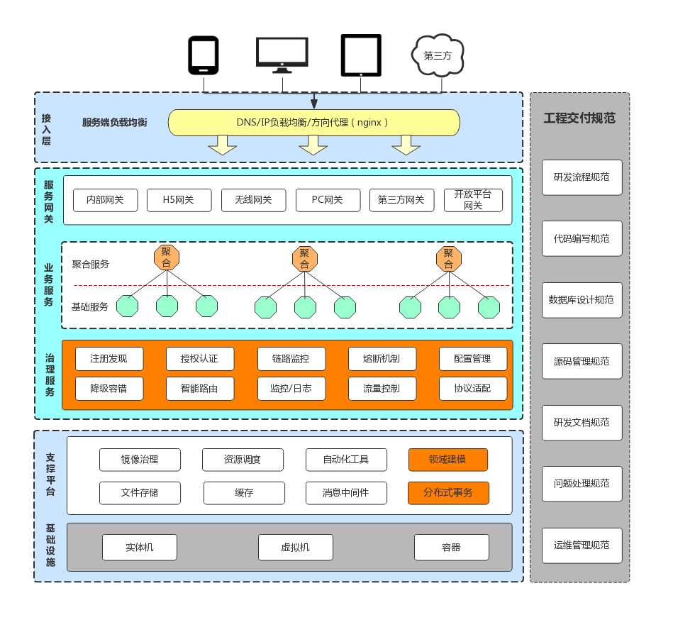
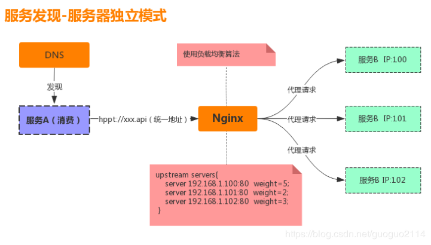
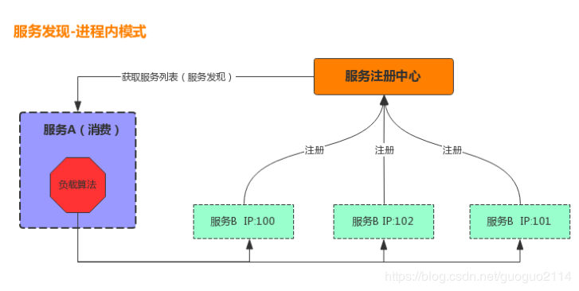

## 一、微服务概览与治理

> **康威定律**：

系统设计（产品结构）等同组织形式，每个设计系统的组织，其产生的设计等同于组织之间的沟通结构。

系统架构一个十分重要的职责就是：解决团队分工协助问题，系统架构体现了组织的沟通与协助方式。这正是康威定律所说的**“系统设计（产品结构）等同组织形式”**。

### 1、微服务概览

#### （1）定义

将一个单体应用拆分成一组微小的服务组件，每个微小的服务组件运行在自己的进程上，组件之间通过 Protobuf 或 Restful 这样的轻量级机制进行交互，这些服务以业务能力为核心，用自动化部署机制独立部署。

微服务是一种编程架构思想，有不同的语言实现。

#### （2）特点

- **服务小而美：**可以使用领域建模的方法来定义服务的粒度。
- **服务独立自治：**由独立的团队开发；可以使用不同的平台和语言；可独立部署，按需伸缩。
- **服务松散耦合：**业务边界清晰，运行在独立的容器中，符合软件设计的单一职责和最少依赖原则，将系统对代码或组件的依赖转换为对服务接口的依赖。
- **服务互联互通：**服务间通过互联互通组成复杂的业务功能，可根据具体场景选择通讯方式。
- **去中心化治理：**
  - 数据去中心化：每个服务独享自身的数据存储设施，有利于服务的独立性，隔离相关干扰。
  - 治理去中心化：没有一个集中的服务管理器，去全局热点。
  - 技术去中心化：每个服务根据业务场景选择合适的技术方案，也要避免过度多样化。

#### （3）问题与挑战

- 微服务应用（分布式架构）固有的复杂性（通信复杂性与不确定性）。
  - 服务调用方（消费者）怎样找到被调用方（提供者）？
  - 如果某个依赖服务挂了（网络异常、服务宕机）怎么办？
  - 服务接口需要暴露在网络上，接口的安全怎么保证？
  - 业务代码分散在各个进程中，统一处理逻辑（鉴权、日志等）写在哪？
  - 如果服务调用链层级太深，时间延迟怎么办？

- 使用 RPC 通信时，必须保证因网络等原因导致服务不可用的局部失效问题（降级）；微服务架构应采用粗粒度的进程间通信，不能多次循环 RPC 调用。
- 分布式数据库的数据一致性问题。
- 微服务构建、配置、测试的困难性。
- 对运维基础设施的要求高。


### 2、微服务设计

> 微服务技术生态



> 微服务要解决的问题：

- 客户端如何访问这些微服务？
- 每个微服务之间如何通信？
- 多个微服务，应如何实现？
- 如果服务出现宕机，该如何解决？

#### （1）服务网关

若有 N 个微服务，调用者就需要维护 N 个 IP 地址，当服务更新升级时，调用者就会非常麻烦。

服务网关就是微服务的入口，为服务调用者提供统一的访问地址与方式，为调用者封装了访问的细节，对调用者透明。因此所有访问的流量都会汇聚到这里，服务网关成了微服务的咽喉要塞，统一服务治理等相关操作可以在这里进行处理（**如：限流、监控、日志、动态路由、异常处理、灰度发布、鉴权认证**），也正是服务网关的重要性，服务网关有着举足轻重的地位。

> 常用的网关组件：Envoy。

#### （2）业务服务

**基础服务：**是根据业务功能进行拆分的一个独立服务组件或者公共服务，基础服务的粒度比较小，可认为是一个个的业务原子，每一个原子只关心自己的核心领域。

**聚合服务：**

- 聚合多个基础服务（BFF）构成更复杂的业务，比如一个复杂的查询需要用的多个基础服务。
- 适配不同的调用端，返回不同的数据，因为对于同一个业务在不同的调用端上需要的数据不一样，比如同样是商品信息 PC 端与 App 需要的数据肯定是不一样的，无论从页面大小，还是流量大小 App 端需要的数据更精简。

#### （3）服务调用

所有微服务都是独立部署，运行在自己的进程中容器中，所以微服务与微服务之间的通信就是进程间通信 IPC（Inter Process Communication），常见的有两大类：同步调用和异步消息调用。

- 同步调用：**PRC**（传输效率高，安全性可控，多用于内部系统之间的调用）；**HTTP**（易实现，跨客户端）。

- 异步消息调用：Kafka、Notify。

#### （4）服务治理

服务治理是微服务的关键，如果没有服务治理，微服务只是一个个业务独立的远程接口，不可能构成一个稳定、可用的线上生产系统。在上面提出的那些微服务问题与挑战，通过服务治理大部分问题也都可以解决，服务治理技术构成了微服务的核心组件，这些组件包括：

- **服务注册与发现：**解决服务之间互相找到与发现的问题，隔离服务之间的 IP 依赖，实现服务的状态监测与管理等。

- **配置中心：**用于管理集群中不同的环境（开发、测试、预生产、生产）配置信息，并实时动态推送配置更新到各个应用。

- **熔断机制：**解决服务调用链上的洪峰或异常情况，对问题进行必要的隔离，防止系统雪崩现象。

- **服务网关：**为外部调用提供统一的入口，为微服务提供横切的功能，如：鉴权、监控、限流等。

- **服务监控：**通过服务监控获取系统的健康数据。

#### （5）支撑平台

支撑平台为微服务的实施提供基础支撑，以脚手架的角色支撑着微服务的构建。

> 自动化部署

- CICD：Gitlab + Gitlab Hooks + k8s
- Testing：测试环境、单元测试、API 自动化测试（YAPI）
- 在线运行时：k8s、Prometheus（监控）、ELK（日志）、Conrtol Panle

#### （6）服务可用性设计

当系统由一系列的服务调用链组成的时候，我们必须确保任一环节的问题不至于影响整体链路。

- 隔离
- 重试
- 限流（令牌桶）
- 熔断
- 降级（本地缓存）
- 超时控制
- 负载均衡


## 二、服务网关（API Gateway）

### 1、什么是服务网关

```text
服务网关 = 路由转发 + 过滤器
```

- 路由转发：接收一切外界请求，转发到后端的微服务上去；

- 过滤器：在服务网关中可以完成一系列的横切功能，例如权限校验、限流、日志、监控等，这些都可以通过过滤器完成（其实路由转发也是通过过滤器实现的）。

> 网关具备的基本功能：
>

- 支持多种协议代理：tcp、http、websocket、grpc
- 支持多种负载均衡策略：随机，轮询，权重轮询，hash一致性轮询
- 支持下游的服务发现：主动探测、自动服务发现
- 支持横向扩展： 加机器就能解决高并发

> 借助网关处理高可用，高并发

- 限流：请求QPS限制
- 熔断：错误率达阈值则服务熔断
- 降级：确保核心业务可用
- 权限认证：请求拦截


## 三、GRPC

### 1、Protocol Buffers

>  Protocol Buffers 是 Google 用于序列化结构化数据的语言中立、平台中立、可扩展的机制。
>

#### （1）安装编译器（protoc）

下载地址：(https://github.com/protocolbuffers/protobuf/releases)

> Windows

- 下载：`protoc-3.20.3-win64.zip`

- 解压

- 配置环境变量
- 成功：

```
> protoc --version
libprotoc 3.19.0
```

#### （2）安装Go代码生成器插件（protoc-gen-go）

> 文档：https://pkg.go.dev/google.golang.org/protobuf

```
# 安装成功，会在 $GOPATH/bin/ 下生成 protoc-gen-go.exe
go get -u google.golang.org/protobuf/cmd/protoc-gen-go@latest
```

#### （3）Protobuf 语法

> 定义即文档。

```protobuf
// 声明 protobuf 版本，默认 v2
syntax = "proto3";

// 定义包名，类似命名空间
package proto;

/**
 * 为了生成 Go 代码，必须为每个 .proto 文件提供 Go 包的导入路径。
 * path：生成的 Go 文件的存放路径（自动创建目录）；
 * name：生成的 Go 文件所属的包名。
 */
option go_package = "path;name";

/**
 * 定义 message
 * 编译成：struct/class
 */
message Parent {
    /**
     * 声明字段
     * 格式：字段类型 字段名 = 字段唯一编号
     */
    bool bool_val = 1;
    float float_val = 2;
    double double_val = 3;
    int32 int32_val = 4;
    uint32 uint32_val = 5;
    uint64 uint64_val = 6;
    sint32 sint32_val = 7;
    sint64 sint64_val = 8;
    fixed32 fixed32_val = 9;
    fixed64 fixed64_val = 10;
    sfixed32 sfixed32_val = 11;
    sfixed64 sfixed64_val = 12;
    string string_val = 13;
    bytes bytes_val = 14;

    // 保留字段、标识
    reserved 16, 32, 100 to 200, 250 to max;
    // reserved "foo", "boo";

    // 定义切片
    repeated string array = 15;

    // 定义 map
    // map 不能是 repeated
    map <string, string> map_val = 17;

    /**
     * 枚举类型
     * 每个枚举类型的第一个值必须为 0
     * 枚举常量必须在32位整型值的范围内
     */
    enum DATA_TYPE {
        INT = 0;
        STRING = 1;
        BOOL = 2;
    }

    /**
     * 嵌套类型
     */
    // 定义
    message Child {
        int32 uid = 1;
        string name = 2;
    }
    // 使用
    repeated Child child = 18;

}

message Request {
    int32 uid = 1;
}

message Response {
    string result = 1;
}

/**
 * 定义服务
 * 服务而非对象，消息而非引用。
 */
service UserService {
    rpc GetUserInfo(Request) returns (Response) {};
}
```

> 数据类型对照

| Protobuf Type | Go Type | 默认值 | 说明                                                         |
| ------------- | ------- | ------ | ------------------------------------------------------------ |
| double        | float64 | 0      |                                                              |
| float         | float32 | 0      |                                                              |
| int32         | int32   | 0      | 使用可变长编码。对于负数的编码效率低下，如果你的字段可能有负值，请改用 sint32。 |
| int64         | int64   | 0      | 使用可变长编码。对于负数的编码效率低下，如果你的字段可能有负值，请改用 sint64。 |
| uint32        | uint32  | 0      | 使用可变长编码。                                             |
| uint64        | uint64  | 0      | 使用可变长编码。                                             |
| sint32        | int32   | 0      | 使用可变长编码。带符号的 int 值。比 int32 更高效地编码负数。 |
| sint64        | int64   | 0      | 使用可变长编码。带符号的 int 值。比 int32 更高效地编码负数。 |
| fixed32       | uint32  | 0      | 总是 4Byte。如果数值总大于 2^28，则比 uint32 更高效。        |
| fixed64       | uint64  | 0      | 总是 8Byte。如果数值总大于 2^56，则比 uint64 更高效。        |
| sfixed32      | int32   | 0      | 总是 4Byte。                                                 |
| sfixed64      | int64   | 0      | 总是 8Byte。                                                 |
| bool          | bool    | false  |                                                              |
| string        | string  | ""     | 字符串必须是 UTF-8 编码或者 7位 ASCII 编码的文本，并且不超过 2^32。 |
| bytes         | []byte  | []     | 可能包含不超过2^32 的任意字节序列。                          |
|               | const   | 0      | 枚举，默认是第一个定义的枚举值，必须为0。                    |
|               | struct  | {}     |                                                              |

#### （4）通过 proto 文件生成 pb 代码

> Protocol Buffers 工作流程：

- 创建 `.proto` 文件以定义数据结构；
- 使用 protoc 编译器生成 PB 代码；
- 用你的项目代码编译 PB 代码；
- 使用 PB 类序列化、共享、反序列化数据。

##### Step 1：创建 /pb/test.proto 文件

```protobuf
syntax = "proto3";

package pb;

option go_package = "./test";

message HelloRequest {
    string name = 1;
}

message HelloReply {
    string message = 1;
}

service Greeter {
    rpc SayHello (HelloRequest) returns (HelloReply) {};
}
```

##### Step 2：使用 protoc 编译器生成代码

```shell
# 解析 PROTO_FILES 并根据给定选项生成输出：
protoc [OPTION] PROTO_FILES
	
Options：
	--proto_path, -I	指定 .proto 解析 import 指令时的查找目录，默认当前目录。
						多次传递该选项可以指定多个导入目录。
	--plugin=EXECUTABLE 指定要使用的插件可执行文件。格式可以是 NAME=PATH。
	--go_out=DST_DIR	可以提供一个或多个输出路径
    --cpp_out
    --java_out
    --python_out
    --ruby_out
    --php_out
    ...

# 旧版
#protoc \
#	--plugin=protoc-gen-go=D:\GoProject\bin\protoc-gen-go.exe \
#	--go_out=plugins=grpc:. \
#	test.proto

# 生成 /pb/test/test.pb.go 文件
# 默认情况下，Go 代码生成器不会为服务生成输出。
# 如果启用 gRPC 插件，则会生成支持 gRPC 的代码。
protoc --go_out=. test.proto
```

> /pb/test/test.pb.go

```go
type HelloRequest struct {
	state         protoimpl.MessageState
	sizeCache     protoimpl.SizeCache
	unknownFields protoimpl.UnknownFields

	Name string `protobuf:"bytes,1,opt,name=name,proto3" json:"name,omitempty"`
}

type HelloReply struct {
	state         protoimpl.MessageState
	sizeCache     protoimpl.SizeCache
	unknownFields protoimpl.UnknownFields

	Message string `protobuf:"bytes,1,opt,name=message,proto3" json:"message,omitempty"`
}
```


### 2、gRPC

gRPC 是一个现代的、开源的远程过程调用 (RPC) 框架，可以在任何地方运行。它使客户端和服务器应用程序能够透明地通信，并使构建连接系统变得更加容易。 

gRPC 默认将 Protocol Buffers 用作其接口定义语言（IDL）和底层消息交换格式。 

从 .proto 文件中的服务定义开始，gRPC 提供了生成客户端和服务端代码的 ProtocolBuffers 编译器插件。gRPC 用户通常在客户端调用这些 API，并在服务端实现相应的 API。

#### （1）安装 gRPC 插件

- 安装 Go
- 安装 protoc 编译器

- 安装编译器的 grpc 插件

```
go get -u google.golang.org/grpc/cmd/protoc-gen-go-grpc
```

- 安装 gRPC 包

```
go get -u google.golang.org/grpc
```

#### （2）gRPC 定义服务的四种方法：

```
# 一元 RPC：客户端向服务器发送单个请求并获得响应，像正常函数调用一样。
rpc SayHello(HelloRequest) returns (HelloResponse);

# 服务器流式 RPC：客户端向服务器发送请求并获取流以读回一系列消息。
# 客户端从返回的流中读取，直到没有更多消息。gRPC 保证单个 RPC 调用中的消息顺序。
rpc LotsOfReplies(HelloRequest) returns (stream HelloResponse);

# 客户端流式 RPC：客户端以流的形式发送一系列消息到服务器，并等待响应。
# gRPC 保证单个 RPC 调用中的消息顺序。
rpc LotsOfGreetings(stream HelloRequest) returns (HelloResponse);

# 双向流式 RPC：双方使用读写流发送一系列消息，这两个流独立运行。
# 保留每个流中消息的顺序。
rpc BidiHello(stream HelloRequest) returns (stream HelloResponse);
```

#### （3）案例

> 项目结构

```
|—— hello/
	|—— client.go   // 客户端
	|—— server.go   // 服务端
|—— proto/
	|—— hello/
		|—— hello.pb.go			// 编译后的结构文件
		|—— hello.proto			// proto 描述文件
		|—— hello_grpc.pb.go	// 编译后的 gRPC 服务定义文件
```

##### Step 1：编写 hello.proto

```protobuf
syntax = "proto3";

package hello;

option go_package = ".;hello";

message HelloRequest {
    string name = 1;
}

message HelloResponse {
    string replay = 1;
}

service Hello {
    rpc SayHello(HelloRequest) returns(HelloResponse) {};
}
```

##### Step 2：编译生成 `hello.pb.go` 和 `hello_grpc.pb.go` 文件

```
protoc --go_out=. --go-grpc_out=. hello.proto
```

##### Step3：服务端实现接口并提供服务

```go
package main

import (
	"context"
	"google.golang.org/grpc"
	"log"
	"net"
	"test/proto/hello"
)

// 服务端：实现约定的接口
type helloService struct {
	hello.UnimplementedHelloServer
}

func (hs helloService) SayHello(ctx context.Context, request *hello.HelloRequest) (*hello.HelloResponse, error) {
	return &hello.HelloResponse{
		Replay: "Hello, " + request.Name,
	}, nil
}

func main() {
	// 监听地址
	Address := "127.0.0.1:7888"
	lis, err := net.Listen("tcp", Address)
	if err != nil {
		log.Fatalln("[Listen Error]", err)
	}
	log.Printf("Listen on %s ...\n", Address)

	// 创建 gRPC 服务
	gs := grpc.NewServer()

	// 向 gRPC 服务器注册本机的服务实现
	hello.RegisterHelloServer(gs, helloService{})

	// Serve() 提供服务
	// 接受 listen 监听的连接请求，为每个连接创建一个新的传输和 goroutine，然后调用已注册的服务来处理它们。
	// Serve() 返回时，将关闭 listen。
	err = gs.Serve(lis)
	if err != nil {
		log.Fatalln("[Serve Error]", err)
	}
}
```

##### Step 4：客户端调用

```go
package main

import (
	"context"
	"fmt"
	"google.golang.org/grpc"
	"google.golang.org/grpc/credentials/insecure"
	"log"
	"test/proto/hello"
	"time"
)

// 客户端初始化连接后直接调用 `hello_grpc.pb.go` 中实现的 SayHello()，
// 即可向服务端发起请求，就像调用本地方法一样。
func main() {
	// 连接 gRPC 服务端
	conn, err := grpc.Dial(":7888", grpc.WithTransportCredentials(insecure.NewCredentials()))
	if err != nil {
		log.Fatalln("[Dial Error]", err)
	}

	// 初始化客户端
	c := hello.NewHelloClient(conn)

	// 远程过程调用
	ctx, cancel := context.WithTimeout(context.Background(), time.Second)
	defer cancel()

	req := &hello.HelloRequest{Name: "Client"}
	resp, err := c.SayHello(ctx, req)
	if err != nil {
		log.Fatalln("[Call Error]", err)
	}

	fmt.Println(resp.Replay)
}
```

> 注意：grpc 的日志是环境变量控制的。

```
# 开启日志
export GRPC_GO_LOG_VERBOSITY_LEVEL=99
export GRPC_GO_LOG_SEVERITY_LEVEL=info
```

#### （4）认证 + 拦截器（middleware）

##### Step 1：生成 openssl 证书

> https://blog.csdn.net/m0_37322399/article/details/117308604

##### Step 2：server.go

```go 
package main

import (
	"context"
	"errors"
	"golang.org/x/net/trace"
	"google.golang.org/grpc"
	"google.golang.org/grpc/credentials"
	"google.golang.org/grpc/metadata"
	"log"
	"net"
	"net/http"
	"test/proto/hello"
)

// 服务端：实现约定的接口
type helloService struct {
	hello.UnimplementedHelloServer
}

func (hs helloService) SayHello(ctx context.Context, request *hello.HelloRequest) (*hello.HelloResponse, error) {
	return &hello.HelloResponse{
		Replay: "Hello, " + request.Name,
	}, nil
}

// 拦截器
func interceptor(ctx context.Context, req interface{}, info *grpc.UnaryServerInfo, handler grpc.UnaryHandler) (resp interface{}, err error) {
	// 解析 metadata 中的信息并验证
	md, ok := metadata.FromIncomingContext(ctx)
	if !ok {
		return nil, errors.New("无 Token 认证信息")
	}

	token := md["token"][0]

	// 解析 token
	if token != "101010" {
		return nil, errors.New(" Token 认证信息无效")
	}

	return handler(ctx, req)
}

func main() {
	// 监听地址
	Address := "127.0.0.1:7888"
	lis, err := net.Listen("tcp", Address)
	if err != nil {
		log.Fatalln("[Listen Error]", err)
	}
	log.Printf("Listen on %s with TLS...\n", Address)

	// TLS 认证
	creds, err := credentials.NewServerTLSFromFile("../key/server.pem", "../key/server.key")
	if err != nil {
		log.Fatalln("[TLS Error]", err)
	}

	// 拦截器（登录验证中间件）
	inter := grpc.UnaryInterceptor(interceptor)

	// 创建 gRPC 服务
	gs := grpc.NewServer(grpc.Creds(creds), inter)

	// 向 gRPC 服务器注册本机的服务实现
	hello.RegisterHelloServer(gs, helloService{})

	// 开启trace
	//go startTrace()

	// Serve() 提供服务
	// 接受 listen 监听的连接请求，为每个连接创建一个新的传输和 goroutine，然后调用已注册的服务来处理它们。
	// Serve() 返回时，将关闭 listen。
	err = gs.Serve(lis)
	if err != nil {
		log.Fatalln("[Serve Error]", err)
	}
}

func startTrace() {
	trace.AuthRequest = func(req *http.Request) (any, sensitive bool) {
		return true, true
	}
	go http.ListenAndServe(":7000", nil)
	log.Println("Trace listen on 7000")
}
```

##### Step 3：client.go

```go
package main

import (
	"context"
	"fmt"
	"google.golang.org/grpc"
	"google.golang.org/grpc/credentials"
	"google.golang.org/grpc/credentials/insecure"
	"log"
	"test/proto/hello"
	"time"
)

// OpenTLS 是否开启TLS认证
const OpenTLS = true

// customCredential 自定义认证
type customCredential struct{}

// GetRequestMetadata 实现自定义认证接口
func (c customCredential) GetRequestMetadata(ctx context.Context, uri ...string) (map[string]string, error) {
	return map[string]string{
		"token":  "101010",
	}, nil
}

// RequireTransportSecurity 自定义认证是否开启TLS
func (c customCredential) RequireTransportSecurity() bool {
	return OpenTLS
}

// 客户端初始化连接后直接调用 `hello_grpc.pb.go` 中实现的 SayHello()，
// 即可向服务端发起请求，就像调用本地方法一样。
func main() {
	var opts []grpc.DialOption

	if OpenTLS {
		// TLS 连接
		creds, err := credentials.NewClientTLSFromFile("../key/server.pem", "www.eline.com")
		if err != nil {
			log.Fatalln("[TLS Error]", err)
		}

		opts = append(opts, grpc.WithTransportCredentials(creds))
	} else {
		opts = append(opts, grpc.WithTransportCredentials(insecure.NewCredentials()))
	}

	// 使用自定义认证
	opts = append(opts, grpc.WithPerRPCCredentials(new(customCredential)))

	// 连接 gRPC 服务端
	conn, err := grpc.Dial(":7888", opts...)
	if err != nil {
		log.Fatalln("[Dial Error]", err)
	}

	// 初始化客户端
	c := hello.NewHelloClient(conn)

	// 远程过程调用
	ctx, cancel := context.WithTimeout(context.Background(), time.Second)
	defer cancel()

	req := &hello.HelloRequest{Name: "Client"}
	resp, err := c.SayHello(ctx, req)
	if err != nil {
		log.Fatalln("[Call Error]", err)
	}

	fmt.Println(resp.Replay)
}
```

#### （5）内置 Trace()


#### （6）HTTP 网关


## 四、服务注册与发现

### 1、为什么要使用服务注册与发现？

在微服务架构中，一般每个服务都是由多个拷贝来做负载均衡，一个服务随时可能下线，也可能增加新的节点。会出现如下问题：

- 服务之间如何感知？
- 服务如何管理？

服务注册与发现主要解决了如下两个重要问题：

- 屏蔽，解耦服务之间的依赖细节
- 对微服务进行动态管理

服务发现将服务 IP、端口等细节通过一个服务名抽象给调用者，并动态管理者各个微服务的状态检测、状态更新，服务上线、下线等，这些都是微服务治理的基础，包括负载均衡，链路跟踪。

> 服务注册与发现的两种实现：


#### （1）服务端模式

服务器端模式通过使用一个中间的服务器，来屏蔽被调用服务的复杂性与变动性，当有新的服务加入或老服务剔除时，只需要修改中间服务器上的配置即可，此模式的显著特点是：引入独立的中间代理服务器来屏蔽真实服务的具体细节。



优点：配置集中在独立的中间服务器端完成，对代码没有任何入侵，也不存在跨平台跨语言的问题。

缺点：中间服务器会成为一个单点，对性能也会有所影响。

#### （2）客户端模式（推荐）

> 微服务的核心是去中心化，推荐使用客户端发现模式。

客户端模式因为在进程内直接调用服务，也叫做进程内负载，由于不需要穿透中间服务器，少一次网络跳转，所以客户端模式的性能损耗比较小。但是，需要在服务内部维护服务注册信息，负载算法等，有一定的代码入侵性，对于跨平台，跨语言的支持不太友好。



优点：架构简单，拓展灵活，只对服务注册器依赖。

缺点：客户端需要维护所有调用服务的地址，有技术难度。

> 常用服务注册与发现技术：

- **Etcd**：高可用，分布式，强一致性。
- **Consul**：提供允许客户端注册和发现的 API，自行进行服务健康检查。
- **Zookeeper**：高性能的协调服务。

### 2、Consul

每个服务启动后，都向 consul 提交注册信息（IP、PORT、server_name）。

客户端向 consul 发起服务请求时，consul 返回可用的服务列表。

consul 特性：

- 服务发现
- 健康检查：定时检查所注册服务的状态。
- 键/值存储
- 多数据中心

> console 服务最好搭建三台及以上，每个服务的节点也最好搭建三台及以上（自动集群）。

#### （1）安装

官网：(https://www.consul.io/)

> Go 安装 consul 插件

```
go get -u github.com/hashicorp/consul/api
```

#### （2）常用命令

```
# 以 dev 模式启动 consul
.\consul.exe agent -dev

# 查看 consul 集群节点
consul members

# 查看当前 consul 的 IP 信息
consul info

# 关闭 consul
consul leave
```

agent 选项：

- -bind=0.0.0.0   指定 consul 所在机器的 IP 地址。
- -http-port=8500  web 访问的默认端口
- -client=127.0.0.1  可以访问 consul 的客户端，默认本机。
- -config-dir=foo  所有注册服务的描述信息
- -data-dir=path  存储所有注册过来的 srv 机器的详细信息
- -dev  开发者模式，以默认配置启动。
- -node=hostname  服务发现的名字。
- -rejoin  consul 启动时，加入到 consul 集群。
- -server 以服务方式开启 consul，允许其它 consul 连接（集群）；不加该选项表示以客户端方式启动，不能被连接。
- -ui  可以使用 web 页面查看服务发现详情。

> consul 服务启动后，在web查看服务发现详情：

```
http://127.0.0.1:8500/
```

#### （3）服务注册

> 以配置文件的方式注册：

```json
{
    "service": {
        "name": "User",
        "tags": ["student", "teacher"],
        "address": "192.168.8.66",
        "port": 9000
    },
    "check": {
        
    }
}
```

> Go 实现服务注册

```go
package main

import (
	"context"
	"fmt"
	"github.com/hashicorp/consul/api"
	"google.golang.org/grpc"
	"grpc/pb"
	"net"
)

type HelloServer struct {
}

func (s *HelloServer) Welcome(ctx context.Context, in *pb.In) (*pb.Out, error) {
	result := &pb.Out{Result: "hello " + in.Name}
	return result, nil
}

const PORT = 9001

func main() {
	// 初始化 consul 配置
	consulConf := api.DefaultConfig()

	// 创建 consul 客户端
	consulClient, err := api.NewClient(consulConf)
	if err != nil {
		fmt.Println("创建 consul 客户端出错：", err)
		return
	}

	// 整理注册信息
	registerServer := api.AgentServiceRegistration{
		ID:      fmt.Sprintf("%d", PORT),
		Name:    "User",
		Tags:    []string{"user"},
		Port:    PORT,
		Address: "127.0.0.1",
		Check: &api.AgentServiceCheck{
			CheckID:  "1",
			TCP:      "127.0.0.1:" + fmt.Sprintf("%d", PORT),
			Timeout:  "5s",
			Interval: "5s",
		},
	}

	// 向 consul 提交注册
	err = consulClient.Agent().ServiceRegister(&registerServer)
	if err != nil {
		fmt.Println("向 consul 注册服务出错：", err)
		return
	}

	/*************************** gRPC 服务 ****************************/
	// 监听端口
	listen, err := net.Listen("tcp", "127.0.0.1:"+fmt.Sprintf("%d", PORT))
	if err != nil {
		fmt.Println("监听出错：", err)
		return
	}

	fmt.Println("等待连接...")

	// 创建 grpc 服务
	grpcServer := grpc.NewServer()

	// 向 gRPC 服务器注册本机的服务实现
	pb.RegisterHelloServer(grpcServer, &HelloServer{})

	/**
	 * 接受 listen 监听的连接请求，为每个连接创建一个新的传输和 goroutine，然后调用已注册的服务来处理它们
	 * Serve() 返回时，将关闭 listen
	 */
	err = grpcServer.Serve(listen)
	if err != nil {
		fmt.Println("请求处理出错：", err)
		return
	}
}
```

#### （4）服务发现

```go
package main

import (
	"context"
	"fmt"
	"github.com/hashicorp/consul/api"
	"google.golang.org/grpc"
	"grpc/pb"
	"strconv"
)

func main() {
	// 初始化 consul 配置
	consulConf := api.DefaultConfig()

	// 创建 consul 客户端
	consulClient, err := api.NewClient(consulConf)
	if err != nil {
		fmt.Println("创建 consul 客户端出错：", err)
		return
	}

	/**
	 * 从 consul 上获取健康的服务
	 *
	 * @param service 服务名
	 * @param tag 标签名
	 * @param passingOnly 是否通过健康检查
	 * @param q 查询参数：nil
	 * @return ServiceEntry 存储服务的切片
	 * @return QueryMeta 额外查询返回值：nil
	 * @return error
	 */
	serviceEntry, _, err := consulClient.Health().Service("User", "user", true, nil)
	if err != nil {
		fmt.Println("从 consul 获取服务出错：", err)
		return
	}

	// 连接到 gRPC 服务
	target := serviceEntry[0].Service.Address + ":" + strconv.Itoa(serviceEntry[0].Service.Port)
	conn, err := grpc.Dial(target, grpc.WithInsecure())
	if err != nil {
		fmt.Println("客户端连接出错：", err)
		return
	}
	defer conn.Close()

	// 创建客户端
	client := pb.NewHelloClient(conn)

	// 调用远程服务
	out, err := client.Welcome(context.Background(), &pb.In{Name: "YCZ"})
	if err != nil {
		fmt.Println("客户端调用出错：", err)
	}

	fmt.Println(out.Result)
}
```

#### （5）服务注销

```go
package main

import (
	"fmt"
	"github.com/hashicorp/consul/api"
)

func main() {
	// 初始化 consul 配置
	consulConf := api.DefaultConfig()

	// 创建 consul 客户端
	client, err := api.NewClient(consulConf)
	if err != nil {
		fmt.Println("创建 consul 客户端出错：", err)
		return
	}

	// 服务注销
	err = client.Agent().ServiceDeregister("9001")
	if err != nil {
		fmt.Println("consul 服务注销出错：", err)
		return
	}
	
	fmt.Println("consul 服务注销成功")
}
```


## 五、服务监控与容错


## 六、服务部署


## 七、微服务框架 PK

| 框架      | 开源时间 | 官网                                                         | GitHub                               | 特点                                                         |
| --------- | -------- | ------------------------------------------------------------ | ------------------------------------ | ------------------------------------------------------------ |
| go-kit    | 2015     | https://gokit.io/                                            | https://github.com/go-kit/kit        | 从严格意义上来说，并不能做为一个微服务框架，而应该是一个微服务的工具集，其官方定义上也是这么说，提供各种选项让你自由选择。 |
| go-micro  | 2015     | -                                                            | https://github.com/go-micro/go-micro | 是一个轻量级的微服务框架，在当时那个市面上开源的微服务框架稀少的年代，它是为数不多的选择。主要槽点就是作者重心做云服务去啦，相应的社区维护力度较弱。 |
| go-zero   | 2020     | [https://go-zero.dev](https://link.zhihu.com/?target=https%3A//go-zero.dev) | https://github.com/zeromicro/go-zero | 整体上做为一个稍重的微服务框架，提供了微服务框架需要具备的通用能力，同时也只带一部分的强约束，例如针对 web 和 rpc 服务需要按照其定义的 DSL 的协议格式进行定义，日志配置、服务配置、apm 配置等都要按照框架定义的最佳实践来走。 |
| go-kratos | 2019     | [https://go-kratos.dev/](https://link.zhihu.com/?target=https%3A//go-kratos.dev/) | https://github.com/go-kratos/kratos  | 整体上做为一个轻量级的微服务框架，B站开源项目； web 和 rpc 服务的 DSL 协议直接采用 protobuf和 grpc 进行定义，采用 wire 做依赖注入、自动生成代码 。 框架定位于解决微服务的核心诉求。 |


## 十、Go-Kit


## 十五、Go-Micro

### 1、安装

（1）安装  Micro

下载地址：(https://github.com/micro/micro/releases)

将 micro.exe 移到 $GOPATH/bin 目录下。

```
# 命令安装方式
go get github.com/micro/micro/v3
```

（2）安装 go-micro

```
go get github.com/micro/go-micro/v3
```

（3）安装 protobuf 插件

```
# 安装成功，会在 $GOPATH/bin 下生成 protoc-gen-micro.exe
go get github.com/micro/micro/v3/cmd/protoc-gen-micro
```

### 2、micro 常用命令

```
micro new [options][arguments]	创建一个新的微服务

选项：
    --namespace "go.micro"	指定服务的命名空间（包名）
    --type "srv"			服务类型（Srv：微服务，Web，API）
    --fqdn					服务的正式完整定义
    --alias					别名
```

### 3、创建 go-micro

```
# 新建一个项目
micro new hello

cd hello

# 编译 protobuf 文件
protoc --proto_path=. --micro_out=. --go_out=:. proto/hello.proto
```


Broker：异步通信组件

Codec：数据编码组件

Registry：服务注册组件

Selector：客户端均衡器

Transport：同步通信组件

Wrapper：包装器

