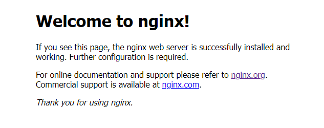

## 1、Instruction

Nginx 是一款高性能的 HTTP 服务器、反向代理服务器以及电子邮件（IMAP/POP3）代理服务器。

正向代理：就是当客户访问服务器资源时，用户知道自己想要请求的服务器是哪个，由用户发起请求，代理服务器去访问指定的网页，再由代理服务器将结果返回给用户。

反向代理：反向代理正好相反，用户请求某一资源时，用户并不清楚自己访问的是哪台服务器，只是将请求交给了反向代理服务器，这一切都由反向代理服务器去解决，最后用户只拿到自己想要的结果。

## 2、Install

### （1）下载安装

[官网下载](http://nginx.org/en/download.html)

````shell
# 安装依赖
yum -y install gcc
yum install -y pcre pcre-devel
yum install -y zlib zlib-devel
yum install -y openssl openssl-devel

# 下载
curl -O http://nginx.org/download/nginx-1.20.1.tar.gz
# 解压
tar -zxvf nginx-1.20.1.tar.gz
cd nginx-1.20.1

# 配置
# 会生成 Makefile 文件，否则无法编译
# --prefix 指定安装目录，默认 /usr/local/nginx
./configure --prefix=/usr/local/nginx

# 编译 & 安装
make && make install

# 配置环境变量
vi /etc/profile

```
# Nginx
export PATH=$PATH:/usr/local/nginx/sbin
```

# 环境变量立即生效
source /etc/profile

# 启动 Nginx
nginx
````

> 访问 `127.0.0.1:80` ：



注意：开启防火墙端口（否则无法访问）

```shell
# 开启防火墙端口
firewall-cmd --zone=public --add-port=80/tcp --permanent

# 查看防火墙端口列表
firewall-cmd --list-ports

# 重新加载配置
firewall-cmd --reload
```

### （2）Docker 安装

```
# 启动初始容器
docker run -d --name nginx -p 80:80 nginx

mkdir conf html

# 拿到初始数据
docker cp nginx:/etc/nginx/nginx.conf conf/
docker cp nginx:/etc/nginx/conf.d/default.conf conf/
docker cp nginx:/usr/share/nginx/html/ html/

# 停止初始容器
docker rm -rf nginx

# 启动数据容器
docker run --name nginx -d \
  --restart always \
  -p 80:80 \
  -v /data/docker-run/nginx/conf/nginx.conf:/etc/nginx/nginx.conf \
  -v /data/docker-run/nginx/html/:/usr/share/nginx/html/ \
  -v /data/docker-run/nginx/logs/:/var/log/nginx/ \
  nginx
```


### （3）目录结构

```shell
> tree /usr/local/nginx/
/usr/local/nginx/
├── client_body_temp
├── conf
│   ├── fastcgi.conf
│   ├── fastcgi.conf.default
│   ├── fastcgi_params
│   ├── fastcgi_params.default
│   ├── koi-utf
│   ├── koi-win
│   ├── mime.types
│   ├── mime.types.default
│   ├── nginx.conf               # nginx 配置文件
│   ├── nginx.conf.default
│   ├── scgi_params
│   ├── scgi_params.default
│   ├── uwsgi_params
│   ├── uwsgi_params.default
│   └── win-utf
├── fastcgi_temp
├── html
│   ├── 50x.html         # 服务不可用页面（50x）
│   └── index.html       # Welcome to nginx! 页面
├── logs
│   ├── access.log       # 访问日志
│   ├── error.log        # 错误日志
│   └── nginx.pid        # 进程 ID
├── proxy_temp
├── sbin
│   └── nginx            # nginx 可执行文件（主服务）
├── scgi_temp
└── uwsgi_temp
```

### （4）常用命令

```shell
# 强制关闭（立即停止）
nginx -s stop

# 请求结束后停止
nginx -s quit

# 重启加载配置文件
nginx -s reload

# 查看版本
nginx -v

# 检查配置文件正确性
nginx -t
```

### （5）添加到系统服务

> vi /etc/init.d/nginx

```shell
#!/bin/bash
# nginx Startup script for the Nginx HTTP Server
# it is v.0.0.2 version.
# chkconfig: - 85 15
# description: Nginx is a high-performance web and proxy server.
#              It has a lot of features, but it's not for everyone.
# processname: nginx
# pidfile: /usr/local/nginx/logs/nginx.pid
# config: /usr/local/nginx/conf/nginx.conf
nginxd=/usr/local/nginx/sbin/nginx
nginx_config=/usr/local/nginx/conf/nginx.conf
nginx_pid=/usr/local/nginx/logs/nginx.pid
RETVAL=0
prog="nginx"
# Source function library.
. /etc/rc.d/init.d/functions
# Source networking configuration.
. /etc/sysconfig/network
# Check that networking is up.
[ "${NETWORKING}" = "no" ] && exit 0
[ -x $nginxd ] || exit 0
# Start nginx daemons functions.
start() {
if [ -e $nginx_pid ];then
   echo "nginx already running...."
   exit 1
fi
   echo -n $"Starting $prog: "
   daemon $nginxd -c ${nginx_config}
   RETVAL=$?
   echo
   [ $RETVAL = 0 ] && touch /var/lock/subsys/nginx
   return $RETVAL
}
# Stop nginx daemons functions.
stop() {
        echo -n $"Stopping $prog: "
        killproc $nginxd
        RETVAL=$?
        echo
        [ $RETVAL = 0 ] && rm -f /var/lock/subsys/nginx /usr/local/nginx/logs/nginx.pid
}
# reload nginx service functions.
reload() {
    echo -n $"Reloading $prog: "
    #kill -HUP `cat ${nginx_pid}`
    killproc $nginxd -HUP
    RETVAL=$?
    echo
}
# See how we were called.
case "$1" in
start)
        start
        ;;
stop)
        stop
        ;;
reload)
        reload
        ;;
restart)
        stop
        start
        ;;
status)
        status $prog
        RETVAL=$?
        ;;
*)
        echo $"Usage: $prog {start|stop|restart|reload|status|help}"
        exit 1
esac
exit $RETVAL
```

> 设置权限
>

```
chmod 755 /etc/init.d/nginx
```

> 开机自启 
>

```sh
# 开机自启配置文件
> vi /etc/rc.local

`
/usr/local/nginx/sbin/nginx
`

# nginx 服务开机自启
chkconfig nginx on
```

> 管理 nginx 服务
>

```
systemctl status nginx
systemctl start nginx
systemctl stop nginx
systemctl reload nginx
systemctl restart nginx
```

## 3、配置文件结构

> 配置文件：/usr/local/nginx/conf/nginx.conf

Nginx 配置文件整体分为三部分：

```nginx
#【全局块】：Nginx 运行相关的全局配置
#user  nobody;
# 工作进程（一般设置为 CPU 核数）
worker_processes  1;

#error_log  logs/error.log;
#error_log  logs/error.log  notice;
#error_log  logs/error.log  info;

#pid        logs/nginx.pid;

# 【events 块】：网络连接的相关配置
# 配置 Nginx 进程与连接的特性
events {
    # 一个工作进程最大连接数 1024
    worker_connections  1024; 
}

# 【http 块】代理、缓存、日志、虚拟主机配置
http {
    include       mime.types;
    default_type  application/octet-stream;

    # 设置日志格式
    #log_format  main  '$remote_addr - $remote_user [$time_local] "$request" '
    #                  '$status $body_bytes_sent "$http_referer" '
    #                  '"$http_user_agent" "$http_x_forwarded_for"';

    # 设置日志路径
    #access_log  logs/access.log  main;

    sendfile        on;
    #tcp_nopush     on;

    #keepalive_timeout  0;
    keepalive_timeout  65;

    #gzip  on;

    # 【server 块】，一个 server 代表一个代理
    server {
        listen       80;         # 监听的端口
        server_name  localhost;  # 监听的地址

        #charset koi8-r;

        #access_log  logs/host.access.log  main;

        # 用于匹配 URL
        location / {
            root   html;                 # 网站根目录
            index  index.html index.htm; # 网站默认首页
        }

        #error_page  404              /404.html;

        # redirect server error pages to the static page /50x.html
        #
        error_page   500 502 503 504  /50x.html;
        location = /50x.html {
            root   html;
        }

        # proxy the PHP scripts to Apache listening on 127.0.0.1:80
        #
        #location ~ \.php$ {
        #    proxy_pass   http://127.0.0.1;
        #}

        # pass the PHP scripts to FastCGI server listening on 127.0.0.1:9000
        #
        #location ~ \.php$ {
        #    root           html;
        #    fastcgi_pass   127.0.0.1:9000;
        #    fastcgi_index  index.php;
        #    fastcgi_param  SCRIPT_FILENAME  /scripts$fastcgi_script_name;
        #    include        fastcgi_params;
        #}

        # deny access to .htaccess files, if Apache's document root
        # concurs with nginx's one
        #
        #location ~ /\.ht {
        #    deny  all;
        #}
    }


    # 虚拟主机配置
    # another virtual host using mix of IP-, name-, and port-based configuration
    #
    #server {
    #    listen       8000;
    #    listen       somename:8080;
    #    server_name  somename  alias  another.alias;

    #    location / {
    #        root   html;
    #        index  index.html index.htm;
    #    }
    #}
    
    # 基于 IP 的虚拟主机（需配置主机网卡）
    server {
        listen 80;
        server_name 139.9.103.139;

        location / {
            root html/virtual;
            index index.html;
        }
    }

    # 基于主机名的虚拟主机（需在客户端配置 hosts）
    server {
        listen 80;
        server_name ycz.com;

        location / {
            root html/virtual;
            index index.html;
        }
    }

    # 基于端口的虚拟主机
    server {
        listen 8080;
        server_name localhost;

        location / {
            root html/virtual;
            index index.html;
        }
    }


    # HTTPS server
    #
    #server {
    #    listen       443 ssl;
    #    server_name  localhost;

    #    ssl_certificate      cert.pem;
    #    ssl_certificate_key  cert.key;

    #    ssl_session_cache    shared:SSL:1m;
    #    ssl_session_timeout  5m;

    #    ssl_ciphers  HIGH:!aNULL:!MD5;
    #    ssl_prefer_server_ciphers  on;

    #    location / {
    #        root   html;
    #        index  index.html index.htm;
    #    }
    #}

}
```

### （1）日志格式参数

| 参数                  | 说明                               |
| --------------------- | ---------------------------------- |
| $remote_addr          | 代理服务器的 IP 地址               |
| $remote_user          | 用于记录远程客户端的用户名称       |
| $time_local           | 用于记录访问时间和时区             |
| $request              | 用于记录请求的 URL 以及请求方法    |
| $status               | 响应状态码                         |
| $body_bytes_sent      | 给客户端发送的文件主体内容字节数   |
| $http_referer         | 可以记录用户是从哪个链接访问过来的 |
| $http_user_agent      | 用户所使用的代理                   |
| $http_x_forwarded_for | 可以记录客户端 IP                  |

### （2）Nginx 日志分割

Nginx 的日志没有 rotate 功能，可以通过写一个 Nginx 日志切割脚本来自动切割日志文件。

```
> vi /usr/local/webserver/nginx/nginx_log.sh

`
#!/bin/bash

# 设置日志文件存放目录
LOG_HOME="/usr/local/nginx/logs/"

# 备份文件名称
LOG_PATH_BAK="$(date -d yesterday + %Y%m%d%H%M)".abc.access.log

# 重命名日志文件

mv ${LOG_HOME}/abc.access.log ${LOG_HOME}/${LOG_PATH_BAK}.log

# 向 Nginx 主进程发信号重新打开日志
kill -USR1 'cat /usr/local/nginx/logs/nginx.pid'
`
```

> 创建 crontab 设置作业
>

```
> crontab -e

*/5 * * * * sh /usr/local/nginx/nginx_log.sh

# 停止 crontab 定时任务执行
service crond stop
```


## 4、Nginx 应用场景

### （1）部署静态资源

Nginx 可以作为静态 web 服务器来部署静态资源。静态资源指在服务端真实存在并且能够直接展示的一些文件，比如常见的 html 页面、css 文件、 js 文件、图片、视频等资源。相对于 Tomcat，Nginx处理静态资源的能力更加高效，所以在生产环境下，一般都会 将静态资源部署到 Nginx 中。将静态资源部署到 Nginx 非常简单，只需要将文件复制到 Nginx 安装目录下的 html 目录中即可。

```shell
# 部署静态资源
vi /usr/local/nginx/conf/nginx.conf

`
http{
    server {
        listen       80;
        server_name  localhost;

        location / {
            root   html;                 # 静态资源的根目录
            index  index.html index.htm; # 静态资源首页
        }
    }
}
`

# 重启 Nginx
nginx -s reload
# or
systemctl reload nginx
```

### （2）反向代理

```shell
# 配置反向代理
vi /usr/local/nginx/conf/nginx.conf

`
server {
	listen      80;
	server_name localhost; 
	
	location / {
		proxy_pass http://192.168.138.101:8080; # 将请求转发到指定服务
	}
}
`

# 重启 Nginx
nginx -s reload
# or
systemctl reload nginx
```


### （3）负载均衡服务器

> 负载均衡算法

| 名称        | 说明                                                         |
| ----------- | ------------------------------------------------------------ |
| round robin | 默认方式，适用于后台机器性能一致的情况，根据服务是否可用自动增减列表。 |
| weight      | 权重方式                                                     |
| ip_hash     | 依据 IP 分配方式                                             |
| least_conn  | 依据最少连接方式                                             |
| url_hash    | 依据 URL 分配方式                                            |
| fair        | 依据响应时间方式                                             |

````shell
# 配置负载均衡
vi /usr/local/nginx/conf/nginx.conf

`
http {
    # 连接池，存放提供 web 服务的服务器地址
    # 轮询 round robin（默认）
    upstream <name> {  
        server 192.168.56.102:81;	# Web 服务器 1
        server 192.168.56.103:82;	# Web 服务器 2
    }
    
    # 权重 weight
    # upstream <name> {  
    #     server 192.168.56.102:81 weight=5;	# Web 服务器 1，权重 5/6（默认：1）
    #     server 192.168.56.103:82 weight=1;	# Web 服务器 2，权重 1/6（默认：1）
    # }
    
    # ip_hash
    # upstream <name> {  
    # 	ip_hash;
    #     server 192.168.56.102:81;	# Web 服务器 1
    #     server 192.168.56.103:82;	# Web 服务器 2
    # }
    
    # url_hash（第三方）
    # upstream <name> {
    #     server squid1:3128;
    #     server squid2:3128;
    #     hash $request_uri;
    #     hash_method crc32;
    # }
    
    # fair（第三方）
    # upstream <name> {
    #     server 192.168.56.102:81;	# Web 服务器 1
    #     server 192.168.56.103:82;	# Web 服务器 2
    #     fair;
    # }

    server {
        listen       80;
        server_name  localhost;

        location / {
            proxy_pass http://<name>;                     # 指定代理连接池
            proxy_set_header Host $http_host;             # 转发请求头信息
            proxy_set_header X-Forward-For $remote_addr;  # 转发请求IP地址
        }
        
        location = /50x.html {
            root   html;
        }
    }
}
`

# 重启 Nginx
nginx -s reload
# or
systemctl reload nginx
````

### （4）虚拟主机

```nginx
# 基于 IP 的虚拟主机（需配置主机网卡）
# - 访问地址：139.9.103.139
server {
    listen 80;
    server_name 139.9.103.139;
    
    location / {
        root html/virtual;
        index index.html;
    }
}

# 基于主机名的虚拟主机（需在客户端配置 hosts）
#  - 访问地址：yancz.com
server {
    listen 80;
    server_name yancz.com;
    
    location / {
        root html/virtual;
        index index.html;
    }
}

# 基于端口的虚拟主机
#  - 访问地址：yancz.com:8080
server {
    listen 8080;
    server_name yancz.com;
    
    location / {
        root html/virtual;
        index index.html;
    }
}
```

## 5、案例

> 目录结构

```
/usr/local/nginx/conf/
├── nginx.conf
├── nginx.conf.default
├── ...
├── vhost
│   ├── ssns.web.readline.cn.conf
│   └── ...
└── ...
```

> /usr/local/nginx/conf/nginx.conf

```nginx
#Specifies the value for maximum file descriptors that can be opened by this process.
worker_rlimit_nofile 51200;

events
    {
        use epoll;
        worker_connections 51200;
        multi_accept off;
        accept_mutex off;
    }

http
    {
        include       mime.types;
        default_type  application/octet-stream;

        server_names_hash_bucket_size 128;
        client_header_buffer_size 32k;
        large_client_header_buffers 4 32k;
        client_max_body_size 50m;

        sendfile on;
        sendfile_max_chunk 512k;
        tcp_nopush on;

        keepalive_timeout 60;

        tcp_nodelay on;

        fastcgi_connect_timeout 300;
        fastcgi_send_timeout 300;
        fastcgi_read_timeout 300;
        fastcgi_buffer_size 64k;
        fastcgi_buffers 4 64k;
        fastcgi_busy_buffers_size 128k;
        fastcgi_temp_file_write_size 256k;

        gzip on;
        gzip_min_length  1k;
        gzip_buffers     4 16k;
        gzip_http_version 1.1;
        gzip_comp_level 2;
        gzip_types     text/plain application/javascript application/x-javascript text/javascript text/css application/xml application/xml+rss;
        gzip_vary on;
        gzip_proxied   expired no-cache no-store private auth;
        gzip_disable   "MSIE [1-6]\.";

        #limit_conn_zone $binary_remote_addr zone=perip:10m;
        ##If enable limit_conn_zone,add "limit_conn perip 10;" to server section.

        server_tokens off;
        access_log off;

        # 包含拆分的配置文件
        include vhost/*.conf;
}
```

> /usr/local/nginx/conf/vhost/ssns.web.readline.cn.conf

```nginx
server {
        listen       80;
        server_name  ssns.web.readline.cn;
        root /data/wwwroot/ssns.szreadline.com/dist;
        index index.html index.htm;

        access_log /data/wwwlogs/ssns.web.readline.cn_nginx.log;
        error_page 404 /index.html;

        location / {
            try_files $uri $uri/ /index.html;
        }

        location /api {
            try_files /_not_exists_ @backend;
        }

        location @backend {
                proxy_set_header X-Forwarded-For $remote_addr;
                proxy_set_header Host            $http_host;

                proxy_connect_timeout           300;
                proxy_send_timeout              300;
                proxy_read_timeout              300;
                proxy_pass http://127.0.0.1:9450;
        }
}
```

