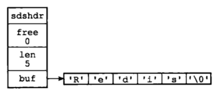
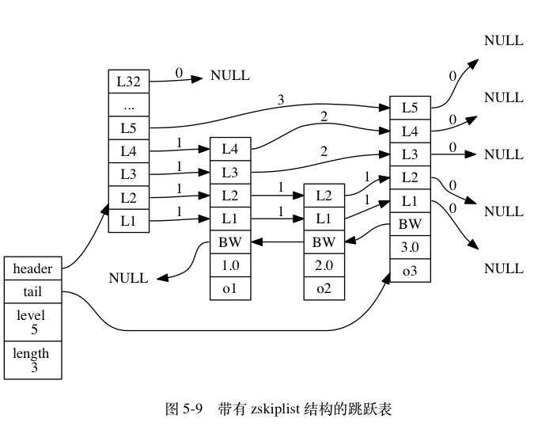
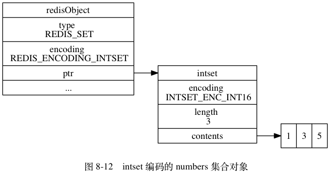
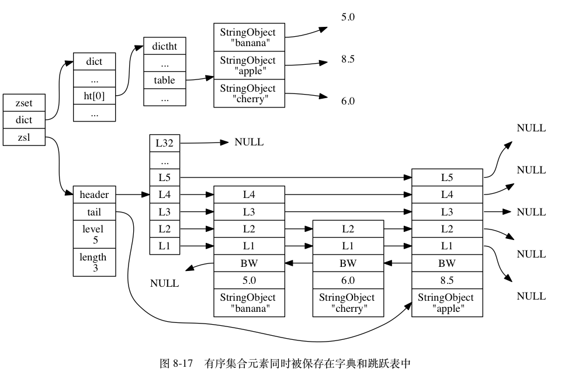

## 一、安装与配置

### 1、简介

官网：https://redis.io/

Redis 版本：6.2

Redis 是高性能的 key/value 型内存数据库。读的速度是110000次/s，写的速度是81000次/s 。

Redis 集群是 AP 型，保证服务高可用，而忽略了数据一致性。

ZooKeeper 集群是 CP 型，强数据一致性。

### 2、Install & Deploy

> 需要 gcc

```
gcc -v

yum install gcc-c++
```

> 下载 Redis 安装包

```
curl -O https://download.redis.io/releases/redis-6.2.6.tar.gz
```

> 解压

```
tar -zxvf redis-6.2.6.tar.gz
```

> 编译 & 安装

```
cd redis-6.2.6

make

make PREFIX=/usr/local/redis install
```

安装完成后，会在生成 /usr/local/redis/bin 目录。

- redis-server：Redis服务器
- redis-cli：Redis命令行客户端
- redis-benchmark：Redis性能测试工具
- redis-check-aof：AOF文件修复工具
- redis-check-rdb：RDB文件检查工具
- redis-sentinel：Redis 哨兵

> 将安装包中的 redis 配置文件复制到 /etc/redis/ 目录下

```ini
# Redis 主配置文件
cp redis.conf /etc/redis/redis.conf

# Redis 哨兵配置文件
cp sentinel.conf /etc/redis/sentinel.conf
```

>  启动 Redis

```ini
# 启动 Redis 服务
# 带上配置文件可以在同一台机上启动多个Redis服务 （配置不同端口）
/usr/local/redis/bin/redis-server /etc/redis/redis.conf

# 启动 Redis 客户端
/usr/local/redis/bin/redis-cli

# 关闭 Redis 服务
/usr/local/redis/bin/redis-cli shutdown
```

> 配置环境变量

```ini
vi /etc/profile

# 配置
export REDIS_HOME=/usr/local/redis
export PATH=$PATH:$REDIS_HOME/bin

# 立即生效
source /etc/profile

# 方便的命令
redis-server /etc/redis/redis.conf
redis-cli
```

### 3、Redis 常用命令

```ini
# 连接到本地 Redis 服务
$ redis-cli

# 连接到远程 Redis 服务
$ redis-cli -h host -p port -a requirepass

# Redis 客户端关闭连接
> shutdown

# 退出客户端
> quit

# 查看 Redis 信息
> info

# 查看密码
> config get requirepass

# 设置密码（本次连接有效）
> config set requirepass <password>

# 密码验证
> auth <requirepass>

# 将 Redis 的执行结果-写入文件
redis-cli -h 127.0.0.1 -p 6379 -a ycz keys '*' >keys.txt 
```

### 4、远程访问

① 注释绑定 IP 并设置密码

```
# 127.0.0.1 只能接受本机的访问请求
# bind 127.0.0.1 ::1

# 设置密码
requirepass ycz
```

② 关闭保护模式

```
# 如果开启了 protected-mode yes
# 在没有设定bind IP，且没有密码的情况下，Redis只允许接受本机的响应
protected-mode no
```

> 开放端口 6379

```
firewall-cmd --zone=public --add-port=6379/tcp --permanent
firewall-cmd --reload
firewall-cmd --list-ports
```


## 二、数据类型


### 1、字符串（Strings）

> string 是 Redis 最基本的类型，是二进制安全的。string 类型最大能存储 512MB 的值。

使用场景：

- 单值缓存
- 计数：incrby
- 限制登录校验次数
- 分布式锁


### 2、列表（Lists）

> list 是简单的 string 列表，按插入顺序排序，最多可以包含 2^32 - 1 个元素 。
>
> 特点：有序、可以重复。

使用场景：

- 栈：lpush + lpop
- 队列：lpush + rpop
- 有限集合：lpush + ltrim
- 消息队列（阻塞）：lpush + brpop


### 3、哈希（Hashes）

> hash 是一个 string 类型的 key => value 映射表，hash 特别适合用于存储对象。查询的时间复杂度是 O(1) 。每个 hash 可以存储 （2^32 - 1） 个键值对。

使用场景：

- 对象缓存
- 购物车

底层数据结构：

- hashtable
- ziplist

 

### 4、集合（Sets）

> set 是 string 类型的无序集合。集合成员是唯一的（自动去重）。
>
> 数据结构：哈希表， 所以添加，删除，查找的复杂度都是 O(1)。 
>
> 特点：无序、不可重复。

使用场景：

- 社交关系网（关注模型）：利用集合的交并集特性，比如在社交领域，我们可以很方便的求出多个用户的共同好友，共同感兴趣的领域等。
- 抽奖：SADD（参与抽奖）、SMEMBERS（查看参与者）、SRANDMEMBER/SPOP（开奖）

- 点赞、收藏、标签


### 5、有序集合（Zset）

> zset 也是 string 类型元素的集合，也不允许有重复元素。
>
> zset 的每个元素都会关联一个 double 类型的评分（score）用来排序，分数可以重复。
>
> 特点：有序、不可重复。

**使用场景：**

- 社交关系图（关注模型）

- 点赞、收藏、标签

- 排行榜


### 6、位图（Bitmaps）


### 7、超级日志（HyperLogLog）


### 8、地理空间索引（Geospatial Index）


### 9、流（Streams）


## 三、数据结构

>  `OBJECT ENCODING key` 该命令可以查看各数据类型的底层数据结构。

### 1、简单动态字符串（SDS）

  

```c
/* sds.h */
struct sdshdr {
    
    // buf 中已占用空间的长度
    int len;

    // buf 中剩余可用空间的长度
    int free;

    // 数据空间
    char buf[];
};
```

用途：

除了用来保存数据库中的字符串值之外，SDS 还被用作缓冲区（buffer）：AOF 模块中的 AOF 缓冲区，以及客户端状态中的输入缓冲区。

优点：

- 获取字符串长度的时间复杂度为 O(1)；
- 杜绝缓冲区溢出（空间预分配）；
- 减少修改字符串的内存重新分配次数（空间预分配、惰性空间释放）；
- 二进制安全（不以`\0`作为字符串的结尾，而是以 len 读取实际长度）；
- 兼容部分 C 字符串函数（ 遵循 C 字符串以 `\0` 结尾的惯例 ）；


### 2、链表（LinkedList）

> 双端链表节点

```c
/* adlist.h */

/*
 * 双端链表节点
 */
typedef struct listNode {

    // 前置节点
    struct listNode *prev;

    // 后置节点
    struct listNode *next;

    // 节点的值
    void *value;

} listNode;

/*
 * 双端链表结构
 */
typedef struct list {

    // 表头节点
    listNode *head;

    // 表尾节点
    listNode *tail;

    // 节点值复制函数
    void *(*dup)(void *ptr);

    // 节点值释放函数
    void (*free)(void *ptr);

    // 节点值对比函数
    int (*match)(void *ptr, void *key);

    // 链表所包含的节点数量
    unsigned long len;

} list;
```

> 数据结构

 


### 3、字典（HT）

> Redis 的字典使用哈希表作为底层实现， 一个哈希表里面可以有多个哈希表节点，而每个哈希表节点就保存了字典中的一个键值对。 
>
> 每个字典都使用两个哈希表，一般情况下，字典只使用 ht[0] 哈希表，ht[1] 哈希表只会在对 ht[0] 哈希表进行 rehash 时使用，从而实现渐进式 rehash。
>
> 用链地址法解决哈希键冲突：将新节点添加到链表的表头位置 。
>
>  在渐进式 rehash 进行期间， 字典的删除（delete）、查找（find）、更新（update）等操作会在两个哈希表上进行； 新添加到字典的键值对一律会被保存到 `ht[1]` 里面 。

（1）哈希表节点

```c
/* dict.h */

/*
 * 哈希表节点
 */
typedef struct dictEntry {

    // 键
    void *key;

    // 值
    union {
        void *val;
        uint64_t u64;
        int64_t s64;
    } v;

    // 指向下个哈希表节点，形成链表（解决哈希冲突）
    struct dictEntry *next;

} dictEntry;

/*
 * 哈希表
 *
 * 每个字典都使用两个哈希表，从而实现渐进式 rehash 。
 */
typedef struct dictht {

    // 哈希表数组
    dictEntry **table;

    // 哈希表大小 | table 数组的大小
    unsigned long size;

    // 哈希表大小掩码，用于计算索引值
    // 总是等于 size - 1
    unsigned long sizemask;

    // 该哈希表已有节点的数量
    unsigned long used;

} dictht;

/*
 * 字典
 */
typedef struct dict {

    // 类型特定函数
    dictType *type;

    // 私有数据
    void *privdata;

    // 哈希表，2个
    dictht ht[2];

    // rehash 索引
    // 当 rehash 不在进行时，值为 -1
    // 当 rehash 正在进行时，值 >= 0
    int rehashidx;

    // 目前正在运行的安全迭代器的数量
    int iterators; 

} dict;
```

> 数据结构


### 4、跳表（SkipList）

> 数组：查找快，插入、删除慢，需要移动大量元素。
>
> 链表：插入、删除快，查找慢。
>
> 跳表：为有序链表添加 “索引”（空间换时间），达到折半查找的效果，可以快速的插入、删除、查找。

```c
/* redis.h */

/*
 * 跳跃表节点
 */
typedef struct zskiplistNode {

    // 成员对象
    robj *obj;

    // 分值
    double score;

    // 后退指针
    struct zskiplistNode *backward;

    // 层
    struct zskiplistLevel {

        // 前进指针
        struct zskiplistNode *forward;

        // 跨度
        unsigned int span;

    } level[];

} zskiplistNode;

/*
 * 跳跃表
 */
typedef struct zskiplist {

    // 表头节点和表尾节点
    struct zskiplistNode *header, *tail;

    // 表中节点的数量
    unsigned long length;

    // 表中层数最大的节点的层数
    int level;

} zskiplist;
```

> 层

创建新的跳跃表节点时，根据幂次定律随机生成一个介于 1 和 32 之间的值作为 level 数组的大小，即层高。

> 前进指针

每个层都有一个指向表尾方向的前进指针，用于从表头向表尾方向遍历节点。

> 跨度

层的跨度记录了两个节点之间的距离， 用于计算排位（rank）。

> 后退指针

 用于从表尾向表头方向遍历节点 。

> 分值和成员

 分数：double 型，跳跃表中的所有节点都按分值从小到大来排序。 

成员：指向字符串对象的指针。

> 数据结构

 


### 5、整数集合（IntSet）

> 整数集合（intset）是 Redis 用于保存整数值的集合抽象数据结构，它可以保存类型为 int16_t、int32_t、int64_t 的整数值， 并且保证集合中不会出现重复元素。 

```c
/* intset.h */

typedef struct intset {
    
    // 编码方式
    uint32_t encoding;

    // 集合包含的元素数量
    uint32_t length;

    // 保存元素的数组
    // 按照从小到大的顺序排列，并且不包含任何重复项
    int8_t contents[];

} intset;
```

  


### 6、压缩列表（ZipList）


| 属性      | 类型       | 长度     | 用途                                                         |
| :-------: | :--------: | :------: | :----------------------------------------------------------- |
| zlbytes | uint32_t | 4 字节 | 记录整个压缩列表占用的内存字节数：在对压缩列表进行内存重分配，或者计算 zlend 的位置时使用。 |
| zltail  | uint32_t | 4 字节 | 记录压缩列表表尾节点距离压缩列表的起始地址有多少字节：通过这个偏移量，程序无须遍历整个压缩列表就可以确定表尾节点的地址。 |
| zllen   | uint16_t | 2 字节 | 记录了压缩列表包含的节点数量：当这个属性的值小于 UINT16_MAX （65535）时，这个属性的值就是压缩列表包含节点的数量；当这个值等于 UINT16_MAX 时，节点的真实数量需要遍历整个压缩列表才能计算得出。 |
| entryX  | 列表节点   | 不定     | 压缩列表包含的各个节点，节点的长度由节点保存的内容决定。     |
| zlend   | uint8_t  | 1 字节 | 特殊值 `0xFF` （十进制 255 ），用于标记压缩列表的末端。  |


## 四、对象

### 1、Redis 对象

Redis 使用对象来表示数据库中的键和值，每次在 Redis 的数据库中创建一个键值对时，至少会创建两个对象，一个是键对象，另一个是值对象。而 Redis 中的每个对象都是由 redisObject 结构来表示：

```c
/* redis.h */

typedef struct redisObject {

    // 类型
    unsigned type:4;

    // 编码
    unsigned encoding:4;

    // 对象最后一次被访问的时间
    unsigned lru:REDIS_LRU_BITS; 

    // 引用计数（内存回收机制、对象共享机制）
    int refcount;

    // 指向实际值的指针
    void *ptr;

} robj;
```

> RedisObject 数据结构


> 类型（type）

| 对象         | 类型         | 输出   |
| ------------ | ------------ | ------ |
| 字符串对象   | REDIS_STRING | string |
| 列表对象     | REDIS_LIST   | list   |
| 哈希对象     | REDIS_HASH   | hash   |
| 集合对象     | REDIS_SET    | set    |
| 有序集合对象 | REDIS_ZSET   | zset   |

> 编码（encoding）

| 类型         | 编码                      | 底层数据结构                | 用途                                                 |
| :----------- | :------------------------ | --------------------------- | ---------------------------------------------------- |
| REDIS_STRING | REDIS_ENCODING_INT        | long 类型的整数             | 字符串：整数型的字符串对象                           |
| REDIS_STRING | REDIS_ENCODING_EMBSTR     | embstr 编码的简单动态字符串 | 字符串：保存 44 字节以内的字符串对象                 |
| REDIS_STRING | REDIS_ENCODING_RAW        | 简单动态字符串              | 字符串：保存大于 44 字节或超过 long 范围的字符串对象 |
| REDIS_LIST   | REDIS_ENCODING_ZIPLIST    | 压缩链表                    |                                                      |
| REDIS_LIST   | REDIS_ENCODING_LINKEDLIST | 双端链表                    | 列表定制                                             |
| REDIS_HASH   | REDIS_ENCODING_ZIPLIST    | 压缩链表                    |                                                      |
| REDIS_HASH   | REDIS_ENCODING_HT         | 字典                        |                                                      |
| REDIS_SET    | REDIS_ENCODING_INTSET     | 整数集合                    | INTSET的特性：按数字排序                             |
| REDIS_SET    | REDIS_ENCODING_HT         | 字典                        | 字典的特性：无序、不可重复                           |
| REDIS_ZSET   | REDIS_ENCODING_ZIPLIST    | 压缩链表                    |                                                      |
| REDIS_ZSET   | REDIS_ENCODING_SKIPLIST   | 跳跃表和字典                | 有序集合定制                                         |

> 内存回收机制

- 在创建一个新对象时， 引用计数的值会被初始化为 1；
- 当对象的引用计数值变为 0 时， 对象所占用的内存会被释放。

> 对象共享机制

- Redis 会在初始化服务器时， 创建一万个字符串对象， 这些对象包含了从 `0 -9999` 的所有整数值，当服务器需要用到值为 `0 -9999` 的字符串对象时， 服务器就会使用这些共享对象（refcount 起始值为 2），而不是新创建对象。 
-  Redis 不共享包含字符串的对象。

注： `OBJECT REFCOUNT key` 查看引用计数。

> LRU 空闲时间

在数据淘汰策略中，优先淘汰空闲时间长的键。

注： `OBJECT IDLETIME key` 查看空闲时间。


### 2、字符串对象

> 字符串对象的编码可以是 int、raw、embstr。

- int 编码

如果一个整数值可以用 long 类型表示，那么字符串对象会将整数值存储在 ptr 中（将 long 转换成 void*）。

int 编码能存储的整数值范围：[ -2^63 , 2^63 - 1]


- embstr 编码

如果字符串的长度小于 44 字节，那么字符串对象将使用 embstr 编码的方式来保存这个字符串。embstr 编码是专门用于保存短字符串的一种优化编码方式。 

优点：

内存分配和释放次数都只需一次。

能够更好的利用缓存带来的优势（缓存行：64 字节）。


- raw 编码

如果字符串的长度大于 44 字节，那么字符串对象将使用一个简单动态字符串（SDS）来保存这个字符串值。

  

- embstr 与 raw 的区别
  - embstr 编码则通过调用一次内存分配函数来分配一块连续的空间， 空间中依次包含 redisObject 和 sdshdr 两个结构。
  - raw 编码会调用两次内存分配函数来分别创建 redisObject 结构和 sdshdr 结构。

- 编码的转换
  - 当 int 编码保存的值不再是整数，或大小超过了 long 的范围时，自动转化为 raw。
  - 对于 embstr 编码，由于 Redis 没有对其编写任何的修改程序（embstr 是只读的），在对 embstr 对象进行修改时，都会先转化为 raw 再进行修改，因此，只要是修改 embstr 对象，修改后的对象一定是 raw 的，无论是否达到了 44 个字节。


### 3、列表对象

> 列表对象的编码可以是 ziplist 或者 linkedlist 。

- ziplist 编码

  

- linkedlist 编码

 

- 编码转换

当同时满足下面两个条件时，使用ziplist（压缩列表）编码：

1、列表保存元素个数小于512个

2、每个元素长度小于64字节

不能满足这两个条件的时候使用 linkedlist 编码。

```ini
# 相关配置
list-max-ziplist-entries 512
list-max-ziplist-value 64
```


### 4、哈希对象

>  哈希对象的编码可以是 ziplist 或者 hashtable。 

- ziplist 编码


- hashtable 编码

  

- 编码转换

当哈希对象可以同时满足以下两个条件时， 哈希对象使用 ziplist 编码：

1、哈希对象保存的所有键值对的键和值的字符串长度都小于 64 字节；

2、哈希对象保存的键值对数量小于 512 个；

不能满足这两个条件的哈希对象需要使用 hashtable 编码。

```ini
# 相关配置
hash-max-ziplist-entries 512
hash-max-ziplist-value 64
```


### 5、集合对象

> 集合对象的编码可以是 intset 或者 hashtable。

- intset 编码

  

- hashtable 编码

  

- 编码转换

当集合对象可以同时满足以下两个条件时， 对象使用 intset 编码：

1. 集合对象保存的所有元素都是整数值；
2. 集合对象保存的元素数量不超过 512 个；

不能满足这两个条件的集合对象需要使用 hashtable 编码。

```ini
# 相关配置
set-max-intset-entries 512
```


### 6、有序集合对象

> 有序集合的编码可以是 ziplist 或者 skiplist 。

- ziplist 编码


- skiplist 编码

> skiplist 编码的有序集合对象使用 zset 结构作为底层实现，一个 zset 结构同时包含一个字典和一个跳跃表。

```c
typedef struct zset {

    // 快速的范围查询
    zskiplist *zsl;

    // 成员 => 分数 
    // 查找给定成员的分值，复杂度为：O(1)
    dict *dict;

} zset;
```

  

- 编码转换

当有序集合对象可以同时满足以下两个条件时， 对象使用 ziplist 编码：
1、有序集合保存的元素数量小于 128 个；
2、有序集合保存的所有元素成员的长度都小于 64 字节；
不能满足以上两个条件的有序集合对象将使用 skiplist 编码。

```ini
# 相关配置
zset-max-ziplist-entries 128
zset-max-ziplist-value 64
```


## 五、数据库

### 1、设置 Redis 键过期时间

```
expire
expireat
pexpire
pexpireat
```

### 2、Redis 过期时间的判定

在 Redis 内部，每当我们设置一个键的过期时间时，Redis 就会将该键带上过期时间存放到一个过期字典中。当我们查询一个键时，Redis 便首先检查该键是否存在过期字典中，如果存在，那就获取其过期时间。然后将过期时间和当前系统时间进行对比。

### 3、过期键删除策略

- 定时删除：占用 CPU 时间
- 惰性删除：占用 CPU 内存
- 定期删除：删除执行时长和频率难拿捏

### 4、Redis 过期键删除策略

- 惰性删除 + 定期删除

```
# 定期删除函数的运行频率
hz 10
```

### 5、内存淘汰策略

```
# Redis 使用的最大内存，不设置表示无限
maxmemory <bytes>

# 设置内存淘汰方式
# maxmemory-policy noeviction

# 选项
# volatile-lru 利用LRU算法移除设置过过期时间的key（LRU：最近使用 Least Recently Used）。
# allkeys-lru 利用LRU算法移除任何key（和上一个相比，删除的key包括设置过期时间和不设置过期时间的）。通常使用该方式。
# volatile-random 移除设置过过期时间的随机key 。
# allkeys-random  无差别的随机移除。
# volatile-ttl   移除即将过期的key(minor TTL) 
# noeviction 不移除任何key，只是返回一个写错误 ，默认选项，一般不会选用。
```

### 6、主从复制删除策略

当主服务器删除一个过期键后，会向所有从服务器发送一条 DEL 命令，从服务器只有收到 DEL 命令才会删除过期键，否则不处理。

### 7、数据库通知

```
# 配置
notify-keyspace-events ""

# 订阅
SUBSCRIBE __keyspace@0__:message

SUBSCRIBE __keyevent@0__:del
```


## 六、持久化

### 1、RDB（半持久化模式）

> 通过保存数据库中的键值对来记录数据库的状态。
>
> 不定期的通过异步方式保存 数据快照 到磁盘上。
>
> RDB 有两种触发方式，分别是自动触发和手动触发。 

#### （1）自动触发

> **RDB 持久化配置**
>
> 在 redis.conf 配置文件中，配置 SNAPSHOTTING 信息。

```ini
# 满足以下三个条件中的任意一个，BGSAVE 命令就会被执行
# 在 900 秒内，至少有 1 次修改
# 在 300 秒内，至少有 10 次修改
# 在 60 秒内，至少有 10000 次修改
save 900 1		
save 300 10		
save 60 10000	

# 当启用了RDB且最后一次后台保存数据失败，Redis是否停止接收数据。
stop-writes-on-bgsave-error yes

# 对于存储到磁盘中的快照，可以设置是否进行压缩存储（LZF压缩算法：http://liblzf.plan9.de）
# 字符串长度小于20字节，原样保存，字符串长度大于20字节，压缩后保存。
rdbcompression yes

# 是否使用CRC64算法来进行数据校验
rdbchecksum yes

# 设置快照的文件名
dbfilename dump.rdb

# 设置快照文件的存放路径
dir ./
```

> 核心代码

```c
# redis.h
struct RedisServer {
    
    // 记录 save 条件的数组
    struct saveparam *saveparams;
    
    // 修改计数器
    long long dirty;
    
    // 上次执行 save 的时间戳
    time_t lastsave;
    
    // ...
}

struct saveparam {
    // 秒数
    time_t seconds;
    
    // 修改数
    int changes;
}
```

> serverCron() 默认每隔 100ms 定时检查 save 条件是否满足。

#### （2）手动触发

> **save**
>
> 会阻塞当前 Redis 服务，直到 RDB 完成为止，线上不建议使用。

```
> save
```

> **bgsave**（后台异步执行）
>
> Redis 进程 fork 出子进程（Copy On Write），再由子进程完成持久化工作，这样就可以极大的避免主进程执行 IO 操作。
>
> Copy On Write：fork 子进程时，父子进程共享内存空间，将拷贝内存推迟到写操作真正发生时，避免了大量无意义的拷贝操作（内存占用及性能消耗）。

```
> bgsave
```

① 在 BGSAVE 命令执行期间，客户端发送的 SAVE、BGSAVE 命令都会被服务器拒绝，防止产生竞争。

② 在 BGSAVE 命令执行期间，客户端发送的 BGREWRITEAOF 命令会被延迟。而在 BGREWRITEAOF 文件执行期间，客户端发送的 BGSAVE 命令会被服务器拒绝。

#### （3）恢复数据

将 RDB 文件（dump.rdb）移动到 redis 安装目录并启动服务即可，redis就会自动加载文件数据至内存了。Redis 服务器在载入 RDB 文件期间，会一直处于阻塞状态，直到载入工作完成为止。 

> RDB 文件的过期键载入

主服务器：过期键不会载入；

从服务器：所有键都载入。

#### （4）RDB的优缺点

① RDB 文件紧凑，非常适用于备份、全量复制、灾难恢复等场景。

② 由子进程处理保存工作，主进程不需要进行任何磁盘 IO 操作。

③ RDB 在恢复大数据集时的速度比 AOF 快。

① 保存了某个时间点上的数据集，不适合实时持久化。

② 由于 Redis 版本问题导致 RDB 文件不兼容。

③ 备份时有时间间隔，所以可能存在数据丢失。

#### （5）分析 RDB 文件

```
od -cx dump.rdb
```


### 2、AOF（全持久化模式）

> 通过保存 Redis 服务器所执行的写命令来记录数据库的状态。
>
> 把每一次数据变化都写入到一个 append only file 里面。以独立日志的方式记录每次 `写` 命令（读不会记录），重启时再重新执行 AOF 文件中的命令，达到恢复数据的目的。
>
> AOF 文件中的所有命令都以 Redis 命令请求协议的格式保存。
>
> 命令先保存到 AOF 缓冲区里面，再定期写入并同步到 AOF 文件中。

AOF 的三种同步策略：
- 每秒同步：异步、效率高。
- 每修改同步：同步、效率低。
- 无同步。

#### （1）AOF 持久化配置

> 在 redis.conf 配置文件中，配置 APPEND ONLY MODE 信息。

```ini
# 开启 AOF，默认 no
appendonly yes

# AOF 保存文件名
appendfilename "appendonly.aof"

# 保存目录跟 RDB 配置的一样

# AOF 持久化策略，默认：每秒同步
# appendfsync always	# 每次有数据修改发生时都会写入AOF文件
appendfsync everysec	# 每秒钟同步一次，该策略为AOF的默认策略
# appendfsync no		# 从不同步。高效但是数据不会被持久化

# 
no-appendfsync-on-rewrite no

# aof 自动重写配置
# 当 AOF 文件大小是上次 rewrite 后大小的一倍且文件大于 64M 时触发
auto-aof-rewrite-percentage 100
auto-aof-rewrite-min-size 64mb

# 
aof-load-truncated yes
aof-use-rdb-preamble yes
```

#### （2）AOF 重写

> 当 AOF 文件过大时，Redis 就会启动 AOF 文件的内容压缩，只保留可以恢复数据的最小指令。
>
> 使用命令：BGREWITEAOF 手动重写。

AOF 文件重写是直接读取服务器的键值对，然后用一条命令去代替之前记录这个键值对的多条命令，生成一个新的文件覆盖掉原来的 AOF 文件，而不是直接对原文件进行重新整理。

**AOF 重写缓冲区：**

当子进程开始重写后，将父进程的写命令暂存缓冲区，等待子进程完成重写后，通知父进程将缓冲区的内容写入新的 AOF 文件。

#### （3）AOF 文件载入与数据还原

① 创建一个不带网络连接的伪客户端；

② 依次执行 AOF 文件中的每条命令；

#### （4）AOF 优缺点

① AOF 持久化的实时性更高，最多丢失 1 秒的数据。

② AOF 使用 Redis 命令追加的形式构造，使用 redis-check-aof 工具容易修正 AOF 文件。

③ AOF 文件的格式可读性更好。

① 对于相同数量的数据集而言，AOF文件通常要大于RDB文件。RDB 在恢复大数据集时的速度比 AOF 的恢复速度要快。

### 3、RDB-AOF 混合持久化 

```ini
# RDB-AOF 混合持久化
aof-use-rdb-preamble yes
```

① 如果服务器开启了 AOF 持久化功能，那么服务器会优先使用 AOF 文件来还原数据库状态。

② 只有在 AOF 持久化功能关闭的情况下，服务器才会使用 RDB 文件来还原数据库状态。

## 七、事件


## 八、客户端

> 显示目前所有连接到服务器的普通客户端：`> CLIENT list` 。

```
id=231030 addr=192.168.8.66:50685 fd=9 name=YCZ age=76486 idle=0 flags=N db=0 sub=0 psub=0 multi=-1 qbuf=0 qbuf-free=32768 obl=0 oll=0 omem=0 events=r cmd=client

id=57758 addr=192.168.8.25:58362 fd=8 name= age=7262013 idle=7244675 flags=N db=0 sub=0 psub=0 multi=-1 qbuf=0 qbuf-free=0 obl=0 oll=0 omem=0 events=r cmd=flushall

id=668 addr=192.168.8.25:60489 fd=7 name= age=9144608 idle=7609054 flags=N db=0 sub=0 psub=0 multi=-1 qbuf=0 qbuf-free=0 obl=0 oll=0 omem=0 events=r cmd=zrange

id=20556 addr=192.168.2.38:3253 fd=6 name= age=8705011 idle=8704988 flags=N db=0 sub=0 psub=0 multi=-1 qbuf=0 qbuf-free=0 obl=0 oll=0 omem=0 events=r cmd=get
```

### 1、客户端结构

```c
# redis.h
typedef struct redisClient {
    /**
     * 套接字描述符（fd）
	 * fd = -1：伪客户端，可以来源于 AOF 文件恢复或 LUA 脚本，这种客户端不需要套接字连接，所以不需要记录套接字描述。
	 * fd > -1：普通客户端，使用套接字来与服务器进行通信。
     */
    int fd;
    
    /**
     * 客户端的名字
     * 默认连接到服务器的客户端没有名字，可以使用 CLIENT setname 为本客户端设置名字。
     */
    robj *name;
    
    /**
     * 客户端状态标志
     * 客户端的标志属性 记录了客户端的角色，以及客户端目前所处的状态。所有标志都定义在 redis.h 文件里面。
     */
    int flags;
    
    /**
     * 查询缓冲区
     * 用于保存客户端发送的命令请求，最大 1GB，否则服务器将关闭这个客户端。
     */
    sds querybuf;
    // 查询缓冲区长度峰值
    size_t querybuf_peak;
    
    /**
     * 命令与命令参数
	 * 服务器将客户端发送的命令请求保存到客户端的输入缓冲区后，对命令请求的内容进行分析，并将得出的命令参数信息保存至客户端。
     */
    // 参数数量，argv 的长度
    int argc;
    // 参数对象数组，argv[0] 是要执行的命令，后面的其它项是参数
    robj **argv;
    
    /**
     * 命令的实现函数（cmd）
	 * 当服务器从协议内容中分析并得出命令参数信息后，服务器将根据 argv[0] 的值，在命令表中查找命令所对应的命令实现函数，并将客户端的 cmd 指向这个结构。
	 */
    // 记录被客户端执行的命令
    struct redisCommand *cmd, *lastcmd;
    
    /**
     * 输出缓冲区
	 * 执行命令所得的命令回复会被保存在客户端的输出缓冲区里面。
	 */
    /* 固定大小的缓冲区 16KB */
    // 回复偏移量
    int bufpos;
    // 回复缓冲区
    char buf[REDIS_REPLY_CHUNK_BYTES];
    
    /* 可变大小的缓冲区 */
    // 回复链表
    list *reply;
    
    /**
     * 身份验证
     * 当 server.requirepass 不为 NULL 时，记录客户端是否通过了身份验证。
     * 0 代表未认证， 1 代表已认证
     */
    int authenticated;
    
    /* 时间 */
    // 创建客户端的时间（计算客户端与服务器已连接秒数：age）
    time_t ctime; 
    // 客户端最后一次和服务器互动的时间（计算空转时间：idle）
    time_t lastinteraction;
    // 客户端的输出缓冲区超过软性限制的时间
    time_t obuf_soft_limit_reached_time;
    
} redisClient;
```

### 2、客户端的创建与关闭

（1）创建普通客户端

客户端在使用 connect 函数连接到服务器时，服务器调用连接事件处理器，为客户端创建客户端状态，并将新客户端状态添加到服务器状态结构的 clients 链表的末尾。

（2）关闭普通客户端

一个普通客户端可以因为多种原因而被关闭：

（3）LUA 脚本的伪客户端

服务器会在初始化时创建负责执行 Lua 脚本中包含的 Redis 命令的伪客户端，并将这个伪客户端关联在服务器状态结构的 lua_client 属性中，直到服务器关闭。

（4）AOF 文件的伪客户端

服务器在载入 AOF 文件时，会创建用于执行 AOF 文件包含的 Redis 命令的伪客户端，并在载入完成后，关闭这个伪客户端。


## 九、服务器


## 十、主从复制

> 搭建多个 Redis 服务，也可以在单机上搭建。

### 1、主从服务信息

> 默认 role 都是 master 服务。

```ini
> info replication

# Replication
role:master
connected_slaves:0
master_failover_state:no-failover
master_replid:62c49df440b6c5192236dfb39cdab5e6a0e4efbd
master_replid2:0000000000000000000000000000000000000000
master_repl_offset:0
second_repl_offset:-1
repl_backlog_active:0
repl_backlog_size:1048576
repl_backlog_first_byte_offset:0
repl_backlog_histlen:0
```

### 2、主从配置

#### （1）保证主服务可远程连接

```ini
# 主服务器配置文件

# 注释后，任意主机可访问
# bind 127.0.0.1

# 设置密码
requirepass ycz

# 保护模式
protected-mode yes
```

```ini
# 开放端口 6379
firewall-cmd --zone=public --add-port=6379/tcp --permanent
firewall-cmd --reload
firewall-cmd --list-ports
```

#### （2）配置从服务器

> 主服务器可远程连接后基本不用再配置，主要配置从服务器。

```ini
# 从服务器配置文件

# 复制于 <masterip> <masterport>
replicaof 192.168.56.103 6379

# 主服务密码
masterauth ycz
```

使用命令添加主从配置：`> slaveof ip port`，服务重启后失效。

#### （3）主从配置成功信息

> 从服务器状态

```ini
> info replication

# 角色：从
role:slave
# 主服务器信息
master_host:192.168.56.103
master_port:6379
# 主服务器连接状态：up-正常，down-未连通
master_link_status:up
master_last_io_seconds_ago:6
master_sync_in_progress:0
slave_read_repl_offset:28
slave_repl_offset:28
slave_priority:100
# 从服务器只读
slave_read_only:1
replica_announced:1
connected_slaves:0
master_failover_state:no-failover
master_replid:09dc3c7b486e0eb78052e4ed1f5f580d2647281e
master_replid2:0000000000000000000000000000000000000000
master_repl_offset:28
second_repl_offset:-1
repl_backlog_active:1
repl_backlog_size:1048576
repl_backlog_first_byte_offset:1
repl_backlog_histlen:28
```

> 主服务器状态

```ini
> info replication

# 角色：主
role:master
# 连接的从服务：1
connected_slaves:1
# 从服务 1 的信息
slave0:ip=192.168.56.104,port=6379,state=online,offset=182,lag=1
master_failover_state:no-failover
master_replid:09dc3c7b486e0eb78052e4ed1f5f580d2647281e
master_replid2:0000000000000000000000000000000000000000
master_repl_offset:182
second_repl_offset:-1
repl_backlog_active:1
repl_backlog_size:1048576
repl_backlog_first_byte_offset:1
repl_backlog_histlen:182
```

#### （4）取消主从

> ① 删除从服务的配置
>
> ② 动态取消主从：` > slaveof no one `

### 3、主从复制原理

Redis 的复制功能分为：同步（SYNC）/ 断线重传（PSYNC）+ 命令传播（command propagate）。

#### （1）同步（SYNC）- 旧版

将从服务器的数据库状态更新至主服务器当前所处的数据库状态。

① 从服务器向主服务器发送 SYNC 命令；

② 收到 SYNC 命令的主服务器执行 BGSAVE 命令，在后台生成一个 RDB 文件，并使用一个缓冲区记录从 RDB 文件生成开始，执行的所有写命令。

③ 当主服务器的 BGSAVE 命令执行完毕时，主服务器会将 BGSAVE 命令生成的 RDB 文件发送给从服务器，从服务器接收并载入这个 RDB 文件，将自己的数据库状态更新至主服务器执行 BGSAVE 命令时的数据库状态。

④ 主服务器将记录在缓冲区里面的所有写命令发送给从服务器，从服务器执行这些写命令，将自己的数据库状态更新至主服务器数据库当前所处的状态。

#### （2）断线重传（PSYNC）- 新版

完整重同步：用于初次同步，与 SYNC 一样。

部分重同步：用于断线重传。

部分重同步功能由以下三个部分构成：

- 主服务器的复制偏移量和从服务器的复制偏移量。
- 主服务器的复制积压缓冲区。
- 服务器的运行 ID。

① 复制偏移量：主服务和从服务器分别维护一个复制偏移量，主服务器传播 N 字节的数据，从服务器接收 N 字节的数据后，分别将自己的复制偏移量加 N。

② 复制积压缓冲区：是由主服务器维护的一个固定长度先进先出队列，默认大小 1MB。当主服务器进行命令传播时，他不仅会将写命令发送给所有的从服务器，还会将写命令入队到复制积压缓冲区里面。并且复制积压缓冲区会为队列中的每个字节记录相应的复制偏移量。

当从服务器重新连接上主服务器时，从服务器会通过 PSYNC 命令将自己的复制偏移量 offset 发送给主服务器，主服务器根据复制偏移量决定执行何种同步操作：

- 若 offset 之后的数据还存在于复制积压缓冲区中，则回复 +CONTINUE，执行部分重同步。
- 若 offset 之后的数据不存在于复制积压缓冲区中，则执行完整重同步。

③ 服务器运行 ID

当从服务器短线并重新连上一个主服务器时，从服务器将向当前连接的主服务器发送之前保存的运行 ID。

- 若 ID 相同，说明从服务器断线之前复制的就是当前连接的主服务器，尝试执行部分重同步。
- 若 ID 不同，说明从服务器断线之前复制的不是当前连接的主服务器，执行完整重同步。

> PSYNC 命令的实现

PSYNC 命令的两种调用方式：

- 完整重同步：`PSYNC ? -1` 。
- 部分重同步：`PSYNC <runid> <offset>` 。

PSYNC 命令的三种回复：

- `+FULLRESYNC <runid> <offset>`：表示执行完整重同步操作。
- `+CONTINUE`：表示执行部分重同步操作。
- `-ERR`：主服务器无法识别 PSYNC，从服务器将向主服务器发送 SYNC 命令。

#### （3）命令传播

用于在同步完成后，主服务器的数据库状态被修改时，让主从服务器的数据库重新回到一致状态。

### 4、复制的实现

① 设置主服务器的地址和端口；

② 建立套接字连接；

③ 发送 PING 命令；

④ 身份验证；

⑤ 发送端口信息；

⑥ 同步；

⑦ 命令传播。

### 5、心跳检测

在命令传播阶段，从服务器默认会以每秒一次的频率，向主服务器发送命令：`REPLCONF ACK <offset>`。

作用：

① 检测主从服务器的网络连接状态

```
# Replication

# 从服务器最后一次向主服务器发送 REPLCONF ACK 距离现在的秒数
lag=0
```

② 辅助实现 min-slaves 配置项

```
# 在从服务器的数量少于3个，或者三个从服务器的延迟都大于等于10秒时（lag >= 10）
# 主服务器将拒绝执行写命令
min-slaves-to-write 3
min-slaves-max-lag  10
```

③ 检测命令丢失

当前偏移量小于主服务器的偏移量时，主服务器补发缺失数据。这与部分重同步的原理非常相似，但补发缺失数据在主从服务器没有断线的情况下执行，而非部分重同步的断线重传。

### 6、缺陷

① 主服务只有一个，一旦主服务挂掉之后，不会自动切换从服务作为主服务，那么整个系统也就无法运行了。

② 同步有延时，当系统繁忙时，延时问题更加严重，同时也会随着从节点的增多而愈加严重。


## 十一、哨兵模式（高可用）

哨兵模式就是不时地监控 Redis 是否按照预期良好地运行（至少是保证主节点是存在的），若一台主机出现问题时，哨兵会自动将该主机下的某一个从机设置为新的主机，并让其他从机和新主机建立主从关系。 

### 1、哨兵配置

```ini
# /etc/redis/sentenel.conf

#配置端口
port 26379

#以守护进程模式启动
daemonize yes

#日志文件名
logfile "sentinel_26379.log"

#存放备份文件以及日志等文件的目录
dir "/opt/redis/data"

# sentinel monitor 自定义名称 监控的IP地址 端口号 投票数
# 至少 2 个sentinel认为宕机才通过
sentinel monitor mymaster 192.168.14.101 6379 2

#30秒ping不通主节点的信息，主观认为master宕机
sentinel down-after-milliseconds mymaster 30000

# Redis 密码
sentinel auth-pass mymaster ycz

#故障转移后重新主从复制，1表示串行，>1并行
sentinel parallel-syncs mymaster 1

#故障转移开始，三分钟内没有完成，则认为转移失败
sentinel failover-timeout mymaster 180000
```

### 2、验证主从自动切换

```
# 启动 sentinel
$ redis-sentinel /etc/redis/sentinel.conf
```

从 sentinel 日志中可以看到故障转移的流程：

- **+switch-master**：表示切换主节点（从节点晋升为主节点）
- **+sdown**：主观下线
- **+odown**：客观下线
- **+convert-to-slave**：切换从节点（原主节点降为从节点）

### 3、哨兵工作原理

**① 三个定时任务**

- 每10秒每个 sentinel 对master 和 slave 执行info 命令:该命令第一个是用来发现slave节点,第二个是确定主从关系。
- 每2秒每个 sentinel 通过 master 节点的 channel（`__sentinel__:hello`）交换信息（pub/sub）：用来交互对节点的看法以及自身信息。

- 每1秒每个 sentinel 对其他 sentinel 和 redis 执行 ping 命令，用于心跳检测，作为节点存活的判断依据.

**②  主观下线和客观下线** 

主观下线（SDOWN）：当前 sentinel 认为 Redis 不可用；

客观下线（ODOWN）：多个 sentinel （配置的投票数）都认为 Redis 处于 SDOWN 状态。

**③ 故障转移** 

故障转移是由 sentinel 领导者节点（也需投票选举）完成的。

- 从 slave 节点中选出一个最合适的节点作为新的 master 节点；
  -  选择 slave-priority 最高的slave节点（优先级最高的）；
  -  选择复制偏移量最大的 slave 节点（复制的最完整）；
  -  选择runId最小的slave节点（启动最早的节点）。

- 对选出来的 slave 节点执行 slaveof no one 命令让其成为新的 master 节点。
- 向剩余的 slave 节点发送命令，让他们成为新 master 节点的 slave 节点（复制规则：parallel-syncs）。
- 更新原来 master 节点配置为 slave 节点，并保持对其进行关注，一旦这个节点重新恢复正常后，会命令它去复制新的 master 节点信息。

### 4、原理

#### （1）启动并初始化 Sentinel

```
# 启动
$ redis-sentinel /etc/redis/sentinel.conf
```

当一个 sentinel 启动时，他需要执行一下步骤：

- 初始化服务器；
- 将普通 Redis 服务器使用的代码替换成 sentinel 专用代码；
- 初始化 sentinel 状态；
- 根据给定的配置文件，初始化 sentinel 的监视主服务器列表；
- 创建连向主服务器的网络连接（命令连接+订阅连接）；

#### （2）获取主服务器信息

sentinel 默认会以每十秒一次的频率，通过命令连接向被监视的主服务器发送 INFO 命令，并通过分析 INFO 命令的回复来获取主服务器的当前信息及其属下的所有从服务器的地址信息。

#### （3）获取从服务器信息

当 sentinel 发现主服务器有新的从服务器出现时，sentinel 除了会为这个新的从服务器创建相应的实例结构外，sentinel 还会创建连接到从服务器的命令连接和订阅连接。

创建命令连接后，每隔十秒通过 INFO 命令获取从服务器的信息。

#### （4）向主服务器和从服务器发送信息

在默认情况下，sentinel 会以每 2s 一次的频率，通过命令连接向所有被监视的主服务器和从服务器的 \__sentinel__:hello 频道发送一条消息：

```
PUBLISH __sentinel__:hello "<s_ip>,<s_port>,<s_runid>,<s_epoch>,<m_name>,<m_ip>,<m_epoch>"
```

- `s_` 开头的参数记录的是 sentinel 本身的信息。
- `m_` 开头的参数记录的是 master 的信息。

#### （5）接收来自主服务器和从服务器的频道信息

当 sentinel 与一个主服务器或者从服务器建立起订阅连接后，sentinel 就会通过订阅连接，向服务器发送一下命令：

```
SUBSCRIBE __sentinel__:hello
```

sentinel 通过分析接收到的频道信息来获知其它 sentinel 的存在，因此不需要提供各个 sentinel 的地址信息，监视同一个主服务器的多个 sentinel 可以自动发现对方。

然后创建连向其它 sentinel 的命令连接，形成 sentinel 集群。

#### （6）检测主观下线状态

在默认情况下，sentinel 会以每秒一次的频率向所有与它创建了命令连接的实例（包括主服务器、从服务器、其他 sentinel 在内）发送 PING 命令，并通过实例返回的 PING 命令回复来判断实例是否在线。

PING 的有效回复：

- +PONG
- -LOADING
- -MASTERDOWN

主观下线时长配置：

```
# sentinel.conf

sentinel monitor master 127.0.0.1 6379 2

# 判定主服务器下线的时间
# 当主服务器连续 30 秒都返回无效回复，则标记 master 主观下线 
# sentinel down-after-milliseconds <master-name> <milliseconds>
sentinel down-after-milliseconds master 30000
```

主观下线时长配置不仅会被 sentinel 用来判断主服务器的主观下线状态，还会被用于判断主服务器属下的所有从服务器，以及所有同样监视这个服务器的其它 sentinel 的主观下线状态。

多个 sentinel 设置的主观下线时长可能不同，只有当最长时间 sentinel 认为主服务器主观下线后，才会所有的 sentinel 都认为主服务器主观下线。

#### （7）检测客观下线状态

当 sentinel 将一个主服务器判断为主观下线后，为了确认这个主服务器是否真的下线，它会向同样监视这一主服务器的其它 sentinel 进行询问，只有收到足够数量的已下线状态（主观或客观），sentinel 才会将主服务器判定为客观下线，并进行故障转移操作。

#### （8）选举领头 sentinel

#### （9）故障转移

由选举出的领头 sentinel 对已下线的主服务器执行故障转移操作：

- 在所有从服务器中挑选出一个状态良好、数据完整的从服务器，向这个从服务器发送 SLAVEOF no one ，将其转换为主服务器。
- 将其它所有的从服务器改为复制新的主服务器，领头 sentinel 向其它从服务器发送 SLAVEOF ip port。
- 将已下线的主服务器设置为新的主服务器的从服务器。 


## 十二、集群（高扩展）

> redis.conf 配置文件中，配置 REDIS CLUSTER 信息。

```
# 开启服务器的集群模式
cluster-enabled yes
```

### 1、集群数据结构

```c
# cluster.h

/**
 * 保存节点的状态
 */
struct clusterNode {
    // 创建节点的时间
    mstime_t ctime;

    // 节点的名字，由 40 个十六进制字符组成
    // 68eef66df23420a5862208ef5b1a7005b806f2ff
    char name[REDIS_CLUSTER_NAMELEN]; 

    // 节点标识
    // 使用各种不同的标识值记录节点的角色（比如主节点或者从节点），以及节点目前所处的状态（比如在线或者下线）。
    int flags;      

    // 节点当前的配置纪元，用于实现故障转移
    uint64_t configEpoch;

    // 记录该节点负责处理的槽
    // 一共有 16384/8=2048 个字节长，共包含 16384 个二进制位
    // 二进制位的值为 1 表示槽正由本节点处理，值为 0 则表示槽并非本节点处理
    unsigned char slots[REDIS_CLUSTER_SLOTS/8];

    // 该节点负责处理的槽数量
    int numslots;

    // 如果本节点是主节点，那么用这个属性记录从节点的数量
    int numslaves;

    // 指针数组，指向各个从节点
    struct clusterNode **slaves;

    // 如果这是一个从节点，那么指向主节点
    struct clusterNode *slaveof;

    // 最后一次发送 PING 命令的时间
    mstime_t ping_sent;

    // 最后一次接收 PONG 回复的时间戳
    mstime_t pong_received;

    // 最后一次被设置为 FAIL 状态的时间
    mstime_t fail_time;

    // 最后一次给某个从节点投票的时间
    mstime_t voted_time;

    // 最后一次从这个节点接收到复制偏移量的时间
    mstime_t repl_offset_time;

    // 这个节点的复制偏移量
    long long repl_offset;

    // 节点的 IP 地址
    char ip[REDIS_IP_STR_LEN];

    // 节点的端口号
    int port; 

    // 保存连接节点所需的有关信息
    clusterLink *link;

    // 一个链表，记录了所有其他节点对该节点的下线报告
    list *fail_reports;
}

/**
 * 保存连接节点所需的信息
 */
typedef struct clusterLink {

    // 连接的创建时间
    mstime_t ctime;

    // TCP 套接字描述符
    int fd;

    // 输出缓冲区，保存着等待发送给其他节点的消息。
    sds sndbuf;

    // 输入缓冲区，保存着从其他节点接收到的消息。
    sds rcvbuf;

    // 与这个连接相关联的节点，如果没有的话就为 NULL
    struct clusterNode *node;

} clusterLink;

/**
 * 记录当前节点下，集群所处的状态。
 */
typedef struct clusterState {

    // 指向当前节点的指针
    clusterNode *myself;

    // 集群当前的配置纪元，用于实现故障转移
    uint64_t currentEpoch;

    // 集群当前的状态：是在线还是下线
    int state;

    // 集群中至少处理着一个槽的节点的数量。
    int size;

    // 集群节点名单（包括 myself 节点）
    // 字典的键为节点的名字，字典的值为 clusterNode 结构
    dict *nodes;

    // 节点黑名单，用于 CLUSTER FORGET 命令
    // 防止被 FORGET 的命令重新被添加到集群里面
    // （不过现在似乎没有在使用的样子，已废弃？还是尚未实现？）
    dict *nodes_black_list;

    /**
     * 记录要从当前节点迁移到目标节点的槽，以及迁移的目标节点
     * CLUSTER SETSLOT MIGRATING 命令实现
     * migrating_slots_to[i] = NULL 表示槽 i 未被迁移
     * migrating_slots_to[i] = clusterNode_A 表示槽 i 要从本节点迁移至节点 A
     */
    clusterNode *migrating_slots_to[REDIS_CLUSTER_SLOTS];

    /** 
     * 记录要从源节点迁移到本节点的槽，以及进行迁移的源节点
     * CLUSTER SETSLOT IMPORTING 命令实现
     * importing_slots_from[i] = NULL 表示槽 i 未进行导入
     * importing_slots_from[i] = clusterNode_A 表示正从节点 A 中导入槽 i
     */
    clusterNode *importing_slots_from[REDIS_CLUSTER_SLOTS];

    // 记录集群中所有槽的指派信息
    // slots[i] 指向 NULL 表示槽i尚未指派给任何节点，slots[i] 指向 clusterNode_A 表示槽 i 由节点 A 处理
    clusterNode *slots[REDIS_CLUSTER_SLOTS];

    // 跳跃表，表中以槽作为分值，键作为成员，对槽进行有序排序
    // 当需要对某些槽进行区间（range）操作时，这个跳跃表可以提供方便
    // 具体操作定义在 db.c 里面
    zskiplist *slots_to_keys;
    
    /* 以下这些域被用于进行故障转移选举 */

    // 上次执行选举或者下次执行选举的时间
    mstime_t failover_auth_time;

    // 节点获得的投票数量
    int failover_auth_count;

    // 如果值为 1 ，表示本节点已经向其他节点发送了投票请求
    int failover_auth_sent;

    int failover_auth_rank;

    uint64_t failover_auth_epoch;

    /* 共用的手动故障转移状态 */

    // 手动故障转移执行的时间限制
    mstime_t mf_end;            
    
    /* 主服务器的手动故障转移状态 */
    clusterNode *mf_slave;      
    
    /* 从服务器的手动故障转移状态 */
    long long mf_master_offset; 
    
    // 指示手动故障转移是否可以开始的标志值
    // 值为非 0 时表示各个主服务器可以开始投票
    int mf_can_start;
    
    /* 以下这些域由主服务器使用，用于记录选举时的状态 */

    // 集群最后一次进行投票的纪元
    uint64_t lastVoteEpoch;

    // 在进入下个事件循环之前要做的事情，以各个 flag 来记录
    int todo_before_sleep;

    // 通过 cluster 连接发送的消息数量
    long long stats_bus_messages_sent;

    // 通过 cluster 接收到的消息数量
    long long stats_bus_messages_received;

} clusterState;
```

### 2、节点

一个 Redis 集群通常由多个节点组成，刚开始每个节点都是相互独立的，需将其连接起来构成集群。

节点是一个个运行在集群模式下的 Redis 服务器。节点数据库只能使用 0 号数据库，而单机服务器不受限制。

```ini
# 查看集群节点（初始集群中只包含当前节点）
> CLUSTER NODE
6d461aad648dca361a4306f8e06846dc7bbe588f :6379 myself,master - 0 0 0 connected 2964 5118 13998 14415 15018

# 向集群中添加节点
> CLUSTER MEET <ip> <port>
```

### 3、槽指派

Redis 集群通过分片的方式来保存数据库中的键值对，集群的整个数据库被分为 16384 个槽，数据库中的每个键都属于这些槽中的某一个，集群中的每个节点可以处理 0 - 16384 个槽。

当数据库中的 16384 个槽都有节点处理时，集群处于上线状态（ok）；否则，任何一个槽没有被处理，集群处于下线状态（fail）。

```ini
# 查看集群信息
> CLUSTER INFO
cluster_state:fail
cluster_slots_assigned:5
cluster_slots_ok:5
cluster_slots_pfail:0
cluster_slots_fail:0
cluster_known_nodes:1
cluster_size:1
cluster_current_epoch:0
cluster_my_epoch:0
cluster_stats_messages_sent:0
cluster_stats_messages_received:0

# 将槽指派给节点
> CLUSTER ADDSLOTS <slot> [slot ...]
```

（1）记录节点的槽指派信息

```c
# cluster.h

struct clusterNode {
    
	/**
     * 记录该节点负责处理的槽
     * 一共有 16384/8=2048 个字节长，共包含 16384 个二进制位
     * 二进制位的值为 1 表示槽正由本节点处理，值为 0 则表示槽并非本节点处理
     */
    unsigned char slots[REDIS_CLUSTER_SLOTS/8];

    // 该节点负责处理的槽数量
    int numslots;
    
    // ...
};
```

（2）传播节点的槽指派信息

节点将自己负责处理的槽，记录在 slots 和 numslots 属性中后，还会将自己的 slots 数组发送给集群中的其它节点，告知其它节点自己负责处理哪些槽。

（3）记录集群所有槽的指派信息

```c
# cluster.h

typedef struct clusterState {
    
    // 指向当前节点的指针
    clusterNode *myself;
    
	/**
     * 记录集群中所有槽的指派信息
     * slots[i] 指向 NULL 表示槽i尚未指派给任何节点
     * slots[i] 指向 clusterNode_A 表示槽 i 由节点 A 处理
     */
    clusterNode *slots[REDIS_CLUSTER_SLOTS];
    
    // ...
}
```

### 4、在集群中执行命令

对数据库中的 16384 个槽指派完成后，集群进入上线状态，这时客户端就可向集群中的节点发送数据命令了。

当客户端向节点发送与数据库键有关的命令时，接收命令的节点会计算出命令要处理的数据库键属于哪个槽，并检查这个槽是否指派给了自己。

- 如果键所在槽所指向的节点是当前节点（clusterState.slots[i] = clusterState.myself），那么节点就直接执行该命令。
- 否则，向客户端返回一个 MOVED 错误，并指引客户端转向（redirect）正确的节点执行命令。

```ini
# 计算键属于哪个槽，算法：CRC16(key) & 16383
> CLUSTER KEYSLOT <key>

# 获取某个槽下指定的键数量
> CLUSTER GETKEYSINSLOT <slot> <count>
```

### 5、重新分片

Redis 集群的重新分片操作可以将任意数量已经指派给某个节点（源节点）的槽改为指派给另一个节点（目标节点），并且相关槽所属的键值对也会从源节点移动到目标节点。

重新分片操作可以在线进行，在重新分片的过程中，集群不需要下线，并且与源节点和目标节点都可以继续处理命令请求。

> 重新分片操作由 Redis 集群管理软件 redis-trib 负责，实现步骤：

```ini
# 1 对目标：让目标节点准备好从源节点导入属于 slot 的键值对
CLUSTER SETSLOT <slot> IMPORTING <source_id>

# 2 对源：让源节点准备好将属于属于 slot 的键值对迁移至目标节点
CLUSTER SETSLOT <slot> MIGRATING <target_id>

# 3 对源：从源节点获取 slot 中的最多 count 个键
CLUSTER GETKEYSINSLOT <slot> <count>

# 4 对源：将步骤3获得的键，从源节点迁移至目标节点
MIGRATE <target_ip> <target_port> <key_name> 0 <timeout>

# 5 重复执行步骤3、4，直到源节点 slot 中的键值对都被迁移至目标节点

# 6 将 slot 指派给目标节点
CLUSTER SETSLOT <slot> NODE <target_id>
```

> ASK 错误

在进行重新分片期间，客户端向源节点发送数据库键命令，而数据库键恰好属于被迁移的槽。若键还在源节点，则由源节点处理命令，否则，键可能被迁移到目标节点，源节点将向客户端返回一个 ASK 错误，指引客户端转向目标节点执行命令。

### 6、复制与故障转移

Redis 集群中的节点分为主节点和从节点，主节点用于处理槽，而从节点用于复制主节点，并在被复制的主节点下线时，代替下线主节点继续处理命令请求。

（1）设置从节点

> 让接收命令的节点成为 node_id 的从节点，并开始复制。

```
CLUSTER REPLICATE <node_id>
```

- 记录节点正在复制的主节点：接收到该命令的节点首先在自己的 clusterState.nodes 字典中找到 node_id 所对应节点的 clusterNode 结构，并将自己的 clusterState.myself.slaveof 指向这个结构。
- 修改节点标识为从节点：关闭原本的 REDIS_NODE_MASTER 标识，打开 REDIS_NODE_SLAVE 标识。
- 调用复制代码，对主节点进行复制。相当于： `SLAVEOF <master_ip> <master_port>`。

```c
# cluster.h

struct clusterNode {
    
	/**
     * 节点标识
     * 使用各种不同的标识值记录节点的角色（比如主节点或者从节点）
     * 以及节点目前所处的状态（比如在线或者下线）
     */
    int flags;
    
    /**
     * 如果这是一个从节点，那么指向主节点
     */
    struct clusterNode *slaveof;
    
    /**
     * 如果这是一个主节点，则会用 slaves 和 numslaves 两个属性来记录所有从节点的信息。
     */
    // 记录从节点的数量
    int numslaves;
    
    // 指向各个从节点的指针数组
    struct clusterNode **slaves;
    
    // ...
};
```

（2）故障检测

集群中的每个节点都会定期地向集群中的其它节点发送 PING 消息，如果接收 PING 消息的节点没在规定时间内，向发送 PING 消息的节点返回 PONG 消息，那么发送方就会将接收方标记为疑似下线。

集群中的各节点会通过互相发送消息的方式，来交换集群中各个节点的状态信息。并将获取到的下线报告添加到已下线节点的 clusterNode.fail_reports 链表里面。

```c
# cluster.h

struct clusterNode {
    
    // 一个链表，记录了所有其他节点对该节点的下线报告
    list *fail_reports;
    
    // ...
};

/**
 * 每个 clusterNodeFailReport 结构保存了一条其他节点对目标节点的下线报告
 * （认为目标节点已经下线）
 */
struct clusterNodeFailReport {

    // 报告目标节点已经下线的节点
    struct clusterNode *node;

    // 最后一次从 node 节点收到下线报告的时间
    // 程序使用这个时间戳来检查下线报告是否过期
    mstime_t time; 

} typedef clusterNodeFailReport;
```

 如果再一个集群里面，半数以上负责处理槽的节点都将某个主节点 X 报告为疑似下线，那么这个主节点 X 将被标记为已下线，将主节点标记为已下线的节点会向集群广播一条主节点 X 下线的消息，所有收到消息的节点都会立即将主节点 X 标记为已下线。

（3）故障转移

当一个从节点发现自己正在复制的主节点进入已下线状态时，从节点将开始对下线主节点进行故障转移。

- 复制下线主节点的所有从节点里面，会有一个从节点被选中。
- 被选中的从节点会执行 SLAVEOF no one 命令，成为新的主节点。
- 新的主节点会接管指派给已下线主节点的所有槽。
- 新的主节点向集群中广播一条 PONG 消息，这条消息可以让集群中的其它节点立即知道这个节点已经由从节点变成主节点，并已接管槽。
- 新的主节点开始接收和自己负责处理的槽有关的命令请求，故障转移完成。

（4）选举新的主节点

- 当从节点发现自己正在复制的主节点进入已下线状态时，广播一条消息，要求有投票权（正在负责处理槽）的主节点为其投票。
- 当从节点获得大于半数的主节点支持时，这个从节点当选为新的主节点。

### 7、消息

- MEET 消息
- PING 消息
- PONG 消息
- FAIL 消息
- PUBLISH 消息


## 十三、独立功能的实现

### 1、发布与订阅

### 2、事务

### 3、LUA 脚本

### 4、排序

### 5、二进制位数组

### 6、慢查询日志

### 7、监视器

### 8、布隆过滤器

使用场景：准确快速的判断某个数据是否存在于大数据量的集合中，并且不占用内存。

布隆过滤器：是一种数据结构，由一串很长的二进制向量组成，可以将其看成一个二进制数组，其初始值为 0 。


## 十四、高并发的缓存问题

### 1、缓存穿透

> 缓存和数据库中都没有数据，可用户还是源源不断的发起请求，导致每次请求都会到数据库，从而压垮数据库。

**解决方法：**

- 业务层校验，拦截错误参数；
- 对不存在的数据设置短过期时间；
- 布隆过滤器，拦截一定不存在的条件。
- singlefly：对同一个失效 key 的多个请求，只有一个请求执行对 key 的更新操作，其余均阻塞等待结果（源码就是waitgroup+atomic+mutex） 

### 2、缓存击穿

> Redis 中一个热点 key 在失效的同时，大量的请求过来，从而会全部到达数据库，压垮数据库。

**解决方法：**

- 设置热点数据永不过期；
- 定时更新缓存；
- 互斥锁：在 Redis 根据 key 获取不到值时，先上锁，然后从数据库加载数据，加载完毕释放锁。其它线程在请求该 key 时，发现获取锁失败，则休眠一段时间后重试；

### 3、缓存雪崩

> Redis 中缓存的数据大面积同时失效，或者 Redis 宕机，从而导致大量请求直接到数据库，压垮数据库。

**解决方法：**

- 设置有效期均匀分布；
- 数据预热；
- 保证 Redis 服务高可用；

### 4、数据库与缓存双写不一致

- 读写锁
- canal 监听 binlog，最终一致


## 十五、Redis 配置文件

> /etc/redis/redis.conf

```ini
#################### Units ####################

# 配置大小单位，只支持 byte 不支持 bit
# 1k => 1000 bytes
# 1kb => 1024 bytes
# 1m => 1000000 bytes
# 1mb => 1024*1024 bytes
# 1g => 1000000000 bytes
# 1gb => 1024*1024*1024 bytes

#################### INCLUDES ####################
# 引入配置文件（后面的配置覆盖前面的）

# include /path/to/local.conf
# include /path/to/other.conf

#################### MODULES ####################
# 引入自定义模块

# loadmodule /path/to/my_module.so
# loadmodule /path/to/other_module.so

#################### NETWORK ####################
# 网络

# 只能接受本机的访问请求，注释后：无限制接受任何IP地址的访问（远程访问）
# 注意：要开放 6379 端口，否则无法远程访问
bind 127.0.0.1 ::1		

# 如果开启了 protected-mode
# 在没有设定bind IP，且没有密码的情况下，Redis也只允许接受本机的响应
protected-mode yes

# 端口
port 6379

# backlog 队列总和 = 未完成三次握手队列 + 已完成三次握手队列 （默认 511）
tcp-backlog 511

# 设置Redis的超时时间，0 代表永不超时（单位：秒）
timeout 0

# 心跳检查周期（超时断开），0 代表不检查（单位：秒）
tcp-keepalive 300

#################### GENERAL ####################
# 通用

# Redis 后台启动（守护进程）
daemonize yes

# 
supervised no

# 配置PID文件路径，进程号：6379
pidfile /var/run/redis/redis-server.pid

# 日志级别（debug/verbose/notice/warning）
loglevel notice

# 日志文件
logfile /var/log/redis/redis-server.log

# 数据库个数
databases 16

#################### SNAPSHOTTING ####################
# RDB 持久化配置

# 表示900 秒内如果至少有 1 个 key 的值变化，则保存
# save 900 1
# 表示300 秒内如果至少有 10 个 key 的值变化，则保存
# save 300 10
# 表示60 秒内如果至少有 10000 个 key 的值变化，则保存
# save 60 10000

# 当启用了RDB且最后一次后台保存数据失败，Redis是否停止接收数据。
stop-writes-on-bgsave-error yes

# 于存储到磁盘中的快照，可以设置是否进行压缩存储（LZF压缩算法）
rdbcompression yes

# 是否使用CRC64算法来进行数据校验
rdbchecksum yes

# 设置快照的文件名
dbfilename dump.rdb

# 设置快照文件的存放路径
dir ./

#################### REPLICATION ####################
# 主从复制

# 从服务器的配置
# 复制于 <masterip> <masterport>
# replicaof 192.168.56.103 6379
# 主服务密码
# masterauth ycz

#
replica-serve-stale-data yes

# 从服务器 只读
replica-read-only yes

#
repl-diskless-sync no
repl-diskless-sync-delay 5
repl-diskless-load disabled
repl-disable-tcp-nodelay no

# 复制积压缓冲区大小，默认 1MB
# repl-backlog-size 1mb

#################### KEYS TRACKING ####################


#################### SECURITY ####################
# 密码

# 重命名命令，"" 代表禁用该命令
# rename-command FLUSHALL ""

# 默认没有密码（设置密码：开启注释，去redis-cli设置）
# requirepass pwd

#################### CLIENTS ####################

# 最大连接数
# maxclients 10000

#################### MEMORY MANAGEMENT ####################

# 最大内存
# maxmemory <bytes>

# 内存清除策略
# maxmemory-policy noeviction

# 样本数
# maxmemory-samples 5

#################### LAZY FREEING ####################


#################### THREADED I/O ####################


#################### APPEND ONLY MODE ####################
# AOF 持久化配置

# 开启 AOF，默认 no
appendonly yes

# AOF 保存文件名
appendfilename "appendonly.aof"

# 三种同步策略选择，默认：每秒同步
# appendfsync always	# 每次有数据修改发生时都会写入AOF文件
appendfsync everysec	# 每秒钟同步一次，该策略为AOF的默认策略
# appendfsync no		# 从不同步。高效但是数据不会被持久化

no-appendfsync-on-rewrite no
auto-aof-rewrite-percentage 100
auto-aof-rewrite-min-size 64mb
aof-load-truncated yes

# RDB-AOF 混合持久化
aof-use-rdb-preamble yes

#################### LUA SCRIPTING ####################
# LUA 脚本

# 一个lua脚本执行的最大时间，单位为ms
lua-time-limit 5000

#################### REDIS CLUSTER ####################
# Redis 集群

# 集群开关
# cluster-enabled yes

# cluster-config-file nodes-6379.conf
# cluster-node-timeout 15000
# cluster-slave-validity-factor 10
# cluster-migration-barrier 1
# cluster-require-full-coverage yes

#################### SLOW LOG ####################

#################### LATENCY MONITOR ####################

#################### EVENT NOTIFICATION ####################

#################### ADVANCED CONFIG ####################
# 高级配置

# 
hash-max-ziplist-entries 512
hash-max-ziplist-value 64

#
list-max-ziplist-size -2

#
list-compress-depth 0

#
set-max-intset-entries 512

# 
zset-max-ziplist-entries 128
zset-max-ziplist-value 64
```


## ＝＝＝＝＝＝ COMMANDS ＝＝＝＝＝＝

### 1. 连接（Connection）

```
# 验证密码
AUTH password

# 返回消息
ECHO message

# 面没有参数时返回PONG，否则会返回后面带的参数。
PING [message]

# 请求服务器关闭连接
QUIT

# 选择数据库，下标从0开始；新连接默认连接的是0号库。
SELECT index
```

### 2. 键（Keys）

##### KEYS

> 返回所有匹配 pattern （正则）的 keys，`*` 代表全部。
>
> 警告：在大型数据库中使用时，可能会破坏性能，请用 SETS 或 SCAN 代替。

```
KEYS pattern
```

##### TYPE

> 返回 key 所存储的 value 的数据结构类型，返回值可以为：string、list、set、zset、hash 等类型。 

```
TYPE key
```

##### DEL / UNLINK

> 删除指定 keys，忽略不存在的 key。
>
> 返回值（integer）：已删除的 key 数。

```
# 会产生阻塞
DEL key [key ...]

# 非阻塞的、异步的
UNLINK key [key ...]
```

##### EXISTS

> 判断 keys 是否存在。
>
> 返回值（integer）：存在 key 的数量，0 - 不存在。

```
EXISTS key [key ...]
```

##### EXPIRE / EXPIREAT

> 设置 / 刷新 key 的过期时间，到期后 key 被自动删除。
>
> 返回值（integer）：0 - 失败，1 - 成功。
>
> 选项：
>
> - NX：仅当密钥没有过期时才设置过期
> - XX：仅当密钥已存在过期时才设置过期
> - GT：仅当新的到期时间大于当前的到期时间时才设置到期时间
> - LT：仅当新的到期时间小于当前的到期时间时才设置到期时间

```
# 过期时间（单位：s）秒级
EXPIRE key seconds [NX|XX|GT|LT]

# 到期时间：Unix 时间戳（单位：s）
EXPIREAT key timestamp [NX|XX|GT|LT]
```

##### PEXPIRE / PEXPIREAT

```
# 过期时间（单位：ms）毫秒级
PEXPIRE key milliseconds

# 到期时间：Unix 时间戳（单位：ms）
PEXPIREAT key milliseconds-timestamp
```

##### TTL / PTTL

> 返回 key 的剩余生存时间。
>
> 返回值（integer）：
>
> - -2：key 不存在，已过期；
> - -1：key 未设置过期时间，永不过期；
> - 其它：剩余生存时间；

```
# 返回 key 的剩余生存时间（单位：s）
TTL key

# 返回 key 的剩余生存时间（单位：ms）
PTTL key
```

##### PERSIST

> 移除 key 的过期时间，使 key 永不过期（持久的）。
>
> 返回值（integer）：
>
> - 0：key 不存在或 key 没有过期时间；
> - 1：成功。

```
PERSIST key
```

##### RANDOMKEY

> 从当前数据库中随机的返回一个 key。 

```
RANDOMKEY
```

##### RENAME / RENAMENX

> 将 key 重命名为 newkey，如果 newkey 已经存在，则值将被覆盖。 
>
> RENAMENX 返回值（integer）：
>
> - 0：newkey 已存在，重命名失败；
> - 1：成功；

```
# 重名覆盖
RENAME key newkey

# 仅当 newkey 不存在时，重命名才能成功
RENAMENX key newkey
```

##### SORT

> 返回或存储属于列表、集合、有序集合类型的元素 key。 
>
> 默认情况下，是将元素值转换为双精度浮点型排序的。
>
> BY pattern：通过外部 key 排序，pattern 正则匹配模式；
>
> LIMIT：限制返回元素数量；
>
> ASC|DESC：排序规则；
>
> ALPHA：按字典顺序排序，A-Z，a-z；
>
> GET pattern：获取外部 key；
>
> STORE：保存排序后的结果（列表）；

```
SORT key [BY pattern] [LIMIT offset count] [GET pattern [GET pattern ...]] [ASC|DESC] [ALPHA] [STORE destination]
```

##### TOUCH

> 更改密钥的最后访问时间。如果键不存在，则忽略该键。 

```
TOUCH key [key ...]
```

##### WAIT

> 阻塞当前客户端，直到所有以前的写命令都成功的传输和指定的slaves 确认。如果超时，指定以毫秒为单位，即使指定的 slaves 还没有到达，命令任然返回。 

```
WAIT numslaves timeout
```

##### DUMP

> 序列化给定 key ，返回被序列化的值，使用 RESTORE 命令可以将这个值反序列化为 Redis 键。 

```
DUMP key
```

##### RESTORE

> 将 DUMP 序列化的值反序列化，并存储到 key 中。
>
> ttl：毫秒级的生存时间，0 永不过期。
>
> serialized-value：序列化值。
>
> REPLACE：替换 key 中的内容，否则当 key 已存在时报错。

```
RESTORE key ttl serialized-value [REPLACE]
```

##### MIGRATE

> 将 key 原子性地从当前实例传送到目标实例的指定数据库上，成功后将源实例中的 key 删除。
>
> 选项：
>
> - COPY：不删除源实例中的 key；
>
> - REPLACE：替换远程实例上现有的 key；
>
> - KEYS：如果 key 是一个空串，则迁移所有跟在 KEYS 之后的键。

```
MIGRATE host port key|"" destination-db timeout [COPY] [REPLACE] [KEYS key ...]
```

##### MOVE

> 将当前数据库的 key 移动到给定的数据库中。
>
> 当前数据库不存在 key，或目标数据库中已存在 key，就什么都不做，因此可将 MOVE 当作 locking 原语。
>
> 返回值（integer）：0 - 失败，1 - 成功。

```
MOVE key db
```

##### OBJECT

> 检查与 key 相关联的 Redis 对象的内部结构，查看 key 是否使用特殊比爱吗的数据类型以节省空间，及 key 的驱动策略。
>
> 子命令：
>
> - `OBJECT REFCOUNT <key>` 返回指定 key 所关联的值被引用的次数（robj.refcount）。该命令主要用于调试。
> - `OBJECT ENCODING <key>` 返回指定 key 的内部表示类型。
> - `OBJECT IDLETIME <key>` 返回指定 key 自存储以来空闲的秒数（没有读写操作请求）。
>
> 对象编码方式：
>
> - 字符串 => raw（常规字符串）、int（64位无符号整数）；
>
> - 列表 => ziplist（较小的列表）、linkedlist；
>
> - 集合 => intset（较小的数字集合）、hashtable；
>
> - 哈希 => zipmap（较小的哈希表）、hashtable；
>
> - 有序集合 => ziplist（较小的有序集合）、skiplist；
>
> 注意：一旦做了某个操作，使 Redis 无法使用节省空间的编码方式，它会自动将特殊编码都转换为通用类型。

```
OBJECT subcommand [arguments [arguments ...]]
```

##### SCAN

> 迭代当前数据库中的key集合。
>
> SCAN、SSCAN、HSCAN、ZSCAN 都用于增量式迭代一个集合元素。不会产生阻塞。
>
> cursor：需要上一次迭代返回的游标参数；0 代表新的一次迭代；当迭代返回的游标参数为 0 时，代表迭代结束。
>
> MATCH：匹配模式；
>
> COUNT：每次迭代返回元素的最大数量（默认：10）。
>
> 返回值：
>
> ```
> 1) "0"			# 游标
> 2) 1) "res1"	# 迭代结果集
> 2) "res2"
> ```

```
SCAN cursor [MATCH pattern] [COUNT count]
```


### 3. 字符串（Strings）

##### SET / SETEX / PSETEX / SETNX 

> `SET` 设置 key 为字符串值 value，无论 key 之前是任何类型，都会被覆盖。
>
> 选项：
>
> - EX：过期时间，单位 s；（等价：SETEX）
> - PX：过期时间，单位 ms;  （等价：PSETEX）
> - NX：仅当 key 不存在时设置；（等价：SETNX）
> - XX：仅当 key 存在时设置；

```
SET key value [EX seconds] [PX milliseconds] [NX|XX]

SETEX key seconds value

PSETEX key milliseconds value

SETNX key value
```

##### MSET / MSETNX

> `MSET` 批量设置字符串 key value，与普通 SET 一样，新值会覆盖旧值。
>
> `MSETNX` 仅当所有 key 都不存在时，设置成功；只要有一个 key 存在，MSETNX 一个操作都不会执行。

```
MSET key value [key value ...]

MSETNX key value [key value ...]
```

##### GET / MGET

> `GET` 返回 key 的字符串值，若 key 对应的 value 类型不是 string 则报错。
>
> `MGET` 批量获取 key 值， 对于非 string 类型或不存在的 key，都返回特殊 nil 值。

```
GET key
MGET key [key ...]
```

##### GETSET

> 返回 key 的字符串值（或 nil），并将 key 设置成字符串 value。

```
GETSET key value
```

##### APPEND

> 在字符串型的 key 后面追加 value。

```
APPEND key value
```

##### SETRANGE

> 将字符串型的 key，从指定的 offset 处开始，覆盖成 value。
>
> offset 从 0 开始。
>
> offset > STRLEN(key)：在string的后面补 0 到 offset 处，再将 value 接上。

```
SETRANGE key offset value
```

##### GETRANGE

> 返回字符串型 key 的子串，字串由 start 和 end 索引决定。
>
> 0：起始位置；-1：最后一个；-2 倒数第二个；...

```
GETRANGE key start end
```

##### STRLEN

> 返回字符串型 key 的长度。
>
> 一个汉字占 2 个长度。

```
STRLEN key
```

##### DECR / DECRBY

> 对数字型的 key 做减操作，操作最大支持在64位有符号的整型数字。

```
# 默认减 1
DECR key

# 减指定的量
DECRBY key decrement
```

##### INCR / INCRBY / INCRBYFLOAT

> 对数字型的 key 做增操作，操作最大支持在64位有符号的整型数字。

```
# 默认增加 1
INCR key

# 增加指定的量
INCRBY key increment

# 增加一个浮点数
INCRBYFLOAT key increment
```

##### SETBIT / GETBIT

> 设置或清空字符串型 key 在 offset 处的 bit 值，value 只能为 0 或 1。
>
> 返回字符串型 key 在 offset 处的 bit 值。
>
> Redis 中 用 bitmap 实现布隆过滤器。

```
SETBIT key offset value

GETBIT key offset
```

##### BITCOUNT

> 统计字符串型 key 中，bit 值被设置为 1 的数量。

```
BITCOUNT key [start end]
```

##### BITFIELD

##### BITOP

##### BITPOS


### 4. 哈希（Hashes）

##### HSET / HMSET / HSETNX

> 设置指定哈希集中的字段值，新值覆盖旧值，哈希集不存在时，自动创建。

```
# 覆盖旧值
HSET key field value
HMSET key field value [field value ...]

# 仅当 field 不存在时创建
HSETNX key field value
```

##### HGET / HMGET / HGETALL

> 返回指定哈希集中的字段值。

```
# 返回指定字段值
HGET key field
HMGET key field [field ...]

# 返回所有字段值
HGETALL key
```

##### HDEL

> 删除指定哈希集中的字段。

```
HDEL key field [field ...]
```

##### HEXISTS

> 返回指定哈希集中的字段是否存在。
>
> 返回值（integer）：0 - 不存在，1- 存在。

```
HEXISTS key field
```

##### HKEYS / HVALS

> 返回指定哈希集中的所有字段名；
>
> 返回指定哈希集中的所有字段值；

```
HKEYS key
HVALS key
```

##### HLEN / HSTRLEN

> 返回哈希集中包含的字段数量。
>
> 返回哈希集中指定 field 的 value的字符串长度。

```
HLEN key
HSTRLEN key field
```

##### HINCRBY / HINCRBYFLOAT

> 对指定哈希集中数字型的 field 做增操作，操作最大支持在64位有符号的整型数字。

```
HINCRBY key field increment
HINCRBYFLOAT key field increment
```

##### HSCAN

> 参见：SCAN


### 5. 列表（Lists）

##### LPUSH / RPUSH

> 往列表的 左边|右边 插入一个或多个值。

```
LPUSH key value [value ...]
RPUSH key value [value ...]
```

##### LPUSHX / RPUSHX

> 仅当列表存在时，往列表的 左边|右边 插入值才能成功。否则插入失败。

```
LPUSHX key value
RPUSHX key value
```

##### LPOP / RPOP

> 移除并返回列表 左边|右边 的第一个元素。

```
LPOP key
RPOP key
```

##### BLPOP / BRPOP

> 阻塞式的从多个列表中移除并返第一个非空列表的 左边|右边 的第一个元素。
>
> timeout：0 - 无限制；

```
BLPOP key [key ...] timeout
BRPOP key [key ...] timeout
```

##### RPOPLPUSH / BRPOPLPUSH

> 原子性 / 阻塞式 地返回并移除 source 列表的右边第一个元素，并把该元素插入到 destination 列表的左边。 

```
# 原子性
RPOPLPUSH source destination

# 阻塞式
BRPOPLPUSH source destination timeout
```

##### LINDEX

> 返回列表中指定索引位置的元素（索引从 0 开始）。

```
LINDEX key index
```

##### LINSERT

> 往列表中指定元素的前面或后面插入值。

```
LINSERT key BEFORE|AFTER pivot value
```

##### LLEN

> 返回列表的长度。

```
LLEN key
```

##### LRANGE

> 返回列表中指定范围的元素（0 -1 代表全部）。

```
LLEN key
```

##### LREM

> 从列表里移除前 count 次出现的值为 value 的元素。
>
> count 参数通过下面几种方式影响这个操作：
>
> - count > 0: 从头往尾移除值为 value 的元素。
> - count < 0: 从尾往头移除值为 value 的元素。
> - count = 0: 移除所有值为 value 的元素。

```
LREM key count value
```

##### LSET

> 设置列表中某个索引位置的元素。

```
LSET key index value
```

##### LTRIM

> 裁剪列表，只保留 start 到 stop 范围内的元素（0 -1 代表全部）。

```
LTRIM key start stop
```


### 6. 集合（Sets）

##### SADD

> 向集合中添加一个或多个元素，忽略重复值。

```
SADD key member [member ...]
```

##### SCARD

> 返回集合中成员的数量。

```
SCARD key
```

##### SISMEMBER

> 返回某集合中是否存在该成员。

```
SISMEMBER key member
```

##### SMEMBERS

> 返回集合的所有成员。

```
SMEMBERS key
```

##### SMOVE

> 将某成员从集合 source 移动到集合 destination 中。

```
SMOVE source destination member
```

##### SPOP / SRANDMEMBER

> `spop` 从集合中随机移除并返回一个或多个成员。
>
> count：只能为正整数。
>
> `SRANDMEMBER` 从集合中随机返回一个或多个成员。
>
> count：
>
> - 为正数时，返回 count 个或全部成员。
> - 为负数时，返回 count 的绝对值个成员，如果 ABS(count) > SCARD(key) ，则返回结果集中的成员会重复出现。

```
SPOP key [count]
SRANDMEMBER key [count]
```

##### SREM

> 移除集合中的指定成员。

```
SREM key member [member ...]
```

##### SINTER / SINTERSTORE

> 返回 / 存储 所有给定的集合成员的交集。

```
SINTER key [key ...]
SINTERSTORE destination key [key ...]
```

##### SUNION / SUNIONSTORE

> 返回 / 存储 所有给定的集合成员的并集。

```
SUNION key [key ...]
SUNIONSTORE destination key [key ...]
```

##### SDIFF / SDIFFSTORE

> 返回 / 存储 一个集合与给定集合成员的差集。
>
> （结果 = key1 - key2 - ... ）

```
SDIFF key [key ...]
SDIFFSTORE destination key [key ...]
```

##### SSCAN

> 参见：SCAN


### 7. 有序集合（Sorted sets）

##### ZADD

> 向有序集合中添加一个或多个 [分数 成员] 对，成员重复时，更新成员分数。
>
> 选项：
>
> - NX：不更新已存在的成员，只添加新成员；
> - XX：只更新已存在的成员，不添加新成员；
> - CH：修改返回值为发生变化的成员总数，原始返回值为新添加的成员总数；
> - INCR：对成员进行加分操作；（等价：ZINCRBY）

```
ZADD key [NX|XX] [CH] [INCR] score member [score member ...]
```

##### ZCARD

> 返回有序集合中的成员数量。

```
ZCARD key
```

##### ZCOUNT

> 返回有序集合中，分数区间在 [min, max] 内的成员数量。

```
ZCOUNT key min max
```

##### ZLEXCOUNT

> 返回有序集合中，指定成员之间的成员数量。
>
> min：分数排名较小的成员；
>
> max：分数排名较大的成员；
>
> 注：
>
> - 成员名称前需要加 `[` 符号；
> - 可以使用 `-` 和 `+` 代表得分最小值和最大值的成员；

```
ZLEXCOUNT key min max
```

##### ZSCORE

> 返回有序集合中指定成员的分数。

```
ZSCORE key member
```

##### ZINCRBY

> 为有序集合中的成员增加指定增量的分数。（当 increment 为负时，代表减分）

```
ZINCRBY key increment member
```

##### ZRANGE / ZREVRANGE

> 返回有序集合中，指定索引区间的成员，按分数 升序/降序 排列。
>
> （0 -1 代表全部）

```
# 按分数升序，从小打大
ZRANGE key start stop [WITHSCORES]

# 按分数降序，从大到小
ZREVRANGE key start stop [WITHSCORES]
```

##### ZRANGEBYLEX / ZREVRANGEBYLEX

> 返回有序集合中，指定成员区间内的成员，按成员字典 升序/降序 排列。（字典序：a-z，A-Z）
>
> 注：
>
> - 成员名称前需要加 `[` 符号；
> - 可以使用 `-` 和 `+` 代表得分最小值和最大值的成员；

```
# 按成员字典 升序
ZRANGEBYLEX key min max [LIMIT offset count]

# 按成员字典 降序
ZREVRANGEBYLEX key max min [LIMIT offset count]
```

##### ZRANGEBYSCORE / ZREVRANGEBYSCORE

> 返回有序集合中，指定分数区间内的成员，按分数 升序/降序 排列。

```
# 按分数升序
ZRANGEBYSCORE key min max [WITHSCORES] [LIMIT offset count]

# 按分数降序
ZREVRANGEBYSCORE key max min [WITHSCORES] [LIMIT offset count]
```

##### ZRANK / ZREVRANK

> 返回有序集合中，成员的排名，其中排名按分数 升序/降序 排列。（排名从 0 开始）

```
# 按分数升序的排名
ZRANK key member

# 按分数降序的排名
ZREVRANK key member
```

##### ZREM

> 删除有序集合中的指定成员。

```
ZREM key member [member ...]
```

##### ZREMRANGEBYLEX

> 删除有序集合中，成员名在区间 [min, max] 内的所有成员，其中排名按字典序由低到高排列。
>
> 注：
>
> - 成员名称前需要加 `[` 符号；
> - 可以使用 `-` 和 `+` 代表得分最小值和最大值的成员；

```
ZREMRANGEBYLEX key min max
```

##### ZREMRANGEBYRANK

> 删除有序集合中，指定排名区间 [min, max] 内的所有成员，其中排名按分数从低到高排列。
>
> （0：第一个，-1：最后一个，-2：倒数第二个）

```
ZREMRANGEBYRANK key start stop
```

##### ZREMRANGEBYSCORE

> 删除有序集合中，指定分数区间 [min, max] 内的所有成员，其中排名按分数从低到高排列。

```
ZREMRANGEBYSCORE key min max
```

##### ZINTERSTORE / ZUNIONSTORE

> 计算给定有序集合的 交集/并集 ，并将结果存储到新的有序集合 destination 中。
>
> WEIGHTS：为各个有序集合输入指定一个乘法系数，默认为1；
>
> AGGREGATE：默认结果集中某个成员的分数值是所有给定集下该成员分数值之和；

```
# 交集
ZINTERSTORE destination numkeys key [key ...] [WEIGHTS weight] [AGGREGATE SUM|MIN|MAX]

# 并集
ZUNIONSTORE destination numkeys key [key ...] [WEIGHTS weight] [AGGREGATE SUM|MIN|MAX]
```

##### ZSCAN

> 参见：SCAN


### 8. 事务（Transaction）

##### MULTI

> 标记一个事务块的开始。 随后的指令将在执行 EXEC 时作为一个原子执行。

##### EXEC

> 执行所有 MULTI 之后发的命令。
>
> 执行事务中所有在排队等待的指令并将链接状态恢复到正常。
>
> 当使用 WATCH 时，只有当被监视的键没有被修改，且允许检查设定机制时，EXEC会被执行。

##### DISCARD

> 丢弃所有 MULTI 之后发的命令。
>
> 刷新一个事务中所有在排队等待的指令，并且将连接状态恢复到正常。
>
> 如果已使用 WATCH，DISCARD 将释放所有被 WATCH 的key。

##### WATCH

> 锁定 key 直到执行了 MULTI/EXEC 命令。
>
> 标记所有指定的key 被监视起来，在事务中有条件的执行（乐观锁）。

```
WATCH key [key ...]
```

#####  UNWATCH

> 取消事务命令。
>
> 刷新一个事务中已被监视的所有key。
>
> 如果执行 EXEC 或者 DISCARD， 则不需要手动执行 UNWATCH。

##### 事务使用示例：

```
MULTI
  SET ...
  SADD ...
  ...
EXEC 
// or DISCARD
```


### 9. 发布/订阅（Pub/Sub）

> 发布订阅：是一种通讯模式，发送者发送消息，订阅者接收消息。
>
> 订阅者能收到发布者发布的所有消息。
>
> Redis 客户端能订阅多个频道。

##### SUBSCRIBE / PSUBSCRIBE

> 订阅频道

```
# 订阅给定的频道
SUBSCRIBE channel [channel ...]

# 订阅匹配模式的频道
PSUBSCRIBE pattern [pattern ...]
```

##### UNSUBSCRIBE / PUNSUBSCRIBE

> 退订频道

```
UNSUBSCRIBE [channel [channel ...]]
PUNSUBSCRIBE [pattern [pattern ...]]
```

##### PUBLISH

> 向频道发布消息

```
PUBLISH channel message
```

##### PUBSUB

```
PUBSUB subcommand [argument [argument ...]]
```


### 10. 脚本（Scripting）

##### EVAL / EVALSHA

>  `EVALSHA` 根据给定的 SHA1 校验码，执行缓存在服务器中的脚本，减少带宽消耗。

```
EVAL script numkeys key [key ...] arg [arg ...]
EVALSHA sha1 numkeys key [key ...] arg [arg ...]
```

例：

```lua
> eval "return {KEYS[1],KEYS[2],ARGV[1],ARGV[2]}" 2 key1 key2 first second

# 在 Lua 中通过全局变量 KEYS 数组接收键名参数，通过全局变量 ARGV 数组接收键值参数
```


##### SCRIPT DEBUG

> 使用 EVAL 可以开启对脚本的调试。 
>
> - YES  打开非阻塞异步调试模式，调试Lua脚本(回退数据修改)
> - SYNC 打开阻塞同步调试模式，调试Lua脚本(保留数据修改稿)
> - NO 关闭脚本调试模式

```
SCRIPT DEBUG YES|SYNC|NO
```

##### SCRIPT EXISTS

> 检查脚本是否存在脚本缓存里面。 

```
SCRIPT EXISTS sha1 [sha1 ...]
```


##### SCRIPT FLUSH

> 清空服务器缓存的 LUA 脚本。

##### SCRIPT KILL

> 杀死当前正在运行的 Lua 脚本，当且仅当这个脚本没有执行过任何写操作时，这个命令才生效。 

##### SCRIPT LOAD

> 将脚本 script 添加到脚本缓存中，但并不立即执行该脚本。在脚本被加入到缓存之后，通过 EVALSHA 命令，可以使用脚本的 SHA1 校验和来调用这个脚本。 EVAL 命令也会将脚本添加到脚本缓存中，但是它会立即对输入的脚本进行求值。 

```
SCRIPT LOAD script
```
