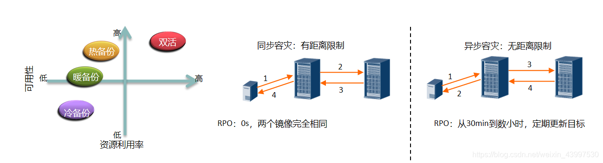
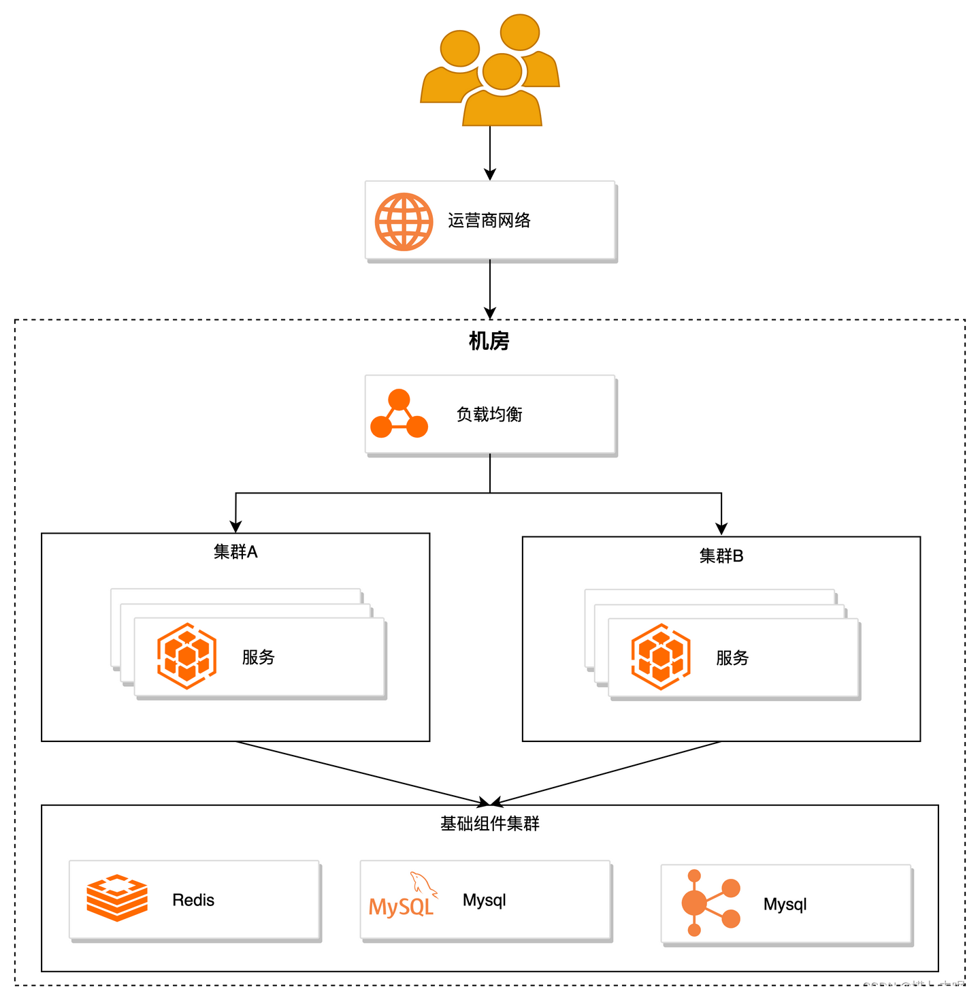
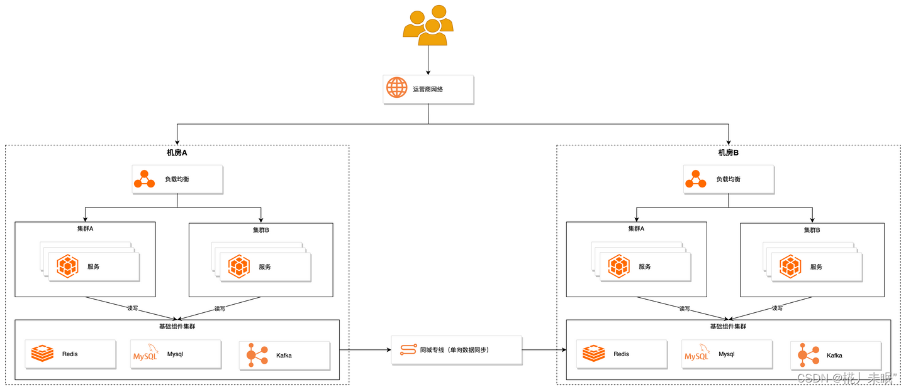
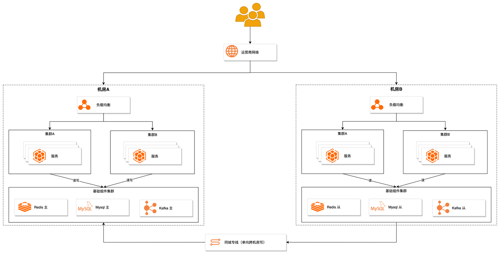
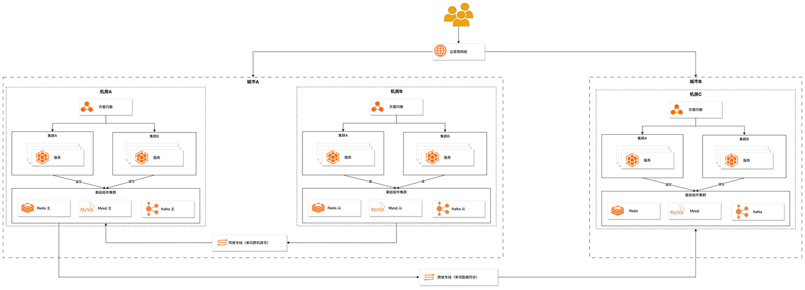
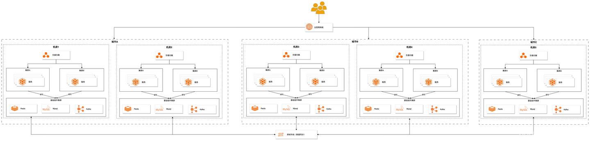

## 1、核心概念

### （1）高可用（High Availability, HA）

高可用是指提供在本地系统单个组件故障情况下，能继续访问应用的能力。无论这个故障时业务流程、物理设施、IT 软/硬件故障。

最好的高可用就是数据中心的一台机器宕机了，但是使用该数据中心服务的用户完全感觉不到。但一般数据中心的机器宕机了，在该机器上运行的服务故障切换（Failover）一般都需要时间，从而导致用户会有感知。

HA 的关键指标是可用性，起计算公式是：1 -（宕机时间+运行时间），我们常常用几个 9 表示可用性：

- 4个9 ：99.99% = 0.01% * 365 * 24 * 60 = 52.56 分/年
- 5个9 ：99.999% = 0.001% * 365 * 24 * 60 = 5.256 分/年
- 6个9 ：99.9999% = 0.0001% * 365 * 24 * 60 = 31 秒/年

### （2）容灾和备份

灾难（Disaster）是由于人为或自然的原因，造成一个数据中心内的信息系统运行严重故障或瘫痪，使信息系统支持的业务功能停顿或服务水平不可接受、达到特定的时间的突发性事件，通常导致信息系统需要切换到备用场地运行。

灾难恢复（Disaster Recovery）是指当灾难破坏生产中心时，在不同地点的数据中心内恢复数据、应用或者业务的能力。

容灾是指除了生产站点以外，用户另外建立的冗余站点，当灾难发生，生产站点收到破坏时，冗余站点可以接管用户正常的业务，达到业务不间断的目的。为了达到更高的可用性，许多用户甚至建立多个冗余站点。

备份：是容灾的基础，通常指在数据中心内，将全部或部分数据集合从应用主机的硬盘或阵列复制到其它的存储介质的过程。

容灾：容灾系统是指在相隔较远的异地，建立两套或多套功能相同的 IT 系统，互相之间可以进行健康状态监视和功能切换，当溢出系统因意外（如火灾、地震等）停止工作时，整个应用系统可以切换到另一处，使得该系统功能可以继续正常工作。

一般意义上，容灾指的是不在同一机房的数据或应用系统备份，备份指的是本地的数据或系统备份。通常说的灾备是将容灾与备份结合，即本地备份结合远程数据复制实现完善的数据保护。

### （3）HA 与 DR 对比

| 维度 | HA（High Availability）                                      | DR（Disaster Recovery）                                      |
| ---- | ------------------------------------------------------------ | ------------------------------------------------------------ |
| 场景 | HA 是指本地的高可用系统，表示在多个服务器运行一个或多种应用的情况下，应确保任意服务器出现任何故障时，其运行的应用不能中断，应用程序和系统应能迅速切换到其它服务器上运行，即本地系统集群和热备份。 | DR 是指异地（同城或异地）的高可用系统，表示在灾害发生时，数据、应用以及业务的恢复能力。 |
| 存储 | HA 往往是共享存储，因此往往不会有数据丢失（RPO = 0），更多的是切换时间长度考虑（即 RTO）。 | 异地灾备的数据是使用数据复制，根据使用的不同数据复制技术（同步、异步），数据往往有损失导致 RPO ＞ 0；而异地的应用切换往往需要更长的时间，这样 RTO＞0. |
| 故障 | 主要处理单组件的故障导致负载在集群内的服务器之间的切换       | 应对大规模的故障导致负载在数据中心之间做切换                 |
| 网络 | LAN 尺度的任务是 HA 的范畴                                   | WAN 尺度的任务是 DR 范围                                     |
| 云   | HA 是一个云环境内保障业务持续性的机制                        | DR 是多个云环境间保障业务持续性的机制                        |
| 目标 | HA 主要是保证业务高可用                                      | DR 是保证数据可靠的基础上的业务可用                          |

### （4）关键指标

- RPO（Recovery Point Objective）：当灾难发生时允许丢失的数据量。
- RTO（Recovery Time Object）：系统恢复的时间。

RPO 与 RTO 越小，系统的可用性就越高，当然用户需要的投资也越大。

## 2、容灾系统概述

### （1）系统级别

| 级别   | 定义                                                         | RTO                                                          | TCO                                            |
| ------ | ------------------------------------------------------------ | ------------------------------------------------------------ | ---------------------------------------------- |
| 数据级 | 通过建立异地容灾中心，做数据的远程备份，在灾难发生之后要确保原有的数据不会丢失或损坏。在数据级容灾方式下，所建立的异地容灾中心可以简单地把它理解成一个远程的数据备份中心。在数据级容灾这个级别，发生灾难时应用是会中断的。数据级容灾的恢复时间较长，但是相比其他容灾级别它的费用较低，且构建实施相对简单。数据源是一切关键性业务系统的生命源泉，因此数据级容灾必不可少。 | RTO 最长（若干天），因为灾难发生时，需要重新部署机器，利用备份数据恢复业务。 | 最低                                           |
| 应用级 | 在数据级容灾的基础之上，在备份站点同样构建一套相同的应用系统，通过同步或异步复制技术，这样可以保证关键应用在允许的时间范围内恢复运行，尽可能减少灾难带来的损失，让用户基本感受不到灾难的发生，这样就使系统所提供的的服务是完整的、可靠地和安全的。 | RTO 中等（几小时）                                           | 中等。异地可以搭建一样的系统，或者小些的系统。 |
| 业务级 | 全业务的灾备，除了必要的 IT 相关技术，还要求具备全部的基础设施。其大部分内容是非 IT 系统（如电话、办公地点等），当大灾难发生后，原有的办公场所都会受到破坏，除了数据和应用的恢复，更需要一个备份的工作场所能够正常的开展业务。 | RTO 最小（几分钟或几秒）                                     | 最高                                           |

### （2）容灾建设等级

|      |                            |                             |
| ---- | -------------------------- | --------------------------- |
| 6级  | 数据零丢失和远程集群支持   | 应用级容灾                  |
| 5级  | 实时数据传输及完整设备支持 | 数据级容灾方案+容灾应用软件 |
| 4级  | 电子传输及完整设备支持     | 数据级容灾方案              |
| 3级  | 电子传输和部分设备支持     | 异地备份方案                |
| 2级  | 备用场地支持               | 备份方案                    |
| 1级  | 基本支持                   | 备份方案                    |

### （3）容灾设计模式（同步、异步）

| 容灾模式 | 可靠性方案    | 灾难恢复 | 数据备份需求             |
| -------- | ------------- | -------- | ------------------------ |
| 双活     | 集群+负载均衡 | 自动     | 实时同步复制（＜100 KM） |
| 热备份   | 集群          | 自动     | 实时同步复制（＜100 KM） |
| 暖备份   | 人工干预      | 手动     | 异步复制（＞100 KM）     |
| 冷备份   | 人工强干预    | 手动     | 异步复制（＞100 KM）     |

## 3、容灾方案

- 本地高可用方案
  - 同城单机房多集群
- 同城容灾方案
  - 同城双机房主备
  - 同城双机房多活（双活）
- 异地容灾方案
  - 两地三中心（异地多活）
  - 三地五中心

### （1）同城单机房多集群

在同一座城市的单个数据中心里，部署多个相互独立但能进行交互的集群。每个集群都拥有自己的设备和资源，可以独立运行和处理任务。集群间可以互相备份数据和共享资源，提高数据的安全性和系统的可用性，同时也可以根据业务需求进行资源调度和负载均衡，提高系统的运行效率。

优点：

- 高可用性：在单个机房内部署多个集群，如果一个集群出现问题，其他集群还能正常运行，避免系统宕机，提高业务的可用性。
- 资源调度：根据业务需求，可以对集群内部的资源进行调度和负载均衡，提高系统的运行效率。

缺点：

- 管理复杂：多集群的管理比单一集群复杂，需要更多的时间和精力进行运维。
- 单点故障：虽然多集群架构可以提高系统的可用性，但如果整个机房故障（如：断电、火灾），仍可能会导致系统宕机。

### （2）同城双机房主备

指在同一个城市设置两个数据中心或机房，其中一个作为主机房，用于运行业务，另一个作为备份机房，用于数据备份和恢复。

在这种架构下，所有的业务运行和数据处理都在主机房进行，同时，主机房的所有数据会实时或定期备份到备份机房。如果主机房出现故障，备份机房可以快速接管业务，保证业务的连续性。

这种架构提高了业务的稳定性和安全性，因为业务运行和数据存储有两套完全独立的物理环境支持，减少了因单一机房故障而导致的业务中断风险。

优点：

- 高可用性：如果主机房故障，备份机房可以迅速接管，确保业务的连续性，从而提高系统的总体可用性。
- 数据安全性：通过双机房实现数据的备份，可提高数据的安全性，减少因单一存储点故障而导致数据丢失的风险。
- 灾难恢复能力强：在遭遇系统故障或灾害等异常情况时，可以快速由备份机房接收运行，实现业务快速恢复。
- 系统维护更加灵活：在需要对主机房进行系统升级、维护或其他改动时，备份机房可以继续提供服务，从而保障业务不受影响。

缺点：

- 成本高：与单一机房相比，双机房需要双倍的硬件设备和空间，还需要投入更多的维护费用，成本较高。
- 管理复杂性增加：对于两个机房的管理和维护是一项挑战，需要进行精细化的运维管理和跨机房的资源调度。
- 数据同步延迟：虽然双机房可以进行数据备份， 但由于网络等因素，可能存在数据同步的延迟，影响数据的实时性。
- 单点故障仍存在：虽然两个机房可以提高系统的可用性，但如果两个机房都位于同一城市，如遇到地震、洪水等大规模自然灾害，仍可能同时影响两个机房，导致系统宕机。
- 单机房资源瓶颈：单机房资源瓶颈依旧存在，无法得到解决。
- 最重要的一点，备用机房平时是无流量请求的，当真正故障发生时，是否敢直接将线上流量全部切入呢？

### （3）同城双机房多活

指在同一个城市内设置两个或更多的数据中心，这些数据中心之间数据实时同步，可以同时提供服务，即任何一个数据中心都能接受和处理来自用户的请求。但只有一个机房的数据中心允许写入，其他机房数据中心只能够处理读请求，写请求都代理到主节点，主节点将数据更改行为同步到剩余的从数据中心。

在这种架构下，业务负载会被分配到各个数据中心，每个数据中心都能独立处理请求和进行服务。当某个数据中心发生故障时，其他数据中心仍然可以继续提供服务，数据中心则进行主从切换，避免了单点故障，提高了系统的可用性和健壮性。同时，这种架构也可以根据业务负载进行动态调整，进行负载均衡，提高了系统的处理能力和效率。

优点：

- 资源利用率高：对比同城双机房主备，有效利用机器资源，不存在资源浪费情况。
- 单机房资源瓶颈缓解：由于有多个机房同时提供服务，类似 Redis、MySQL 等集群资源得到分担，不会将压力都给到一个机房上。
- 可用性高：相对于备份机房只有故障发生时才启用，双机房能够一直提供服务，确保服务一直处于可用状况。

缺点：

- 单点故障仍存在：虽然两个机房可以提高系统的可用性，但如果两个机房都位于同一城市，如遇到地震、洪水等大规模自然灾害，仍可能同时影响两个机房，导致系统宕机。

### （4）两地三中心

为了解决城市级容灾，产生出两地三中心的概念。指在两个地理位置（通常是两个城市）部署三个数据中心。这三个数据中心通常配置为：一个主数据中心，一个本地备份中心（位于与主数据中心同一城市，但在不同的地理位置），与一个远程灾备中心（位于另一个城市）。

在这种配置中，主数据中心运行日常业务，同时，本地备份中心对主数据中心的数据进行实时或近实时的备份，用于处理主数据中心的短暂停机或小范围灾害。而在远程灾备中心则用于处理主数据中心和本地备份中心同时受到影响的大范围灾害（如：地震、洪水等）。

在同一城市内的网络传输耗时约为 2ms 左右，而两个城市之间的网络传输耗时约为 30ms（例如北京到上海）。这种较大的延迟会导致灾备中心的数据与主数据库之间存在较大的延时。在灾难发生时，数据可能会丢失，并且服务的可用性也无法得到保证。因此，我们需要将灾备中心转换为一个能够对外提供服务的节点，以分担其他活跃节点的流量。

由于跨城市请求的耗时延迟较大，基础组件需要支持双写或多写功能，不再区分数据中心的主从节点。每个机房都应有自己的数据中心，服务只向自己机房的数据中心进行读写操作，然后再进行数据同步。然而，分布式基础组件都是基于 Raft（或 Paxos） 协议，当有一个机房出现问题时，无法形成多数派，从而导致基础组件无法自动切换，因此，至少需要 5 个数据中心来确保系统的可靠性和稳定性。

### （5）三地五中心

基于两地三中心的缺点，设计出三地五中心方案。

优点：

- 城市级容灾：一个城市节点故障时，可以将用户流量切到另一个数据中心上继续处理请求。
- 资源利用率高：每个数据中心都可以对外提供服务，没有备份中心，不存在数据浪费。
- 用户体验变高：用户可以就近访问数据中心，用户请求耗时更低。

缺点：

- 成本高：与上面所有方案相对，需要组件的开发支持，机器与运维的投入，成本较高。

